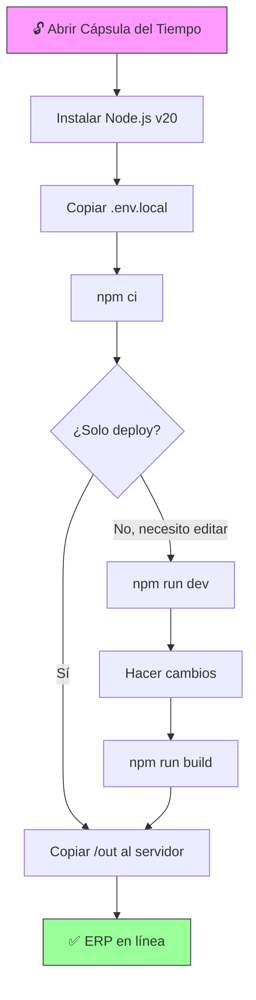

# 📋 HANDOFF MAESTRO — Protocolo de Entrega y Preservación

> **El manifiesto definitivo para que cualquier desarrollador futuro pueda mantener, compilar y desplegar este ERP.**  
> **Última actualización:** 2026-02-21

## Documentos Relacionados

- [docs/01_ARQUITECTURA_GENERAL.md](./docs/01_ARQUITECTURA_GENERAL.md) — Arquitectura
- [docs/05_GUIA_DESARROLLADOR.md](./docs/05_GUIA_DESARROLLADOR.md) — Convenciones
- [docs/06_BLINDAJE_ARQUITECTONICO.md](./docs/06_BLINDAJE_ARQUITECTONICO.md) — Blindaje
- [CONTINGENCIA_SUPABASE.md](./CONTINGENCIA_SUPABASE.md) — Plan de emergencia

---

## ⚠️ REGLA #1: Nunca Uses `npm install`

```
❌ npm install    → PROHIBIDO. Puede romper el lockfile y actualizar paquetes.
✅ npm ci         → OBLIGATORIO. Instala los bytes exactos del lockfile.
```

---

## Información Técnica del Proyecto

| Dato | Valor |
|------|-------|
| **Nombre** | Sistema ERP de Inventario y Cotizaciones |
| **Framework** | Next.js 16.1.6 (SPA Estática) |
| **Node.js requerido** | v20.x LTS (recomendado: 20.11.0) |
| **Base de datos** | PostgreSQL 15 vía Supabase |
| **Tipo de build** | `output: 'export'` → Carpeta `/out` |
| **Lenguaje** | TypeScript 5.x |

---

## Procedimiento de Compilación (Build)

### Requisitos Previos

1. **Node.js** instalado (v20 LTS)
2. **El archivo `.env.local`** en la raíz con las variables de Supabase

### Pasos

```bash
# 1. Clonar el proyecto (o descomprimir el ZIP)
git clone <url-del-repo>
cd "ia inventario"

# 2. Instalar dependencias (EXACTAS, no aproximadas)
npm ci

# 3. Compilar la SPA estática
npm run build

# 4. Verificar que se creó la carpeta /out
ls out/
# Resultado esperado: index.html, dashboard.html, catalog.html, etc.

# 5. (Opcional) Probar localmente
npx serve out
# Abrir: http://localhost:3000
```

---

## Estructura del Artefacto Compilado (`/out`)

```
out/
├── index.html              # Página de inicio
├── dashboard.html          # Dashboard KPI
├── catalog.html            # Catálogo de productos
├── clients.html            # Clientes
├── configuracion.html      # Configuración
├── cotizaciones.html       # Lista de cotizaciones
├── cotizaciones/
│   └── 1.html              # Detalle dummy (SPA usa URL dinámica)
│       └── print.html      # Editor de impresión
├── export.html             # Exportador Excel
├── inventory.html          # Inventario
├── production.html         # Kanban
├── recetas.html            # Recetas
├── settings.html           # Settings
├── suppliers.html          # Proveedores
├── _next/                  # Assets JS/CSS hasheados
│   ├── static/
│   │   ├── chunks/         # Código JS fragmentado
│   │   └── css/            # Estilos CSS
│   └── data/               # Datos precargados
└── favicon.ico
```

---

## Despliegue en Producción

### Opción 1: Netlify (Recomendado — Gratis)

1. Crear cuenta en [netlify.com](https://netlify.com)
2. Drag & Drop la carpeta `/out` en el dashboard
3. ✅ Listo. URL asignada automáticamente.

### Opción 2: IIS (Windows Server — Intranet)

1. Copiar la carpeta `/out` al directorio del sitio IIS
2. Configurar `web.config` para SPA:
```xml
<?xml version="1.0" encoding="UTF-8"?>
<configuration>
    <system.webServer>
        <rewrite>
            <rules>
                <rule name="SPA Fallback" stopProcessing="true">
                    <match url=".*" />
                    <conditions>
                        <add input="{REQUEST_FILENAME}" matchType="IsFile" negate="true" />
                        <add input="{REQUEST_FILENAME}" matchType="IsDirectory" negate="true" />
                    </conditions>
                    <action type="Rewrite" url="/index.html" />
                </rule>
            </rules>
        </rewrite>
    </system.webServer>
</configuration>
```

### Opción 3: AWS S3 + CloudFront

1. Crear bucket S3 con Static Website Hosting
2. Subir contenido de `/out`
3. Configurar CloudFront como CDN

### Opción 4: Servidor Apache/Nginx

```nginx
# nginx.conf
server {
    listen 80;
    root /var/www/erp/out;
    
    location / {
        try_files $uri $uri.html $uri/ /index.html;
    }
}
```

---

## Paquete de Supervivencia ("Cápsula del Tiempo")

Crea una carpeta `_ARCHIVO_MAESTRO_ERP` y guarda:

| Elemento | Descripción | Ubicación |
|----------|-------------|-----------|
| **Código fuente** | Proyecto completo (sin `node_modules` ni `.next`) | `codigo_fuente/` |
| **Build compilado** | Carpeta `/out` lista para deploy | `build_out/` |
| **Variables de entorno** | Archivo `.env.local` | `secretos/` |
| **Dump de BD** | `pg_dump` de toda la base | `base_datos/` |
| **Instalador Node.js** | v20.11.0 LTS para Windows | `instaladores/` |
| **Instalador VS Code** | Versión actual | `instaladores/` |
| **Docker Desktop** | Instalador offline | `instaladores/` |
| **Documentación offline** | PDFs de Supabase JS v2 y TanStack Query v5 | `documentacion/` |
| **Este documento** | Copia impresa en PDF | `documentacion/` |

### ¿Dónde Guardar la Cápsula?

| Medio | Vida Útil | Notas |
|-------|-----------|-------|
| **USB 3.0 cifrado** | 5-10 años | En caja fuerte de la oficina |
| **Disco externo SSD** | 10-15 años | Almacenado en lugar fresco y seco |
| **GitHub/GitLab privado** | ~Indefinido | Mientras el servicio exista |
| **Google Drive** | ~Indefinido | Backup secundario en la nube |

---

## Diagrama del Proceso de Resurrección



---

## Contacto de Emergencia

| Rol | Responsable | Notas |
|-----|-------------|-------|
| **Desarrollador original** | [Completar] | Principal referente técnico |
| **Administrador de Supabase** | [Completar] | Acceso al dashboard Cloud |
| **Responsable de infraestructura** | [Completar] | Servidores, DNS, SSL |

> 📌 **Completa esta tabla con los datos reales de tu equipo antes de archivar este documento.**
