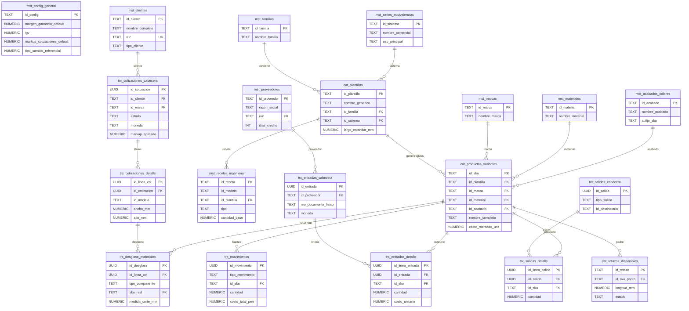

# 02 — Esquema de Base de Datos

> **Motor:** PostgreSQL 15 (vía Supabase)  
> **Esquema base:** [database/schema.sql](../database/schema.sql)  
> **Última actualización:** 2026-02-21

## Documentos Relacionados

- [01_ARQUITECTURA_GENERAL.md](./01_ARQUITECTURA_GENERAL.md) — Visión global
- [09_DICCIONARIO_DATOS.md](./09_DICCIONARIO_DATOS.md) — Detalle columna por columna
- [10_FLUJOS_DE_NEGOCIO.md](./10_FLUJOS_DE_NEGOCIO.md) — Flujos que interactúan con estas tablas

---

## 1. Diagrama Entidad-Relación (ER)

---

## 2. Resumen de Tablas por Capa

### Capa MST (Maestra) — 10 tablas

| Tabla | Propósito | PK |
|-------|-----------|-----|
| `mst_config_general` | Configuración global del ERP (IGV, markup, cuentas) | `id_config` |
| `mst_clientes` | Registro de clientes | `id_cliente` |
| `mst_proveedores` | Registro de proveedores | `id_proveedor` |
| `mst_familias` | Familias de productos (Perfiles, Vidrios, etc.) | `id_familia` |
| `mst_marcas` | Marcas comerciales (Corrales, HPD, etc.) | `id_marca` |
| `mst_materiales` | Tipos de material (Aluminio, Vidrio, etc.) | `id_material` |
| `mst_acabados_colores` | Acabados/colores (Negro, Blanco, Champagne) | `id_acabado` |
| `mst_series_equivalencias` | Series/Sistemas de perfilería | `id_sistema` |
| `mst_recetas_modelos` | Modelos de receta (ej: "Ventana Corrediza 2H") | `id_modelo` |
| `mst_recetas_ingenieria` | Líneas de receta BOM con fórmulas | `id_receta` |

### Capa CAT (Catálogo) — 2 tablas

| Tabla | Propósito | PK |
|-------|-----------|-----|
| `cat_plantillas` | Plantillas genéricas de producto | `id_plantilla` |
| `cat_productos_variantes` | SKUs concretos (Plantilla + Marca + Color) | `id_sku` |

### Capa TRX (Transaccional) — 8 tablas

| Tabla | Propósito | PK |
|-------|-----------|-----|
| `trx_movimientos` | Kardex maestro de movimientos | `id_movimiento` (UUID) |
| `trx_entradas_cabecera` | Cabecera de compras | `id_entrada` (UUID) |
| `trx_entradas_detalle` | Líneas de compra | `id_linea_entrada` (UUID) |
| `trx_salidas_cabecera` | Cabecera de despachos | `id_salida` (UUID) |
| `trx_salidas_detalle` | Líneas de despacho | `id_linea_salida` (UUID) |
| `trx_cotizaciones_cabecera` | Cabecera de cotización | `id_cotizacion` (UUID) |
| `trx_cotizaciones_detalle` | Ítems de cotización (ventanas) | `id_linea_cot` (UUID) |
| `trx_desglose_materiales` | BOM/Despiece por ítem | `id_desglose` (UUID) |

### Capa DAT (Operativa) — 2 tablas

| Tabla | Propósito | PK |
|-------|-----------|-----|
| `dat_retazos_disponibles` | Retazos de perfil reutilizables | `id_retazo` |
| `dat_kanban_produccion` | Órdenes del tablero Kanban | `id_registro` (UUID) |

---

## 3. Triggers Automáticos

| Trigger | Tabla Origen | Acción | Función |
|---------|-------------|--------|---------|
| `tg_entrada_kardex` | `trx_entradas_detalle` | `AFTER INSERT` | `fn_trigger_entrada_to_kardex()` — Inserta movimiento COMPRA (+) |
| `tg_salida_kardex` | `trx_salidas_detalle` | `AFTER INSERT` | `fn_trigger_salida_to_kardex()` — Inserta movimiento de tipo salida (-) |

---

## 4. Vistas Principales (Views)

| Vista | Propósito | Tablas Fuente |
|-------|-----------|---------------|
| `vw_stock_realtime` | Stock actual con valorización PMP | `trx_movimientos` + `cat_productos_variantes` |
| `vw_kardex_reporte` | Reporte Kardex con nombres de productos | `trx_movimientos` + joins |
| `vw_cotizaciones_totales` | Totales calculados por cotización | `trx_cotizaciones_cabecera` + detalles |
| `vw_cotizaciones_detalladas` | Detalle con costos de materiales | `trx_cotizaciones_detalle` + desglose |
| `vw_reporte_desglose` | Reporte de ingeniería completo | `trx_desglose_materiales` + joins |
| `vw_reporte_produccion` | Estado de producción Kanban | `dat_kanban_produccion` + joins |
| `vw_reporte_retazos` | Retazos con valor recuperable | `dat_retazos_disponibles` + joins |
| `vw_kpi_stock_zombie` | Stock inmovilizado sin movimiento | `vw_stock_realtime` filtrado |

---

## 5. Funciones RPC (Remote Procedure Call)

| Función | Propósito |
|---------|-----------|
| `fn_calcular_despiece(id_linea)` | Genera automáticamente el BOM de materiales para una ventana |
| `fn_clonar_cotizacion(id)` | Duplica una cotización completa con sus líneas |
| `fn_clonar_item(id_linea)` | Duplica un ítem dentro de la misma cotización |

---

## 6. Scripts de Migración

Los scripts están en la carpeta [`database/`](../database/) y siguen la convención numérica `001_`, `002_`, etc. para su ejecución ordenada. Consulte la [Guía del Desarrollador](./05_GUIA_DESARROLLADOR.md) para el procedimiento de aplicación.
