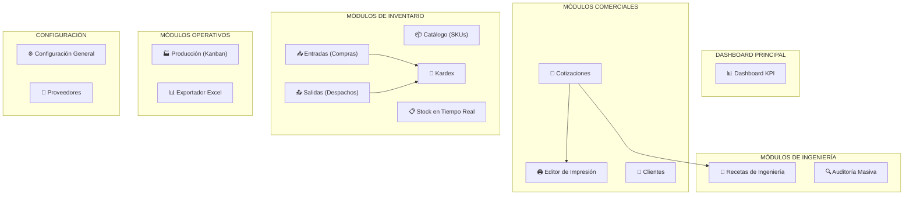

# 03 — Módulos y Funcionalidades

> **Última actualización:** 2026-02-21

## Documentos Relacionados

- [01_ARQUITECTURA_GENERAL.md](./01_ARQUITECTURA_GENERAL.md) — Stack y capas
- [04_API_REFERENCIA.md](./04_API_REFERENCIA.md) — Funciones de cada API
- [05_GUIA_DESARROLLADOR.md](./05_GUIA_DESARROLLADOR.md) — Cómo extender módulos

---

## Mapa de Módulos del Dashboard

---

## 1. 📊 Dashboard KPI

| Propiedad | Valor |
|-----------|-------|
| **Ruta** | `/dashboard` |
| **Página** | `app/(dashboard)/dashboard/page.tsx` |
| **API** | `lib/api/dashboard.ts` |
| **Componentes** | `components/dashboard/` |

### Funcionalidades
- **KPIs en tiempo real:** Total de cotizaciones, tasa de conversión, valor de inventario
- **Gráficos Recharts:** Cotizaciones por mes, distribución ABC de stock
- **Métricas operativas:** OTIF (On Time In Full), stock zombie, días de inventario
- **Filtros temporales:** Último mes, trimestre, año

---

## 2. 📝 Cotizaciones

| Propiedad | Valor |
|-----------|-------|
| **Ruta** | `/cotizaciones` y `/cotizaciones/[id]` |
| **Páginas** | `app/(dashboard)/cotizaciones/page.tsx`, `[id]/page.tsx` |
| **API** | `lib/api/cotizaciones.ts` |
| **Componentes** | `components/trx/cotizacion-*.tsx` |

### Funcionalidades
- **Listado** con filtros por estado (Borrador, Aprobada, Rechazada, Anulada)
- **Creación** con selección de cliente, marca y moneda (PEN/USD)
- **Agregar ítems** (ventanas/mamparas) con dimensiones, modelo y acabado
- **Despiece automático** (BOM Engine): Calcula perfiles, vidrios y accesorios
- **Despiece manual**: Edición directa del desglose de materiales
- **Clonar** cotizaciones e ítems individuales
- **Gestión de estados**: Aprobar → Rechazar → Anular con auditoría de fechas
- **Cálculos en cascada**: Costo materiales → Markup → IGV → Precio final
- **Conversión de moneda** dual (PEN ↔ USD) con tipo de cambio configurable

### 🖨️ Editor de Impresión
- **Ruta**: `/cotizaciones/[id]/print`
- **3 temas**: Moderno, Clásico, Minimalista
- **Personalización**: Logo, color de marca, secciones toggleables
- **Variables dinámicas**: `{{CLIENTE}}`, `{{TOTAL}}`, `{{VALIDEZ}}`
- **Exportación directa** a PDF vía `window.print()`

---

## 3. 📦 Catálogo de Productos (SKUs)

| Propiedad | Valor |
|-----------|-------|
| **Ruta** | `/catalog` |
| **API** | `lib/api/cat.ts` |
| **Componentes** | `components/cat/product-*.tsx`, `plantilla-*.tsx` |
| **Validador** | `lib/validators/cat.ts` |

### Funcionalidades
- **Gestión de Plantillas**: CRUD de perfiles genéricos (sin marca/color)
- **Gestión de SKUs (Variantes)**: Plantilla + Marca + Material + Acabado = SKU único
- **Búsqueda avanzada** con filtros por familia, marca, material, sistema
- **Paginación** server-side (100 por página)
- **Actualización masiva de precios** de mercado
- **Detalle de producto** con sheet lateral (stock, costos, metadata)
- **Ajuste de stock** directo desde el catálogo

---

## 4. 📋 Inventario (Stock en Tiempo Real)

| Propiedad | Valor |
|-----------|-------|
| **Ruta** | `/inventory` |
| **API** | `lib/api/trx.ts` → `getStockRealtime()` |
| **Vista SQL** | `vw_stock_realtime` |
| **Componentes** | `components/trx/stock-list.tsx` |

### Funcionalidades
- **Stock actual** calculado vía Kardex (suma de movimientos)
- **Costo Promedio Ponderado (PMP)** automático
- **Clasificación ABC** por valor de inversión
- **Indicadores de reposición**: Stock mínimo, punto de pedido
- **Estado de abastecimiento**: Normal, Alerta, Crítico

---

## 5. 📥📤 Entradas y Salidas

| Propiedad | Entradas | Salidas |
|-----------|----------|---------|
| **Ruta** | `/inventory` (tab) | `/inventory` (tab) |
| **API** | `trxApi.createEntrada()` | `trxApi.createSalida()` |
| **Componentes** | `entrada-form.tsx`, `entrada-list.tsx` | `salida-form.tsx`, `salida-list.tsx` |

### Flujo Automático
1. Usuario crea entrada/salida con líneas de detalle
2. **Trigger PostgreSQL** inserta automáticamente en `trx_movimientos` (Kardex)
3. La vista `vw_stock_realtime` se actualiza al instante

---

## 6. 📒 Kardex

| Propiedad | Valor |
|-----------|-------|
| **Ruta** | `/inventory` (tab Kardex) |
| **Vista SQL** | `vw_kardex_reporte` |
| **Componentes** | `components/trx/kardex-list.tsx`, `kardex-detail.tsx` |

### Funcionalidades
- **Registro automático** de cada compra, venta, producción o ajuste
- **Búsqueda** por SKU, producto, proveedor o documento
- **Filtros** por tipo de movimiento y rango de fechas
- **Paginación** con conteo total

---

## 7. 🔧 Motor de Recetas de Ingeniería

| Propiedad | Valor |
|-----------|-------|
| **Ruta** | `/recetas` y `/configuracion/recetas` |
| **API** | `lib/api/recetas.ts` |
| **Componentes** | `components/mto/recipe-*.tsx` |

### Funcionalidades
- **Modelos**: Definición de tipos de ventana (ej: "Corrediza 2 Hojas Serie 25")
- **Líneas de receta**: Cada componente con fórmulas de corte y cantidad
- **Fórmulas dinámicas**: `ANCHO - 22`, `ALTO / 2 + 15`, etc.
- **Tipos de componente**: Perfil, Vidrio, Accesorio
- **Clonado de modelos** completos con todas sus líneas
- **🔍 Auditoría masiva**: Escaneo de todas las recetas para detectar SKUs faltantes, fórmulas inválidas o costos cero

---

## 8. 🏭 Producción (Kanban)

| Propiedad | Valor |
|-----------|-------|
| **Ruta** | `/production` |
| **API** | `lib/api/kanban.ts` |
| **Componentes** | `components/production/kanban-board.tsx` |

### Funcionalidades
- **Tablero Drag & Drop** con 6 columnas de estado
- **Creación manual** de órdenes de trabajo
- **Importación automática** desde cotizaciones aprobadas
- **Historial de cambios** por orden
- **Estadísticas** de producción con gráficos
- **Exportación** del tablero a Excel

---

## 9. 📊 Exportador Excel (Power BI Ready)

| Propiedad | Valor |
|-----------|-------|
| **Ruta** | `/export` |
| **Servicio** | `lib/export/excel-export.ts` |
| **Componentes** | `app/(dashboard)/export/page.tsx` |

### 4 Tipos de Exportación

| Tipo | Hojas Incluidas | Uso |
|------|----------------|-----|
| **Comercial** | Cabeceras, Detalles, Desglose, Producción | Análisis de márgenes |
| **Inventario** | Stock Valorizado, Retazos, Stock Zombie | Valorización |
| **Kardex** | Movimientos con filtro de fecha | Auditoría |
| **Datos Maestros** | Catálogo, Clientes, Proveedores, Familias | Dimensiones para BI |

---

## 10. ⚙️ Configuración

| Propiedad | Valor |
|-----------|-------|
| **Ruta** | `/configuracion` y `/settings` |
| **API** | `lib/api/config.ts` |
| **Componentes** | `components/mst/config-general-form.tsx` |

### Parámetros Configurables
- **Empresa**: Nombre, RUC, dirección, logo, firma digital
- **Económicos**: IGV, markup default, tipo de cambio, costo mano de obra
- **Bancarios**: Cuentas BCP y BBVA en soles y dólares
- **Textos**: Condiciones, garantía, formas de pago (para impresión)
- **Personalización**: Color primario, moneda default, validez de cotización
