# 10 — Flujos de Negocio

> **Diagramas de secuencia y flujo de los procesos clave del ERP**  
> **Última actualización:** 2026-02-21

## Documentos Relacionados

- [03_MODULOS_Y_FUNCIONALIDADES.md](./03_MODULOS_Y_FUNCIONALIDADES.md) — Módulos involucrados
- [04_API_REFERENCIA.md](./04_API_REFERENCIA.md) — APIs utilizadas
- [09_DICCIONARIO_DATOS.md](./09_DICCIONARIO_DATOS.md) — Tablas afectadas

---

## 1. Flujo Completo de Cotización

### Visión General

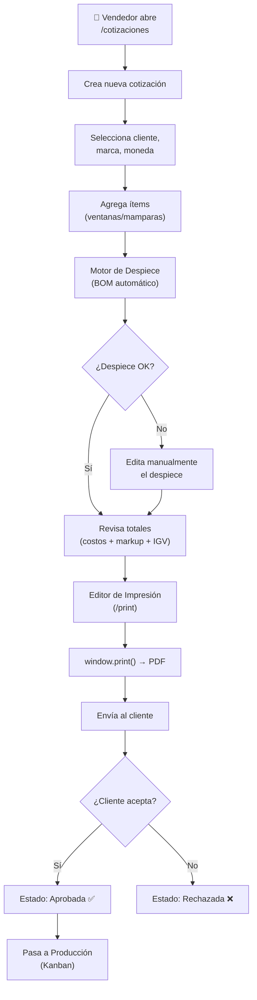

### Secuencia Técnica del Despiece

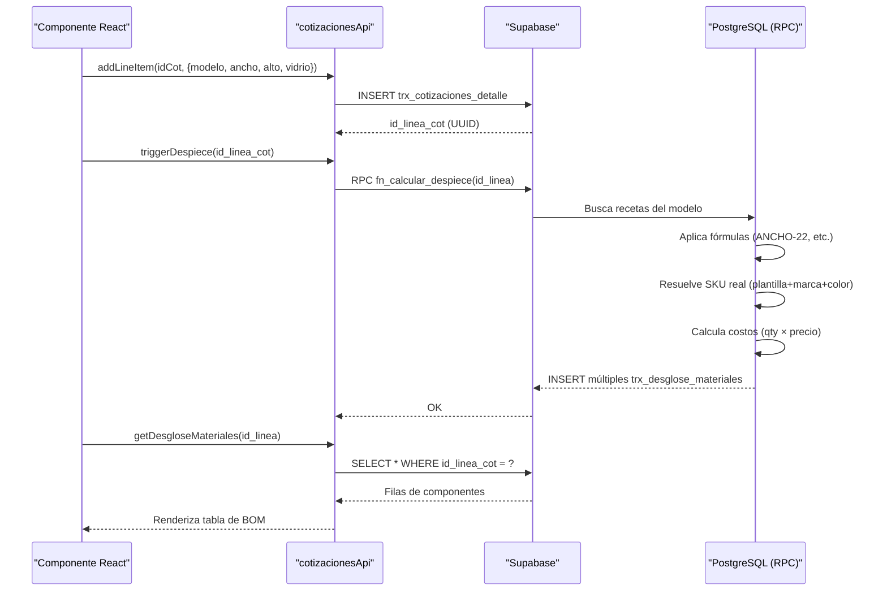

---

## 2. Flujo de Compra (Entrada de Inventario)

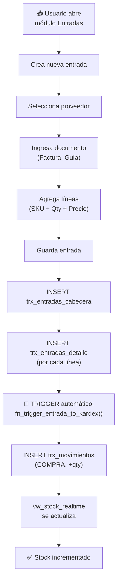

### Detalle del Trigger

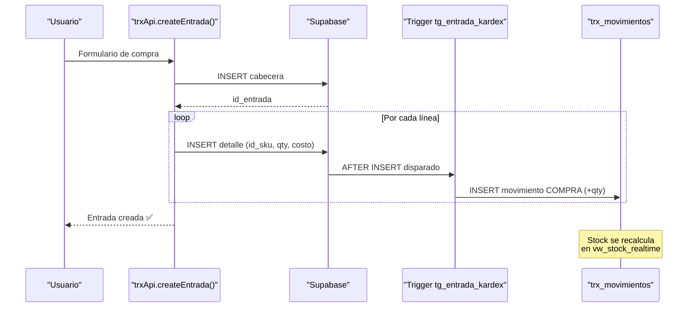

---

## 3. Flujo de Despacho (Salida de Inventario)

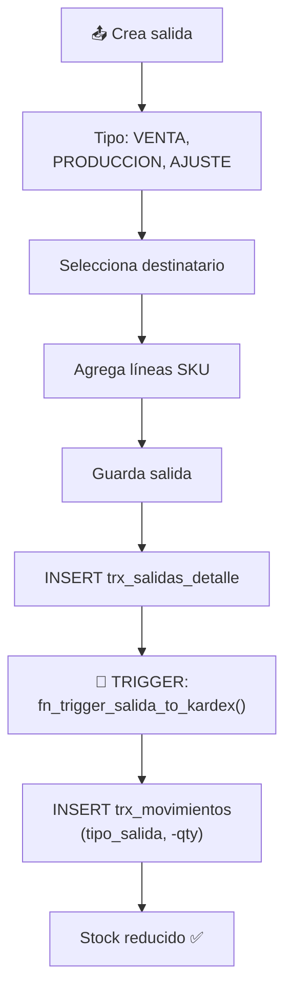

---

## 4. Flujo de Producción (Kanban)

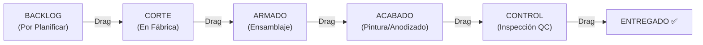

### Cómo llegan las órdenes al Kanban

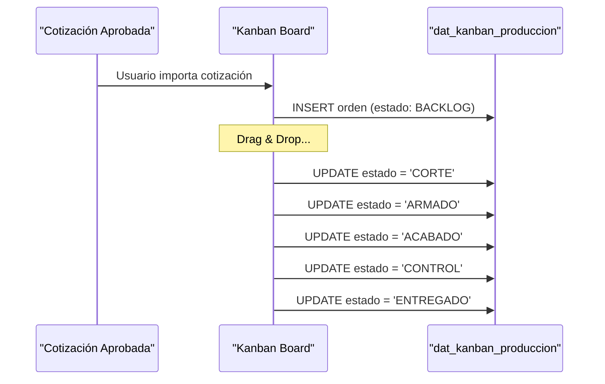

---

## 5. Flujo de Exportación Excel

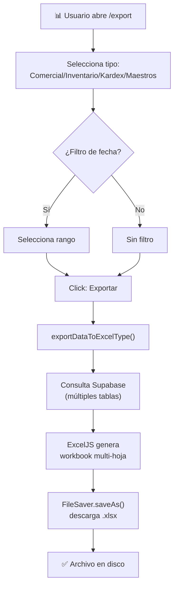

---

## 6. Flujo de Cálculo de Precios en Cotización

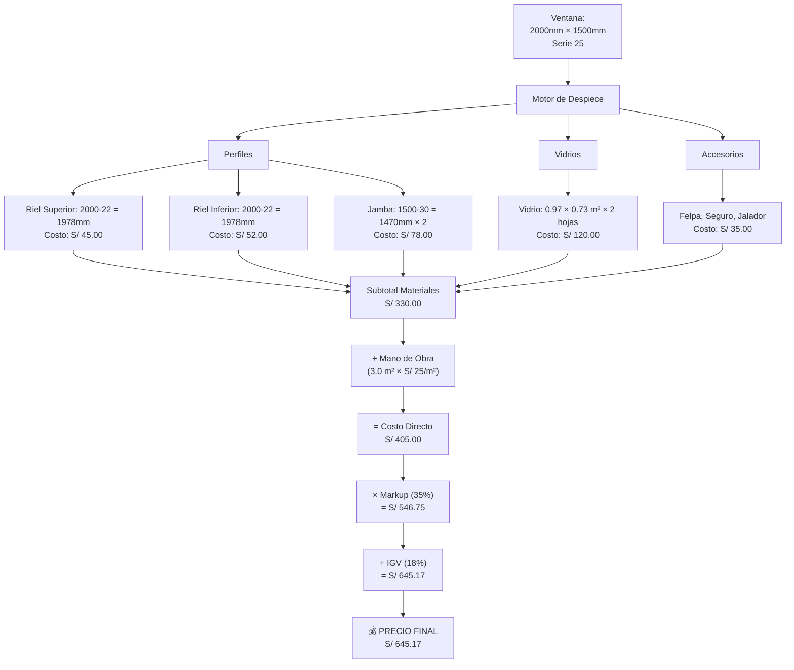

---

## 7. Flujo de Datos en Tiempo Real (SPA)

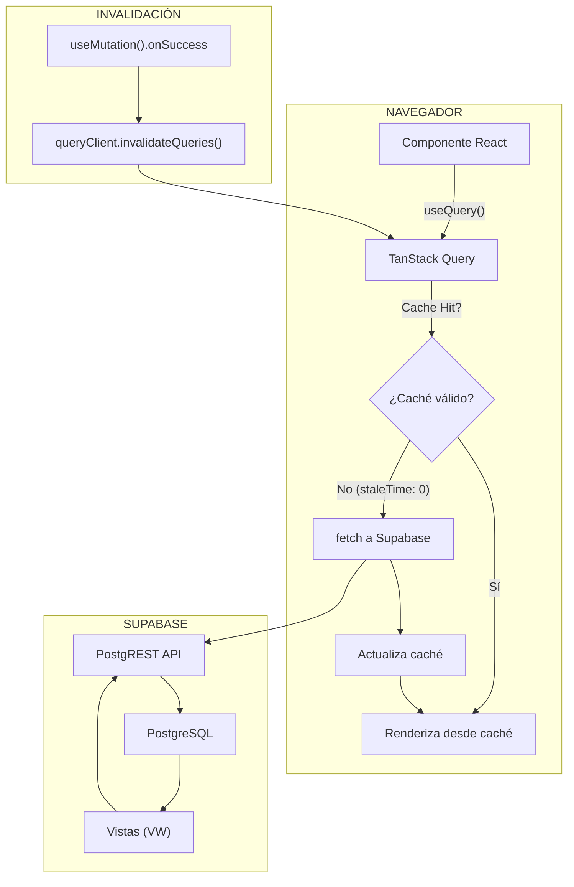

---

## 8. Ciclo de Vida de una Cotización (Estado)

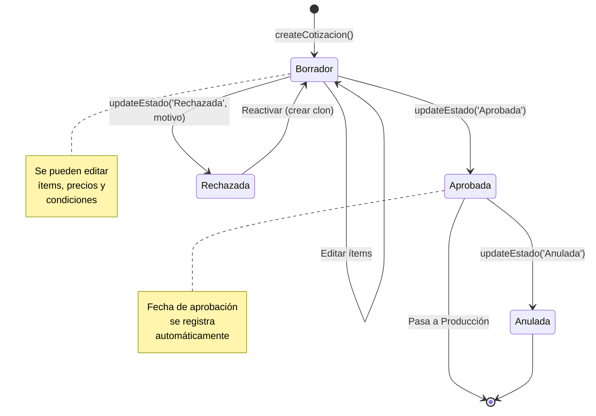
