# 10 — Flujos de Negocio

> **Diagramas de secuencia y flujo de los procesos clave del ERP**  
> **Última actualización:** 2026-02-21

## Documentos Relacionados

- [03_MODULOS_Y_FUNCIONALIDADES.md](./03_MODULOS_Y_FUNCIONALIDADES.md) — Módulos involucrados
- [04_API_REFERENCIA.md](./04_API_REFERENCIA.md) — APIs utilizadas
- [09_DICCIONARIO_DATOS.md](./09_DICCIONARIO_DATOS.md) — Tablas afectadas

---

## 1. Flujo Completo de Cotización

### Visión General

```mermaid
flowchart TD
    A["👤 Vendedor abre<br/>/cotizaciones"] --> B["Crea nueva cotización"]
    B --> C["Selecciona cliente,<br/>marca, moneda"]
    C --> D["Agrega ítems<br/>(ventanas/mamparas)"]
    D --> E["Motor de Despiece<br/>(BOM automático)"]
    E --> F{"¿Despiece OK?"}
    F -->|"Sí"| G["Revisa totales<br/>(costos + markup + IGV)"]
    F -->|"No"| H["Edita manualmente<br/>el despiece"]
    H --> G
    G --> I["Editor de Impresión<br/>(/print)"]
    I --> J["window.print() → PDF"]
    J --> K["Envía al cliente"]
    K --> L{"¿Cliente acepta?"}
    L -->|"Sí"| M["Estado: Aprobada ✅"]
    L -->|"No"| N["Estado: Rechazada ❌"]
    M --> O["Pasa a Producción<br/>(Kanban)"]
```

### Secuencia Técnica del Despiece

```mermaid
sequenceDiagram
    participant UI as "Componente React"
    participant API as "cotizacionesApi"
    participant SB as "Supabase"
    participant PG as "PostgreSQL (RPC)"

    UI->>API: addLineItem(idCot, {modelo, ancho, alto, vidrio})
    API->>SB: INSERT trx_cotizaciones_detalle
    SB-->>API: id_linea_cot (UUID)
    
    UI->>API: triggerDespiece(id_linea_cot)
    API->>SB: RPC fn_calcular_despiece(id_linea)
    SB->>PG: Busca recetas del modelo
    PG->>PG: Aplica fórmulas (ANCHO-22, etc.)
    PG->>PG: Resuelve SKU real (plantilla+marca+color)
    PG->>PG: Calcula costos (qty × precio)
    PG-->>SB: INSERT múltiples trx_desglose_materiales
    SB-->>API: OK
    
    UI->>API: getDesgloseMateriales(id_linea)
    API->>SB: SELECT * WHERE id_linea_cot = ?
    SB-->>API: Filas de componentes
    API-->>UI: Renderiza tabla de BOM
```

---

## 2. Flujo de Compra (Entrada de Inventario)

```mermaid
flowchart TD
    A["📥 Usuario abre<br/>módulo Entradas"] --> B["Crea nueva entrada"]
    B --> C["Selecciona proveedor"]
    C --> D["Ingresa documento<br/>(Factura, Guía)"]
    D --> E["Agrega líneas<br/>(SKU + Qty + Precio)"]
    E --> F["Guarda entrada"]
    F --> G["INSERT trx_entradas_cabecera"]
    G --> H["INSERT trx_entradas_detalle<br/>(por cada línea)"]
    H --> I["🔔 TRIGGER automático:<br/>fn_trigger_entrada_to_kardex()"]
    I --> J["INSERT trx_movimientos<br/>(COMPRA, +qty)"]
    J --> K["vw_stock_realtime<br/>se actualiza"]
    K --> L["✅ Stock incrementado"]
```

### Detalle del Trigger

---

## 3. Flujo de Despacho (Salida de Inventario)

```mermaid
flowchart TD
    A["📤 Crea salida"] --> B["Tipo: VENTA,<br/>PRODUCCION, AJUSTE"]
    B --> C["Selecciona destinatario"]
    C --> D["Agrega líneas SKU"]
    D --> E["Guarda salida"]
    E --> F["INSERT trx_salidas_detalle"]
    F --> G["🔔 TRIGGER:<br/>fn_trigger_salida_to_kardex()"]
    G --> H["INSERT trx_movimientos<br/>(tipo_salida, -qty)"]
    H --> I["Stock reducido ✅"]
```

---

## 4. Flujo de Producción (Kanban)

```mermaid
flowchart LR
    A["BACKLOG<br/>(Por Planificar)"] -->|"Drag"| B["CORTE<br/>(En Fábrica)"]
    B -->|"Drag"| C["ARMADO<br/>(Ensamblaje)"]
    C -->|"Drag"| D["ACABADO<br/>(Pintura/Anodizado)"]
    D -->|"Drag"| E["CONTROL<br/>(Inspección QC)"]
    E -->|"Drag"| F["ENTREGADO ✅"]
```

### Cómo llegan las órdenes al Kanban

---

## 5. Flujo de Exportación Excel

```mermaid
flowchart TD
    A["📊 Usuario abre /export"] --> B["Selecciona tipo:<br/>Comercial/Inventario/Kardex/Maestros"]
    B --> C{"¿Filtro de fecha?"}
    C -->|"Sí"| D["Selecciona rango"]
    C -->|"No"| E["Sin filtro"]
    D --> F["Click: Exportar"]
    E --> F
    F --> G["exportDataToExcelType()"]
    G --> H["Consulta Supabase<br/>(múltiples tablas)"]
    H --> I["ExcelJS genera<br/>workbook multi-hoja"]
    I --> J["FileSaver.saveAs()<br/>descarga .xlsx"]
    J --> K["✅ Archivo en disco"]
```

---

## 6. Flujo de Cálculo de Precios en Cotización

---

## 7. Flujo de Datos en Tiempo Real (SPA)

```mermaid
flowchart TD
    subgraph "NAVEGADOR"
        A["Componente React"] -->|"useQuery()"| B["TanStack Query"]
        B -->|"Cache Hit?"| C{"¿Caché válido?"}
        C -->|"No (staleTime: 0)"| D["fetch a Supabase"]
        C -->|"Sí"| E["Renderiza desde caché"]
        D --> F["Actualiza caché"]
        F --> E
    end

    subgraph "SUPABASE"
        D --> G["PostgREST API"]
        G --> H["PostgreSQL"]
        H --> I["Vistas (VW)"]
        I --> G
    end

    subgraph "INVALIDACIÓN"
        J["useMutation().onSuccess"] --> K["queryClient.invalidateQueries()"]
        K --> B
    end
```

---

## 8. Ciclo de Vida de una Cotización (Estado)

