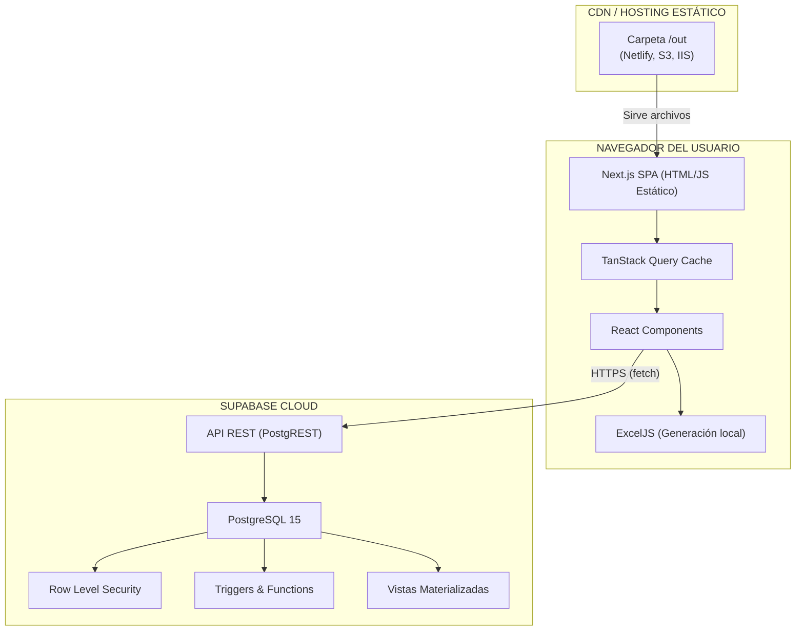
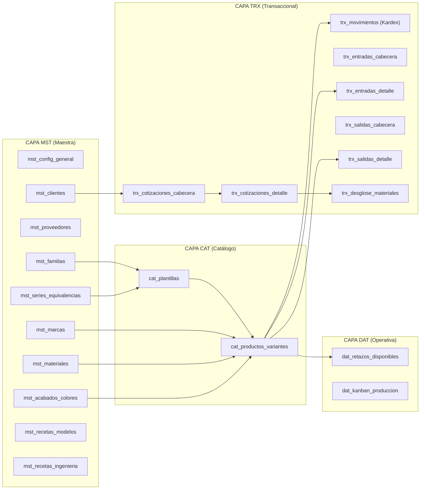
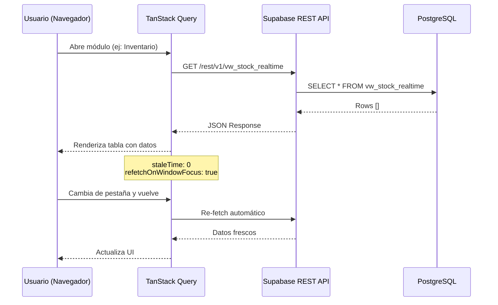
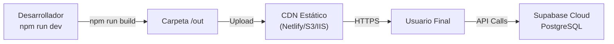

# 01 — Arquitectura General del Sistema ERP

> **Proyecto:** Sistema ERP de Inventario y Cotizaciones para Carpintería Metálica  
> **Stack:** Next.js 16 (SPA Estática) + Supabase (PostgreSQL) + TanStack Query  
> **Última actualización:** 2026-02-21

## Documentos Relacionados

| Documento | Enlace |
|-----------|--------|
| Esquema de Base de Datos | [02_ESQUEMA_BASE_DATOS.md](./02_ESQUEMA_BASE_DATOS.md) |
| Módulos y Funcionalidades | [03_MODULOS_Y_FUNCIONALIDADES.md](./03_MODULOS_Y_FUNCIONALIDADES.md) |
| Referencia de API | [04_API_REFERENCIA.md](./04_API_REFERENCIA.md) |
| Guía del Desarrollador | [05_GUIA_DESARROLLADOR.md](./05_GUIA_DESARROLLADOR.md) |
| Blindaje Arquitectónico | [06_BLINDAJE_ARQUITECTONICO.md](./06_BLINDAJE_ARQUITECTONICO.md) |
| Contingencia Supabase | [../CONTINGENCIA_SUPABASE.md](../CONTINGENCIA_SUPABASE.md) |
| Handoff Maestro | [../HANDOFF_MAESTRO.md](../HANDOFF_MAESTRO.md) |
| Diccionario de Datos | [09_DICCIONARIO_DATOS.md](./09_DICCIONARIO_DATOS.md) |
| Flujos de Negocio | [10_FLUJOS_DE_NEGOCIO.md](./10_FLUJOS_DE_NEGOCIO.md) |

---

## 1. Visión General

Este sistema ERP está diseñado para una empresa de **carpintería metálica** (vidriería de aluminio) en Perú. Gestiona el ciclo completo desde la cotización de ventanas/mamparas hasta el control del inventario de perfiles, accesorios y vidrios, incluyendo la producción tipo Kanban.

### Características Principales
- **Catálogo Maestro** de perfiles, vidrios y accesorios con SKU dinámico
- **Motor de Cotizaciones** con despiece automático de ingeniería (BOM)
- **Inventario tipo Kardex** con entradas, salidas y stock en tiempo real
- **Dashboard KPI** con métricas comerciales y operativas
- **Tablero Kanban** de producción
- **Exportador Excel** multi-hoja para análisis en Power BI
- **Editor de Impresión** de cotizaciones con temas visuales

---

## 2. Stack Tecnológico

| Capa | Tecnología | Versión Congelada | Propósito |
|------|-----------|-------------------|-----------|
| **Framework** | Next.js | 16.1.6 | SPA estática (`output: 'export'`) |
| **UI Library** | React | 19.2.3 | Renderizado de componentes |
| **Estilos** | Tailwind CSS | 4.x | Sistema de diseño utilitario |
| **Componentes UI** | Radix UI | 1.x | Primitivos accesibles (Dialog, Tabs, etc.) |
| **State/Data** | TanStack Query | 5.90.20 | Cache y fetching client-side |
| **Formularios** | React Hook Form + Zod | 7.71.1 / 4.3.6 | Validación tipada |
| **Backend** | Supabase (PostgreSQL) | 2.94.0 | Base de datos, Auth, RLS |
| **Exportación** | ExcelJS + FileSaver | 4.4.0 / 2.0.5 | Generación de XLSX en cliente |
| **Gráficos** | Recharts | 3.7.0 | Visualizaciones del Dashboard |
| **Drag & Drop** | @hello-pangea/dnd | 18.0.1 | Tablero Kanban |

---

## 3. Diagrama de Arquitectura por Capas

---

## 4. Arquitectura por Capas de Datos

El sistema utiliza un modelo de **4 capas lógicas** en la base de datos, inspirado en arquitectura de Data Warehouse:

---

## 5. Flujo de Datos (Data Flow)

---

## 6. Modelo de Despliegue

| Entorno | Tecnología | Descripción |
|---------|-----------|-------------|
| **Desarrollo** | `npm run dev` | Servidor local Next.js con HMR |
| **Build** | `npm run build` | Genera carpeta `/out` estática |
| **Producción** | CDN estático | Netlify, S3, IIS, Cloudflare Pages |
| **Base de datos** | Supabase Cloud | PostgreSQL gestionado con RLS |
| **Contingencia** | Docker (Self-host) | Ver [CONTINGENCIA_SUPABASE.md](../CONTINGENCIA_SUPABASE.md) |

### Diagrama de Despliegue

---

## 7. Seguridad

| Capa | Mecanismo | Detalle |
|------|-----------|---------|
| **Transporte** | HTTPS/TLS | Todas las comunicaciones cifradas |
| **Autenticación** | Supabase Anon Key | Clave pública para acceso controlado |
| **Autorización** | Row Level Security (RLS) | Políticas a nivel de fila en PostgreSQL |
| **Variables** | `.env.local` | Claves nunca expuestas en el código |
| **Versiones** | `package-lock.json` | Dependencias congeladas con `npm ci` |

---

## 8. Principios de Diseño

1. **SPA Pura (Serverless):** Todo el renderizado ocurre en el navegador. No hay servidor Node.js en producción.
2. **Client-Side Fetching:** TanStack Query maneja todo el estado remoto con revalidación agresiva.
3. **Inmutabilidad Temporal:** Versiones exactas en `package.json` para reproducibilidad a 10+ años.
4. **Separación por Capas:** MST → CAT → TRX → DAT, cada capa con responsabilidad clara.
5. **Exportación Portátil:** La carpeta `/out` es autosuficiente y deployable en cualquier servidor HTTP.
