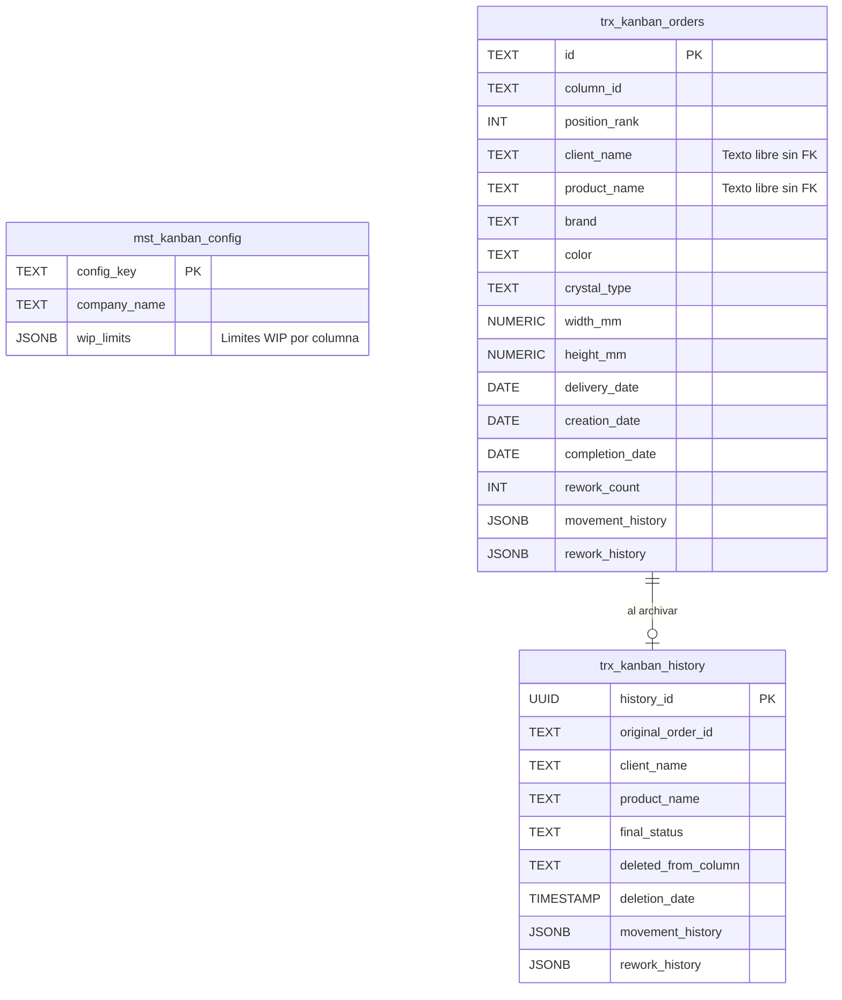
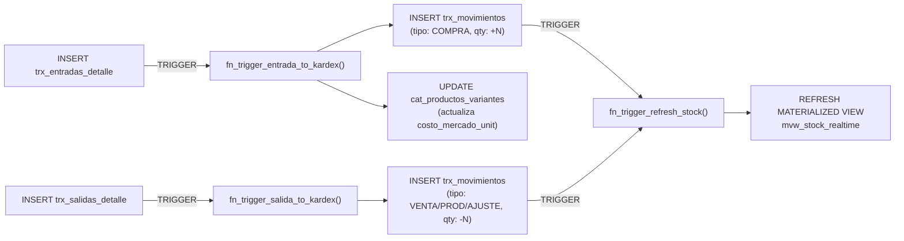
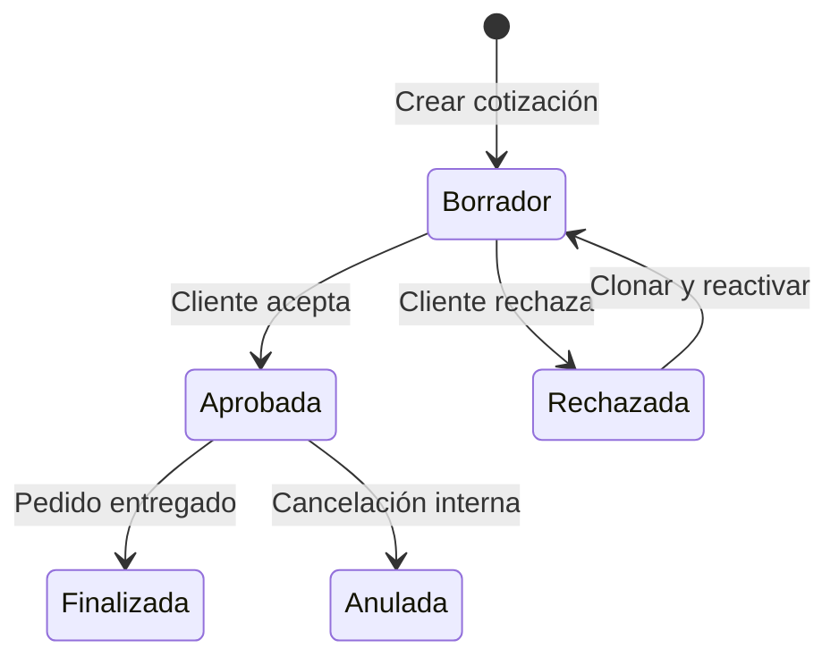

# 02 — Esquema de Base de Datos

> **Motor:** PostgreSQL 17 (vía Supabase)  
> **Esquema base:** Carpeta [`database/`](../database/)  
> **Última actualización:** 2026-03-23

## Documentos Relacionados

- [01_ARQUITECTURA_GENERAL.md](./01_ARQUITECTURA_GENERAL.md) — Visión global
- [09_DICCIONARIO_DATOS.md](./09_DICCIONARIO_DATOS.md) — Detalle columna por columna
- [10_FLUJOS_DE_NEGOCIO.md](./10_FLUJOS_DE_NEGOCIO.md) — Flujos que interactúan con estas tablas

---

## 1. Diagrama Entidad-Relación — Núcleo ERP

> Este ERD muestra las tablas principales y sus Foreign Keys reales según el DDL. Las tablas del módulo **Kanban** se muestran en un diagrama separado (sección 1b) porque son **transaccionalmente independientes**.

```mermaid
erDiagram
    mst_config_general {
        TEXT id_config PK
        NUMERIC margen_ganancia_default
        NUMERIC igv
        NUMERIC markup_cotizaciones_default
        NUMERIC costo_mo_m2_default
        NUMERIC tipo_cambio_referencial
        TEXT moneda_default
        INT validez_cotizacion_dias
        NUMERIC descuento_maximo_pct
        TEXT color_primario
        TEXT nombre_empresa
        TEXT ruc
    }

    mst_clientes {
        TEXT id_cliente PK
        TEXT nombre_completo
        TEXT ruc UK
        TEXT telefono
        TEXT direccion_obra_principal
        TEXT tipo_cliente "CHECK EMPRESA o PERSONA"
    }

    mst_proveedores {
        TEXT id_proveedor PK
        TEXT razon_social
        TEXT ruc UK
        TEXT nombre_comercial
        TEXT contacto_vendedor
        INT dias_credito
        TEXT moneda_predeterminada "CHECK PEN o USD"
    }

    mst_familias {
        TEXT id_familia PK
        TEXT nombre_familia
        TEXT categoria_odoo
    }

    mst_marcas {
        TEXT id_marca PK
        TEXT nombre_marca
        TEXT pais_origen
    }

    mst_materiales {
        TEXT id_material PK
        TEXT nombre_material
        TEXT odoo_code
    }

    mst_acabados_colores {
        TEXT id_acabado PK
        TEXT nombre_acabado
        TEXT sufijo_sku
    }

    mst_almacenes {
        TEXT id_almacen PK
        TEXT nombre_almacen
    }

    mst_series_equivalencias {
        TEXT id_sistema PK
        TEXT nombre_comercial
        TEXT cod_corrales
        TEXT cod_eduholding
        TEXT cod_hpd
        TEXT cod_limatambo
        TEXT uso_principal
    }

    cat_plantillas {
        TEXT id_plantilla PK
        TEXT nombre_generico
        TEXT id_familia FK
        TEXT id_sistema FK
        NUMERIC largo_estandar_mm
        NUMERIC peso_teorico_kg
        TEXT imagen_ref
    }

    cat_productos_variantes {
        TEXT id_sku PK
        TEXT id_plantilla FK
        TEXT id_marca FK
        TEXT id_material FK
        TEXT id_acabado FK
        TEXT id_almacen FK
        TEXT nombre_completo
        TEXT unidad_medida
        NUMERIC costo_mercado_unit
        TEXT moneda_reposicion
        BOOL es_templado
        NUMERIC espesor_mm
        NUMERIC stock_minimo
        NUMERIC punto_pedido
        INT tiempo_reposicion_dias
    }

    mst_recetas_modelos {
        TEXT id_modelo PK
        TEXT id_sistema FK
        TEXT nombre_comercial
        INT num_hojas
        VARCHAR tipo_dibujo "Corrediza Proyectante Batiente Fijo"
        VARCHAR config_hojas_default "CC FCCF F P A"
        BOOL activo
    }

    mst_recetas_ingenieria {
        TEXT id_receta PK
        TEXT id_modelo FK
        TEXT id_plantilla FK
        TEXT id_material_receta FK
        TEXT id_acabado_receta FK
        TEXT id_marca_receta FK
        TEXT id_sistema FK
        TEXT tipo "CHECK Perfil Vidrio Accesorio Servicio"
        TEXT condicion "CHECK BASE u OPCIONAL"
        TEXT seccion "CHECK MARCO HOJAS etc"
        TEXT formula_cantidad
        TEXT formula_perfil
        INT angulo "CHECK 0 45 90"
        TEXT grupo_opcion
        TEXT id_sku_catalogo
        INT orden_visual
    }

    trx_cotizaciones_cabecera {
        UUID id_cotizacion PK
        TEXT id_cliente FK
        TEXT id_marca FK
        ENUM estado "Borrador Aprobada Finalizada Rechazada Anulada"
        TEXT moneda
        NUMERIC markup_aplicado
        BOOL incluye_igv
        BOOL aplica_detraccion
        NUMERIC costo_mano_obra_m2
        NUMERIC costo_fijo_instalacion
        TEXT titulo_documento
        TEXT terminos_personalizados
        TIMESTAMP fecha_aprobacion
        TEXT motivo_rechazo
    }

    trx_cotizaciones_detalle {
        UUID id_linea_cot PK
        UUID id_cotizacion FK
        TEXT id_modelo
        TEXT color_perfiles
        NUMERIC cantidad
        NUMERIC ancho_mm
        NUMERIC alto_mm
        TEXT etiqueta_item
        TEXT tipo_vidrio
        TEXT tipo_cierre
        JSONB opciones_seleccionadas
        BOOL es_despiece_manual
    }

    trx_desglose_materiales {
        UUID id_desglose PK
        UUID id_linea_cot FK
        TEXT tipo_componente "CHECK Perfil Vidrio Accesorio Servicio"
        TEXT nombre_componente
        TEXT sku_real
        NUMERIC medida_corte_mm
        INT angulo_corte
        NUMERIC cantidad_calculada
        NUMERIC costo_total_item
    }

    trx_movimientos {
        UUID id_movimiento PK
        TIMESTAMP fecha_hora
        TEXT tipo_movimiento "CHECK COMPRA VENTA PRODUCCION AJUSTE RETORNO"
        TEXT id_sku FK
        NUMERIC cantidad
        TEXT moneda_origen
        NUMERIC costo_unit_doc
        NUMERIC tipo_cambio
        NUMERIC costo_total_pen
        UUID referencia_doc
    }

    trx_entradas_cabecera {
        UUID id_entrada PK
        TEXT tipo_entrada
        TEXT id_proveedor FK
        TEXT id_cliente FK
        TEXT nro_documento_fisico
        TEXT moneda
        NUMERIC tipo_cambio
        TEXT estado
    }

    trx_entradas_detalle {
        UUID id_linea_entrada PK
        UUID id_entrada FK
        TEXT id_sku FK
        NUMERIC cantidad
        NUMERIC costo_unitario
        NUMERIC descuento
        NUMERIC total_linea
    }

    trx_salidas_cabecera {
        UUID id_salida PK
        TEXT tipo_salida
        TEXT id_destinatario FK
        TEXT estado
        NUMERIC total_dinero
        TEXT responsable_interno
    }

    trx_salidas_detalle {
        UUID id_linea_salida PK
        UUID id_salida FK
        TEXT id_sku FK
        NUMERIC cantidad
        NUMERIC precio_unitario
        NUMERIC subtotal
    }

    dat_retazos_disponibles {
        TEXT id_retazo PK
        TEXT id_sku_padre FK
        NUMERIC longitud_mm
        TEXT ubicacion
        TEXT estado "CHECK DISPONIBLE o USADO"
        TEXT orden_trabajo
    }

    user_roles {
        UUID user_id PK "FK auth.users"
        TEXT role "CHECK ADMIN SECRETARIA OPERARIO"
        TEXT display_name
    }

    login_logs {
        UUID id PK
        UUID user_id "FK auth.users"
        TEXT email
        TEXT role
        TEXT ip_address
    }

    mst_familias ||--o{ cat_plantillas : "contiene"
    mst_series_equivalencias ||--o{ cat_plantillas : "sistema"
    cat_plantillas ||--o{ cat_productos_variantes : "genera SKUs"
    mst_marcas ||--o{ cat_productos_variantes : "marca"
    mst_materiales ||--o{ cat_productos_variantes : "material"
    mst_acabados_colores ||--o{ cat_productos_variantes : "acabado"
    mst_almacenes ||--o{ cat_productos_variantes : "almacen"
    mst_series_equivalencias ||--o{ mst_recetas_modelos : "sistema"
    mst_recetas_modelos ||--o{ mst_recetas_ingenieria : "modelo"
    cat_plantillas ||--o{ mst_recetas_ingenieria : "plantilla"
    mst_materiales ||--o{ mst_recetas_ingenieria : "material receta"
    mst_acabados_colores ||--o{ mst_recetas_ingenieria : "acabado receta"
    mst_marcas ||--o{ mst_recetas_ingenieria : "marca receta"
    mst_series_equivalencias ||--o{ mst_recetas_ingenieria : "sistema receta"
    cat_productos_variantes ||--o{ trx_movimientos : "kardex"
    mst_proveedores ||--o{ trx_entradas_cabecera : "proveedor"
    mst_clientes ||--o{ trx_entradas_cabecera : "cliente devolucion"
    trx_entradas_cabecera ||--o{ trx_entradas_detalle : "lineas"
    cat_productos_variantes ||--o{ trx_entradas_detalle : "producto"
    mst_clientes ||--o{ trx_salidas_cabecera : "destinatario"
    trx_salidas_cabecera ||--o{ trx_salidas_detalle : "lineas"
    cat_productos_variantes ||--o{ trx_salidas_detalle : "producto"
    mst_clientes ||--o{ trx_cotizaciones_cabecera : "cliente"
    mst_marcas ||--o{ trx_cotizaciones_cabecera : "marca"
    trx_cotizaciones_cabecera ||--o{ trx_cotizaciones_detalle : "items"
    trx_cotizaciones_detalle ||--o{ trx_desglose_materiales : "despiece"
    cat_productos_variantes ||--o{ dat_retazos_disponibles : "SKU padre"
```



---

## 1b. Diagrama — Módulo Kanban (Transaccionalmente Aislado)

> **⚠️ Aislamiento Transaccional:** Las tablas del Kanban **NO tienen Foreign Keys** hacia `mst_clientes`, `trx_cotizaciones_cabecera`, ni ninguna otra tabla del ERP. Los campos `client_name`, `product_name`, etc. son **texto libre** ingresado manualmente. Esto es por diseño: el Kanban opera de forma independiente.



---

## 2. Resumen de Tablas por Capa

### Capa MST (Maestra) — 12 tablas

| Tabla | Propósito | PK |
|-------|-----------|-----|
| `mst_config_general` | Configuración global del ERP (IGV, markup, cuentas bancarias, empresa) | `id_config` |
| `mst_clientes` | Registro de clientes con RUC, teléfono y tipo (EMPRESA/PERSONA) | `id_cliente` |
| `mst_proveedores` | Registro de proveedores con crédito y moneda predeterminada | `id_proveedor` |
| `mst_familias` | Familias de productos (Perfiles, Vidrios, etc.) | `id_familia` |
| `mst_marcas` | Marcas comerciales (Corrales, HPD, Eduholding, etc.) | `id_marca` |
| `mst_materiales` | Tipos de material (Aluminio, Vidrio, PVC, etc.) | `id_material` |
| `mst_acabados_colores` | Acabados/colores (Negro, Blanco, Champagne) con sufijo para SKU | `id_acabado` |
| `mst_almacenes` | Almacenes físicos del negocio | `id_almacen` |
| `mst_series_equivalencias` | Series/Sistemas de perfilería con códigos multi-distribuidor | `id_sistema` |
| `mst_recetas_modelos` | Modelos de receta con `tipo_dibujo` y `config_hojas_default` | `id_modelo` |
| `mst_recetas_ingenieria` | Líneas de receta BOM con fórmulas, secciones y opciones | `id_receta` |
| `mst_kanban_config` | Configuración del tablero Kanban (límites WIP) | `config_key` |

### Capa CAT (Catálogo) — 2 tablas

| Tabla | Propósito | PK |
|-------|-----------|-----|
| `cat_plantillas` | Plantillas genéricas de producto (sin marca/color) | `id_plantilla` |
| `cat_productos_variantes` | SKUs concretos con precio, stock mínimo y punto de pedido | `id_sku` |

### Capa TRX (Transaccional) — 10 tablas

| Tabla | Propósito | PK |
|-------|-----------|-----|
| `trx_movimientos` | Kardex maestro de movimientos valorizados en PEN | `id_movimiento` (UUID) |
| `trx_entradas_cabecera` | Cabecera de compras, ajustes positivos, devoluciones | `id_entrada` (UUID) |
| `trx_entradas_detalle` | Líneas de compra con costo, descuento y total | `id_linea_entrada` (UUID) |
| `trx_salidas_cabecera` | Cabecera de ventas, ajustes negativos, producción | `id_salida` (UUID) |
| `trx_salidas_detalle` | Líneas de despacho con precio unitario y subtotal | `id_linea_salida` (UUID) |
| `trx_cotizaciones_cabecera` | Cabecera de cotización con estado ENUM y markup | `id_cotizacion` (UUID) |
| `trx_cotizaciones_detalle` | Ítems de cotización con dimensiones y opciones JSONB | `id_linea_cot` (UUID) |
| `trx_desglose_materiales` | BOM/Despiece calculado por ítem de cotización | `id_desglose` (UUID) |
| `trx_kanban_orders` | Órdenes activas del tablero Kanban (sin FK al ERP) | `id` (TEXT) |
| `trx_kanban_history` | Archivo histórico de órdenes Kanban completadas | `history_id` (UUID) |

### Capa DAT (Operativa) — 1 tabla

| Tabla | Propósito | PK |
|-------|-----------|-----|
| `dat_retazos_disponibles` | Retazos de perfil reutilizables con estado y ubicación | `id_retazo` |

### Capa AUTH (Autenticación) — 2 tablas

| Tabla | Propósito | PK |
|-------|-----------|-----|
| `user_roles` | Roles de usuario (ADMIN, SECRETARIA, OPERARIO) con FK a `auth.users` | `user_id` (UUID) |
| `login_logs` | Registro de inicios de sesión con IP, user-agent y rol | `id` (UUID) |

---

## 3. Triggers Automáticos

| Trigger | Tabla Origen | Acción | Función |
|---------|-------------|--------|---------|
| `tg_entrada_kardex` | `trx_entradas_detalle` | `AFTER INSERT` | `fn_trigger_entrada_to_kardex()` — Crea movimiento COMPRA (+), convierte USD→PEN, actualiza `costo_mercado_unit` |
| `tg_salida_kardex` | `trx_salidas_detalle` | `AFTER INSERT` | `fn_trigger_salida_to_kardex()` — Crea movimiento de salida (-) a costo PMP o costo mercado |
| `trg_refresh_stock_after_movimiento` | `trx_movimientos` | `AFTER INSERT/UPDATE/DELETE` | `fn_trigger_refresh_stock()` — Refresca la vista materializada `mvw_stock_realtime` |
| `trg_refresh_stock_after_sku_change` | `cat_productos_variantes` | `AFTER INSERT/UPDATE/DELETE` | `fn_trigger_refresh_stock()` — Refresca `mvw_stock_realtime` tras cambios en catálogo |



---

## 4. Vistas (Views)

### 4a. Vistas Operativas

| Vista | Propósito | Tablas Fuente |
|-------|-----------|---------------|
| `vw_stock_realtime` | Stock actual con valorización PMP, datos de familia/marca/acabado | `cat_productos_variantes` + `trx_movimientos` + joins maestras |
| `mvw_stock_realtime` | **Vista Materializada** — Idéntica a `vw_stock_realtime` con refresh automático vía trigger. Índice UNIQUE en `id_sku` | Mismas tablas |
| `vw_dashboard_stock_realtime` | Stock para dashboard con estado de abastecimiento (OK/ALERTA/CRITICO) | `trx_movimientos` + `cat_productos_variantes` |
| `vw_kardex_reporte` | Reporte Kardex enriquecido con nombre de entidad (proveedor/cliente) y Nro. documento | `trx_movimientos` + `cat_productos_variantes` + cabeceras + maestras |
| `vw_reporte_produccion` | Estado de producción: UNION de órdenes activas + historial archivado | `trx_kanban_orders` UNION `trx_kanban_history` |
| `vw_reporte_retazos` | Retazos con nombre del perfil y valor recuperable estimado | `dat_retazos_disponibles` + `cat_productos_variantes` + `cat_plantillas` |
| `vw_reporte_desglose` | Reporte completo de ingeniería/despiece por cotización | `trx_desglose_materiales` + detalle + cabecera + cliente |

### 4b. Vistas de Cotizaciones

| Vista | Propósito | Tablas Fuente |
|-------|-----------|---------------|
| `vw_cotizaciones_detalladas` | Detalle con `_costo_materiales`, `_vc_precio_unit_oferta_calc`, `_vc_subtotal_linea_calc` | `trx_cotizaciones_detalle` + cabecera + desglose + config |
| `vw_cotizaciones_totales` | Totales con `_vc_total_costo_materiales`, `_vc_subtotal_venta`, `_vc_monto_igv`, `_vc_precio_final_cliente` | `trx_cotizaciones_cabecera` + `vw_cotizaciones_detalladas` + config |

### 4c. Vistas KPI / Análisis

| Vista | Propósito |
|-------|-----------|
| `vw_kpi_conversion` | Tasa de conversión: total cotizaciones / ganadas / perdidas / pendientes |
| `vw_kpi_ciclo_ventas` | Días promedio de cierre (fecha_aprobacion − fecha_emision) |
| `vw_kpi_margen_real` | Margen bruto mensual: ventas − costos directos (últimos 6 meses) |
| `vw_kpi_otif` | OTIF mensual: % de entregas a tiempo (fecha_entrega_real ≤ fecha_prometida) |
| `vw_kpi_ticket_promedio` | Ticket promedio, máximo y mínimo de ventas cerradas |
| `vw_kpi_top_productos` | Top 10 modelos por volumen de ventas |
| `vw_kpi_abc_analisis` | Clasificación ABC por valor de salidas (últimos 90 días) |
| `vw_kpi_valorizacion` | Valorización total del inventario en PEN y USD, conteo de SKUs críticos |
| `vw_kpi_retazos_valorizados` | Cantidad de retazos, metros lineales y valor recuperable total |
| `vw_kpi_stock_zombie` | Stock inmovilizado sin movimiento en 90+ días con valor estancado |

### 4d. Vistas de Auditoría de Recetas

| Vista | Propósito |
|-------|-----------|
| `vw_audit_skus_recetas` | Genera el SKU teórico de cada línea de receta |
| `vw_audit_skus_faltantes` | Compara SKUs teóricos vs. existentes en catálogo (✅/❌) |
| `vw_audit_plantillas_faltantes` | Plantillas referenciadas en recetas que no existen en `cat_plantillas` |
| `vw_audit_resumen_sistema` | Resumen de completitud por sistema/modelo (% SKUs OK) |

---

## 5. Funciones RPC (Remote Procedure Call)

### 5a. Motor de Cotizaciones

| Función | Parámetros | Propósito |
|---------|-----------|-----------|
| `fn_crear_cotizacion_mto(...)` | 14 params + JSONB detalles | Crea cotización completa con cabecera + detalles + despiece en una sola transacción |
| `fn_agregar_linea_cotizacion(...)` | 11 params | Inserta línea de detalle y genera despiece automáticamente |
| `fn_generar_despiece_ingenieria(uuid)` | `p_id_linea_cot` | Motor BOM: itera recetas, evalúa fórmulas, resuelve SKUs, calcula costos y genera desglose |
| `fn_evaluar_formula(text, numeric, numeric, numeric)` | Expresión, ancho, alto, hojas | Evaluador seguro de fórmulas matemáticas con variables `ANCHO`, `ALTO`, `hojas` |
| `fn_calcular_sku_real(...)` | 7 params de tipo/plantilla/color/marca | Genera el código SKU dinámicamente según tipo (Perfil → `AL-XXX-COLOR-MARCA`, Accesorio → `MAT-XXX-ACAB-MARCA`) |
| `fn_clonar_cotizacion(uuid)` | `p_id_cotizacion` | Duplica cotización completa (cabecera + detalles + regenera despiece) |
| `fn_clonar_item_cotizacion(uuid)` | `p_id_linea_cot` | Duplica un ítem dentro de la misma cotización con recálculo de despiece |

### 5b. Producción (Kanban)

| Función | Propósito |
|---------|-----------|
| `fn_archive_kanban_order(text, text, text, jsonb, jsonb)` | Mueve una orden activa al historial (`trx_kanban_history`) y la elimina de `trx_kanban_orders` |
| `fn_archive_kanban_batch()` | Archiva todas las órdenes de la columna `column-finalizado` de golpe |

### 5c. Inventario y Stock

| Función | Propósito |
|---------|-----------|
| `fn_trigger_entrada_to_kardex()` | Trigger: convierte entrada → movimiento Kardex, actualiza `costo_mercado_unit` en compras |
| `fn_trigger_salida_to_kardex()` | Trigger: convierte salida → movimiento Kardex negativo, usa costo PMP o costo mercado |
| `fn_trigger_refresh_stock()` | Trigger: ejecuta `fn_refresh_stock_materializada()` tras cambios |
| `fn_refresh_stock_materializada()` | Refresca `mvw_stock_realtime` con `REFRESH MATERIALIZED VIEW CONCURRENTLY` |
| `rename_sku(old, new, data)` | Renombra un SKU propagando a movimientos, entradas, salidas, desglose y retazos |
| `update_costos_mercado_bulk(jsonb)` | Actualización masiva de `costo_mercado_unit` desde un array JSON |

### 5d. Análisis y Reportes

| Función | Propósito |
|---------|-----------|
| `get_abc_analysis_v2(p_dias)` | Análisis ABC parametrizado por días (NULL = sin filtro de fecha) |
| `get_abc_inventory_valuation()` | Clasificación ABC por valor de inventario actual |

### 5e. Seguridad y Administración

| Función | Propósito |
|---------|-----------|
| `get_user_role()` | Retorna el rol del usuario autenticado (`ADMIN`, `SECRETARIA`, `OPERARIO`). `SECURITY DEFINER` |
| `fn_reset_erp_transactions()` | **Danger Zone:** Purga todas las transacciones ERP (TRUNCATE CASCADE). Solo ADMIN |
| `fn_reset_kanban_data()` | **Danger Zone:** Purga todas las órdenes y historial Kanban. Solo ADMIN |
| `rls_auto_enable()` | Event trigger: habilita RLS automáticamente en tablas nuevas del schema `public` |

---

## 6. Enumeración de Estado de Cotización

```sql
CREATE TYPE estado_cotizacion AS ENUM (
    'Borrador',
    'Aprobada',
    'Finalizada',
    'Rechazada',
    'Anulada'
);
```



---

## 7. Row Level Security (RLS)

Todas las tablas tienen RLS habilitado. La función `get_user_role()` determina el acceso:

| Rol | Lectura (SELECT) | Escritura (INSERT/UPDATE) | Eliminación (DELETE) |
|-----|:-:|:-:|:-:|
| **ADMIN** | ✅ Todo | ✅ Todo | ✅ Todo |
| **SECRETARIA** | ✅ Todo (excepto config) | ✅ Clientes, Proveedores, Entradas, Salidas, Cotizaciones | ✅ Mismas tablas de escritura |
| **OPERARIO** | ✅ Catálogo, Inventario, Kanban | ✅ Kanban, Retazos | ✅ Kanban, Retazos |

---

## 8. Scripts de Migración

Los scripts de creación y alteración están en la carpeta [`database/`](../database/) como archivos `.sql` individuales. Consulte la [Guía del Desarrollador](./05_GUIA_DESARROLLADOR.md) para el procedimiento de aplicación.
