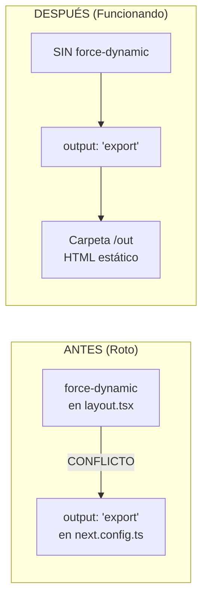
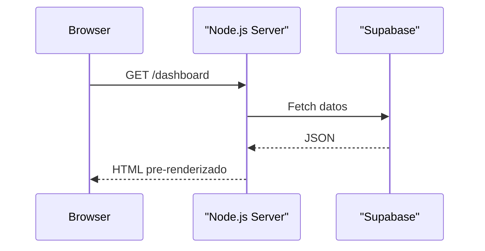
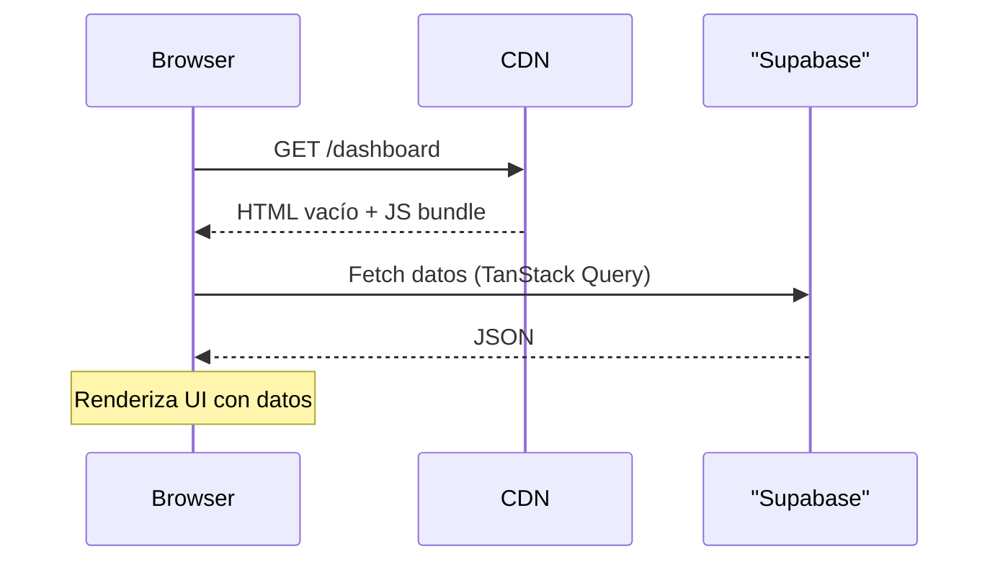
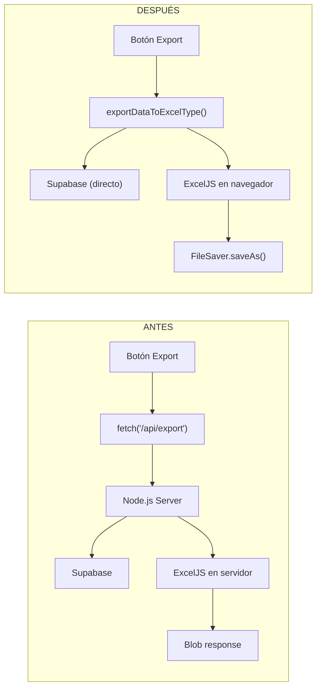
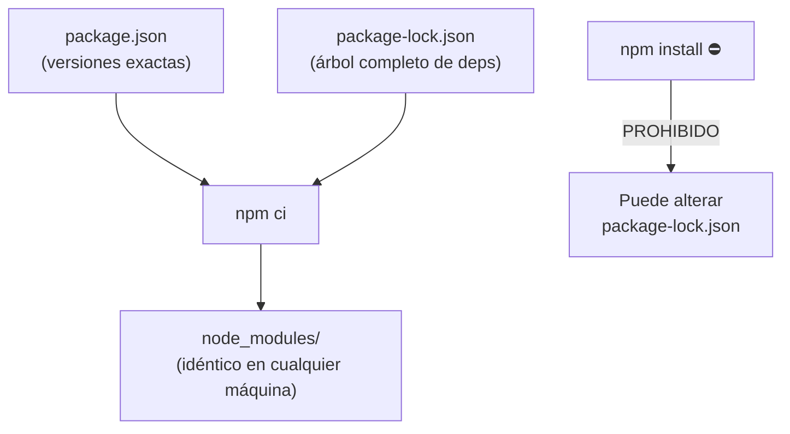

# 06 — Informe de Blindaje Arquitectónico

> Resolución de conflictos y garantía de longevidad del sistema ERP  
> **Última actualización:** 2026-02-21

## Documentos Relacionados

- [01_ARQUITECTURA_GENERAL.md](./01_ARQUITECTURA_GENERAL.md) — Arquitectura actual
- [05_GUIA_DESARROLLADOR.md](./05_GUIA_DESARROLLADOR.md) — Reglas de oro
- [../CONTINGENCIA_SUPABASE.md](../CONTINGENCIA_SUPABASE.md) — Plan de emergencia
- [../HANDOFF_MAESTRO.md](../HANDOFF_MAESTRO.md) — Protocolo de entrega

---

## 1. Resolución del Conflicto Crítico: `force-dynamic` vs. `output: 'export'`

### El Problema

Next.js ofrece dos modos fundamentalmente **incompatibles**:

| Modo | Directiva | Requiere Servidor | Resultado |
|------|-----------|-------------------|-----------|
| Server-Side Rendering | `export const dynamic = 'force-dynamic'` | ✅ Sí | HTML generado en cada request |
| Static Export (SPA) | `output: 'export'` en `next.config.ts` | ❌ No | Carpeta `/out` con HTML estático |

Si ambos coexisten, **el build falla**:

```
Error: Page "/dashboard" is missing "generateStaticParams()" so it 
cannot be used with "output: export" config.
```

### La Solución Implementada



**Cambios realizados:**

1. **Eliminado** `export const dynamic = 'force-dynamic'` del archivo `app/(dashboard)/layout.tsx`
2. **Configurado** `next.config.ts` con:
   ```typescript
   const nextConfig: NextConfig = {
       output: 'export',
       images: { unoptimized: true }
   };
   ```
3. **Rutas dinámicas** (`[id]`): Se crearon Server Component wrappers con `generateStaticParams()` vacíos para satisfacer al compilador.

---

## 2. Migración a Client-Side Fetching Puro

### Paradigma Anterior (SSR)



### Paradigma Actual (SPA)



### Configuración de TanStack Query

```typescript
// components/providers.tsx
const queryClient = new QueryClient({
    defaultOptions: {
        queries: {
            staleTime: 0,              // Datos se consideran viejos inmediatamente
            refetchOnWindowFocus: true, // Recarga al volver a la pestaña
        },
    },
})
```

| Parámetro | Valor | Razón |
|-----------|-------|-------|
| `staleTime` | `0` | Siempre fetchar datos frescos |
| `refetchOnWindowFocus` | `true` | Si el usuario cambia de app y vuelve, recarga |

---

## 3. Migración del Exportador Excel (Servidor → Cliente)

### Problema
La ruta `app/api/export/route.ts` era una API server-side que generaba archivos Excel. Es **incompatible** con `output: 'export'`.

### Solución

| Componente | Antes | Después |
|-----------|-------|---------|
| **Generación** | `api/export/route.ts` (Node.js) | `lib/export/excel-export.ts` (Navegador) |
| **Descarga** | `fetch('/api/export')` + blob | `ExcelJS` local + `FileSaver.saveAs()` |
| **Datos** | Server → Supabase | Browser → Supabase (directo) |



---

## 4. Protocolo de Criogenización (Congelación de Versiones)

### El Peligro del `^` (Caret)

```json
// PELIGROSO: npm puede instalar next 16.2.0, 16.5.0, etc.
"next": "^16.1.6"

// SEGURO: siempre instalará exactamente 16.1.6
"next": "16.1.6"
```

### Cambios Realizados

Se eliminaron **todos** los `^` y `~` del `package.json`:

| Símbolo | Significado | Riesgo |
|---------|-----------|--------|
| `^16.1.6` | Cualquier 16.x.x | Medio-Alto |
| `~16.1.6` | Cualquier 16.1.x | Medio |
| `16.1.6` | Solo 16.1.6 | ✅ Ninguno |

### El Lockfile Sagrado



| Comando | Seguro | Qué Hace |
|---------|:------:|----------|
| `npm ci` | ✅ | Instala exactamente lo que dice el lockfile |
| `npm install` | ❌ | Puede resolver versiones nuevas y alterar el lockfile |

---

## 5. Resumen de la Nueva Arquitectura Blindada

| Componente | Estado Anterior (Riesgoso) | Estado Blindado |
|------------|---------------------------|-----------------|
| **Rendering** | Next.js Server (SSR) / `force-dynamic` | **Static Export (`output: 'export'`)** |
| **Data Fetching** | Server Components | **Client-Side (TanStack Query) + RLS** |
| **Excel Export** | API Route (`/api/export`) | **Client-Side (ExcelJS + FileSaver)** |
| **Versiones** | Flexibles (`^16.1.6`) | **Congeladas (`16.1.6`) + `npm ci`** |
| **Dependencia Runtime** | Vercel / Node.js | **Hosting Estático (cualquiera)** |
| **Imágenes** | Next.js Image Optimizer | **Desactivado (`unoptimized: true`)** |
| **Supabase** | Confianza ciega en la nube | **Plan Docker Self-Host** |

---

## 6. Rutas Dinámicas en SPA Estática

Para las rutas con parámetros (`[id]`), Next.js requiere `generateStaticParams()`:

```
app/(dashboard)/cotizaciones/[id]/
├── layout.tsx      ← Server Component con generateStaticParams
├── page.tsx        ← Server Component wrapper con generateStaticParams
└── print/
    ├── page.tsx    ← Server Component wrapper con generateStaticParams  
    └── client.tsx  ← Client Component real ("use client")
```

**¿Por qué arrays con `[{ id: '1' }]`?**  
Next.js necesita al menos un parámetro para generar la estructura. En runtime, el componente `"use client"` extraerá el `id` real de la URL y cargará los datos desde Supabase.

---

## 7. Checklist de Verificación Post-Build

- [x] `npm run build` termina con exit code 0
- [x] Se genera la carpeta `/out` con archivos `.html`
- [x] Las 19 páginas se listan sin errores
- [x] No hay referencias a `/api/` en el código
- [x] No hay `force-dynamic` en ningún archivo
- [x] `package.json` no contiene `^` ni `~`
- [x] `package-lock.json` presente y no modificado
