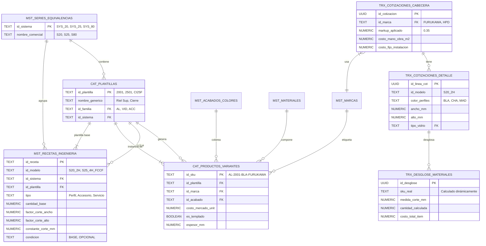
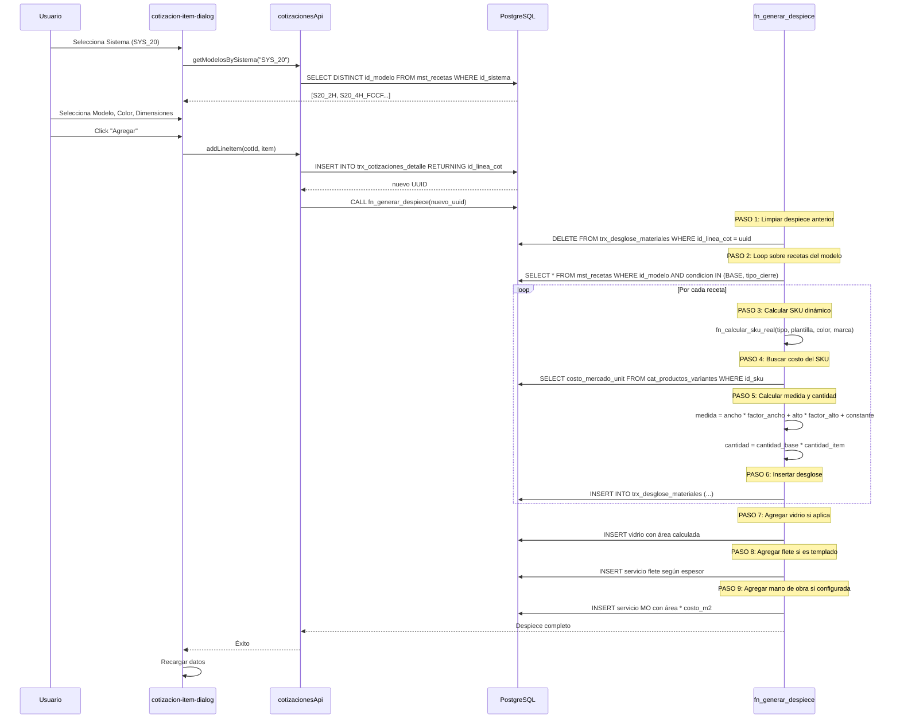
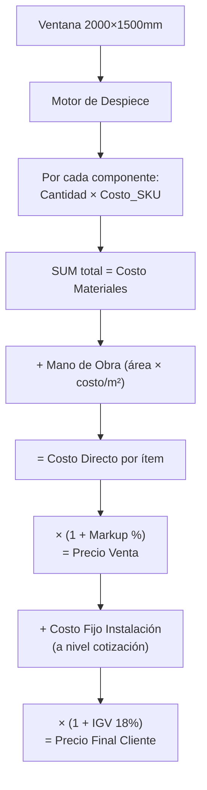

# 08 — Arquitectura del Motor de Recetas y Cotizaciones

> **Documento técnico del corazón del ERP:** el motor de despiece automático (BOM Engine)  
> que convierte dimensiones de ventanas en listas de materiales con costos.  
> **Última actualización:** 2026-02-21

## Documentos Relacionados

| Documento | Enlace |
|-----------|--------|
| Esquema de Base de Datos | [02_ESQUEMA_BASE_DATOS.md](./02_ESQUEMA_BASE_DATOS.md) |
| Módulos y Funcionalidades | [03_MODULOS_Y_FUNCIONALIDADES.md](./03_MODULOS_Y_FUNCIONALIDADES.md) |
| API de Cotizaciones | [04_API_REFERENCIA.md](./04_API_REFERENCIA.md) |
| Diccionario de Datos | [09_DICCIONARIO_DATOS.md](./09_DICCIONARIO_DATOS.md) |
| Flujos de Negocio | [10_FLUJOS_DE_NEGOCIO.md](./10_FLUJOS_DE_NEGOCIO.md) |

---

## 1. Modelo de Datos del Motor de Recetas



---

## 2. Flujo del Despiece Automático



---

## 3. Fórmulas de SKU Dinámico

El SKU se calcula dinámicamente según el **tipo de componente**:

### 3.1 Para PERFILES (Aluminio)

```
SKU = "AL-" + id_plantilla + "-" + color_perfiles + "-" + id_marca_cotizacion
```

**Ejemplo:**
| Variable | Valor | Origen |
|----------|-------|--------|
| Plantilla | `2001` (Riel Superior) | Receta |
| Color | `BLA` (Blanco) | Selección del usuario en ítem |
| Marca | `FURUKAWA` | Cabecera de cotización |
| **SKU resultante** | **`AL-2001-BLA-FURUKAWA`** | Calculado |

> **Clave:** Las variables dinámicas son **color** (del ítem) y **marca** (de la cabecera). La plantilla viene de la receta.

### 3.2 Para ACCESORIOS

```
SKU = id_material_receta + "-" + id_plantilla + "-" + id_acabado_receta + "-" + id_marca_receta
```

**Ejemplo:**
| Variable | Valor | Origen |
|----------|-------|--------|
| Material | `GEN` | Fijo en la receta |
| Plantilla | `CI25F` (Cierre tipo F) | Receta |
| Acabado | `GEN` | Fijo en la receta |
| Marca | `GEN` | Fijo en la receta |
| **SKU resultante** | **`GEN-CI25F-GEN-GEN`** | Calculado |

> **Nota:** Los accesorios usan valores **fijos** de la receta porque no cambian con el proyecto. Solo los perfiles varían por marca y color del cliente.

### 3.3 Implementación SQL

```sql
CREATE OR REPLACE FUNCTION fn_calcular_sku_real(
    p_tipo TEXT,              -- 'Perfil' o 'Accesorio'
    p_id_plantilla TEXT,      -- '2001', 'CI25F', etc.
    p_color_perfiles TEXT,    -- 'BLA', 'CHA' (del usuario)
    p_id_marca_cot TEXT,      -- 'FURUKAWA', 'HPD' (de la cabecera)
    p_id_material_receta TEXT,-- 'AL', 'GEN' (de la receta)
    p_id_acabado_receta TEXT, -- 'GEN' o NULL
    p_id_marca_receta TEXT    -- 'GEN' o NULL
) RETURNS TEXT AS $$
BEGIN
    IF p_tipo = 'Perfil' THEN
        -- SKU dinámico: varía por color y marca del proyecto
        RETURN 'AL-' || p_id_plantilla || '-' || p_color_perfiles || '-' || p_id_marca_cot;
    ELSE
        -- SKU fijo: usa valores de la receta
        RETURN COALESCE(p_id_material_receta, 'AC') || '-' || 
               p_id_plantilla || '-' || 
               COALESCE(p_id_acabado_receta, 'GEN') || '-' || 
               COALESCE(p_id_marca_receta, 'GEN');
    END IF;
END;
$$ LANGUAGE plpgsql IMMUTABLE;
```

---

## 4. Cálculos de Cantidades y Medidas

### 4.1 Medida de Corte (para Perfiles)

```
Medida_Corte_mm = (Ancho × factor_corte_ancho) + (Alto × factor_corte_alto) + constante_corte_mm
```

**Tabla de factores reales del sistema:**

| Componente | Plantilla | F. Ancho | F. Alto | Constante | Fórmula Resultante |
|------------|-----------|:---:|:---:|:---:|---|
| Riel Superior | `2001` | 1 | 0 | -12 | `Ancho - 12` |
| Jamba | `2009` | 0 | 1 | 0 | `Alto` |
| Zócalo Superior | `2004` | 0.5 | 0 | -4 | `(Ancho / 2) - 4` |
| Traslapo | `2010` | 0 | 1 | -28 | `Alto - 28` |
| Marco 45° | `80501` | 1 | 0 | 0 | `Ancho` (corte a 45°) |

### 4.2 Cantidad Calculada

**Fórmula base:**
```
Cantidad = cantidad_base × cantidad_item_usuario
```

**Fórmula avanzada (por área/perímetro):**
```
Cantidad = (factor_cantidad_ancho × Ancho) + (factor_cantidad_alto × Alto) + (factor_cantidad_area × Área)
```

| Componente | Base | F. Ancho | F. Alto | F. Área | Interpretación |
|------------|:---:|:---:|:---:|:---:|---|
| Felpa (`FESYB`) | 0 | 0.004 | 0.006 | 0 | Metros lineales por perímetro |
| Silicona (`S25`) | 0 | 0.002 | 0.004 | 0 | Consumo proporcional |
| Acc. por m² | 0 | 0 | 0 | 0.000001 | Proporcional al área |

---

## 5. Cálculos de Costos (Pipeline Completo)



### Fórmulas Detalladas

| Cálculo | Fórmula |
|---------|---------|
| **Costo componente** | `Cantidad_Calculada × costo_mercado_unit` |
| **Costo materiales línea** | `SUM(costo_total_item) WHERE id_linea_cot` |
| **Precio venta línea** | `Costo_Materiales × (1 + markup_aplicado)` |
| **Subtotal venta** | `SUM(precio_venta_lineas) + costo_fijo_instalacion` |
| **IGV** | `Subtotal_Venta × 0.18` |
| **Precio final** | `Subtotal_Venta × 1.18` |

---

## 6. Servicios Especiales

### 6.1 Vidrio

| Propiedad | Valor |
|-----------|-------|
| **Tipo componente** | `Vidrio` |
| **Cantidad** | `(Ancho × Alto) / 1,000,000` (metros cuadrados) |
| **SKU** | Seleccionado por el usuario (filtrado por familia `VID`) |
| **Costo** | `Área_m² × costo_mercado_unit` |

### 6.2 Flete de Templado (Condicional)

| Condición | SKU Asignado |
|-----------|-------------|
| `es_templado = TRUE` Y espesor ≤ 6mm | `SER-FLETE-06MM` |
| `es_templado = TRUE` Y espesor ≤ 8mm | `SER-FLETE-08MM` |
| `es_templado = TRUE` Y espesor > 8mm | `SER-FLETE-10MM` |

**Costo:** `Área_m² × costo_flete_SKU`

### 6.3 Mano de Obra

- **Condición:** `costo_mano_obra_m2 > 0` en la cabecera
- **Costo:** `Área_m² × costo_mano_obra_m2`

### 6.4 Instalación (Fijo por Proyecto)

- **Ubicación:** Campo `costo_fijo_instalacion` en `trx_cotizaciones_cabecera`
- **Descripción:** Embalaje, Flete a obra, Movilidad, Viáticos, SCTR
- **Costo:** Monto **fijo** por cotización, ingresado manualmente

---

## 7. Vistas SQL de Cálculo

### 7.1 Vista de Detalle (`vw_cotizaciones_detalladas`)

```sql
SELECT 
    d.*,
    -- Costo de materiales (suma del desglose)
    (SELECT SUM(costo_total_item) 
     FROM trx_desglose_materiales 
     WHERE id_linea_cot = d.id_linea_cot) as _costo_materiales,
    
    -- Precio unitario con markup
    _costo_materiales * (1 + c.markup_aplicado) as _vc_precio_unit_oferta,
    
    -- Subtotal línea
    _vc_precio_unit_oferta * d.cantidad as _vc_subtotal_linea
FROM trx_cotizaciones_detalle d
JOIN trx_cotizaciones_cabecera c ON d.id_cotizacion = c.id_cotizacion;
```

### 7.2 Vista de Totales (`vw_cotizaciones_totales`)

```sql
SELECT 
    c.*,
    SUM(_costo_materiales) as _vc_total_costo_materiales,
    SUM(_vc_subtotal_linea) + COALESCE(c.costo_fijo_instalacion, 0) as _vc_subtotal_venta,
    _vc_subtotal_venta * (SELECT igv FROM mst_config_general) as _vc_monto_igv,
    _vc_subtotal_venta * (1 + igv) as _vc_precio_final_cliente
FROM trx_cotizaciones_cabecera c
JOIN vw_cotizaciones_detalladas d ON c.id_cotizacion = d.id_cotizacion
GROUP BY c.id_cotizacion;
```

---

## 8. Editor de Recetas (UI)

El editor visual de recetas se encuentra en `components/mto/recipe-editor.tsx` (~47KB) y permite:

- **Ver** todas las líneas de una receta agrupadas por sección
- **Agregar** nuevos componentes con fórmulas de corte
- **Editar** fórmulas dinámicas (`formula_cantidad`, `formula_perfil`)
- **Vincular** SKUs reales del catálogo
- **Auditar** masivamente todas las recetas (ver [03_MODULOS_Y_FUNCIONALIDADES.md](./03_MODULOS_Y_FUNCIONALIDADES.md#7--motor-de-recetas-de-ingeniería))

### APIs Involucradas

| Operación | API | Método |
|-----------|-----|--------|
| Listar modelos | `recetasApi` | `getModelos()` |
| Ver líneas de un modelo | `recetasApi` | `getRecetasByModelo(id)` |
| Agregar componente | `recetasApi` | `createRecetaLinea(data)` |
| Clonar modelo completo | `recetasApi` | `clonarModelo(id, nuevo_id, nombre)` |
| Auditoría masiva | `recetasApi` | `getAllRecetasConCatalogInfo()` |

> Para la referencia completa de la API, ver [04_API_REFERENCIA.md](./04_API_REFERENCIA.md#4-recetasapi--recetas-de-ingeniería).
