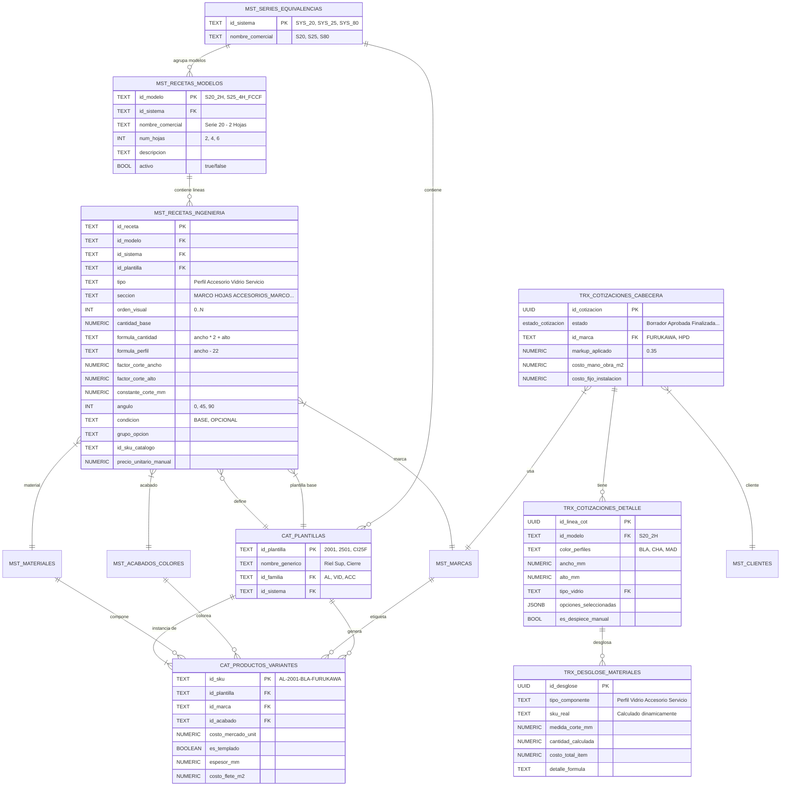
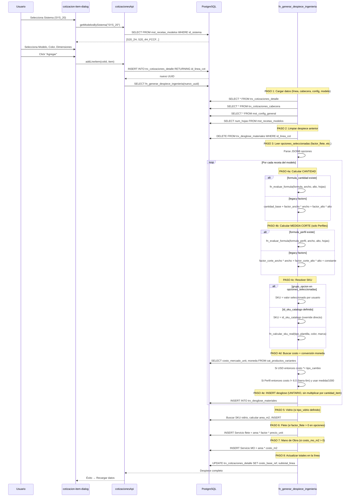
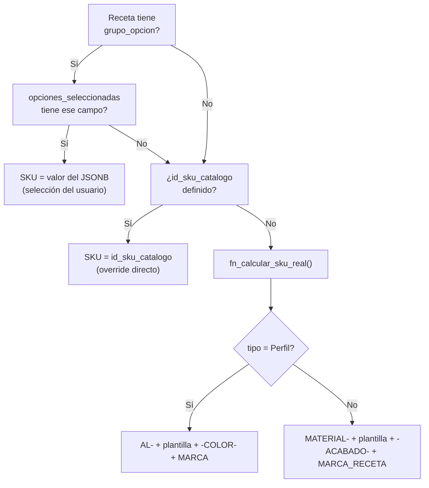
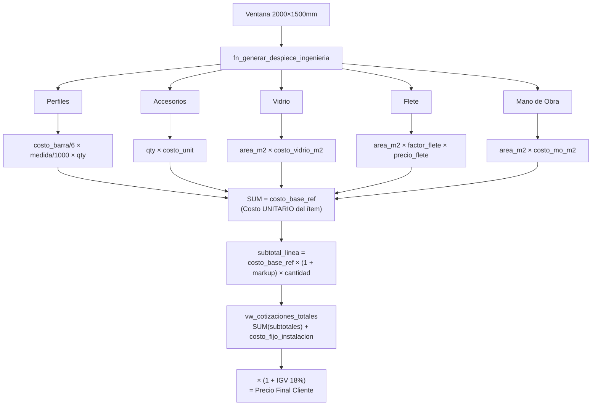

# 08 — Arquitectura del Motor de Recetas y Cotizaciones

> **Documento técnico del corazón del ERP:** el motor de despiece automático (BOM Engine)
> que convierte dimensiones de ventanas en listas de materiales con costos.
> **Verificado contra schema real:** 2026-02-21

## Documentos Relacionados

| Documento | Enlace |
|-----------|--------|
| Esquema de Base de Datos | [02_ESQUEMA_BASE_DATOS.md](./02_ESQUEMA_BASE_DATOS.md) |
| Módulos y Funcionalidades | [03_MODULOS_Y_FUNCIONALIDADES.md](./03_MODULOS_Y_FUNCIONALIDADES.md) |
| API de Cotizaciones | [04_API_REFERENCIA.md](./04_API_REFERENCIA.md) |
| Diccionario de Datos | [09_DICCIONARIO_DATOS.md](./09_DICCIONARIO_DATOS.md) |
| Flujos de Negocio | [10_FLUJOS_DE_NEGOCIO.md](./10_FLUJOS_DE_NEGOCIO.md) |

---

## 1. Modelo de Datos del Motor de Recetas



> **Diferencia clave vs doc anterior:** se añadió la tabla `mst_recetas_modelos` que agrupa las recetas por modelo. El campo `estado` de `trx_cotizaciones_cabecera` es un ENUM PostgreSQL con 5 valores: `'Borrador'`, `'Aprobada'`, `'Finalizada'`, `'Rechazada'`, `'Anulada'`.

---

## 2. Flujo del Despiece Automático (`fn_generar_despiece_ingenieria`)



---

## 3. Fórmulas de SKU Dinámico

### 3.1 Resolución de SKU (3 niveles de prioridad)



### 3.2 Para PERFILES (Aluminio)

```
SKU = "AL-" + id_plantilla + "-" + color_perfiles + "-" + id_marca_cotizacion
```

| Variable | Valor | Origen |
|----------|-------|--------|
| Plantilla | `2001` | Receta (`id_plantilla`) |
| Color | `BLA` | Selección del usuario en ítem (`color_perfiles`) |
| Marca | `FURUKAWA` | Cabecera de cotización (`id_marca`) |
| **SKU** | **`AL-2001-BLA-FURUKAWA`** | Calculado dinámicamente |

### 3.3 Para ACCESORIOS

```
SKU = COALESCE(material_receta, 'AC') + "-" + plantilla + "-" + COALESCE(acabado_receta, 'GEN') + "-" + COALESCE(marca_receta, 'GEN')
```

| Variable | Valor | Origen |
|----------|-------|--------|
| Material | `GEN` | Fijo en la receta |
| Plantilla | `CI25F` | Receta |
| Acabado | `GEN` | Fijo en la receta |
| Marca | `GEN` | Fijo en la receta |
| **SKU** | **`GEN-CI25F-GEN-GEN`** | Calculado |

### 3.4 Implementación SQL Real

```sql
CREATE OR REPLACE FUNCTION fn_calcular_sku_real(
    p_tipo TEXT,
    p_id_plantilla TEXT,
    p_color_perfiles TEXT,     -- Del usuario (solo Perfiles)
    p_id_marca_cot TEXT,       -- De la cabecera (solo Perfiles)
    p_id_material_receta TEXT, -- De la receta
    p_id_acabado_receta TEXT,  -- De la receta
    p_id_marca_receta TEXT     -- De la receta
) RETURNS TEXT AS $$
BEGIN
    IF p_tipo = 'Perfil' THEN
        RETURN 'AL-' || p_id_plantilla || '-' || p_color_perfiles || '-' || p_id_marca_cot;
    ELSE
        RETURN COALESCE(p_id_material_receta, 'AC') || '-' ||
               p_id_plantilla || '-' ||
               COALESCE(p_id_acabado_receta, 'GEN') || '-' ||
               COALESCE(p_id_marca_receta, 'GEN');
    END IF;
END;
$$ LANGUAGE plpgsql IMMUTABLE;
```

---

## 4. Evaluador de Fórmulas (`fn_evaluar_formula`)

Función que permite usar **expresiones dinámicas** en las recetas:

```sql
CREATE OR REPLACE FUNCTION fn_evaluar_formula(
    p_expression TEXT,    -- "ancho - 22" o "alto * 2 + 50"
    p_ancho NUMERIC,      -- Ancho del ítem en mm
    p_alto NUMERIC,       -- Alto del ítem en mm
    p_cant_hojas NUMERIC  -- Número de hojas del modelo (default 1)
) RETURNS NUMERIC
```

### Variables Disponibles

| Variable | Se reemplaza por | Ejemplo |
|----------|-----------------|---------|
| `ancho` | `p_ancho` (mm) | `ancho - 22` → `2000 - 22` = `1978` |
| `alto` | `p_alto` (mm) | `alto * 0.5` → `1500 * 0.5` = `750` |
| `hojas` | `p_cant_hojas` | `hojas * 2` → `2 * 2` = `4` |

### Seguridad

- Solo permite caracteres: `0-9 . + - * / ( ) espacio`
- Cualquier carácter no numérico/operador retorna `0`
- Errores de ejecución retornan `0` (nunca falla fatalmente)

---

## 5. Cálculos de Cantidades y Medidas

### 5.1 Medida de Corte (Perfiles) — Doble sistema

| Prioridad | Método | Cuándo se usa |
|:-:|--------|---------------|
| 1️⃣ | `formula_perfil` | Si el campo tiene valor (nueva forma) |
| 2️⃣ | `factor_corte_ancho/alto + constante` | Legacy, cuando no hay fórmula |

**Tabla de factores reales:**

| Componente | Plantilla | F. Ancho | F. Alto | Constante | Fórmula Equiv. |
|------------|-----------|:---:|:---:|:---:|---|
| Riel Superior | `2001` | 1 | 0 | -12 | `ancho - 12` |
| Jamba | `2009` | 0 | 1 | 0 | `alto` |
| Zócalo Superior | `2004` | 0.5 | 0 | -4 | `(ancho / 2) - 4` |
| Traslapo | `2010` | 0 | 1 | -28 | `alto - 28` |
| Marco 45° | `80501` | 1 | 0 | 0 | `ancho` (corte a 45°) |

### 5.2 Cantidad Calculada — Doble sistema

| Prioridad | Método | Cuándo se usa |
|:-:|--------|---------------|
| 1️⃣ | `formula_cantidad` | Si el campo tiene valor |
| 2️⃣ | `cantidad_base` o factores legacy | Cuando no hay fórmula |

### 5.3 Lógica de Costo por Tipo

| Tipo | Fórmula de Costo |
|------|-----------------|
| **Perfil** | `costo_barra / 6.0` → `cantidad × (medida_mm / 1000) × costo_metro` |
| **Accesorio** | `cantidad × costo_unitario` |
| **Vidrio** | `area_m² × costo_m²` |
| **Servicio** | `area_m² × costo_m²` (MO) o `area × factor × precio` (Flete) |

> **Conversión de moneda:** Si `moneda_reposicion = 'USD'`, se multiplica por `tipo_cambio_referencial` (de `mst_config_general`).

---

## 6. Pipeline Completo de Costos



> **Importante:** Los costos en `trx_desglose_materiales` son **UNITARIOS** (por 1 unidad del ítem). La multiplicación por `cantidad` del ítem ocurre al calcular `subtotal_linea` en la línea.

---

## 7. Opciones Dinámicas (`opciones_seleccionadas`)

El campo JSONB `opciones_seleccionadas` en `trx_cotizaciones_detalle` permite configuraciones dinámicas por ítem:

```json
{
    "factor_flete": "1.5",
    "factor_flete_otro": "",
    "tipo_vidrio_custom": "VID-6MM-TEMPLADO"
}
```

### Cómo interactúan con las recetas:

1. **`grupo_opcion`** en `mst_recetas_ingenieria` define qué campo del JSONB usar
2. Si el campo existe en el JSONB → el valor se usa como SKU directamente
3. Si no existe → se usa el flujo normal de SKU dinámico

### Flete Dinámico:

| Valor `factor_flete` | Comportamiento |
|----------------------|---------------|
| `"1.5"` | `area × 1.5 × precio_flete_unit` |
| `"Otro"` | Lee `factor_flete_otro` como número |
| `null` o vacío | No se agrega flete |

---

## 8. Secciones de Recetas

Las recetas se organizan en **secciones** para el editor visual:

| Sección | Descripción |
|---------|-------------|
| `MARCO` | Perfiles del marco exterior |
| `HOJAS` | Perfiles de hojas móviles |
| `ACCESORIOS_MARCO` | Accesorios del marco |
| `ACCESORIOS_HOJAS` | Accesorios de las hojas |
| `INTERIOR` | Componentes internos |
| `CRUCES` | Perfiles de cruce |
| `ACCESORIOS_CRUCES` | Accesorios de cruce |
| `GENERAL` | Default (componentes sin clasificar) |

El campo `orden_visual` controla el orden de aparición dentro de cada sección.

---

## 9. Vistas SQL de Cálculo

### 9.1 `vw_cotizaciones_detalladas`

Agrega columnas calculadas a cada línea de cotización:

| Columna Virtual | Fórmula |
|----------------|---------|
| `_costo_materiales` | `SUM(costo_total_item) FROM trx_desglose_materiales` |
| `_vc_precio_unit_oferta_calc` | `_costo_materiales × (1 + COALESCE(markup, config.default, 0.35))` |
| `_vc_subtotal_linea_calc` | `_vc_precio_unit_oferta_calc × cantidad` |

### 9.2 `vw_cotizaciones_totales`

Agrega totales a cada cabecera:

| Columna Virtual | Fórmula |
|----------------|---------|
| `_vc_total_costo_materiales` | `SUM(_costo_materiales)` de todos los ítems |
| `_vc_subtotal_venta` | `SUM(_vc_subtotal_linea_calc) + costo_fijo_instalacion` |
| `_vc_monto_igv` | `_vc_subtotal_venta × igv` (solo si `incluye_igv = true`) |
| `_vc_precio_final_cliente` | `_vc_subtotal_venta × (1 + igv)` o `_vc_subtotal_venta` |

### 9.3 Vistas de Auditoría

| Vista | Propósito |
|-------|----------|
| `vw_audit_skus_recetas` | Genera el SKU teórico de cada receta |
| `vw_audit_skus_faltantes` | Cruza SKUs teóricos con catálogo real |
| `vw_audit_plantillas_faltantes` | Recetas que referencian plantillas inexistentes |
| `vw_audit_resumen_sistema` | % de completitud por sistema/modelo |

---

## 10. Funciones RPC Auxiliares

| Función | Propósito |
|---------|----------|
| `fn_clonar_cotizacion(uuid)` | Clona cabecera + detalle + regenera despiece |
| `fn_clonar_item_cotizacion(uuid)` | Clona un ítem individual y regenera su BOM |
| `fn_archive_kanban_order(...)` | Archiva orden Kanban completada al historial |
| `rename_sku(old, new, data)` | Renombra un SKU propagando a todas las tablas FK |
| `update_costos_mercado_bulk(jsonb)` | Actualización masiva de precios |
| `get_abc_analysis_v2(dias)` | Análisis ABC por valor de salidas |
| `get_abc_inventory_valuation()` | Análisis ABC por valorización de stock |

### APIs del Frontend

| Operación | API | Método |
|-----------|-----|--------|
| Listar modelos | `recetasApi` | `getModelos()` |
| Ver líneas de un modelo | `recetasApi` | `getRecetasByModelo(id)` |
| Agregar componente | `recetasApi` | `createRecetaLinea(data)` |
| Clonar modelo completo | `recetasApi` | `clonarModelo(id, nuevo_id, nombre)` |
| Auditoría masiva | `recetasApi` | `getAllRecetasConCatalogInfo()` |

> Para la referencia completa de la API, ver [04_API_REFERENCIA.md](./04_API_REFERENCIA.md).
