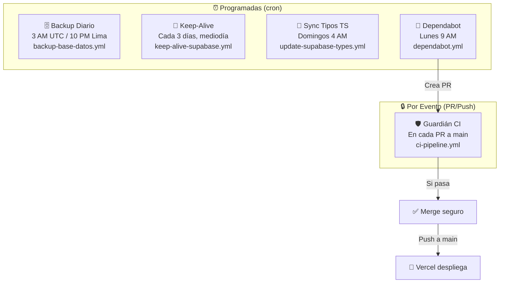
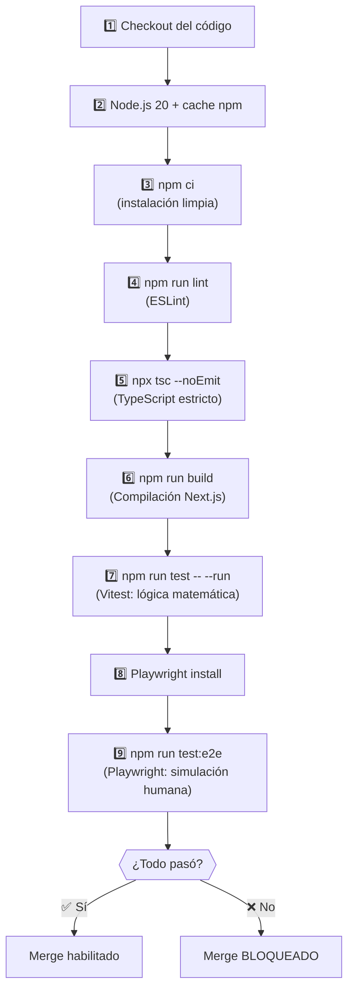
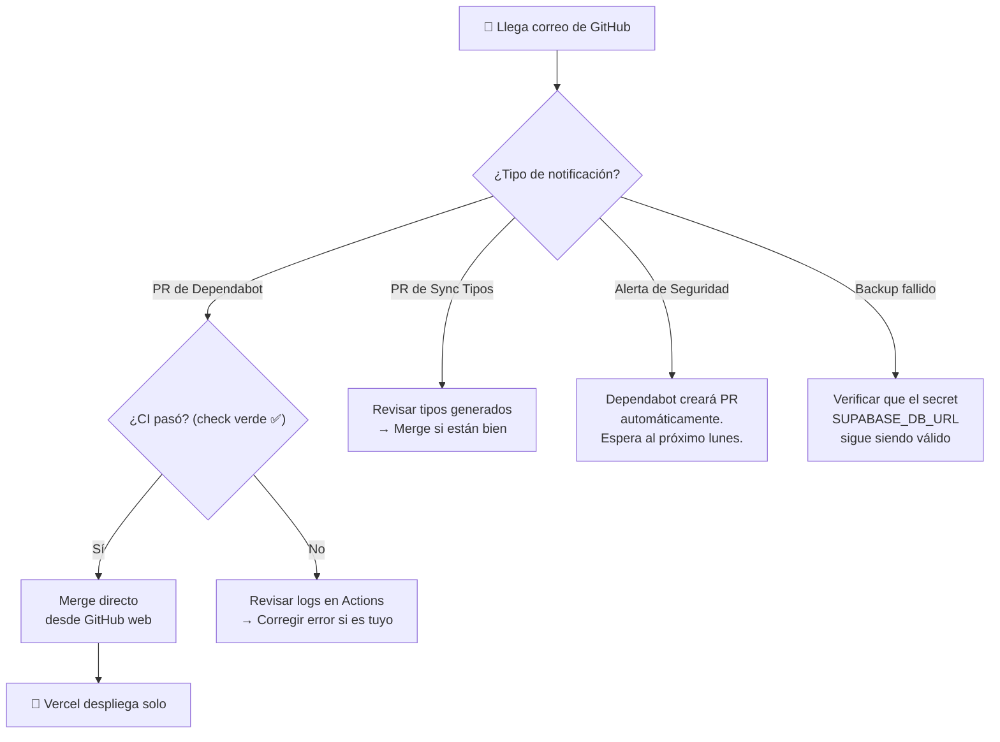

# 15 — Guía de Mantenimiento DevOps (Automatización Total)

> **Regla de Oro:** Este documento está diseñado para garantizar **Cero Interrupciones** en Producción y requerir el menor esfuerzo humano posible. La computadora trabaja, tú solo apruebas.  
> **Última actualización:** Marzo 2026

---

## 1. Visión General de Automatizaciones

Tu repositorio de GitHub funciona como un **Centro de Operaciones DevOps**. Los siguientes robots trabajan automáticamente:



| Robot | Archivo | Frecuencia | Qué hace |
|:------|:--------|:-----------|:---------|
| **Backup Diario** | `.github/workflows/backup-base-datos.yml` | 3 AM UTC diario | Dump PostgreSQL 17 → Artifact descargable (30 días) |
| **Keep-Alive** | `.github/workflows/keep-alive-supabase.yml` | Cada 3 días, 12:00 UTC | Ping a la API REST para evitar pausa por inactividad |
| **Sync Tipos** | `.github/workflows/update-supabase-types.yml` | Domingos 4 AM UTC | Lee el schema y genera `types/supabase.ts` → Crea PR |
| **Dependabot** | `.github/dependabot.yml` | Lunes 9 AM | Busca actualizaciones de paquetes npm → Crea PRs agrupados |
| **Guardián CI** | `.github/workflows/ci-pipeline.yml` | En cada PR/push a `main` | Lint + TypeScript + Build + Vitest + Playwright |

---

## 2. Detalle de Cada Automatización

### 2.1 🗄️ Backup Diario de Base de Datos

**Archivo:** `backup-base-datos.yml`

**Qué hace paso a paso:**
1. Se ejecuta a las **3 AM UTC** (10 PM hora Lima)
2. Instala PostgreSQL Client **v17** (compatible con Supabase)
3. Ejecuta `pg_dump` contra tu base de datos de producción
4. Sube el archivo `.sql` como **Artifact** de GitHub (descargable por 30 días)

**Cómo descargar un backup:**
1. Ve a GitHub → tu repositorio → pestaña **Actions**
2. Busca la ejecución más reciente de "Backup Diario Supabase a GitHub"
3. En la sección **Artifacts**, haz clic en `supabase-database-backup-YYYY-MM-DD`
4. Se descarga un ZIP con el archivo `.sql`

**Ejecución manual:** También puedes ejecutarlo manualmente desde Actions → "Run workflow" (botón verde).

**Secret requerido:**

| Secret | Valor | Dónde lo encuentras |
|--------|-------|---------------------|
| `SUPABASE_DB_URL` | URI de conexión directa | Supabase → Settings → Database → Connection String → URI |

---

### 2.2 💓 Keep-Alive (Anti-Apagado de Supabase)

**Archivo:** `keep-alive-supabase.yml`

Supabase **pausa** los proyectos gratis después de **7 días sin actividad**. Este workflow simula actividad:

1. Se ejecuta **cada 3 días** a las 12:00 UTC
2. Hace una petición `GET` a la API REST leyendo `login_logs`
3. Supabase detecta la actividad y reinicia el contador de 7 días

**Resultado:** Tu base de datos **nunca se apaga**.

---

### 2.3 🔄 Sincronizador de Tipos TypeScript

**Archivo:** `update-supabase-types.yml`

Si modificas el esquema de la base de datos (agregas columnas, tablas, etc.), los tipos TypeScript se desactualizan. Este workflow:

1. Se ejecuta **cada domingo a las 4 AM**
2. Usa `supabase gen types` para generar `types/supabase.ts`
3. Si hay cambios, crea un **Pull Request** automático con título "🔄 Sincronización de Tipos"
4. El PR pasa por el Guardián CI antes de poder hacer merge

**Secrets requeridos:**

| Secret | Valor | Dónde lo encuentras |
|--------|-------|---------------------|
| `SUPABASE_ACCESS_TOKEN` | Token de acceso personal | Supabase → Account → Access Tokens → Generate New Token |
| `SUPABASE_PROJECT_ID` | ID del proyecto | Supabase → Settings → General → Reference ID |

---

### 2.4 🤖 Dependabot (Actualizador Automático de Paquetes)

**Archivo:** `dependabot.yml`

Dependabot escanea **todos los lunes a las 9 AM** tu `package.json` y `package-lock.json` buscando:
- 🔴 **Vulnerabilidades de seguridad** (parches críticos)
- 🟡 **Actualizaciones menores** (mejoras y bugfixes)
- 🟢 **Actualizaciones mayores** (versiones nuevas)

**Agrupación inteligente:** Los PRs se agrupan para minimizar el número de revisiones:

| Grupo | Paquetes incluidos | Ejemplo de PR |
|-------|-------------------|---------------|
| `next-react-ecosystem` | `next`, `react`, `react-dom` | "Bump next-react-ecosystem group" |
| `dev-dependencies` | Todas las dependencias de desarrollo | "Bump dev-dependencies group" |
| *(sin grupo)* | Resto de dependencias de producción | PRs individuales |

**Configuración actual:**
```yaml
# .github/dependabot.yml
version: 2
updates:
  - package-ecosystem: "npm"
    directory: "/"
    schedule:
      interval: "weekly"
      day: "monday"
      time: "09:00"
    labels:
      - "dependencies"
    groups:
      next-react-ecosystem:
        patterns:
          - "next"
          - "react"
          - "react-dom"
      dev-dependencies:
        dependency-type: "development"
```

#### Cómo manejar los PRs de Dependabot

**Opción A: Revisión Manual (Recomendada para actualizaciones mayores)**

1. Recibes correo de GitHub con el PR
2. Ve a la pestaña Actions del PR → verifica que el Guardián CI pasó ✅
3. Si pasó, haz merge directamente desde GitHub (botón verde)
4. Vercel desplegará automáticamente

**Opción B: Revisión Local (Si quieres probar antes)**

```bash
# 1. Descargar la rama del bot
git fetch origin
git checkout dependabot/npm_and_yarn/next-react-ecosystem

# 2. Limpieza e instalación
Remove-Item -Recurse -Force node_modules   # PowerShell
Remove-Item package-lock.json
npm install

# 3. Probar localmente
npm run dev
# → Verificar http://localhost:3000

# 4. Si todo OK, merge a main
git checkout main
git merge dependabot/npm_and_yarn/next-react-ecosystem
git push origin main
```

#### Habilitar Auto-Merge de Dependabot (Mantenimiento Mínimo)

Para que los PRs de Dependabot se aprueben y fusionen **automáticamente** cuando el CI pasa, puedes configurar reglas en GitHub:

1. Ve a GitHub → tu repositorio → **Settings** → **Rules** → **Rulesets**
2. O usa **Settings** → **Branches** → **Branch protection** → `main`
3. Activa **"Allow auto-merge"** en **Settings** → **General** (sección Pull Requests)
4. En cada PR de Dependabot, haz clic en **"Enable auto-merge"** → **"Squash and merge"**

> **💡 Resultado:** Cuando Dependabot crea un PR y el CI pasa (lint + build + tests), el merge se ejecuta solo. Tú no haces nada.

---

### 2.5 🛡️ Guardián de Integridad (CI Pipeline)

**Archivo:** `ci-pipeline.yml`

Se ejecuta **automáticamente** en cada Push a `main` y en cada Pull Request contra `main`. Ejecuta 6 pasos en orden estricto:



| Paso | Herramienta | Qué verifica |
|:---:|:---:|:---|
| 4 | ESLint | Formato de código, errores de estilo |
| 5 | TypeScript | Tipos estrictos, sin `any` implícito |
| 6 | Next.js Build | Compilación estática exitosa |
| 7 | Vitest | Fórmulas de despiece, cálculos de markup |
| 9 | Playwright | Navegación real del ERP en un navegador |

**Si falla algún paso:** El botón de merge se bloquea automáticamente (si configuraste Branch Protection). Debes corregir el error y hacer push de nuevo.

---

## 3. Secrets Necesarios (Configuración Única)

Todos los secrets se configuran en GitHub → **Settings** → **Secrets and variables** → **Actions** → **New repository secret**.

| Secret | Usado por | Valor |
|--------|-----------|-------|
| `NEXT_PUBLIC_SUPABASE_URL` | CI, Keep-Alive | URL de tu proyecto Supabase (`https://xxxx.supabase.co`) |
| `NEXT_PUBLIC_SUPABASE_ANON_KEY` | CI, Keep-Alive | Clave anon pública de Supabase |
| `SUPABASE_DB_URL` | Backup Diario | URI de conexión PostgreSQL directa |
| `SUPABASE_ACCESS_TOKEN` | Sync Tipos | Token de acceso personal de Supabase |
| `SUPABASE_PROJECT_ID` | Sync Tipos | Reference ID del proyecto |

---

## 4. Configuración Manual (Solo una vez)

### 4.1 Vercel Previews (Entorno de pruebas)

1. [Vercel](https://vercel.com) → tu proyecto → **Settings** → **Git**
2. Asegura que **GitHub Integration** esté conectado
3. En **Deployments** → activa **Preview Deployments** para Pull Requests
4. En **Settings** → **Environment Variables**: copia `NEXT_PUBLIC_SUPABASE_URL` y `ANON_KEY` tanto para **Production** como **Preview**

### 4.2 Branch Protection (Bloqueo de código defectuoso)

1. GitHub → tu repositorio → **Settings** → **Branches**
2. Clic en **"Add branch protection rule"**
3. **Branch name pattern:** `main`
4. ✅ **"Require a pull request before merging"**
5. ✅ **"Require status checks to pass before merging"**
   - Busca `build-and-test` y selecciónalo
6. **Save changes**

> Resultado: Nadie puede subir código a `main` sin que pase el Guardián CI.

### 4.3 Auto-Merge para Dependabot

1. GitHub → tu repositorio → **Settings** → **General** (sección Pull Requests)
2. ✅ Activa **"Allow auto-merge"**
3. Cuando Dependabot cree un PR, haz clic en **"Enable auto-merge"** en ese PR (solo la primera vez por grupo)
4. A futuro, todos los PRs de ese tipo se auto-mergearán si el CI pasa

---

## 5. Rutina Mensual de 5 Minutos (El Triaje)



**Resumen: Si configuraste auto-merge, no necesitas hacer nada. Las actualizaciones se aprueban solas.**

---

## 6. Prevención de Riesgos

| Situación | Causa probable | Solución |
|:----------|:---------------|:---------|
| ERP muestra pantalla en blanco | Problema de CORS o Supabase pausado | Verificar Keep-Alive en Actions. Si falló, ejecutar manualmente |
| Error "401" o "Deprecated" en la BD | Cambio de API de Supabase | Esperar PR de Dependabot. Si es urgente, actualizar `@supabase/supabase-js` manualmente |
| "Vercel Build Failed" (cartel rojo) | Error en el código que no pasó CI | Leer logs de GitHub Actions. Corregir localmente y hacer push |
| Backup no se generó | Secret `SUPABASE_DB_URL` expirado | Supabase cambió la contraseña de BD → actualizar el secret |
| Keep-Alive falló | Secrets de Supabase inválidos | Verificar `NEXT_PUBLIC_SUPABASE_URL` y `ANON_KEY` en GitHub Secrets |
| Sync Tipos no genera PR | No hubo cambios en el schema | Normal. Solo crea PR cuando hay cambios reales |
| Dependabot no crea PRs | `package.json` sin actualizaciones | Normal. Solo crea PRs cuando hay versiones nuevas |

---

## 7. Cómo Descargar y Restaurar un Backup

### Descargar
1. GitHub → Actions → "Backup Diario Supabase a GitHub"
2. Seleccionar la ejecución del día deseado
3. En **Artifacts**, descargar `supabase-database-backup-YYYY-MM-DD`

### Restaurar (Solo en emergencias)
```bash
# 1. Descomprimir el artifact
unzip supabase-database-backup-2026-03-02.zip

# 2. Restaurar en la BD de Supabase
psql "TU_SUPABASE_DB_URL" < backup_2026-03-02.sql
```

> **⚠️ IMPORTANTE:** Restaurar un backup **sobrescribe** todos los datos actuales. Solo hacerlo en emergencias reales.

---

## 🔗 Documentos Relacionados

- [05_GUIA_DESARROLLADOR.md](./05_GUIA_DESARROLLADOR.md) — Setup del entorno de desarrollo
- [11_AUTH_ROLES_SEGURIDAD.md](./11_AUTH_ROLES_SEGURIDAD.md) — RLS y roles del sistema
- [T12_TUTORIAL_CONFIGURACION.md](./tutoriales/T12_TUTORIAL_CONFIGURACION.md) — Configuración general del ERP
