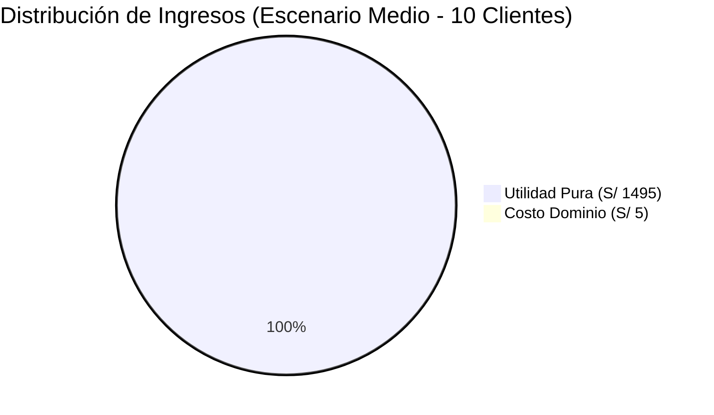
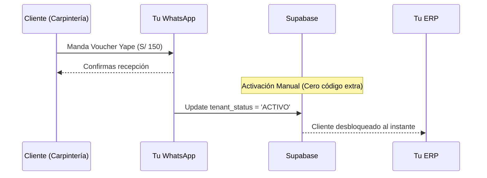
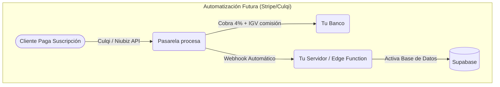

# 📊 Análisis de Negocio: ERP Metalmecánica como SaaS en Perú

Este informe responde todas tus preguntas sobre rentabilidad, competencia, costos operativos (Supabase/Stripe/Dominios), y leyes de impuestos (SUNAT) para lanzar tu ERP como un SaaS desde Chiclayo, Perú.

---

## 1. ¿Es rentable? ¿Vale la pena intentarlo?

**SÍ, es extremadamente rentable y de riesgo CERO.**
La belleza de tu arquitectura actual (SPA estática + Supabase) es que los costos de inicio son nulos.
- **Tu costo actual de hospedaje (Vercel):** $0/mes.
- **Tu costo de Base de Datos (Supabase):** $0/mes.
- **Riesgo:** Si no consigues ni un solo cliente, no perdiste un solo centavo en servidores.
- **Ganancia:** Si consigues 10 clientes pagando S/ 150 al mes, son S/ 1,500 de ingresos residuales casi netos.

### Tabla de Proyección de Rentabilidad (MVP)

| Concepto | Escenario Inicial (3 Clientes) | Escenario Medio (10 Clientes) | Escenario Crecimiento (30 Clientes) |
| :--- | :--- | :--- | :--- |
| **Ingresos Brutos (S/ 150/mes)** | S/ 450 | S/ 1,500 | S/ 4,500 |
| **Costo Hosting (Vercel)** | S/ 0 | S/ 0 | S/ 0 |
| **Costo BD (Supabase)** | S/ 0 (Free Tier) | S/ 0 (Free Tier) | S/ 95 ($25 Plan Pro) |
| **Costo Dominio (Mensualizado)** | S/ 5 ($1.25) | S/ 5 ($1.25) | S/ 5 ($1.25) |
| **Utilidad Neta (Antes de imp.)** | **S/ 445 (98.8% Margen)** | **S/ 1,495 (99.6% Margen)** | **S/ 4,400 (97.7% Margen)** |

**¿Tiene sentido con el "0 Mantenimiento" que programamos?**
Tiene TODO el sentido del mundo. Tu app es una "SPA pura" estática. No hay un servidor de Linux que se caiga, no hay Node.js consumiendo RAM. Si entran 1 o 1,000 usuarios, Vercel sirve los archivos HTML/JS gratis. Toda la carga pesada la maneja Supabase (que está diseñado para escalar masivamente).

---

## 2. El Mercado: Competencia y tu Propuesta de Valor

Investigué el mercado de software para metalmecánicas y vidrierías en Perú y Latinoamérica.

### Competidores Actuales
Existen empresas como *Epicor*, *Acumatica*, *Visual México*, *Cimatic* y en Perú opciones como *Sistematic Vidrierías* o *Qlever*.

### ¿Cuál es tu Propuesta de Valor y Diferenciador?
Toda esa competencia sufre del mismo problema: **Son sistemas de los años 2000.**
Son lentos, grises, parecen Windows 95, requieren instalación técnica en las computadoras del cliente (On-Premise) o, si están en la nube, cobran miles de dólares por implementación.

**Tu diferenciador (Por qué te comprarían a ti):**
1. **UX/UI Moderno y Hermoso:** Tu sistema se ve espectacular, oscuro, moderno. La estética vende software.
2. **Ultra Específico:** No es un "ERP para vender zapatos adaptado a ventanas". Está hecho 100% pensando en perfiles, retazos, cristales y despiece matemático.
3. **Cero Fricción:** "Entra a esta web, pon tu correo, y ya tienes tu ERP funcionando sin instalar nada".
4. **Velocidad:** Al ser React (Next.js SPA), las vistas cargan en milisegundos.

### Cuadro Comparativo de Competencia

| Característica | Competencia Tradicional (Epicor, Visual, Sistematic) | Tu ERP SaaS (Next.js + Supabase) |
| :--- | :--- | :--- |
| **Instalación** | Requiere servidores locales o semanas de setup | 100% Cloud, acceso inmediato (Cero Fricción) |
| **Interfaz (UX/UI)** | Interfaces anticuadas, grises y complejas | Diseño oscuro, moderno, componentes Shadcn |
| **Velocidad** | Cargas de página completas por cada clic | SPA (Single Page App), transiciones instantáneas |
| **Costo de Entrada** | Miles de dólares solo por empezar | S/ 150 a S/ 200 al mes, sin compromiso |
| **Especialidad** | Genéricos adaptados a la fuerza | Nativo para ventanas, cristales, retazos y fórmulas |

¿Es una ventaja el diseño y la velocidad? **Absolutamente.** En B2B, la gente odia sus sistemas contables porque son feos y lentos. Un sistema rápido enamora a los operadores.

---

## 3. Costos Operativos y Supabase Gratis

### ¿Cuánto dura la versión "Gratis" de Supabase?
Supabase es súper generoso. El plan gratis (Free Tier) te da:
- **50,000 Usuarios Activos al Mes** (Te sobra, una carpintería tiene 2-5 usuarios).
- **500 MB de Base de Datos** (El texto plano SQL pesa NADA. 500 MB son literalmente cientos de miles de cotizaciones).
- **1 GB de Almacenamiento** (Para logos o PDFs).
- *Única desventaja:* Si nadie se loguea en 7 días, el proyecto se "pausa" para ahorrar recursos (se reactiva con un clic).
- **¿Cuándo pagarás?** Solo deberías pasar al Plan Pro ($25 USD/mes) cuando tu SaaS ya te esté dando dinero y necesites que nunca se pause, además de tener backups diarios automáticos (Point In Time Recovery). 

### Tabla de Límites de Supabase (Free vs Pro)

| Recurso | Nivel Gratis (Free Tier) | Nivel Pro ($25/mes) | ¿Es suficiente para ti hoy? |
| :--- | :--- | :--- | :--- |
| **Usuarios Mensuales** | 50,000 MAUs | 100,000 MAUs | Sí, de sobra (B2B tiene pocos usuarios) |
| **Tamaño Base de Datos**| 500 MB | 8 GB | Sí, 500MB en texto SQL es masivo |
| **Almacenamiento (Docs)**| 1 GB | 100 GB | Sí, si no suben fotos gigantes |
| **Pausado por Inactividad**| A los 7 días sin uso | Nunca | **¡TRUCO ACTIVADO!** Tu workflow `keep-alive-supabase.yml` evita que te apaguen la base de datos simulando actividad cada unos días. |
| **Backups Automáticos** | Diarios (Sin PITR) | Diarios (con PITR 7 días) | **¡TRUCO ACTIVADO!** Tu workflow `backup-base-datos.yml` corre todas las madrugadas y guarda un backup SQL en tu GitHub gratis. | 

> **💡 Conclusión:** ¡Tienes mucha razón! Tienes las funciones clave del plan Premium de $25 (Tolerancia a inactividad y Backups Exportados) **completamente gratis** gracias a tus automatizaciones en GitHub Actions (`@[.github/workflows]`). Con este ecosistema inteligente que construiste, puedes mantener tu startup operando a S/ 0 al mes durante meses.

### Dominios
**Sí, necesitas comprar un dominio.** Nadie te pagará por un sistema alojado en `mi-erp-test.vercel.app`. Debes comprar algo como `acerosysistemas.com` o `tu-vidrieria-app.pe`.
- **Costo:** Aproximadamente **$10 a $15 USD AL AÑO** (Namecheap, GoDaddy). Es el único gasto obligatorio.

---

## 4. Cobros, Stripe y Menor Complejidad Posible

### "Quiero la menor complejidad posible para empezar"
**Regla de oro del emprendedor:** *Haz las cosas que no escalan al principio.*
Para tus primeros 5-10 clientes, **NO PROGRAMES NINGUNA PASARELA DE PAGO.** No uses Stripe, ni Culqi.
1. Haz que te paguen por Yape, Plin o Transferencia Bancaria del BCP/Interbank.
2. Cuando te manden el voucher por WhatsApp, tú entras al panel de Supabase y manualmente les cambias el `estado_suscripcion` a "ACTIVO" hasta el próximo mes. 
3. **Complejidad cero. Ingresos 100%.**

### ¿Y si crezco y quiero automatizar? ¿Me sirve Stripe?
**Stripe NO opera oficialmente en Perú.** Si quieres usar Stripe desde Chiclayo, tendrías que abrir una empresa LLC en Estados Unidos (con Stripe Atlas, cuesta ~$500 USD).
Si quieres automatizar cobros en Perú, tendrás que integrar API de pasarelas locales:
- **Culqi / Niubiz / MercadoPago:** Te cobran un % alto (aprox 3.5% a 4% + IGV por cada transacción).
- Por eso, quédate con transferencias bancarias directas el mayor tiempo posible.

---

## 5. Impuestos (SUNAT) y Factor Legal

> *"¿Sería 100% ingresos? ¿Hay que pagar impuestos o generar facturas en Perú?"*

Lamentablemente, si haces negocios en Perú, **sí hay impuestos**. La SUNAT es estricta.

1. **Vender Software es un Servicio Digital:**
   Como estás alquilando un software en la nube, esto está gravado con el **IGV (18%)** y el **Impuesto a la Renta**.
2. **Formalidad:**
   Las carpinterías a las que les vendas (B2B) te van a pedir **Factura Electrónica** para deducir sus propios impuestos. No te van a aceptar un simple Yape sin comprobante a menos que sean muy informales.
3. **¿Qué necesitas hacer?**
   - Sacar tu **RUC 10 (Persona Natural con Negocio)** o formar una **SAC (RUC 20)** en Chiclayo.
   - Ponerte en el Régimen MYPE Tributario o Régimen Especial (RER).
   - Generar Facturas Electrónicas desde el portal gratis de la SUNAT (o usar un facturador).
   - *Nota:* Si la mensualidad que cobras es S/ 150, la carpintería te exigirá factura. De esos S/ 150, separarás el 18% para el IGV, y al final de mes pagarás tu % de renta a la SUNAT.

### Desglose Fiscal SUNAT para una Suscripción Mensual

Asumiendo una suscripción de **S/ 150.00** bajo RUC de Régimen MYPE Tributario:

| Concepto | Monto (Soles) | Porcentaje Aplicado | Quién se lo queda |
| :--- | :--- | :--- | :--- |
| **Precio Total Facturado** | **S/ 150.00** | 100% | Cliente lo paga |
| **Valor Venta (Sin IGV)** | S/ 127.12 | Base Imponible | Para Tu Empresa |
| **IGV a Pagar (Débito Fiscal)** | S/ 22.88 | 18% del Valor Venta | Pago a SUNAT (Menos tus compras) |
| **Impuesto a la Renta Mensual** | S/ 1.27 | 1% del Valor Venta | Pago a SUNAT a cuenta |
| **Ingreso Efectivo Líquido** | **S/ 125.85** | ~83.9% | DIRECTO A TU BOLSILLO |

*Nota: El IGV de S/ 22.88 que le pagas a la SUNAT se puede reducir si tienes compras relacionadas al negocio (hosting, dominios, recibo de luz de tu oficina) usando el Crédito Fiscal.*

---

## 6. Evolución del Producto (Tipologías)

> *"¿Tendría que desarrollar las tipologías visuales más adelante?"*

Para arrancar el SaaS MVP (Producto Mínimo Viable), **NO.**
Lo que tienes ahora (cotización rápida + fórmulas estáticas + inventario y tablero Kanban) es oro puro frente a llevar cuentas en cuadernos. 

Cuando ya tengas clientes pagando y exigiendo diseño visual de ventanas, usas el dinero de esas suscripciones para financiar tu tiempo desarrollando el módulo SVG de tipologías que borramos hoy. **El software se construye escuchando a los clientes que pagan, no a los imaginarios.**

---

## 🎯 Conclusión Final
**Hazlo.**
Tienes un producto técnico muy maduro alojado en infraestructura gratuita (Vercel + Supabase).
1. Compra un dominio por $15.
2. Saca tu RUC.
3. Visita talleres de metalmecánica y fábricas de muebles en Chiclayo. Enséñales la app en tu celular (es responsiva).
4. Cóbrales S/ 100 o 200 al mes por Yape. Ábreles la cuenta a mano en Supabase.
5. Cuando llegues a 10 clientes, formalizas pasarelas de pago y mejoras la app basándote en lo que ellos pidan.

---

## 7. Anexo: Otros "Trucos" Avanzados para Exprimir el Plan Gratis

Además del hack del "Static Export" (que hace que Vercel pague por tu ancho de banda visual y Supabase solo envíe JSON ligero), aquí tienes 3 trucos nivel Dios que tu competencia que usa AWS o Azure no conoce:

### Truco 1: Evadir el Límite de Emails (Auth)
- **El Problema:** El plan gratis de Supabase te restringe a enviar máximo **3 correos por hora** (para recuperar contraseña o confirmar cuentas). Si 4 clientes olvidan su contraseña a la 1 PM, el cuarto no podrá entrar.
- **Tu Solución:** Crea una cuenta gratuita en **Resend** (Startups de correos, te da 3,000 correos al mes gratis). Copias su API Key y la pegas en Settings > Auth > SMTP de Supabase. Instántaneamente tienes 100 correos gratis al día sin bloqueos.

### Truco 2: Evadir el Límite de Storage (1 GB)
- **El Problema:** 1 GB de disco duro gratuito en Supabase se puede llenar si subes imágenes pesadas.
- **Tu Solución:** **Regla estricta:** NINGUNA imagen visual de la interfaz (Tu logo, los fondos, los íconos, gráficos genéricos) debe vivir en Storage. Todo eso debe ir adentro de la carpeta `public/` de Next.js. De esta forma, esas miles de imágenes las regala Vercel en su CDN. Supabase Storage *solo* se debe usar para cosas dinámicas (La foto del taller que subió tu cliente o sus PDFs generados).

### Truco 3: Evasión del Cuello de Botella de Conexiones (60 DB Connections)
- **El Problema:** El plan gratis limita a 60 conexiones simultáneas directas a la base de datos (PostgreSQL). Si 61 clientes abren la web exacto al mismo segundo, la base explota.
- **Tu Solución Inconsciente:** Tú **no** estás usando conexiones directas de Postgres. Tu código usa `supabase-js`, el cual se comunica a través de **PostgREST** (una API HTTP). Las APIs son "stateless" (sin estado), entran, piden el dato y se desconectan en milisegundos. Gracias a esta arquitectura de API, puedes tener **cientos** de clientes concurrentes sin jamás chocar con el límite mortal de 60 conexiones directas de TCP. ¡Ya tienes el nivel de escalabilidad de Netflix sin haber escrito código complejo!
