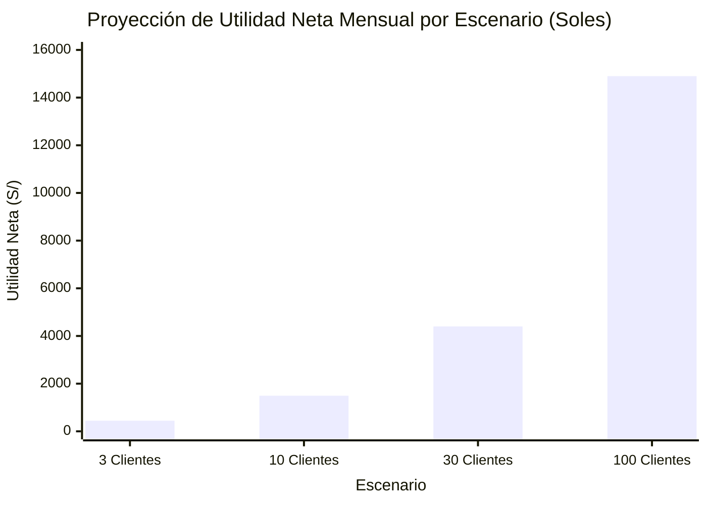
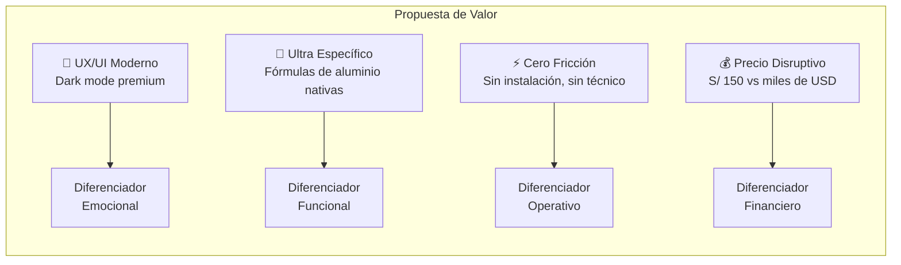
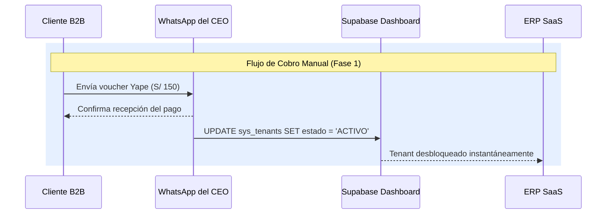
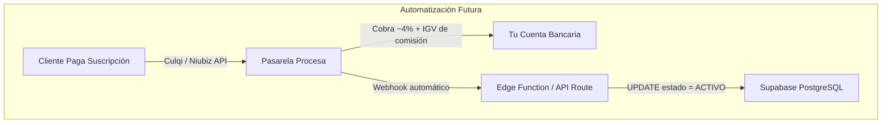
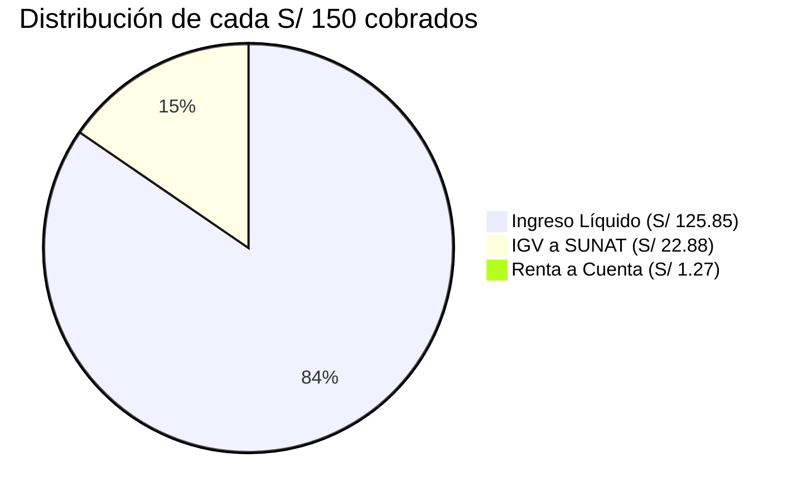
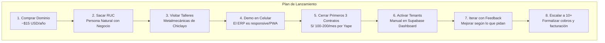

# Documento Técnico-Ejecutivo: Análisis de Negocio — ERP Metalmecánica como SaaS B2B

> **Clasificación:** Estrategia Comercial y Financiera — Mercado Peruano (Chiclayo)  
> **Stack:** Next.js SPA Export · Supabase PostgreSQL · Vercel CDN  
> **Versión:** 2.0 — Refactorizado con proyecciones financieras, análisis competitivo y marco tributario SUNAT

---

## Tabla de Contenidos

1. [Viabilidad Financiera y Análisis de Riesgo](#1-viabilidad-financiera-y-análisis-de-riesgo)
2. [Análisis Competitivo del Mercado Peruano](#2-análisis-competitivo-del-mercado-peruano)
3. [Estructura de Costos Operativos (Supabase + Vercel)](#3-estructura-de-costos-operativos)
4. [Estrategia de Cobros y Pasarelas de Pago](#4-estrategia-de-cobros-y-pasarelas-de-pago)
5. [Marco Tributario SUNAT para Software como Servicio](#5-marco-tributario-sunat)
6. [Hoja de Ruta del Producto (MVP → Escala)](#6-hoja-de-ruta-del-producto)
7. [Plan de Lanzamiento Operativo](#7-plan-de-lanzamiento-operativo)

---

## 1. Viabilidad Financiera y Análisis de Riesgo

### 1.1. Modelo de Riesgo

La arquitectura actual (SPA estática + Supabase Free Tier) genera un modelo de negocio con **riesgo financiero cero** en la fase de validación: si no se consigue ningún cliente, el costo acumulado de infraestructura es **$0.00 USD**. La única inversión obligatoria es la adquisición de un dominio comercial (~$15 USD/año).

### 1.2. Proyección de Rentabilidad por Escenario

Proyecciones basadas en un precio de suscripción mensual de **S/ 150.00** por tenant B2B:

| Concepto | Escenario Inicial (3 Clientes) | Escenario Validado (10 Clientes) | Escenario Crecimiento (30 Clientes) | Escenario Escala (100 Clientes) |
| :--- | :---: | :---: | :---: | :---: |
| **Ingresos Brutos Mensuales** | S/ 450 | S/ 1,500 | S/ 4,500 | S/ 15,000 |
| Costo Hosting (Vercel CDN) | S/ 0 | S/ 0 | S/ 0 | S/ 0 |
| Costo BD (Supabase) | S/ 0 (Free) | S/ 0 (Free) | S/ 95 ($25 Pro) | S/ 95 ($25 Pro) |
| Costo Dominio (Mensualizado) | S/ 5 | S/ 5 | S/ 5 | S/ 5 |
| Costo SMTP (Resend.com) | S/ 0 (Free) | S/ 0 (Free) | S/ 0 (Free) | S/ 0 (Free) |
| **Utilidad Neta (Pre-Impuestos)** | **S/ 445** | **S/ 1,495** | **S/ 4,400** | **S/ 14,900** |
| **Margen Operativo** | **98.8%** | **99.6%** | **97.7%** | **99.3%** |

### 1.3. Punto de Equilibrio

El negocio genera **utilidad neta positiva desde el primer cliente** debido a que los costos fijos de infraestructura son $0. El único gasto recurrente (dominio: S/ 5/mes) se recupera con el **3.3% del primer cobro al primer cliente**.

---

## 2. Análisis Competitivo del Mercado Peruano

### 2.1. Landscape Competitivo

El mercado de software para metalmecánicas y vidrierías en Perú y Latinoamérica está dominado por soluciones legacy con interfaces anticuadas, modelos de licenciamiento costosos y requerimientos de instalación local.

| Dimensión | Competencia Tradicional (Epicor, Visual México, Sistematic, Qlever) | Tu ERP SaaS (Next.js + Supabase) | Ventaja Competitiva |
| :--- | :--- | :--- | :---: |
| **Modelo de Despliegue** | On-Premise (servidores locales) o Cloud con semanas de setup | 100% Cloud, acceso inmediato tras registro | 🟢 Crítica |
| **Interfaz (UX/UI)** | Interfaces Windows 95/2000, grises y complejas | Dark mode moderno, componentes Shadcn/Radix, transiciones React | 🟢 Crítica |
| **Velocidad de Navegación** | Recargas completas de página por cada acción | SPA (Single Page App), renderizado instantáneo client-side | 🟢 Alta |
| **Costo de Entrada** | $2,000 - $50,000 USD por implementación inicial | S/ 150/mes, sin compromiso, sin setup | 🟢 Crítica |
| **Especialización Vertical** | ERPs genéricos adaptados con personalización costosa | Nativo para perfiles de aluminio, cristales, retazos y fórmulas de despiece | 🟢 Alta |
| **Acceso Móvil** | Nulo o limitado a apps nativas separadas | Responsive PWA desde cualquier navegador | 🟡 Media |
| **Onboarding** | Requiere técnico presencial para instalación | Self-service: email + contraseña = sistema operativo | 🟢 Crítica |

### 2.2. Propuesta de Valor Diferenciada

> **Insight Estratégico:** En mercados B2B industriales, la estética de la interfaz es un factor de cierre de venta subestimado. Los operarios de taller rechazan activamente sistemas "feos y lentos", generando resistencia interna a la adopción. Un ERP visualmente moderno reduce la fricción de implementación y acelera el time-to-value del cliente.

---

## 3. Estructura de Costos Operativos

### 3.1. Límites del Free Tier de Supabase vs Plan Pro

| Recurso | Free Tier (Actual) | Plan Pro ($25/mes) | ¿Suficiente Hoy? | Hack Aplicado |
| :--- | :---: | :---: | :---: | :--- |
| **Usuarios Activos Mensuales (MAU)** | 50,000 | 100,000 | ✅ Sobrado (B2B = pocos usuarios) | N/A |
| **Tamaño Base de Datos** | 500 MB | 8 GB | ✅ 500 MB = ~256K cotizaciones | VACUUM FULL periódico |
| **Almacenamiento de Archivos** | 1 GB | 100 GB | ✅ Con compresión Client-Side | Compresión Canvas HTML5 a 150 KB |
| **Egress (Ancho de Banda)** | 5 GB | 250 GB | ✅ JSON puro pesa KB | Caché Zustand + Distribución Asimétrica |
| **Pausado por Inactividad** | 7 días sin uso → Pausa | Nunca | ✅ **Hack Activo** | `keep-alive-supabase.yml` Cron cada 5 días |
| **Backups Automáticos** | Sin PITR | PITR 7 días | ✅ **Hack Activo** | `backup-base-datos.yml` con `pg_dump` diario |
| **Correos Auth (Onboarding)** | 3/hora | Ilimitado | ⚠️ **Pendiente** | Resend.com SMTP Custom (3,000/mes gratis) |
| **Conexiones Simultáneas** | 60 directas / 200 pooler | 60 / 200 (escala con compute) | ✅ **Hack Activo** | PostgREST Stateless (reciclaje en ~10ms) |

### 3.2. Costo del Dominio Comercial

Un dominio profesional es el único gasto obligatorio para operar comercialmente. Nadie pagará por acceder a `mi-erp.vercel.app`.

| Proveedor | Extensión | Costo Anual | Costo Mensualizado |
| :--- | :--- | :---: | :---: |
| **Namecheap** | `.com` | ~$10 USD | ~S/ 3.20 |
| **GoDaddy** | `.com` | ~$15 USD | ~S/ 4.80 |
| **NIC.PE** | `.pe` | ~$50 USD | ~S/ 16.00 |

> **Recomendación:** Adquirir un dominio `.com` por ~$10 USD/año. Configurar DNS apuntando a Vercel mediante el panel de Custom Domains (incluido en Vercel Free).

---

## 4. Estrategia de Cobros y Pasarelas de Pago

### 4.1. Fase 1 — Manual (0 a 10 Clientes)

Para la fase de validación comercial, la regla de oro es: **"Haz las cosas que no escalan al principio."**

*   Cobrar vía **Yape, Plin o Transferencia Bancaria** (BCP/Interbank).
*   El cliente envía voucher por WhatsApp.
*   El administrador activa manualmente el `estado_suscripcion = 'ACTIVO'` en la tabla `sys_tenants` de Supabase.
*   **Complejidad técnica: Cero. Ingresos: 100%.**

### 4.2. Fase 2 — Semi-Automatizada (10+ Clientes)

| Pasarela | Disponibilidad en Perú | Comisión por Transacción | Complejidad de Integración | Requisito Legal |
| :--- | :---: | :---: | :---: | :--- |
| **Stripe** | ❌ No opera oficialmente | 2.9% + $0.30 | Alta | LLC en EE.UU. ($500 USD vía Stripe Atlas) |
| **Culqi** | ✅ Nativa | 3.49% + IGV | Media | RUC peruano |
| **Niubiz (VisaNet)** | ✅ Nativa | 3.5% - 4% + IGV | Alta | RUC + contrato comercial |
| **MercadoPago** | ✅ Nativa | 3.49% + IGV | Baja | RUC peruano |
| **Yape Empresas** | ✅ Nativa | 0% (transferencia directa) | Nula | Cuenta BCP |

> **Recomendación Estratégica:** Mantener el cobro manual (Yape/Transferencia) el mayor tiempo posible. Las comisiones de pasarelas (3.5-4% + IGV) sobre S/ 150 representan ~S/ 6.30 perdidos por cliente por mes. Con 30 clientes, eso serían S/ 189/mes evaporados en comisiones que podrían ir directo a tu utilidad.

---

## 5. Marco Tributario SUNAT

### 5.1. Clasificación Fiscal

Vender software en la nube en Perú se clasifica como **Servicio Digital**, gravado con:
*   **IGV (Impuesto General a las Ventas):** 18% sobre el valor de venta.
*   **Impuesto a la Renta:** Variable según régimen tributario.

### 5.2. Requisitos de Formalización

| Requisito | Detalle | Costo Aproximado |
| :--- | :--- | :---: |
| **RUC** | Persona Natural con Negocio (RUC 10) o SAC (RUC 20) | Gratis (SUNAT) |
| **Régimen Tributario** | MYPE Tributario o Régimen Especial (RER) | N/A |
| **Facturación Electrónica** | Portal gratuito SUNAT o facturador externo (Nubefact, eBIZ) | S/ 0 - S/ 50/mes |
| **Libros Electrónicos** | PLE (Programa de Libros Electrónicos) | Gratis (SUNAT) |

> **Nota Crítica:** Los clientes B2B (talleres, carpinterías formales) exigirán **Factura Electrónica** para deducir el gasto en su propia contabilidad. No aceptarán un simple comprobante de Yape sin Factura asociada.

### 5.3. Desglose Fiscal por Suscripción

Análisis detallado de una suscripción mensual de **S/ 150.00** bajo Régimen MYPE Tributario:

| Concepto | Monto (S/) | % del Total | Destino |
| :--- | :---: | :---: | :--- |
| **Precio Total Facturado al Cliente** | **S/ 150.00** | 100.0% | Lo paga el cliente |
| Valor Venta (Base Imponible) | S/ 127.12 | 84.7% | Base para cálculos |
| IGV (Débito Fiscal) | S/ 22.88 | 15.3% | Pago a SUNAT (reducible con Crédito Fiscal) |
| Impuesto a la Renta Mensual (1%) | S/ 1.27 | 0.8% | Pago a cuenta SUNAT |
| **Ingreso Efectivo Líquido** | **S/ 125.85** | **83.9%** | **Directo a tu bolsillo** |

> **Optimización Fiscal:** El IGV pagado (S/ 22.88) es reducible mediante **Crédito Fiscal**. Las facturas de compras relacionadas al negocio (dominio, hosting futuro, equipos, recibo de luz de oficina, internet) generan IGV recuperable que se descuenta del débito fiscal mensual.

### 5.4. Proyección Fiscal Anual por Escenario

| Escenario | Ingresos Brutos Anuales | IGV Anual | Renta Anual (1%) | Ingreso Neto Anual |
| :--- | :---: | :---: | :---: | :---: |
| 3 Clientes | S/ 5,400 | S/ 823 | S/ 46 | **S/ 4,531** |
| 10 Clientes | S/ 18,000 | S/ 2,746 | S/ 153 | **S/ 15,101** |
| 30 Clientes | S/ 54,000 | S/ 8,237 | S/ 458 | **S/ 45,305** |
| 100 Clientes | S/ 180,000 | S/ 27,458 | S/ 1,525 | **S/ 151,017** |

---

## 6. Hoja de Ruta del Producto

### 6.1. Evolución por Fases

| Fase | Producto | Funcionalidades Clave | Criterio de Transición |
| :--- | :--- | :--- | :--- |
| **MVP (Actual)** | ERP Single-Tenant | Cotización rápida, fórmulas estáticas, inventario, Kardex, Dashboard | Producto operativo y estable |
| **SaaS v1** | ERP Multi-Tenant | `tenant_id` + RLS, onboarding self-service, cobro manual | Primer cliente externo pagando |
| **SaaS v2** | ERP Multi-Tenant + Cobros | Pasarela de pago automatizada (Culqi), facturación electrónica | 10+ clientes activos |
| **SaaS v3** | ERP con Diseñador Visual | Módulo SVG de tipologías de ventanas, catálogo visual con Cloudflare R2 | Demanda validada por clientes que pagan |

> **Principio de Desarrollo:** *"El software se construye escuchando a los clientes que pagan, no a los imaginarios."* No invertir tiempo de desarrollo en funcionalidades especulativas hasta que la demanda sea validada con ingresos reales.

---

## 7. Plan de Lanzamiento Operativo

### 7.1. Checklist de Go-To-Market

### 7.2. Inversión Inicial Requerida

| Concepto | Costo | Frecuencia | Obligatorio |
| :--- | :---: | :--- | :---: |
| Dominio `.com` | ~S/ 40 | Anual | ✅ |
| Hosting (Vercel) | S/ 0 | Mensual | ✅ |
| Base de Datos (Supabase) | S/ 0 | Mensual | ✅ |
| SMTP (Resend.com) | S/ 0 | Mensual | ✅ |
| RUC SUNAT | S/ 0 | Único | ✅ |
| **Total Inversión Inicial** | **~S/ 40** | — | — |

---

## 8. Requisitos Legales para Operar como SaaS B2B

### 8.1. Documentos Obligatorios

Cualquier SaaS B2B que almacene datos de terceros en Perú necesita documentación legal mínima antes de firmar contratos comerciales:

| Documento | Propósito | ¿Cuándo? | Complejidad |
| :--- | :--- | :--- | :---: |
| **Términos de Servicio (ToS)** | Define responsabilidades, límites de servicio, derecho a suspender por falta de pago, SLA (uptime) | Antes del primer cliente | 🟡 Media |
| **Política de Privacidad** | Explica cómo se almacenan, protegen y procesan datos personales | Antes del primer cliente | 🟡 Media |
| **Acuerdo de Procesamiento de Datos (DPA)** | Si un taller almacena datos de *sus* clientes (nombre, RUC, teléfono) en tu sistema, tú eres "encargado del tratamiento" bajo la Ley 29733 | Antes de tener 5+ clientes | 🟠 Alta |

### 8.2. Marco Legal Peruano Aplicable

| Norma | Relevancia para tu SaaS |
| :--- | :--- |
| **Ley 29733** (Protección de Datos Personales) | Regula el tratamiento de datos de los clientes de tus clientes |
| **D.S. 003-2013-JUS** (Reglamento) | Define obligaciones del "encargado del tratamiento" |
| **Ley 27269** (Firmas y Certificados Digitales) | Aplica si implementas firma digital en cotizaciones |
| **Código de Protección al Consumidor** | Aplica a tu relación con los talleres como clientes SaaS |

### 8.3. Contenido Mínimo de los Términos de Servicio

- Descripción del servicio y niveles de disponibilidad (SLA informativo: "99% uptime")
- Derecho del proveedor a suspender acceso por falta de pago (alineado con Sección 9 del Doc 18)
- Periodo de gracia antes de eliminación de datos (15 días suspensión → 90 días cancelado)
- Propiedad intelectual: los datos del taller son propiedad del taller, no del proveedor SaaS
- Exportación de datos: el taller puede solicitar exportación de sus datos en formato estándar (`.xlsx`, `.csv`)
- Jurisdicción: Chiclayo, Perú. Tribunales competentes locales

> **Acción Inmediata:** Generar una versión inicial de ToS y Política de Privacidad usando plantillas B2B adaptadas a Perú. Publicarlas como página estática en `/terminos` y `/privacidad` del ERP.
