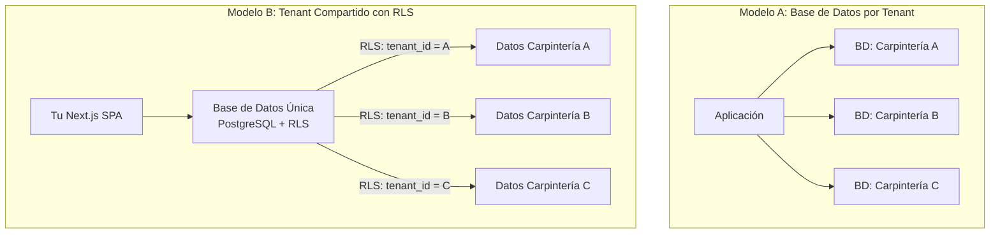
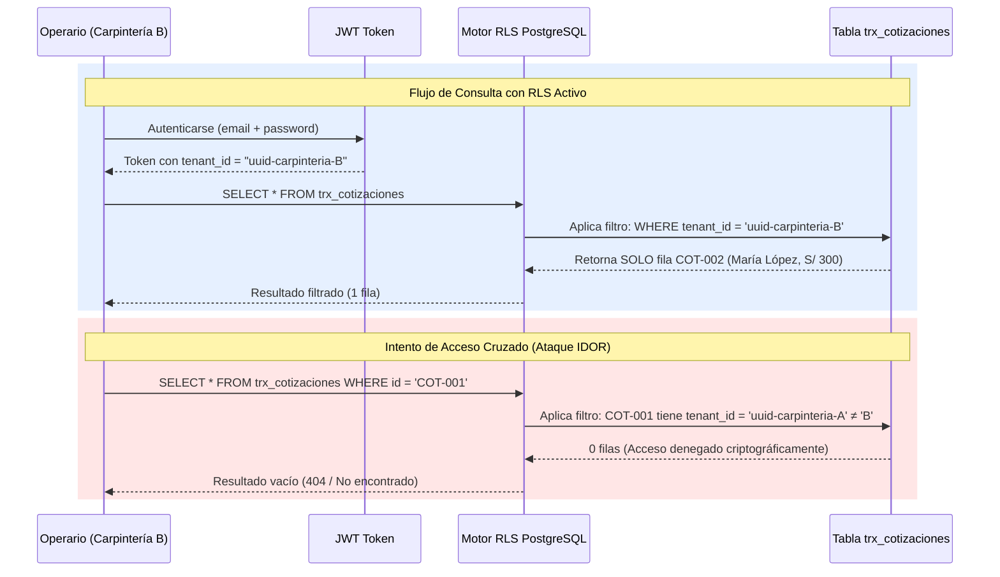
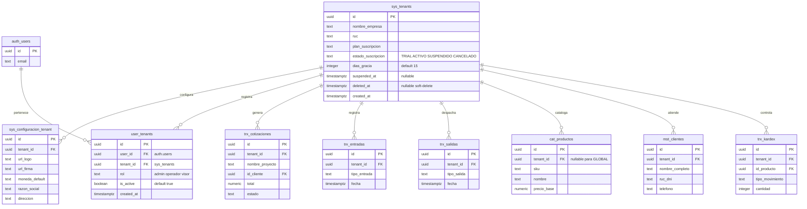
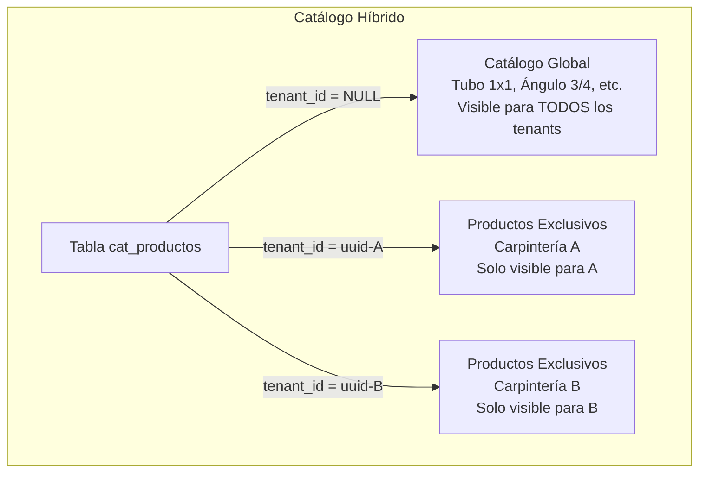
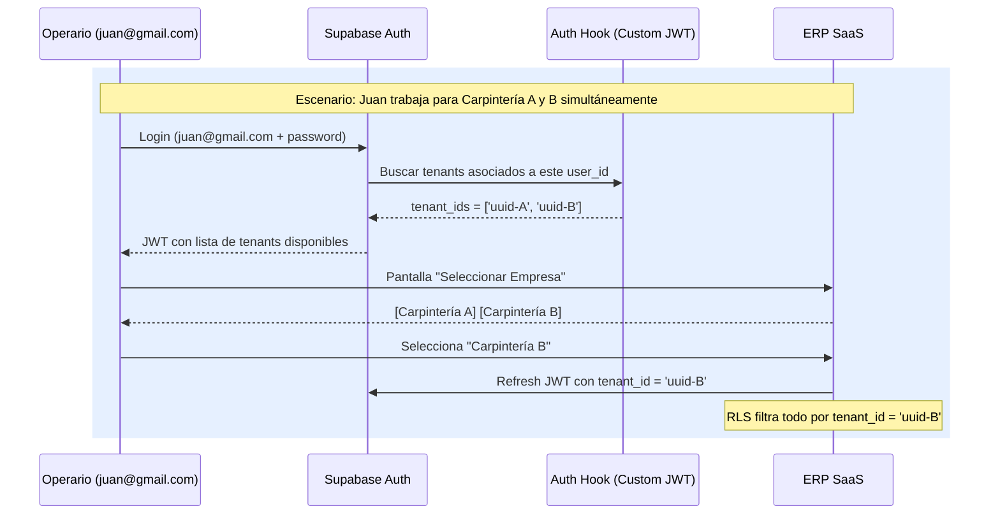
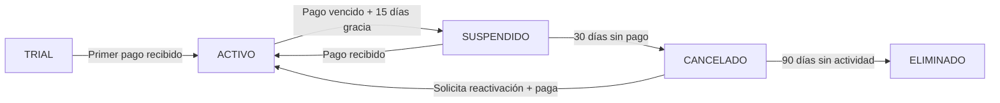
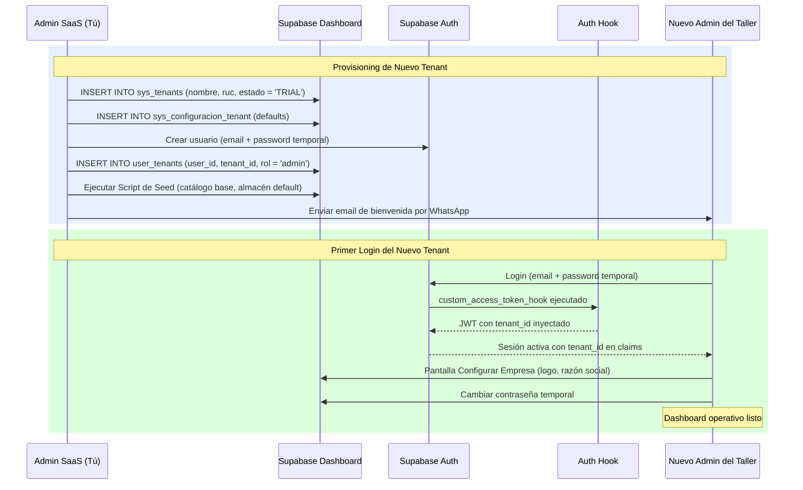

# Documento Técnico-Ejecutivo: Guía de Migración — De ERP Interno a SaaS Multi-Tenant

> **Clasificación:** Arquitectura de Datos y Seguridad — Migración Multi-Tenant con PostgreSQL RLS  
> **Stack:** Next.js SPA Export · Supabase PostgreSQL · Row-Level Security (RLS)  
> **Versión:** 2.0 — Refactorizado con diagramas ER, matrices de seguridad y roadmap de migración detallado

---

## Tabla de Contenidos

1. [Fundamentos de Arquitectura Multi-Tenant](#1-fundamentos-de-arquitectura-multi-tenant)
2. [Mecánica del Row-Level Security (RLS)](#2-mecánica-del-row-level-security)
3. [Modelo de Datos Multi-Tenant (Esquema ER)](#3-modelo-de-datos-multi-tenant)
4. [Estrategia de Catálogo: Compartido vs Personalizado](#4-estrategia-de-catálogo)
5. [Matriz de Amenazas y Contramedidas de Seguridad](#5-matriz-de-amenazas-y-contramedidas)
6. [Operaciones Administrativas sobre Tenants](#6-operaciones-administrativas)
7. [Plan de Migración Detallado (Roadmap Técnico)](#7-plan-de-migración-detallado)
8. [Implementación del Auth Hook (Custom JWT Claims)](#8-implementación-del-auth-hook)
9. [Ciclo de Vida del Tenant (Suspensión / Reactivación)](#9-ciclo-de-vida-del-tenant)
10. [Flujo de Onboarding Self-Service](#10-flujo-de-onboarding-self-service)
11. [Restricciones de `output: 'export'` para SaaS](#11-restricciones-de-output-export-para-saas)

---

## 1. Fundamentos de Arquitectura Multi-Tenant

### 1.1. Modelos Arquitectónicos Comparados

En el diseño de sistemas SaaS existen dos enfoques fundamentales para aislar datos entre clientes:

| Dimensión | Modelo A: Base de Datos por Tenant | Modelo B: Tenant Compartido con RLS (Actual) |
| :--- | :--- | :--- |
| **Analogía** | Una casa separada por cliente | Un edificio con llaves maestras por piso |
| **Aislamiento de Datos** | Físico (100% separación) | Lógico (filtro criptográfico por JWT) |
| **Costo por Tenant** | Alto ($25/mes por instancia Supabase) | Marginal (~0.002 KB por fila con `tenant_id`) |
| **Mantenimiento (ALTER TABLE)** | Ejecutar en N bases de datos separadas | Ejecutar 1 vez, aplica para todos |
| **Eliminación de Tenant** | `DROP DATABASE` (instantáneo) | `DELETE WHERE tenant_id = X` + CASCADE |
| **Riesgo de Fuga de Datos** | Nulo (físicamente imposible) | Bajo (depende de correcta configuración RLS) |
| **Escalabilidad de Costo** | Lineal ($25 × N clientes) | Logarítmica (1 sola instancia para todos) |
| **Complejidad DevOps** | Alta (requiere orquestación .NET/Azure) | Baja (1 archivo SQL con políticas) |
| **Adecuado Para** | Empresas con >$10K/mes por cliente | SaaS B2B con precios < $200/mes |



> **Decisión Arquitectónica:** El Modelo B (Tenant Compartido con RLS) es la elección óptima para este ERP debido al precio de suscripción objetivo (S/ 150/mes). El Modelo A requeriría que cada tenant financie su propia instancia Supabase ($25/mes × N), destruyendo el margen operativo del 98%.

---

## 2. Mecánica del Row-Level Security

### 2.1. Principio de Funcionamiento

Row-Level Security (RLS) es un mecanismo nativo de PostgreSQL que opera como un **filtro invisible a nivel de motor de base de datos**. Intercepta cada operación SQL (`SELECT`, `INSERT`, `UPDATE`, `DELETE`) y aplica una condición booleana antes de permitir o rechazar el acceso a cada fila individual.

### 2.2. Ejemplo Concreto con Datos Reales

Tabla compartida `trx_cotizaciones` con datos de múltiples tenants:

| id_cotizacion | cliente | total | tenant_id |
| :---: | :--- | :---: | :--- |
| COT-001 | Juan Pérez | S/ 500 | `uuid-carpinteria-A` |
| COT-002 | María López | S/ 300 | `uuid-carpinteria-B` |
| COT-003 | Hotel Plaza | S/ 900 | `uuid-carpinteria-A` |
| COT-004 | Restaurant Coral | S/ 750 | `uuid-carpinteria-C` |

### 2.3. Política RLS de Aislamiento

```sql
-- Habilitar RLS en la tabla
ALTER TABLE trx_cotizaciones ENABLE ROW LEVEL SECURITY;

-- Crear política de aislamiento total
CREATE POLICY "tenant_isolation_policy" 
ON trx_cotizaciones 
FOR ALL 
USING ( tenant_id = (auth.jwt() ->> 'tenant_id')::uuid );
```

### 2.4. Comportamiento en Tiempo de Ejecución



> **Garantía de Seguridad:** El filtrado RLS se ejecuta a nivel de motor PostgreSQL, no a nivel de código aplicativo. Incluso si un bug en el frontend omite un filtro `WHERE`, o si un atacante manipula la URL para adivinar un `id_cotizacion` ajeno, la base de datos rechaza la consulta antes de devolver resultados. La fuga de datos entre tenants es **matemáticamente imposible** con RLS correctamente configurado.

---

## 3. Modelo de Datos Multi-Tenant

### 3.1. Esquema Entidad-Relación (ER) Target



### 3.2. Tablas Afectadas por la Migración

| Esquema | Tabla | Acción Requerida | Criticidad |
| :--- | :--- | :--- | :---: |
| `public` | `trx_cotizaciones` | ADD COLUMN `tenant_id` + RLS Policy | 🔴 Crítica |
| `public` | `trx_detalles_cotizacion` | ADD COLUMN `tenant_id` + RLS Policy | 🔴 Crítica |
| `public` | `trx_entradas` | ADD COLUMN `tenant_id` + RLS Policy | 🔴 Crítica |
| `public` | `trx_salidas` | ADD COLUMN `tenant_id` + RLS Policy | 🔴 Crítica |
| `public` | `trx_kardex` | ADD COLUMN `tenant_id` + RLS Policy | 🔴 Crítica |
| `public` | `mst_clientes` | ADD COLUMN `tenant_id` + RLS Policy | 🔴 Crítica |
| `public` | `cat_productos` | ADD COLUMN `tenant_id` (nullable para GLOBAL) + RLS Híbrido | 🟡 Media |
| `public` | `mst_familias` | Evaluar: ¿Global o por Tenant? | 🟡 Media |
| `public` | `mst_materiales` | Evaluar: ¿Global o por Tenant? | 🟡 Media |
| `public` | `mst_acabados_colores` | Evaluar: ¿Global o por Tenant? | 🟡 Media |
| `public` | `mst_marcas` | Evaluar: ¿Global o por Tenant? | 🟡 Media |
| — | `sys_tenants` | **CREAR NUEVA** (con estados de suscripción y soft-delete) | 🔴 Crítica |
| — | `sys_configuracion_tenant` | **CREAR NUEVA** (migrar datos de config actual) | 🔴 Crítica |
| — | `user_tenants` | **CREAR NUEVA** (junction table usuario ↔ tenant con rol) | 🔴 Crítica |

---

## 4. Estrategia de Catálogo

### 4.1. Modelo Híbrido (Estándar de Oro en SaaS B2B)

El catálogo de productos implementa un modelo híbrido donde coexisten artículos **Globales** (proveídos por el administrador del SaaS) y artículos **Locales** (creados por cada tenant individualmente).

*   **Artículos Globales:** `tenant_id = NULL` o `tenant_id = 'GLOBAL'`. Visibles para todos los tenants. Solo editables por el administrador del SaaS.
*   **Artículos Locales:** `tenant_id = uuid-del-tenant`. Visibles y editables solo por el tenant propietario.



### 4.2. Política RLS Híbrida para Catálogo

```sql
-- Política de LECTURA: Ver productos propios + globales
CREATE POLICY "catalog_read_policy" 
ON cat_productos FOR SELECT 
USING (
    tenant_id = (auth.jwt() ->> 'tenant_id')::uuid 
    OR tenant_id IS NULL  -- Productos globales
);

-- Política de ESCRITURA: Solo modificar productos propios (nunca globales)
CREATE POLICY "catalog_write_policy" 
ON cat_productos FOR ALL 
USING ( tenant_id = (auth.jwt() ->> 'tenant_id')::uuid )
WITH CHECK ( tenant_id = (auth.jwt() ->> 'tenant_id')::uuid );
```

| Operación | Productos Globales (`tenant_id = NULL`) | Productos del Tenant Actual | Productos de Otro Tenant |
| :--- | :---: | :---: | :---: |
| `SELECT` (Leer) | ✅ Permitido | ✅ Permitido | ❌ Bloqueado por RLS |
| `INSERT` (Crear) | ❌ Solo Admin SaaS | ✅ Permitido | ❌ Bloqueado por RLS |
| `UPDATE` (Editar) | ❌ Solo Admin SaaS | ✅ Permitido | ❌ Bloqueado por RLS |
| `DELETE` (Borrar) | ❌ Solo Admin SaaS | ✅ Permitido | ❌ Bloqueado por RLS |

---

## 5. Matriz de Amenazas y Contramedidas

| ID | Amenaza | Descripción | Probabilidad | Impacto | Contramedida | Estado |
| :---: | :--- | :--- | :---: | :---: | :--- | :---: |
| T1 | **Tabla sin RLS habilitado** | Se crea una tabla nueva (ej. `trx_pagos`) sin ejecutar `ENABLE ROW LEVEL SECURITY`. Un usuario podría leer datos de todos los tenants. | 🟠 Media | 🔴 Crítico | Checklist obligatorio: toda tabla nueva lleva RLS + política. Uso de skill `supabase-postgres-best-practices` para auditoría. | 🕒 |
| T2 | **IDOR (Insecure Direct Object Reference)** | Un usuario manipula la URL `/cotizacion/uuid-ajeno` intentando acceder a datos de otro tenant. | 🟡 Baja | 🔴 Crítico | RLS bloquea automáticamente. La consulta devuelve resultado vacío (404) ya que el `tenant_id` del JWT no coincide. | ✅ |
| T3 | **Exposición del `SERVICE_ROLE_KEY`** | La clave `SERVICE_ROLE_KEY` (que bypasea todo RLS) se importa en un archivo `"use client"` del frontend, quedando visible en el navegador. | 🟡 Baja | 🔴 Catastrófico | Key restringida exclusivamente a archivos Server-Side (`server.ts`, API Routes). Auditoría previa confirmó ausencia de exposición. | ✅ |
| T4 | **Concurrencia de Inventario Global** | Dos tenants venden el mismo producto "Global" simultáneamente. El Kardex resta de un stock compartido inexistente. | 🟡 Baja | 🟠 Alto | El Kardex y el inventario son **siempre 100% por tenant** (`tenant_id` obligatorio). El catálogo puede ser global, pero el stock físico es local. | ✅ |
| T5 | **Omisión de `tenant_id` en INSERT** | Un bug en el frontend crea una cotización sin asignar `tenant_id`, generando un registro "huérfano" visible para nadie o para todos. | 🟠 Media | 🟠 Alto | Restricción `NOT NULL` en la columna `tenant_id` + Trigger que auto-inyecta el `tenant_id` del JWT en cada INSERT. | 🕒 |
| T6 | **Colisión de Email Único Global en Auth** | Supabase Auth impone un índice `UNIQUE` global sobre `email` en `auth.users`. Si la Carpintería A registra `juan@gmail.com`, la Carpintería B **no puede** registrar a un empleado diferente con el mismo email. Viola la promesa de aislamiento multi-tenant. | 🟠 Media | 🟠 Alto | Diseñar el onboarding con un **selector de tenant**: un mismo email puede pertenecer a múltiples tenants. El `tenant_id` se asigna vía Auth Hook (Custom JWT Claim), no vía usuario duplicado. Si un consultor trabaja para 2 talleres, se le presenta un selector de empresa al iniciar sesión. | 🕒 |
| T7 | **Enumeración de Emails (Email Enumeration Attack)** | Un atacante usa el formulario de registro o recuperación de contraseña para descubrir qué emails están registrados en el sistema. `supabase.auth.signUp({email})` devuelve un error diferente si el email ya existe vs. si no existe, exponiendo la existencia de cuentas de otros tenants. | 🟠 Media | 🟡 Medio | Activar **"Enable email enumeration protection"** en Supabase Dashboard → Auth Settings → Email. Con esta opción activa, Supabase devuelve la misma respuesta genérica sin importar si el email existe o no, bloqueando la fuga de información. | 🕒 |

### 5.1. Detalle de Mitigación: T6 — Email Compartido entre Tenants



### 5.2. Detalle de Mitigación: T7 — Protección contra Enumeración

**Ruta en Supabase Dashboard:** `Authentication → Email Auth → Enable email enumeration protection`

| Configuración | Comportamiento al hacer `signUp` con email existente | Riesgo |
| :--- | :--- | :---: |
| **Protección DESACTIVADA** (default) | Devuelve error específico: *"User already registered"* | 🔴 Fuga de información |
| **Protección ACTIVADA** (recomendado) | Devuelve respuesta genérica idéntica a un registro exitoso | 🟢 Sin fuga |

---

## 6. Operaciones Administrativas

### 6.1. Eliminación Completa de un Tenant

Si un cliente cancela su suscripción y solicita la eliminación de sus datos:

```sql
-- Las Foreign Keys con ON DELETE CASCADE eliminan todo en cascada
DELETE FROM sys_tenants WHERE id = 'uuid-carpinteria-B';
-- Resultado: Se eliminan automáticamente todas las cotizaciones,
-- clientes, productos, entradas, salidas y kardex del tenant B.
```

### 6.2. Exportación de Datos de un Tenant Específico

No se puede usar el botón genérico "Exportar base de datos" (descargaría datos de todos los tenants). Métodos seguros:

| Método | Comando / Herramienta | Formato de Salida | Complejidad |
| :--- | :--- | :---: | :---: |
| Exportador Excel (Admin) | Módulo de Exportación con filtro `tenant_id` | `.xlsx` | Baja |
| Script SQL directo | `SELECT * FROM trx_cotizaciones WHERE tenant_id = 'uuid';` | `.csv` / `.sql` | Media |
| `pg_dump` con filtro | `pg_dump --table=trx_cotizaciones --where="tenant_id='uuid'"` | `.sql` | Alta |

### 6.3. Cuándo Pagar Supabase Pro

| Criterio de Decisión | Umbral de Transición | Costo Mensual |
| :--- | :--- | :---: |
| DB cercana a 400 MB | ~200,000 cotizaciones históricas acumuladas | $25 USD |
| Necesidad de Backups PITR nativos | Cuando el backup por GitHub Actions sea insuficiente | $25 USD |
| +100K MAUs alcanzados | Extremadamente improbable en B2B industrial | $25 USD |

---

## 7. Plan de Migración Detallado

### 7.1. Roadmap Técnico de Ejecución

```mermaid
graph TD
    subgraph Fase_1["Fase 1: Estructura de Datos"]
        A["Crear tabla sys_tenants"] --> A2["Crear tabla user_tenants"]
        A2 --> B["Crear tabla sys_configuracion_tenant"]
        B --> C["ALTER TABLE: Añadir tenant_id<br/>a ~13 tablas existentes"]
    end

    subgraph Fase_2["Fase 2: Migración de Datos"]
        C --> D["Crear 'Empresa Cero'<br/>(Tu propia carpintería)"]
        D --> D2["Crear registro en user_tenants<br/>para tu usuario actual"]
        D2 --> E["UPDATE masivo: Asignar tenant_id<br/>a todos los registros existentes"]
    end

    subgraph Fase_3["Fase 3: Auth Hook"]
        E --> F["Crear función custom_access_token_hook<br/>(Sección 8)"]
        F --> F2["Configurar hook en Dashboard<br/>Auth → Hooks → Custom Access Token"]
    end

    subgraph Fase_4["Fase 4: Seguridad RLS"]
        F2 --> G["Borrar políticas RLS antiguas"]
        G --> H["Crear nuevas políticas RLS Multi-Tenant"]
        H --> H2["Crear políticas de suspensión<br/>(Sección 9)"]
        H2 --> I["Crear índices B-Tree<br/>sobre tenant_id en cada tabla"]
    end

    subgraph Fase_5["Fase 5: Frontend"]
        I --> J["Ajustar formula-engine.ts<br/>Respetar scope del Tenant"]
        J --> J2["Crear TenantGuard component<br/>(Verificar estado_suscripcion)"]
        J2 --> K["Actualizar módulo de Configuración<br/>Leer desde sys_configuracion_tenant"]
    end

    subgraph Fase_6["Fase 6: Onboarding"]
        K --> K2["Crear flujo de Onboarding<br/>(Sección 10)"]
        K2 --> K3["Script de Seed para<br/>nuevos tenants"]
    end

    subgraph Fase_7["Fase 7: Validación"]
        K3 --> L["Crear 2 empresas de prueba"]
        L --> M["Tests Playwright: Cotizar en paralelo<br/>Validar aislamiento cruzado"]
        M --> M2["Test: Suspender tenant y verificar<br/>bloqueo de escritura"]
        M2 --> N["✅ Sistema Multi-Tenant Operativo"]
    end
```



### 7.2. Estimación de Esfuerzo por Fase

| Fase | Descripción | Archivos Afectados | Estimación | Riesgo de Regresión |
| :---: | :--- | :---: | :---: | :---: |
| **1** | Estructura de Datos (DDL) | ~4 archivos SQL | 2-3 horas | 🟢 Bajo |
| **2** | Migración de Datos (DML) | ~3 scripts SQL | 1-2 horas | 🟡 Medio |
| **3** | Auth Hook (JWT Custom Claims) | ~2 archivos SQL | 1 hora | 🟡 Medio |
| **4** | Seguridad (RLS + Índices + Suspensión) | ~15 archivos SQL | 3-4 horas | 🔴 Alto |
| **5** | Frontend (Guards + Config) | ~7 componentes TSX | 3-4 horas | 🟡 Medio |
| **6** | Onboarding (Seed + Flujo) | ~3 archivos | 2-3 horas | 🟢 Bajo |
| **7** | Validación (Tests E2E) | ~4 archivos de test | 2-3 horas | 🟢 Bajo |
| **Total** | — | **~38 archivos** | **14-20 horas** | — |

> **Nota Operativa:** El grueso del trabajo es SQL puro (Fases 1-4). El frontend de React casi no se modifica porque RLS opera de forma transparente: el código React sigue haciendo `supabase.from('cotizaciones').select('*')` como siempre, pero ahora la base de datos filtra automáticamente por `tenant_id` sin que el frontend lo sepa.

---

## 8. Implementación del Auth Hook

### 8.1. Función `custom_access_token_hook` (PL/pgSQL)

Esta función se ejecuta automáticamente cada vez que Supabase emite o refresca un JWT. Inyecta el `tenant_id` del usuario activo en los claims del token.

```sql
-- Función que inyecta tenant_id en el JWT
CREATE OR REPLACE FUNCTION public.custom_access_token_hook(event jsonb)
RETURNS jsonb
LANGUAGE plpgsql
AS $$
DECLARE
  claims jsonb;
  v_tenant_id text;
  v_rol text;
BEGIN
  -- Buscar el tenant activo del usuario en la junction table
  SELECT ut.tenant_id::text, ut.rol INTO v_tenant_id, v_rol
  FROM public.user_tenants ut
  WHERE ut.user_id = (event->>'user_id')::uuid
    AND ut.is_active = true
  LIMIT 1;

  claims := event->'claims';

  -- Inyectar tenant_id y rol en los claims del JWT
  IF v_tenant_id IS NOT NULL THEN
    claims := jsonb_set(claims, '{tenant_id}', to_jsonb(v_tenant_id));
    claims := jsonb_set(claims, '{tenant_rol}', to_jsonb(v_rol));
  END IF;

  RETURN jsonb_set(event, '{claims}', claims);
END;
$$;

-- Permisos de seguridad (OBLIGATORIO)
GRANT EXECUTE ON FUNCTION public.custom_access_token_hook TO supabase_auth_admin;
GRANT USAGE ON SCHEMA public TO supabase_auth_admin;
REVOKE EXECUTE ON FUNCTION public.custom_access_token_hook FROM authenticated, anon, public;
```

### 8.2. Activación en Supabase Dashboard

**Ruta:** `Authentication → Hooks → Custom Access Token → Seleccionar función → custom_access_token_hook`

### 8.3. SQL de la Junction Table `user_tenants`

```sql
CREATE TABLE public.user_tenants (
  id UUID DEFAULT gen_random_uuid() PRIMARY KEY,
  user_id UUID NOT NULL REFERENCES auth.users(id) ON DELETE CASCADE,
  tenant_id UUID NOT NULL REFERENCES sys_tenants(id) ON DELETE CASCADE,
  rol TEXT NOT NULL DEFAULT 'operador' CHECK (rol IN ('admin', 'operador', 'visor')),
  is_active BOOLEAN DEFAULT true,
  created_at TIMESTAMPTZ DEFAULT now(),
  UNIQUE(user_id, tenant_id)
);

ALTER TABLE public.user_tenants ENABLE ROW LEVEL SECURITY;

-- Solo el Auth Hook (service_role) puede leer esta tabla
CREATE POLICY "service_role_only"
ON public.user_tenants FOR SELECT
USING (auth.role() = 'service_role');
```

> **Nota de Seguridad:** La tabla `user_tenants` NO debe ser accesible desde el frontend. Solo el Auth Hook (que corre con `supabase_auth_admin`) y funciones administrativas con `service_role` deben poder leerla. Un usuario normal nunca debe poder ver a qué otros tenants pertenecen otros usuarios.

---

## 9. Ciclo de Vida del Tenant

### 9.1. Máquina de Estados



### 9.2. Comportamiento por Estado

| Estado | Login | SELECT | INSERT/UPDATE/DELETE | Facturación | Retención de Datos |
| :--- | :---: | :---: | :---: | :--- | :--- |
| **TRIAL** | ✅ | ✅ | ✅ | Gratis (7-14 días) | Activa |
| **ACTIVO** | ✅ | ✅ | ✅ | Suscripción vigente | Activa |
| **SUSPENDIDO** | ✅ | ✅ (solo lectura) | ❌ Bloqueado por RLS | Pago vencido, gracia 15 días | Activa |
| **CANCELADO** | ❌ | ❌ | ❌ | Sin cobro | 90 días (soft-delete) |
| **ELIMINADO** | ❌ | ❌ | ❌ | N/A | `DELETE CASCADE` ejecutado |

### 9.3. Política RLS de Suspensión

```sql
-- Permitir INSERT/UPDATE/DELETE solo si el tenant está ACTIVO o en TRIAL
CREATE POLICY "active_tenant_write"
ON trx_cotizaciones FOR INSERT
WITH CHECK (
  tenant_id = (auth.jwt() ->> 'tenant_id')::uuid
  AND EXISTS (
    SELECT 1 FROM sys_tenants
    WHERE id = (auth.jwt() ->> 'tenant_id')::uuid
    AND estado_suscripcion IN ('ACTIVO', 'TRIAL')
  )
);

-- SELECT siempre permitido para ACTIVO, TRIAL y SUSPENDIDO (read-only)
CREATE POLICY "tenant_read"
ON trx_cotizaciones FOR SELECT
USING (
  tenant_id = (auth.jwt() ->> 'tenant_id')::uuid
);
```

### 9.4. Guard Client-Side (React)

Como la app usa `output: 'export'` (sin Middleware server-side), el bloqueo de acceso para tenants suspendidos se implementa con un componente React:

```tsx
// components/dashboard/TenantGuard.tsx
function TenantGuard({ children }) {
  const [estado, setEstado] = useState(null);

  useEffect(() => {
    supabase.from('sys_tenants')
      .select('estado_suscripcion')
      .eq('id', tenantId)
      .single()
      .then(({ data }) => setEstado(data?.estado_suscripcion));
  }, []);

  if (estado === 'SUSPENDIDO') return <SuspensionScreen />;
  if (estado === 'CANCELADO') return <CancellationScreen />;
  return children;
}
```

---

## 10. Flujo de Onboarding Self-Service

### 10.1. Secuencia Completa de Provisioning



### 10.2. Script de Seed para Nuevos Tenants

Cada nuevo tenant debe recibir datos iniciales para poder operar desde el primer día:

| Dato Semilla | Tabla | Cantidad Aproximada | Origen |
| :--- | :--- | :---: | :--- |
| Catálogo de perfiles base | `cat_productos` (Global) | ~500 SKUs | Ya existen como `tenant_id = NULL` |
| Almacén por defecto | `mst_almacenes` | 1 | Script de seed |
| Configuración inicial | `sys_configuracion_tenant` | 1 registro | Defaults (moneda = PEN, etc.) |
| Familias de materiales | `mst_familias` (Global) | ~10 | Ya existen como globales |

---

## 11. Restricciones de `output: 'export'` para SaaS

### 11.1. Funcionalidades Afectadas

La directiva `output: 'export'` en `next.config.ts` elimina el runtime de servidor Node.js. Esto tiene implicaciones directas para la arquitectura multi-tenant:

| Funcionalidad | Con SSR (Next.js Normal) | Con `output: 'export'` (Tu Caso) | Workaround Implementado |
| :--- | :---: | :---: | :--- |
| Middleware (interceptar requests) | ✅ Nativo | ❌ No disponible | `TenantGuard` React component |
| Subdominios (`taller-a.tuapp.com`) | ✅ Middleware | ❌ No disponible | URL única: `tuapp.com/login` |
| Auth check server-side | ✅ `getServerSideProps` | ❌ No disponible | Auth check Client-Side con `useEffect` |
| Protección de rutas | ✅ Server Middleware | ❌ No disponible | `ProtectedRoute` React component |
| SEO por tenant | ✅ Meta tags dinámicos | ❌ No disponible | N/A (ERP B2B no necesita SEO) |
| Detección de tenant | ✅ `req.headers.host` | ❌ No disponible | JWT claim `tenant_id` vía Auth Hook |

### 11.2. Por Qué Funciona para Tu Caso de Uso

1. **Es un ERP B2B privado**, no un landing page pública. No necesita SEO por tenant.
2. **Todos los usuarios se loguean en la misma URL** (`tuapp.com/login`). No se requieren subdominios.
3. **El `tenant_id` viaja en el JWT**, no en el hostname. El Auth Hook resuelve la identificación del tenant.
4. **RLS hace todo el filtrado a nivel de BD**, no de servidor. El frontend es "ciego" al multi-tenancy.
5. **Guards Client-Side son suficientes** porque un usuario que manipule el frontend no puede evadir RLS.

> **Decisión Arquitectónica Documentada:** Se acepta la ausencia de Middleware server-side como trade-off consciente a cambio de hosting gratuito ilimitado en Vercel CDN ($0/mes). La seguridad de datos está garantizada por RLS a nivel de motor PostgreSQL, que es una capa más baja y segura que cualquier middleware de aplicación.
