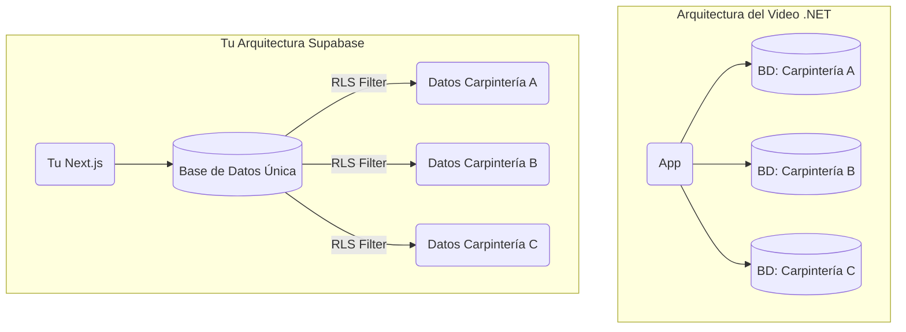
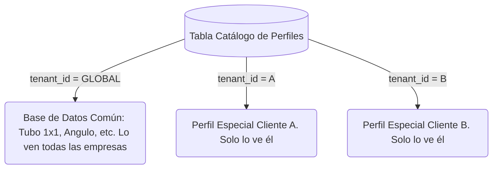

# 🚀 Guía Definitiva: De ERP Interno a SaaS Multi-Tenant con Supabase

Este documento es una explicación **extremadamente detallada y desde cero** de cómo convertir tu ERP actual en un software que puedas vender a docenas o cientos de carpinterías (un SaaS: Software as a Service), manteniendo todo seguro y organizado.

---

## 1. ¿Qué es exactamente el modelo "Multi-Tenant" (SaaS)?

Imagina un edificio de apartamentos. El edificio es tu aplicación (el servidor, la base de datos, el código). Los **inquilinos** (tenants) son tus clientes (Carpintería A, Carpintería B, Carpintería C).

Existen dos formas principales de construir este edificio en bases de datos:

### Enfoque 1: El del Video (Un Esquema/Base de Datos por Inquilino)
Es como darle a cada inquilino **una casa separada**. 
- **Pros:** Imposible que se mezclen los datos. Si quieres borrar un cliente, borras su casa de un plumazo.
- **Contras:** Si tienes 100 clientes y quieres agregar una columna "Descuento" a la tabla de cotizaciones, tienes que ir a las 100 casas y agregarla una por una. Esto requiere equipos DevOps completos (.NET + Azure).

### Enfoque 2: El de Supabase (Una Base de Datos, Múltiples Inquilinos con `tenant_id`)
Es como tener a todos en **el mismo edificio**, pero cada inquilino tiene una **llave maestra (RLS)** que solo abre las puertas de sus propias habitaciones.
- **Pros:** Extremadamente barato, rápido de mantener. Si agregas la columna "Descuento", se agrega para todos al instante.
- **Contras:** Si te equivocas haciendo la llave (las políticas de seguridad), un inquilino podría entrar al cuarto de otro.



---

## 2. RLS desde Cero: ¿Cómo funciona eso de filtrar por `tenant_id`?

**No necesitas duplicar tablas.** Todas las carpinterías usarán la *misma tabla* `trx_cotizaciones`. 

¿Cómo evitamos que la Carpintería B vea las cotizaciones de la A?
Agregando una simple columna llamada `tenant_id` (ID del Inquilino).

### Ejemplo visual de la tabla compartida:

| id_cotizacion | cliente | total | **tenant_id** (Empresa) |
|---|---|---|---|
| 001 | Juan Pérez | $500 | `carpinteria_A_id` |
| 002 | Maria López | $300 | `carpinteria_B_id` |
| 003 | Hotel Plaza | $900 | `carpinteria_A_id` |

### La Magia del RLS (Row Level Security)
Row Level Security (Seguridad a Nivel de Fila) es como un "guardia de seguridad invisible" que está dentro del motor de PostgreSQL. No importa si tu código de Next.js tiene un bug, el guardia NUNCA dejará pasar datos ajenos.

Le dices a Supabase:
> *"Señor Guardia, cuando un usuario inicie sesión, fíjese de qué empresa es. Si es de la Empresa A, solo déjelo hacer SELECT, INSERT, UPDATE o DELETE en las filas que digan `tenant_id = carpinteria_A_id`."*

**El código SQL real de esa política sería así:**
```sql
CREATE POLICY "Aislamiento de Inquilinos" 
ON trx_cotizaciones FOR ALL 
USING ( tenant_id = auth.jwt() ->> 'tenant_id' );
```
Con esa simple línea, tu sistema es multi-tenant. Si el usuario de la Carpintería B hace `SELECT * FROM trx_cotizaciones`, mágicamente la base de datos *solo le devuelve la fila 002*. Las filas 001 y 003 "no existen" para él.

---

## 3. Resolviendo tus Dudas Específicas

> **"¿Y si quiero borrar a un solo cliente?"**

Muy fácil. Como todo tiene la etiqueta `tenant_id`, solo ejecutas:
`DELETE FROM mst_empresas WHERE id = 'carpinteria_B_id';`
Si configuraste bien tus Claves Foráneas (Foreign Keys) con `ON DELETE CASCADE`, al borrar la empresa matriz, **se borrarán mágicamente todas sus cotizaciones, clientes, productos e inventario** en milisegundos.

> **"¿Cuándo tendría que pagarle a Supabase?"**

Supabase no te cobra "por cliente" ni "por tabla". El plan Pro cuesta **$25 USD al mes** y te incluye:
- 100,000 usuarios activos mensuales.
- 8 GB de base de datos (texto ocupa muy poco, 8GB son millones y millones de cotizaciones).
- Solo empezarías a pagar extras si tuvieras un éxito masivo (cientos de carpinterías usándolo todos los días al unísono). Es un modelo sumamente rentable para ti.

> **"¿Y si quisiera descargar los datos O UN SQL de UNA SOLA empresa?"**

No puedes usar el botón genérico de "Exportar base de datos" porque eso bajaría los datos de todos. Para exportar de uno solo:
1. Usas el exportador a Excel que ya programamos, pero a nivel administrador global (exportar filtrando por `tenant_id`).
2. O corres un script SQL de DUMP con una cláusula WHERE:
   `SELECT * FROM public.trx_cotizaciones WHERE tenant_id = 'su_id';`
   y guardas eso en un CSV/SQL.

---

## 4. El Catálogo de Productos: ¿Compartido o Personalizado?

Esta es la mejor pregunta que hiciste: *"¿Qué pasa si quiero copiar mi catálogo de productos para otra empresa, pero luego ellos quieren tener sus propios productos (que yo no tengo) y viceversa?"*

Tienes dos soluciones arquitectónicas para esto en SaaS:

### Solución A: 100% Personalizado (Copiar y Pegar)
Cuando una empresa nueva paga su suscripción, corres una función (Trigger) en Supabase que toma tus 500 productos base y hace un `INSERT` duplicándolos para ellos (poniéndoles el `tenant_id` nuevo).
A partir de ese momento, la empresa nueva puede borrar, editar precio o crear productos. Son **suyos**.
- **Problema:** Si tú inventas un nuevo perfil de aluminio meses después, ellos no lo tendrán automáticamente. Tendrías que inyectárselo.

### Solución B: "Catálogo Híbrido" (El estándar de oro en SaaS B2B)
Es la manera más profesional. Una tabla puede tener artículos que son "Globales" (brindados por ti como creador del ERP) y artículos que son "Locales" (creados por la carpintería).

Para hacer esto, el campo `tenant_id` en el catálogo permite un **valor nulo o especial** (ej: `tenant_id = 'GLOBAL'`).



**Política RLS Híbrida:**
> *"Puedes ver este producto si tú eres el dueño (`tenant_id = tuyo`) O si somos nosotros (`tenant_id = 'GLOBAL'`). PERO solo puedes editar o borrar si tú eres el dueño."*

Con esto, tú mantienes un catálogo base universal, y ellos pueden pre-cargar sus inventos privados.

---

## 5. Casos Límite: Formas en que se podría romper tu código o seguridad

Si vas a volverlo SaaS, debes protegerte de estos posibles peligros:

| Qué podría salir mal | Descripción del Peligro | Solución / Prevención |
| :--- | :--- | :--- |
| **Olvidar prender RLS en una tabla nueva** | Creas una tabla `trx_pagos` por la noche y olvidas hacer el comando `ENABLE ROW LEVEL SECURITY`. El código de Next.js podría accidentalmente pedir la tabla entera, y un usuario hábil podría ver pagos genéricos. | Nunca saltarse la Rule 0: Toda tabla nueva lleva RLS sin excepción. El agente de IA tiene una skill `.agents/skills/supabase-postgres-best-practices` precisamente para auditar esto. |
| **Vulnerabilidad de IDOR (Insecure Direct Object Reference)** | La URL dice `/cotizacion/uuid-ajeno`. El usuario cambia la URL para adivinar el ID de otra cotización. | **RLS te salva aquí.** Incluso si adivina la URL de la cotización B, el backend de Supabase verá que esa cotización no tiene su `tenant_id` y le devolverá un error 404 (Vacío). Tu Next.js fallará de forma segura. |
| **El "Service Role Key" expuesto** | El `SERVICE_ROLE_KEY` (clave secreta de Supabase) es "Dante", o "Dios". Se salta completamente las barreras de RLS. Si este código llega al navegador web, te roban toda la BD. | Ya hicimos una auditoría de esto antes. Este key NUNCA debe importarse en archivos `"use client"`. Solo debe vivir en el servidor (`server.ts`). |
| **Bugs de concurrencia de inventario** | Dos empresas venden casualmente el mismo "Tubo Global" exacto a la misma milésima de segundo. | Al ser Multi-tenant donde cada quien tiene *su propio almacén local*, la resta de inventario ocurre aislada. Solo pasa si usas catálogo global y no separas los Kardex. El Kardex siempre debe ser 100% de la empresa, nunca Global. |

---

## 6. Paso a Paso: ¿Cómo sería la migración real en código?

Si mañana decides dar luz verde y convertir el proyecto en SaaS, el agente de IA y tú seguirían estos pasos:

1. **Crear tabla `sys_tenants` (Empresas):** 
   - Columnas: `id, nombre_empresa, plan_suscripcion, estado_suscripcion`.
2. **Alterar TODAS las tablas existentes:**
   - Correr unos 50 `ALTER TABLE XXX ADD COLUMN tenant_id UUID REFERENCES sys_tenants(id)`.
3. **Migrar tu data personal (La Carpintería Cero):**
   - Crear tu "Empresa Cero" y hacer un script UPDATE masivo para asignarle tu `tenant_id` a todos tus datos actuales. Tu data quedará intacta, ahora encapsulada.
4. **Actualizar el JWT de Autenticación:**
   - Inyectar el `tenant_id` en el token de sesión de Supabase Auth para que vaya en cada "request" automáticamente.
5. **Reescribir las Políticas RLS de 177 archivos SQL:**
   - Borrar las políticas de seguridad viejas y sobreescribirlas con las genéricas de SaaS (ver punto 2).
6. **Ajustar Generación Mágica (Fórmulas):**
   - Garantizar que el evaluador matemático (`formula-engine.ts`) no pida cosas fuera del "Tenant".
7. **Probar:** Usar la herramienta Playwright para crear dos empresas de prueba y cotizar en paralelo, validando que jamás crucen información.

**¿Cuánto tardaría esto?**
Para un equipo corporativo, semanas. Para nosotros (Agente IA + Tú), con el proyecto ya ordenado, sería un trabajo intenso de **1 a 2 días de pura base de datos** (reescribir mucho SQL). El frontend de React casi no se tocaría, porque el RLS hace que React siga funcionando igual, ciego al hecho de que hay otras empresas.
