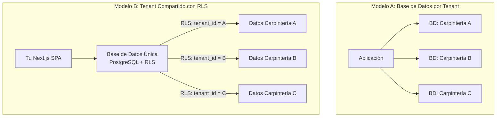
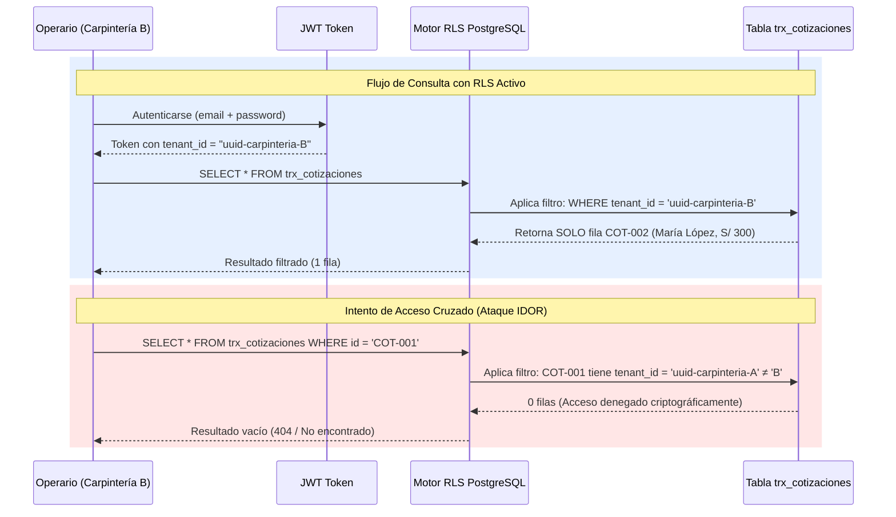
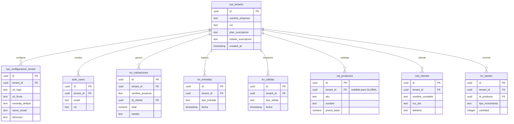
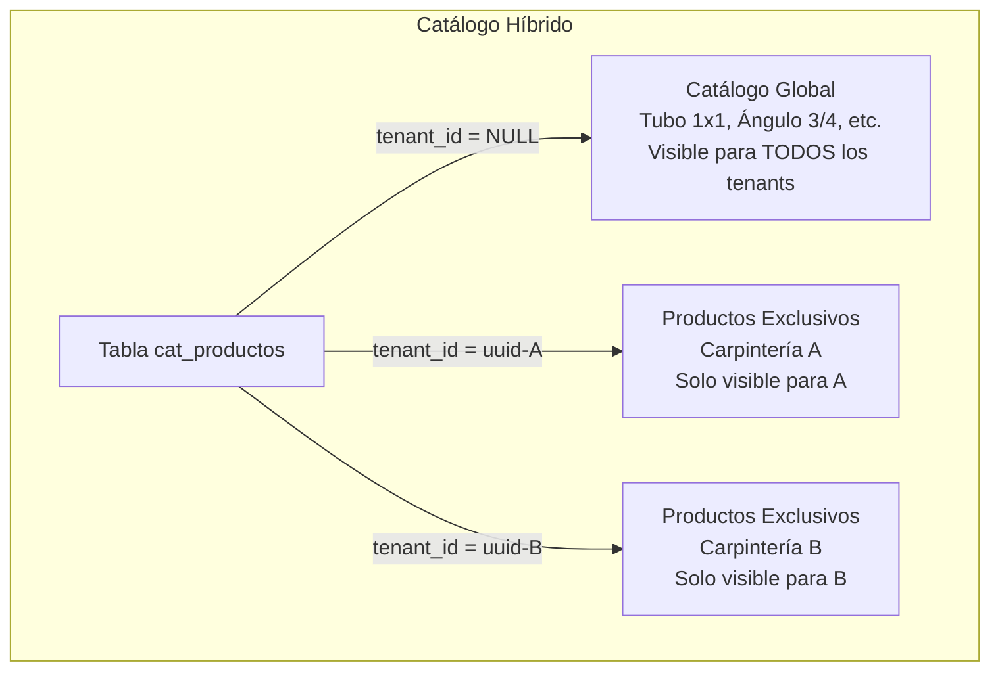
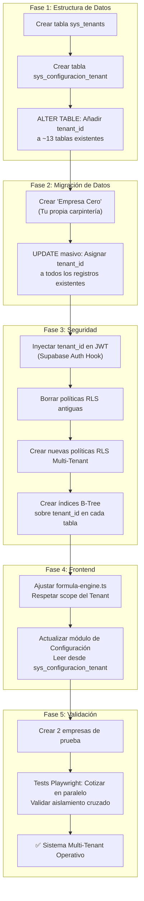

# Documento Técnico-Ejecutivo: Guía de Migración — De ERP Interno a SaaS Multi-Tenant

> **Clasificación:** Arquitectura de Datos y Seguridad — Migración Multi-Tenant con PostgreSQL RLS  
> **Stack:** Next.js SPA Export · Supabase PostgreSQL · Row-Level Security (RLS)  
> **Versión:** 2.0 — Refactorizado con diagramas ER, matrices de seguridad y roadmap de migración detallado

---

## Tabla de Contenidos

1. [Fundamentos de Arquitectura Multi-Tenant](#1-fundamentos-de-arquitectura-multi-tenant)
2. [Mecánica del Row-Level Security (RLS)](#2-mecánica-del-row-level-security)
3. [Modelo de Datos Multi-Tenant (Esquema ER)](#3-modelo-de-datos-multi-tenant)
4. [Estrategia de Catálogo: Compartido vs Personalizado](#4-estrategia-de-catálogo)
5. [Matriz de Amenazas y Contramedidas de Seguridad](#5-matriz-de-amenazas-y-contramedidas)
6. [Operaciones Administrativas sobre Tenants](#6-operaciones-administrativas)
7. [Plan de Migración Detallado (Roadmap Técnico)](#7-plan-de-migración-detallado)

---

## 1. Fundamentos de Arquitectura Multi-Tenant

### 1.1. Modelos Arquitectónicos Comparados

En el diseño de sistemas SaaS existen dos enfoques fundamentales para aislar datos entre clientes:

| Dimensión | Modelo A: Base de Datos por Tenant | Modelo B: Tenant Compartido con RLS (Actual) |
| :--- | :--- | :--- |
| **Analogía** | Una casa separada por cliente | Un edificio con llaves maestras por piso |
| **Aislamiento de Datos** | Físico (100% separación) | Lógico (filtro criptográfico por JWT) |
| **Costo por Tenant** | Alto ($25/mes por instancia Supabase) | Marginal (~0.002 KB por fila con `tenant_id`) |
| **Mantenimiento (ALTER TABLE)** | Ejecutar en N bases de datos separadas | Ejecutar 1 vez, aplica para todos |
| **Eliminación de Tenant** | `DROP DATABASE` (instantáneo) | `DELETE WHERE tenant_id = X` + CASCADE |
| **Riesgo de Fuga de Datos** | Nulo (físicamente imposible) | Bajo (depende de correcta configuración RLS) |
| **Escalabilidad de Costo** | Lineal ($25 × N clientes) | Logarítmica (1 sola instancia para todos) |
| **Complejidad DevOps** | Alta (requiere orquestación .NET/Azure) | Baja (1 archivo SQL con políticas) |
| **Adecuado Para** | Empresas con >$10K/mes por cliente | SaaS B2B con precios < $200/mes |



> **Decisión Arquitectónica:** El Modelo B (Tenant Compartido con RLS) es la elección óptima para este ERP debido al precio de suscripción objetivo (S/ 150/mes). El Modelo A requeriría que cada tenant financie su propia instancia Supabase ($25/mes × N), destruyendo el margen operativo del 98%.

---

## 2. Mecánica del Row-Level Security

### 2.1. Principio de Funcionamiento

Row-Level Security (RLS) es un mecanismo nativo de PostgreSQL que opera como un **filtro invisible a nivel de motor de base de datos**. Intercepta cada operación SQL (`SELECT`, `INSERT`, `UPDATE`, `DELETE`) y aplica una condición booleana antes de permitir o rechazar el acceso a cada fila individual.

### 2.2. Ejemplo Concreto con Datos Reales

Tabla compartida `trx_cotizaciones` con datos de múltiples tenants:

| id_cotizacion | cliente | total | tenant_id |
| :---: | :--- | :---: | :--- |
| COT-001 | Juan Pérez | S/ 500 | `uuid-carpinteria-A` |
| COT-002 | María López | S/ 300 | `uuid-carpinteria-B` |
| COT-003 | Hotel Plaza | S/ 900 | `uuid-carpinteria-A` |
| COT-004 | Restaurant Coral | S/ 750 | `uuid-carpinteria-C` |

### 2.3. Política RLS de Aislamiento

```sql
-- Habilitar RLS en la tabla
ALTER TABLE trx_cotizaciones ENABLE ROW LEVEL SECURITY;

-- Crear política de aislamiento total
CREATE POLICY "tenant_isolation_policy" 
ON trx_cotizaciones 
FOR ALL 
USING ( tenant_id = (auth.jwt() ->> 'tenant_id')::uuid );
```

### 2.4. Comportamiento en Tiempo de Ejecución



> **Garantía de Seguridad:** El filtrado RLS se ejecuta a nivel de motor PostgreSQL, no a nivel de código aplicativo. Incluso si un bug en el frontend omite un filtro `WHERE`, o si un atacante manipula la URL para adivinar un `id_cotizacion` ajeno, la base de datos rechaza la consulta antes de devolver resultados. La fuga de datos entre tenants es **matemáticamente imposible** con RLS correctamente configurado.

---

## 3. Modelo de Datos Multi-Tenant

### 3.1. Esquema Entidad-Relación (ER) Target



### 3.2. Tablas Afectadas por la Migración

| Esquema | Tabla | Acción Requerida | Criticidad |
| :--- | :--- | :--- | :---: |
| `public` | `trx_cotizaciones` | ADD COLUMN `tenant_id` + RLS Policy | 🔴 Crítica |
| `public` | `trx_detalles_cotizacion` | ADD COLUMN `tenant_id` + RLS Policy | 🔴 Crítica |
| `public` | `trx_entradas` | ADD COLUMN `tenant_id` + RLS Policy | 🔴 Crítica |
| `public` | `trx_salidas` | ADD COLUMN `tenant_id` + RLS Policy | 🔴 Crítica |
| `public` | `trx_kardex` | ADD COLUMN `tenant_id` + RLS Policy | 🔴 Crítica |
| `public` | `mst_clientes` | ADD COLUMN `tenant_id` + RLS Policy | 🔴 Crítica |
| `public` | `cat_productos` | ADD COLUMN `tenant_id` (nullable para GLOBAL) + RLS Híbrido | 🟡 Media |
| `public` | `mst_familias` | Evaluar: ¿Global o por Tenant? | 🟡 Media |
| `public` | `mst_materiales` | Evaluar: ¿Global o por Tenant? | 🟡 Media |
| `public` | `mst_acabados_colores` | Evaluar: ¿Global o por Tenant? | 🟡 Media |
| `public` | `mst_marcas` | Evaluar: ¿Global o por Tenant? | 🟡 Media |
| — | `sys_tenants` | **CREAR NUEVA** | 🔴 Crítica |
| — | `sys_configuracion_tenant` | **CREAR NUEVA** (migrar datos de config actual) | 🔴 Crítica |

---

## 4. Estrategia de Catálogo

### 4.1. Modelo Híbrido (Estándar de Oro en SaaS B2B)

El catálogo de productos implementa un modelo híbrido donde coexisten artículos **Globales** (proveídos por el administrador del SaaS) y artículos **Locales** (creados por cada tenant individualmente).

*   **Artículos Globales:** `tenant_id = NULL` o `tenant_id = 'GLOBAL'`. Visibles para todos los tenants. Solo editables por el administrador del SaaS.
*   **Artículos Locales:** `tenant_id = uuid-del-tenant`. Visibles y editables solo por el tenant propietario.



### 4.2. Política RLS Híbrida para Catálogo

```sql
-- Política de LECTURA: Ver productos propios + globales
CREATE POLICY "catalog_read_policy" 
ON cat_productos FOR SELECT 
USING (
    tenant_id = (auth.jwt() ->> 'tenant_id')::uuid 
    OR tenant_id IS NULL  -- Productos globales
);

-- Política de ESCRITURA: Solo modificar productos propios (nunca globales)
CREATE POLICY "catalog_write_policy" 
ON cat_productos FOR ALL 
USING ( tenant_id = (auth.jwt() ->> 'tenant_id')::uuid )
WITH CHECK ( tenant_id = (auth.jwt() ->> 'tenant_id')::uuid );
```

| Operación | Productos Globales (`tenant_id = NULL`) | Productos del Tenant Actual | Productos de Otro Tenant |
| :--- | :---: | :---: | :---: |
| `SELECT` (Leer) | ✅ Permitido | ✅ Permitido | ❌ Bloqueado por RLS |
| `INSERT` (Crear) | ❌ Solo Admin SaaS | ✅ Permitido | ❌ Bloqueado por RLS |
| `UPDATE` (Editar) | ❌ Solo Admin SaaS | ✅ Permitido | ❌ Bloqueado por RLS |
| `DELETE` (Borrar) | ❌ Solo Admin SaaS | ✅ Permitido | ❌ Bloqueado por RLS |

---

## 5. Matriz de Amenazas y Contramedidas

| ID | Amenaza | Descripción | Probabilidad | Impacto | Contramedida | Estado |
| :---: | :--- | :--- | :---: | :---: | :--- | :---: |
| T1 | **Tabla sin RLS habilitado** | Se crea una tabla nueva (ej. `trx_pagos`) sin ejecutar `ENABLE ROW LEVEL SECURITY`. Un usuario podría leer datos de todos los tenants. | 🟠 Media | 🔴 Crítico | Checklist obligatorio: toda tabla nueva lleva RLS + política. Uso de skill `supabase-postgres-best-practices` para auditoría. | 🕒 |
| T2 | **IDOR (Insecure Direct Object Reference)** | Un usuario manipula la URL `/cotizacion/uuid-ajeno` intentando acceder a datos de otro tenant. | 🟡 Baja | 🔴 Crítico | RLS bloquea automáticamente. La consulta devuelve resultado vacío (404) ya que el `tenant_id` del JWT no coincide. | ✅ |
| T3 | **Exposición del `SERVICE_ROLE_KEY`** | La clave `SERVICE_ROLE_KEY` (que bypasea todo RLS) se importa en un archivo `"use client"` del frontend, quedando visible en el navegador. | 🟡 Baja | 🔴 Catastrófico | Key restringida exclusivamente a archivos Server-Side (`server.ts`, API Routes). Auditoría previa confirmó ausencia de exposición. | ✅ |
| T4 | **Concurrencia de Inventario Global** | Dos tenants venden el mismo producto "Global" simultáneamente. El Kardex resta de un stock compartido inexistente. | 🟡 Baja | 🟠 Alto | El Kardex y el inventario son **siempre 100% por tenant** (`tenant_id` obligatorio). El catálogo puede ser global, pero el stock físico es local. | ✅ |
| T5 | **Omisión de `tenant_id` en INSERT** | Un bug en el frontend crea una cotización sin asignar `tenant_id`, generando un registro "huérfano" visible para nadie o para todos. | 🟠 Media | 🟠 Alto | Restricción `NOT NULL` en la columna `tenant_id` + Trigger que auto-inyecta el `tenant_id` del JWT en cada INSERT. | 🕒 |

---

## 6. Operaciones Administrativas

### 6.1. Eliminación Completa de un Tenant

Si un cliente cancela su suscripción y solicita la eliminación de sus datos:

```sql
-- Las Foreign Keys con ON DELETE CASCADE eliminan todo en cascada
DELETE FROM sys_tenants WHERE id = 'uuid-carpinteria-B';
-- Resultado: Se eliminan automáticamente todas las cotizaciones,
-- clientes, productos, entradas, salidas y kardex del tenant B.
```

### 6.2. Exportación de Datos de un Tenant Específico

No se puede usar el botón genérico "Exportar base de datos" (descargaría datos de todos los tenants). Métodos seguros:

| Método | Comando / Herramienta | Formato de Salida | Complejidad |
| :--- | :--- | :---: | :---: |
| Exportador Excel (Admin) | Módulo de Exportación con filtro `tenant_id` | `.xlsx` | Baja |
| Script SQL directo | `SELECT * FROM trx_cotizaciones WHERE tenant_id = 'uuid';` | `.csv` / `.sql` | Media |
| `pg_dump` con filtro | `pg_dump --table=trx_cotizaciones --where="tenant_id='uuid'"` | `.sql` | Alta |

### 6.3. Cuándo Pagar Supabase Pro

| Criterio de Decisión | Umbral de Transición | Costo Mensual |
| :--- | :--- | :---: |
| DB cercana a 400 MB | ~200,000 cotizaciones históricas acumuladas | $25 USD |
| Necesidad de Backups PITR nativos | Cuando el backup por GitHub Actions sea insuficiente | $25 USD |
| +100K MAUs alcanzados | Extremadamente improbable en B2B industrial | $25 USD |

---

## 7. Plan de Migración Detallado

### 7.1. Roadmap Técnico de Ejecución



### 7.2. Estimación de Esfuerzo por Fase

| Fase | Descripción | Archivos Afectados | Estimación | Riesgo de Regresión |
| :---: | :--- | :---: | :---: | :---: |
| **1** | Estructura de Datos (DDL) | ~3 archivos SQL | 2-3 horas | 🟢 Bajo |
| **2** | Migración de Datos (DML) | ~2 scripts SQL | 1-2 horas | 🟡 Medio |
| **3** | Seguridad (RLS + Índices) | ~15 archivos SQL | 3-4 horas | 🔴 Alto |
| **4** | Frontend (Ajustes React) | ~5 componentes TSX | 2-3 horas | 🟡 Medio |
| **5** | Validación (Tests E2E) | ~3 archivos de test | 2-3 horas | 🟢 Bajo |
| **Total** | — | **~28 archivos** | **10-15 horas** | — |

> **Nota Operativa:** El grueso del trabajo es SQL puro (Fases 1-3). El frontend de React casi no se modifica porque RLS opera de forma transparente: el código React sigue haciendo `supabase.from('cotizaciones').select('*')` como siempre, pero ahora la base de datos filtra automáticamente por `tenant_id` sin que el frontend lo sepa. El código permanece "ciego" al hecho de que existen otros tenants en el sistema.
