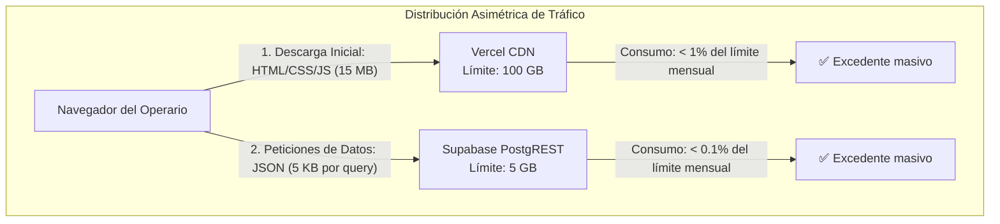
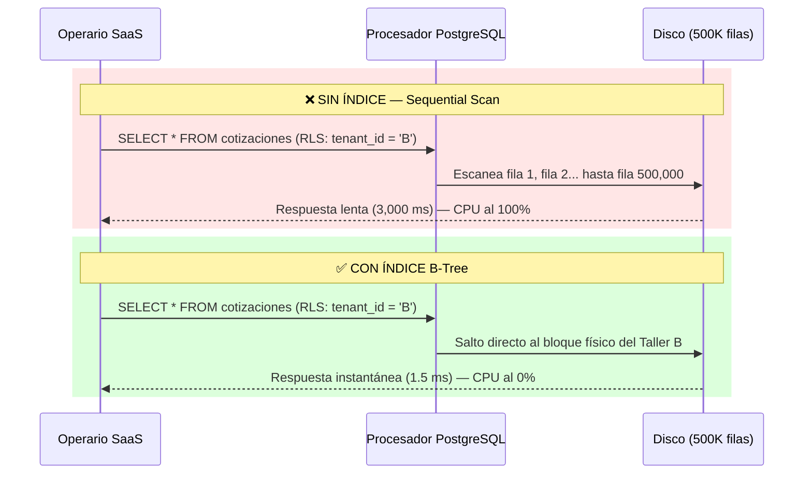
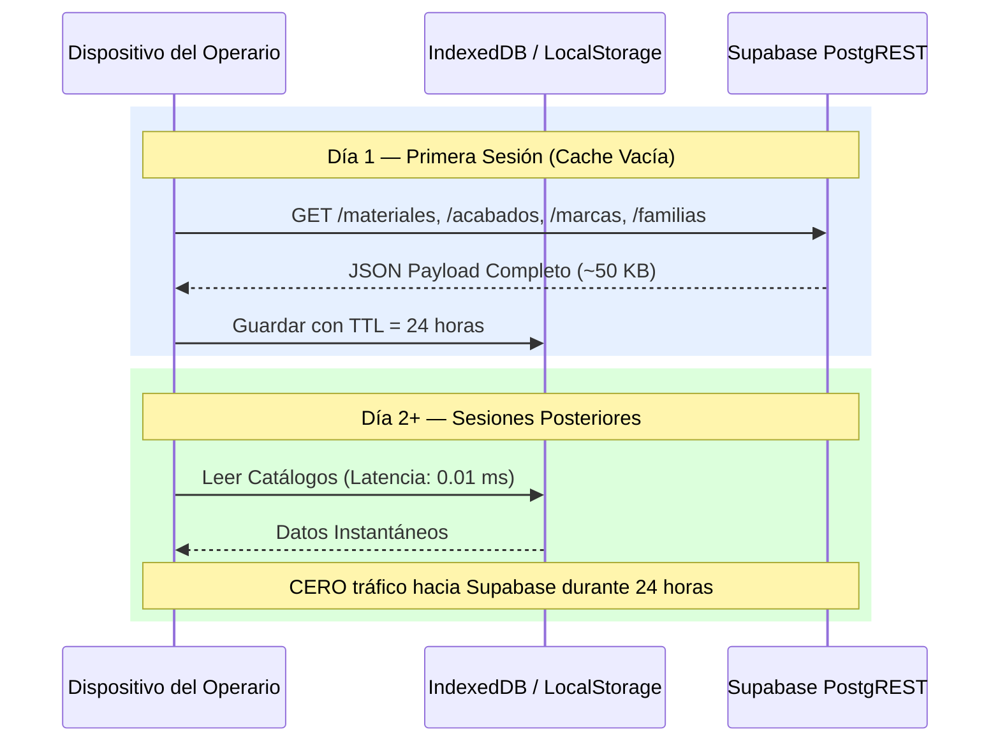
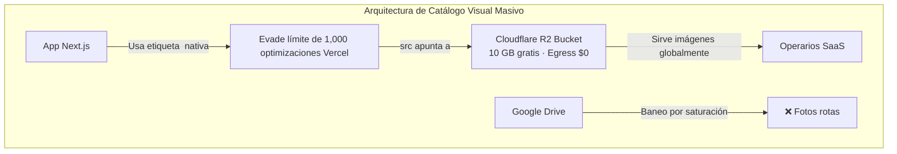
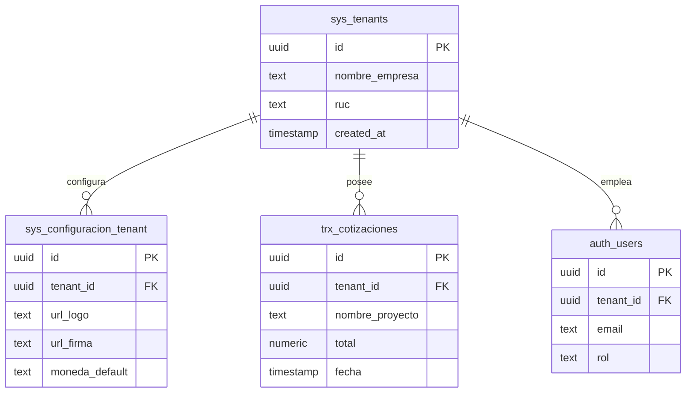
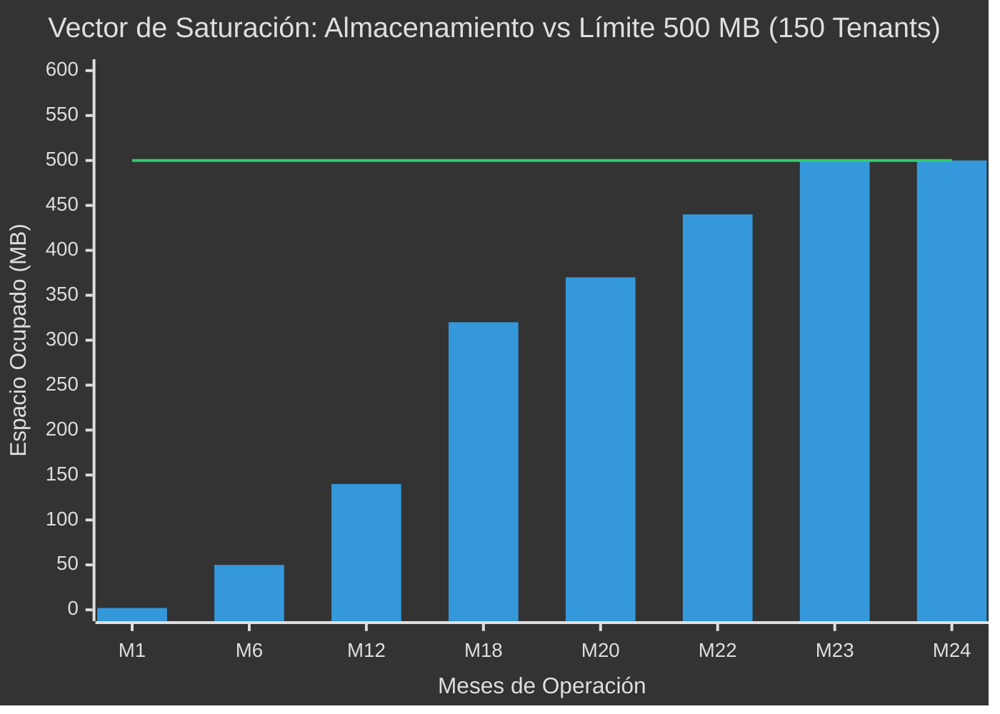

# Documento Técnico-Ejecutivo: Estrategia de Escalabilidad SaaS B2B "Zero-Cost"

> **Clasificación:** Arquitectura de Infraestructura — ERP Metalmecánico Multi-Tenant  
> **Stack:** Next.js (SPA Export) · Supabase (PostgreSQL + PostgREST) · Vercel (CDN Estático)  
> **Versión:** 2.0 — Refactorizado y reestructurado por categoría temática y prioridad de implementación

---

## Tabla de Contenidos

1. [Resumen Ejecutivo](#1-resumen-ejecutivo)
2. [Matriz de Priorización de Implementación](#2-matriz-de-priorización-de-implementación)
3. [Categoría A — Infraestructura y Despliegue (Edge/CDN)](#3-categoría-a--infraestructura-y-despliegue)
4. [Categoría B — Arquitectura de Base de Datos (PostgreSQL)](#4-categoría-b--arquitectura-de-base-de-datos)
5. [Categoría C — Caché, Red y Operaciones Masivas](#5-categoría-c--caché-red-y-operaciones-masivas)
6. [Categoría D — Storage, Monetización y Seguridad Multi-Tenant](#6-categoría-d--storage-monetización-y-seguridad-multi-tenant)
7. [Escenario de Falla Estructural (Día del Juicio)](#7-escenario-de-falla-estructural)

---

## 1. Resumen Ejecutivo

Este documento define la estrategia técnica completa para operar un ERP SaaS B2B Multi-Tenant con costos de infraestructura cercanos a **$0 USD** durante los primeros **23 meses** de operación comercial. La arquitectura explota las asimetrías de transferencia de datos entre Vercel (Capa Frontal CDN) y Supabase/PostgreSQL (Capa de Persistencia), neutralizando los límites duros de cómputo, almacenamiento, conexiones y ancho de banda.

El documento agrupa **8 tácticas de ingeniería** en 4 categorías temáticas, diferenciando claramente las que **ya están operativas** de las que **requieren implementación** antes del lanzamiento SaaS, ordenadas por prioridad de riesgo.

---

## 2. Matriz de Priorización de Implementación

Esta tabla consolida todas las tácticas del documento, ordena por criticidad descendente, y clasifica por estado actual.

| Prioridad | Estado | ID | Táctica | Categoría | Límite que Neutraliza | Impacto si NO se Implementa |
| :---: | :---: | :---: | :--- | :--- | :--- | :--- |
| **P0 (Crítica)** | ✅ Operativa | A1 | Frontend SPA Estático (`output: 'export'`) | Infraestructura | 100 GB-Horas de CPU Vercel | Suspensión del sitio por exceso de cómputo |
| **P0 (Crítica)** | ✅ Operativa | A2 | Ancho de Banda Asimétrico (Vercel ↔ Supabase) | Infraestructura | 5 GB Egress Supabase | Corte de servicio por saturación de Egress |
| **P0 (Crítica)** | ✅ Operativa | A3 | Anti-Pausa Cron (Keep-Alive) | Infraestructura | Pausa automática tras 7 días de inactividad | Base de datos congelada, pantalla de error |
| **P0 (Crítica)** | ✅ Operativa | B1 | Backups PITR vía GitHub Actions | Base de Datos | Sin backups en tier Free | Pérdida total e irreversible de datos |
| **P0 (Crítica)** | ✅ Operativa | B2 | Evasión del Límite de 60 conexiones TCP (PostgREST) | Base de Datos | 60 conexiones simultáneas PostgreSQL | Colapso bajo concurrencia B2B |
| **P1 (Alta)** | 🕒 Pendiente | B3 | Índices GIN/B-Tree sobre `tenant_id` (RLS) | Base de Datos | CPU al 100% por Sequential Scans | Timeout y suspensión del servicio |
| **P1 (Alta)** | 🕒 Pendiente | D1 | Compresión Client-Side de Archivos Subidos | Storage | 1 GB Supabase Storage | Llenado del Storage en semanas |
| **P1 (Alta)** | 🕒 Pendiente | D2 | SMTP Custom con Resend.com | Autenticación | 3 correos/hora Supabase Auth | Bloqueo del Onboarding de empleados |
| **P2 (Media)** | 🕒 Pendiente | C1 | Zustand Persist (Caché de Catálogos Maestros) | Caché/Red | Lecturas API redundantes (Egress) | Consumo acelerado del Egress de 5 GB |
| **P2 (Media)** | 🕒 Pendiente | A4 | Analíticas Off-Grid (PostHog / GA4) | Infraestructura | 2,500 eventos Vercel Analytics | Ceguera operativa o cobro de $20/mes |
| **P3 (Baja)** | 🕒 Pendiente | C2 | RPC Batching (Inserciones Masivas) | Caché/Red | Rate Limiting / Flagging DDOS | Baneo de IP al importar catálogos Excel |
| **P3 (Baja)** | 🕒 Pendiente | B4 | `VACUUM FULL` Programado (Desfragmentación) | Base de Datos | 500 MB de DB invadidos por Tuplas Muertas | Llenado fantasma del disco sin datos reales |
| **P3 (Baja)** | 🕒 Pendiente | D3 | Cloudflare R2 para Catálogo de Imágenes | Storage | 1,000 optimizaciones de imagen Vercel | Fotos rotas con error `402 Payment Required` |

---

## 3. Categoría A — Infraestructura y Despliegue

Esta categoría abarca las tácticas que gobiernan cómo el código llega al usuario final y cómo se distribuye el tráfico entre los proveedores de infraestructura.

### A1. Neutralización de Cómputo Activo (SPA Export) — ✅ Operativa

*   **Límite Técnico:** Vercel "Hobby" otorga 100 GB-Horas de procesamiento. En una arquitectura SSR (Server-Side Rendering), cada petición HTTP activa un proceso Node.js que consume CPU para generar HTML dinámicamente. Un ERP B2B con 50 usuarios concurrentes agotaría esta cuota en días.
*   **Implementación Actual:** La directiva `output: 'export'` en `next.config.ts` transforma Next.js en un generador de archivos HTML/JS estáticos en tiempo de compilación. Vercel se degrada intencionalmente a un CDN (Content Delivery Network) que sirve binarios muertos.
*   **Resultado:** Consumo de cómputo servidor: **0.00 GB-Horas**. La totalidad del renderizado (tablas, formularios, cálculos) se ejecuta en la CPU/RAM del dispositivo del usuario final.

| Métrica Operativa | Arquitectura SSR Tradicional | Arquitectura SPA Estática (Actual) | Ahorro |
| :--- | :--- | :--- | :---: |
| Generación de HTML | Por cada petición (consume CPU servidor) | Precompilado antes del despliegue | **100%** |
| Consumo de RAM en Servidor | Alto (instancias Node.js en background) | Inexistente (archivos estáticos) | **100%** |
| Timeout por Funciones | 10s límite (funciones cortadas arbitrariamente) | Infinito (lo procesa el PC del cliente) | **N/A** |

### A2. Distribución Asimétrica del Ancho de Banda — ✅ Operativa

*   **Límite Técnico:** Supabase Free permite únicamente **5 GB de Egress mensal**. Vercel Free otorga **100 GB**.
*   **Implementación Actual:** Todos los activos pesados (CSS, fuentes tipográficas, íconos SVG, JavaScript compilado) se sirven desde Vercel CDN. Supabase transmite exclusivamente payloads JSON de texto puro (cotizaciones, catálogos, clientes).
*   **Resultado:** Una consulta JSON de 1,000 cotizaciones pesa ~50 KB. Para saturar los 5 GB de Supabase se necesitarían **~100,000 consultas masivas mensuales**, un volumen inalcanzable para un ERP de manufactura.

### A3. Sistema Anti-Pausa Cron (Keep-Alive) — ✅ Operativa

*   **Límite Técnico:** Supabase suspende ("pausa") la instancia PostgreSQL de proyectos Free tras **7 días continuos sin actividad** registrada en el Dashboard. La detección ignora el tráfico API entrante, evaluando solo sesiones de consola.
*   **Implementación Actual:** Workflow `keep-alive-supabase.yml` en GitHub Actions ejecuta un `SELECT 1` programado vía Cron cada 5 días, simulando actividad de usuario.
*   **Resultado:** La instancia PostgreSQL permanece activa indefinidamente (**100% de Uptime**) sin intervención manual ni pago del Plan Pro.

### A4. Analíticas Off-Grid (PostHog / GA4) — 🕒 Pendiente

*   **Límite Técnico:** La función nativa "Analytics" del Dashboard de Vercel se congela al superar **2,500 eventos mensuales**. La activación es silenciosa y el cobro de $20 USD/mes es obligatorio para desbloquear.
*   **Solución Propuesta:** Integrar **PostHog** (analítica de producto) o **Google Analytics 4** (analítica de adquisición) como proveedor externo inyectando un script de telemetría en el layout del frontend.

| Proveedor | Eventos Gratuitos/Mes | Comportamiento al Agotar Cuota | Funcionalidad Extra | Costo por Exceso |
| :--- | :---: | :--- | :--- | :---: |
| **Vercel Analytics** | 2,500 | Métricas congeladas; cobro obligatorio | Ninguna | $20.00 USD/mes |
| **PostHog** | **1,000,000** | Deja de registrar; la app NO se afecta | Session Replay (5,000/mes), Feature Flags | ~$0.0001/evento |
| **Google Analytics 4** | **Ilimitado** | N/A | Integración con ecosistema Google Ads | Gratis |

> **Nota Técnica:** PostHog renueva su cuota de 1,000,000 eventos el día 1 de cada mes. Estimando 20 eventos/día/usuario, se necesitarían **~2,500 usuarios activos diarios** para agotar la cuota. PostHog además incluye grabación de sesiones en video, permitiendo diagnosticar problemas de UX observando directamente la interacción del operario.

---

## 4. Categoría B — Arquitectura de Base de Datos

Esta categoría agrupa las tácticas que protegen la integridad, disponibilidad y rendimiento del motor PostgreSQL hospedado en Supabase.

### B1. Backups PITR Gratuitos vía GitHub Actions — ✅ Operativa

*   **Límite Técnico:** El tier Free de Supabase **no incluye** respaldos automáticos ("Point In Time Recovery"). Un `DELETE` accidental o una corrupción de datos resulta en pérdida total irreversible. El PITR nativo requiere el Plan Pro ($25/mes).
*   **Implementación Actual:** Workflow `backup-base-datos.yml` ejecuta `pg_dump` automatizado en la madrugada, almacenando el archivo SQL resultante en el repositorio Git.
*   **Resultado:** Respaldo diario completo con historial versionado por commits, emulando la funcionalidad PITR sin costo mensual alguno.

### B2. Evasión del Límite de 60 Conexiones TCP (PostgREST) — ✅ Operativa

*   **Límite Técnico:** PostgreSQL en el tier Micro de Supabase soporta un máximo de **60 conexiones directas** y **200 a través del Connection Pooler**. Una aplicación tradicional que mantenga conexiones persistentes (ej. ORM con pool abierto) saturaría el límite con 61 usuarios simultáneos.
*   **Implementación Actual:** La librería `@supabase/supabase-js` canaliza todas las operaciones a través de PostgREST, un gateway HTTP que convierte peticiones REST en SQL, ejecuta la consulta, envía la respuesta JSON y destruye la conexión TCP inmediatamente ("stateless").
*   **Resultado:** Cada operación consume la conexión durante **~10 milisegundos**. El reciclaje ultra-rápido permite servir miles de peticiones concurrentes con un pool teórico de 60 slots, creando la ilusión de concurrencia masiva.

### B3. Indexación Obligatoria para RLS Multi-Tenant — 🕒 Pendiente (P1)

*   **Escenario de Riesgo:** 500,000 cotizaciones acumuladas entre 50 tenants. Un operario del Taller B consulta "Mis Cotizaciones". La política RLS ejecuta un **Sequential Scan** recorriendo las 500,000 filas preguntando `WHERE tenant_id = 'taller_b'`.
*   **Impacto:** CPU al 100%, timeout de la consulta, potencial suspensión del servicio por abuso de recursos.
*   **Solución:** Crear índice B-Tree compuesto: `CREATE INDEX idx_tenant_id_cotizaciones ON trx_cotizaciones(tenant_id);`. La resolución pasa de recorrido lineal O(n) a búsqueda logarítmica O(log n), ejecutándose en **< 2 milisegundos** con **0% de carga CPU**.

### B4. Desfragmentación con `VACUUM FULL` — 🕒 Pendiente (P3)

*   **Escenario de Riesgo:** Supabase otorga **500 MB** de espacio físico para la Base de Datos. PostgreSQL opera bajo MVCC (Multi-Version Concurrency Control): los comandos `DELETE` y `UPDATE` no eliminan datos del disco; generan "Tuplas Muertas" (Dead Tuples) que permanecen como espacio fantasma inutilizable.
*   **Impacto:** En 2 años de operación con borrados frecuentes, hasta **300 MB** del límite podrían estar ocupados por basura invisible.
*   **Solución:** Ejecución periódica (mensual o trimestral) de `VACUUM FULL;` en las tablas transaccionales principales. Este comando reescribe físicamente la tabla, recuperando espacio de disco al instante.

> **Trade-Off Crítico:** Durante la ejecución de `VACUUM FULL`, la tabla objetivo queda **bloqueada para escrituras** (Lock exclusivo). En un SaaS con operarios activos, debe ejecutarse en horario de mantenimiento nocturno (ej. 3:00 AM vía Cron) para evitar interrupciones.

---

## 5. Categoría C — Caché, Red y Operaciones Masivas

Tácticas que reducen el volumen de peticiones HTTP hacia Supabase, protegiendo el límite de Egress (5 GB) y evitando penalizaciones por Rate Limiting.

### C1. Caché Periférico de Catálogos Maestros (Zustand Persist) — 🕒 Pendiente (P2)

*   **Escenario de Riesgo:** 200 operarios abren el ERP simultáneamente a las 8:00 AM. Cada sesión ejecuta 4 consultas a tablas maestras estáticas (Materiales, Acabados, Marcas, Familias). Resultado: **800 lecturas** a Supabase consumidas en el primer minuto del día laboral, todas devolviendo datos idénticos.
*   **Solución:** Implementar `Zustand` con middleware `persist` (LocalStorage o IndexedDB). Al iniciar sesión por primera vez, el front-end descarga el catálogo maestro completo (~50 KB) y lo almacena en la memoria interna del dispositivo con un timestamp de expiración de 24 horas. En sesiones posteriores, los catálogos se leen desde el almacenamiento local en **~0.01 ms** sin generar tráfico de red hacia Supabase.
*   **Impacto Proyectado:** Reducción del **~80%** de las consultas API en operación diaria normal.

### C2. Inserción Balística por RPC Batching — 🕒 Pendiente (P3)

*   **Escenario de Riesgo:** Un distribuidor migra un catálogo de 5,000 productos desde un archivo Excel al ERP mediante un botón "Importar".
*   **Antipatrón:** Iterar en JavaScript ejecutando `supabase.from('productos').insert(fila)` en un bucle de 5,000 iteraciones. Resultado: 5,000 peticiones HTTP secuenciales. El Rate Limiter de Supabase detecta el patrón como un ataque DDOS y **banea la IP del cliente**.
*   **Solución:** Serializar el Excel completo en un único payload JSON en memoria del navegador. Enviar el bloque en **1 sola petición HTTP** a un Procedimiento Almacenado (`RPC / Stored Procedure`) en PostgreSQL. El motor de la base de datos ejecuta el `INSERT` masivo internamente en una sola transacción atómica (~500 ms).

| Método de Inserción | Peticiones HTTP | Tiempo Estimado | Riesgo de Baneo |
| :--- | :---: | :---: | :---: |
| **Loop Front-end (Antipatrón)** | 5,000 | 45-120 segundos | 🔴 Alto (DDOS Flag) |
| **RPC Batch (1 Payload)** | 1 | 0.5 segundos | 🟢 Nulo |

---

## 6. Categoría D — Storage, Monetización y Seguridad Multi-Tenant

Tácticas que protegen el límite de almacenamiento de archivos (1 GB), construyen la estrategia de monetización por planes, y garantizan el aislamiento total de datos entre empresas.

### D1. Compresión Client-Side de Archivos Subidos — 🕒 Pendiente (P1)

*   **Escenario de Riesgo:** Operarios suben fotos de obra desde smartphones modernos (resolución nativa: ~8 MB por foto). 125 fotos saturan el límite de **1 GB** del Storage gratuito de Supabase en semanas.
*   **Contexto de Negocio:** Actualmente, el módulo de Configuración permite insertar logos mediante URL externa (costo de Storage: **S/ 0.00**). Sin embargo, al lanzar el SaaS B2B, los clientes exigirán subir fotos de instalación adjuntas a cotizaciones desde su celular. Prohibir las subidas es comercialmente inviable.
*   **Solución:** Implementar interceptación Client-Side (Canvas HTML5 Resize). Antes de ejecutar el `upload()` a Supabase Storage, el código React en el navegador comprime la imagen a un techo fijo de **~150 KB**, utilizando el procesador del dispositivo del cliente.

| Tipo de Subida | Peso Unitario | Capacidad del Free Tier (1 GB) | Vida Útil Proyectada (50 Tenants) |
| :--- | :---: | :---: | :--- |
| Foto directa celular (sin compresión) | 8.00 MB | ~128 imágenes totales | **Semanas.** Colapso inminente. |
| Logo por URL externa (actual) | 0.00 MB | Infinito | **Eterno.** Pero limitado en UX para el cliente. |
| PDF de cotización digital | 0.05 MB | ~20,480 documentos | **Años.** Altamente eficiente. |
| **Foto comprimida Client-Side** | **0.15 MB** | **~6,826 imágenes** | **Años.** Escalabilidad B2B asegurada. |

### D2. Bypass del Bloqueo de E-Mails (Resend SMTP) — 🕒 Pendiente (P1)

*   **Límite Técnico:** Supabase Auth Free restringe el envío a **3 correos electrónicos por hora** (invitaciones, reseteo de contraseña, confirmación de email). En un SaaS con 10 empresas y 50 operarios, un pico matutino de "olvidé mi contraseña" bloquea al 4to usuario durante una hora completa.
*   **Solución:** Registrar cuenta gratuita en **Resend.com** (3,000 correos/mes incluidos). Configurar las credenciales SMTP Custom de Resend en el panel de Supabase Auth, sustituyendo el motor de correos nativo.
*   **Resultado:** Capacidad de envío escalada de 3/hora a **3,000/mes**, eliminando completamente el cuello de botella de onboarding.

### D3. CDN de Imágenes con Cloudflare R2 — 🕒 Pendiente (P3)

*   **Escenario de Riesgo:** Si el ERP evoluciona para incluir un catálogo visual de productos (ej. 1 millón de perfiles de aluminio con foto), la etiqueta `<Image>` de Next.js activaría el optimizador de imágenes de Vercel, el cual tiene un límite de **1,000 optimizaciones mensuales** en el tier Free. Superarlo devuelve un error `402 Payment Required`.
*   **¿Por qué no usar Google Drive como CDN?** Google Drive no es un servidor web. Si detecta cientos de operarios descargando la misma imagen simultáneamente, **banea el enlace por abuso de tráfico** y las fotos aparecen rotas.
*   **Solución:** Utilizar la etiqueta HTML nativa `` (que no invoca el optimizador de Vercel) apuntando a un bucket de **Cloudflare R2**. R2 otorga 10 GB de almacenamiento y **$0.00 de costo por Egress**.

### D4. Estrategia de Monetización por Planes (Logo URL vs Upload)

La diferenciación de niveles de servicio permite monetizar funcionalidades cuyo costo marginal para el proveedor es cercano a cero.

*   **Plan MYPE Básico (~S/ 50/mes):** El cliente coloca su logo corporativo mediante URL externa (Facebook, Imgur, sitio web propio). Costo de almacenamiento y Egress para el proveedor: **S/ 0.00**.
*   **Plan Empresarial ORO (~S/ 150/mes):** Se habilita el botón "Subir Archivo desde PC", protegido por la compresión Client-Side (D1). Costo marginal: despreciable gracias a la compresión.

### D5. Aislamiento Multi-Tenant (RLS Criptográfico)

La arquitectura de aislamiento de datos garantiza que ningún tenant pueda acceder, visualizar o imprimir datos de otro tenant, incluso ante errores de código en el frontend.

**Migración Arquitectónica:**

1. Se crea la tabla `sys_empresas` (también llamada `sys_tenants`). Cada contrato comercial genera una fila.
2. El módulo de Configuración se refactoriza hacia `sys_configuracion_tenant` con columna obligatoria `tenant_id`.
3. Cada usuario autenticado porta su `tenant_id` en el JWT (JSON Web Token) emitido por Supabase Auth.
4. Las políticas RLS validan automáticamente: `USING (tenant_id = auth.jwt()->>'tenant_id')`. Cualquier consulta que no coincida con el tenant del JWT activo es **rechazada a nivel de motor de base de datos**, haciendo matemáticamente imposible la filtración cruzada de datos.

> **Garantía Legal para el Cliente:** La segregación RLS opera a nivel de motor PostgreSQL, no de código aplicativo. Incluso si un bug en el frontend omitiera un filtro `WHERE`, la base de datos rechazaría la consulta antes de devolver resultados. Esta es la garantía contractual de que los datos de un taller nunca aparecerán impresos en la cotización de su competidor.

---

## 7. Escenario de Falla Estructural

Incluso con los 8 tácticas configuradas correctamente, existe un límite físico absoluto e infranqueable: los **500 MB de capacidad de la Base de Datos SQL** en el tier Free de Supabase.

### 7.1. Parámetros de la Ecuación de Colapso

| Parámetro | Valor |
| :--- | :--- |
| Peso promedio de 1 cotización (cabecera + 10 detalles + índices) | **~2 KB** |
| Límite físico absoluto del Free Tier | **500 MB = 512,000 KB** |
| Capacidad máxima teórica | **~256,000 cotizaciones históricas totales** |

### 7.2. Proyección de Saturación Temporal

Asumiendo crecimiento progresivo de la base de clientes SaaS con captación acelerada:

| Mes | Clientes SaaS | Cotizaciones/Día (Total) | KB Nuevos/Mes | DB Acumulada (MB) | Ingreso Mensual ($50/cliente) | Estado |
| :---: | :---: | :---: | :---: | :---: | :---: | :--- |
| 1 | 5 | 50 | 2,500 | **2** | $250 | 🟢 Excedente 99% |
| 6 | 20 | 200 | 12,000 | **50** | $1,000 | 🟢 VACUUM activo |
| 12 | 50 | 500 | 30,000 | **140** | $2,500 | 🟡 Alerta temprana |
| 18 | 100 | 1,000 | 60,000 | **320** | $5,000 | 🟠 Espacio degradándose |
| **23** | **150** | **1,500** | **90,000** | **500 (Tope)** | **$7,500** | 🛑 **READ-ONLY MODE** |

### 7.3. Gráfico de Saturación vs Límite Físico

*(La línea horizontal representa el tope físico de 500 MB. Las barras representan el consumo acumulado proyectado.)*

### 7.4. Resolución Operativa

En el **Mes 23**, cuando la base de datos entre en modo Read-Only:

| Métrica | Valor en el Punto de Quiebre |
| :--- | :--- |
| Ingresos mensuales por suscripciones SaaS | **$7,500 USD** |
| Costo del Upgrade a Supabase Pro | **$25 USD/mes** |
| Proporción del costo sobre los ingresos | **0.33%** |
| Nueva capacidad de Base de Datos | **8 GB (8,192 MB)** |
| Autonomía proyectada con 8 GB | **> 10 años adicionales** |

El acto resolutorio es un clic administrativo en el dashboard de Supabase: `Upgrade to Pro`. El gasto de $25 USD/mes pasa a ser una línea insignificante del OPEX mensual frente a los $7,500 USD de ingresos recurrentes que la plataforma generará en ese momento.

> **Conclusión Arquitectónica:** La implementación de estas 8 tácticas desde el Día 1 transforma un potencial gasto paralizante de Cloud Computing en un trámite administrativo irrelevante, ejecutable en el momento exacto en que el negocio genera ingresos suficientes para absorberlo sin impacto financiero.
