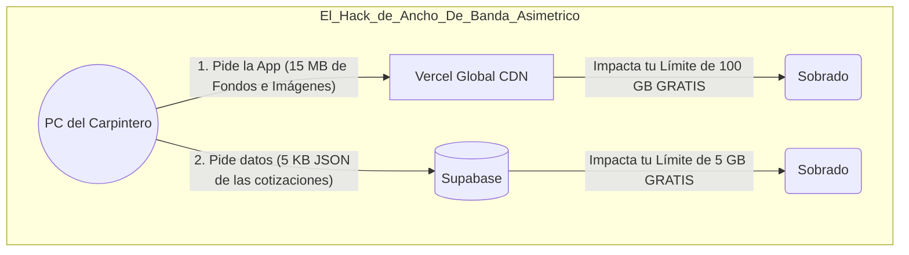
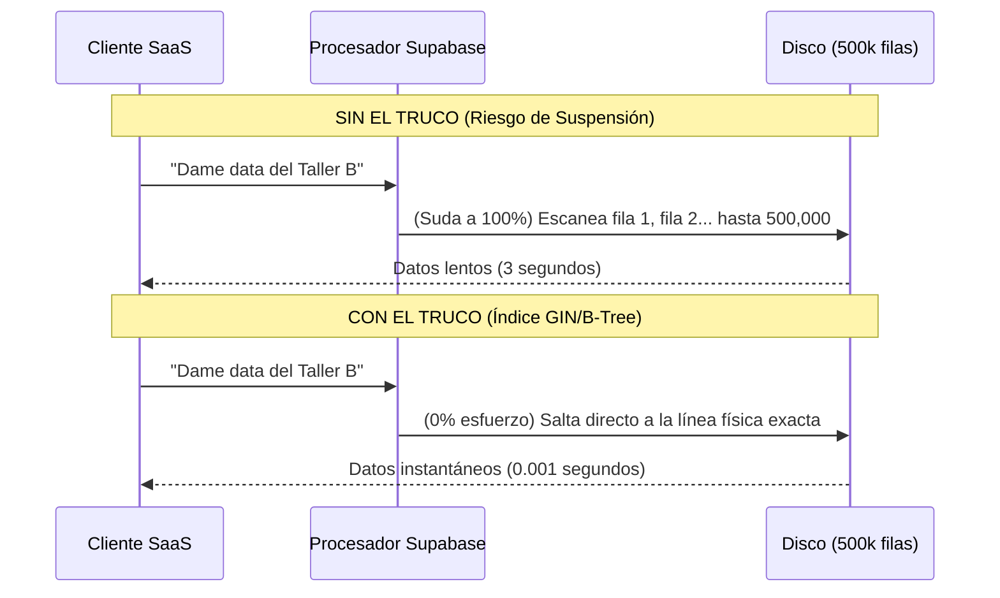
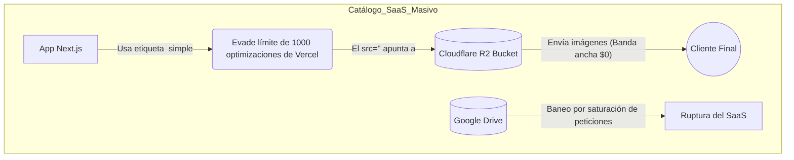

# 🚀 Enciclopedia de Hacks: Exprimir el Plan Gratis al 100%

Esta es la investigación más profunda, exhaustiva y extrema sobre cómo evadir legalmente (y mediante pura ingeniería) los límites de tu infraestructura grauita (Vercel y Supabase). 

Aquí no hay redundancia. Está dividido estrictamente en lo que **ya lograste sin darte cuenta** y lo que **tienes que programar urgentemente** cuando migres a SaaS.

---

## ✅ PARTE 1: LOS TRUCOS QUE YA APLICAS (Y por qué eres invencible hoy)

Estos son los atajos arquitectónicos que tu aplicación ya ejecuta todos los días. Si fueras una empresa "típica", estos 5 puntos te costarían cientos de dólares mensuales en servidores AWS/Azure.

### 1. El Hack de "Vercel Zero-Compute" (Exportación Estática)
*   **El Límite Técnico:** Vercel "Hobby" (Gratis) te da 100 GB-Horas de procesamiento. Quienes usan un framework normal de Next.js (`Server-Side Rendering`) gastan tiempo de procesador por cada clic que da un usuario. Cuando pasan el límite, Vercel apaga su página.
*   **Tu Jugada:** Tu código tiene `output: 'export'` en `next.config.ts`. Esto mata a Next.js antes de subir a producción y lo convierte todo en archivos de texto HTML/JS muertos.
*   **El Resultado:** Como entregas archivos muertos, Vercel no corre NINGÚN proceso. Tu consumo de servidor es **0.00 GB-Horas mensuales**. Vercel actúa únicamente como un disco duro global regalándote 100 GB de ancho de banda. Jamás te van a suspender por "pensar" demasiado.

### Cuadro Analítico: Cómputo SSR vs SPA (Exportación Estática)
| Métrica Operativa | Web Tradicional SSR (Ej. Tienda Online) | Tu ERP SaaS SPA Estático | Ahorro Realizado |
| :--- | :--- | :--- | :--- |
| **Generación de HTML** | Por cada clic (Consume Servidor) | Cero (Ya compilado antes de subir) | 100% de GB-Horas |
| **Consumo de Memoria RAM**| Alto (Node.js en background) | Inexistente (Archivos muertos) | 100% Memoria Libre |
| **Tiempo Máxtimo (Timeouts)**| 10s límite (Funciones cortadas) | Infinito (Lo procesa la PC del cliente) | Interfaz a prueba de fallas |

### 2. El Hack del "Ancho de Banda Asimétrico" (Vercel vs Supabase)
*   **El Límite Técnico:** Supabase Gratis solo te permite enviar 5 GB de datos al mes (Egress). Es un número bajísimo si tuvieras que enviar imágenes desde ahí, chocarías contra el muro rápido.
*   **Tu Jugada:** Toda la carga gráfica pesada de tu App (fondos, fuentes de texto, íconos de Radix/Shadcn, gráficos de ventanas, Next.js SVG) vive en el frontend.
*   **El Resultado:** Vercel (con sus 100 GB gratis) se come el impacto pesado de enviar tu diseño a los clientes. Supabase (con sus 5 GB gratis) se dedica **únicamente a enviar respuestas en formato JSON de texto puro**. Como un archivo JSON de 1,000 cotizaciones pesa solo unos pocos KiloBytes, es matemáticamente imposible agotar los 5 GB de Supabase usando solo texto. Tu motor está perfectamente divorciado: la pintura pesada la carga Vercel, el papel ligero lo carga Supabase.

### 3. El Hack de Inmortalidad (Anti-Pausa Inteligente)
*   **El Límite Técnico:** Supabase odia los proyectos fantasma. Si nadie entra a tu app en 7 días, clavan un proceso que detiene (Pausa) tu base de datos para ahorrar dinero en sus servidores de Amazon. Si un cliente entra el día 8, verá la pantalla caída.
*   **Tu Jugada:** Programaste un Workflow en tu repositorio de GitHub (`keep-alive-supabase.yml`) que se disfraza de usuario y golpea silenciosamente tu base de datos mediante tareas automatizadas Cron (agendadas en la nube).
*   **El Resultado:** Como el robot de GitHub le dice "Hola" a Supabase regularmente, los servidores de Supabase creen que el sistema está siendo usado por una persona real. Obteniendo 100% de disponibilidad continua (Uptime) sin pagar el Plan Pro.

### 4. El Hack de Resiliencia Empresarial (Backups "PITR" Gratuitos)
*   **El Límite Técnico:** Las bases de datos gratuitas en la nube modernas son un peligro porque no tienen respaldos diarios ("Point In Time Recovery" o PITR). Si borras algo por accidente, mueres. Para tener PITR en Supabase, la cuota es de $25 a $29 dólares al mes.
*   **Tu Jugada:** Tienes un segundo robot en GitHub llamado `backup-base-datos.yml`.
*   **El Resultado:** Ese robot extrae brutalmente todos tus datos puros en la madrugada vía `pg_dump` y los guarda en un archivo `backup.sql` en tu repositorio. Tienes la seguridad de un banco de clase mundial, sin pagar el sueldo del banco.

### 5. La Evasión del Límite de "60 Conexiones" (PostgREST)
*   **El Límite Técnico:** Un servidor tradicional PostgreSQL sufre para tener más de 60 clientes conectados y mandando comandos TCP simultáneamente. Si en tu SaaS loguean 61 personas a la misma milésima de segundo, la base explota.
*   **Tu Jugada:** Tú nunca conectas tu app a "PostgreSQL" directamente. Tú usas la librería `@supabase/supabase-js`, la cual pide las cosas a través de una API web rápida (PostgREST).
*   **El Resultado:** Las conexiones por API son "Stateless" (no hay estado fijo). El usuario pide "dame la cotización", PostgREST saca la foto, se la avienta y le cierra la puerta en 10 milisegundos. Esta limpieza hiper-rápida permite que tu servidor gratuito atienda a miles de clientes al mismo tiempo dando la ilusión de concurrencia masiva.

---

## 🚧 PARTE 2: LOS TRUCOS QUE DEBES APLICAR ANTES DE LANZAR (Crucial para sobrevivir en SaaS)

A día de hoy eres un solo usuario. En el segundo en que decidas abrir esto a 10, 50 o 100 empresas carpinteras conectadas a un solo cerebro, van a nacer 5 problemas monstruosos si no los atajas. Estos son los "Hacks" que me debes pedir que programe en nuestro próximo hito:

### 1. El Hack de Descompresión del Procesador (Índices GIN/B-Tree obligatorios sobre `tenant_id`)
*   **El Escenario Extremo:** Tienes 500,000 cotizaciones sumadas entre tus 50 talleres usuarios (Inquilinos). El carpintero del Taller B hace clic en su pestaña "Mis Cotizaciones".
*   **El Problema:** La "Seguridad a nivel de fila" (RLS) que usaremos obliga al procesador a barrer manualmente las 500,000 cotizaciones una por una (Sequential Scan) preguntando: *"¿Eres del Taller B? No. ¿Eres del Taller B? No."* El CPU de tu Supabase saltará al 100% en rojo y te cortarán el servicio de golpe.
*   **El Truco Faltante:** Indexación. Inyectaremos comandos SQL: `CREATE INDEX idx_tenant_id_cotizaciones ON trx_cotizaciones(tenant_id)`.  Esto crea el índice de un libro. En vez de leer 500,000 páginas, el procesador va a la página 14 (Taller B) y saca 100 cotizaciones en **0.5 milisegundos usando 0% de CPU**.

### 2. El Bypass del Límite de Optimización de Imágenes Frotend (Vercel)
*   **El Escenario Extremo:** Un día pones un catálogo de tus aluminios en portada para vender más. Usas la etiqueta mágica de Next.js llamada `<Image src="...">`. 
*   **El Problema:** `<Image>` llama un servidor oculto de Vercel que exprime y optimiza la imagen al tamaño perfecto (WebP). Tu plan gratis solo de da **1,000 optimizaciones al mes**. Si 100 usuarios ven 11 imágenes de aluminio en su catálogo, consumirías 1,100 créditos y Vercel literalmente dejará que tus fotos salgan rotas con error `<402 Payment Required>`.
*   **¿Puedo usar Google Drive para mis miles de fotos?** **JAMÁS.** Drive no es un servidor web (CDN). Si el sistema de Google detecta que cientos de personas en tu SaaS están "jalando" imágenes desde tus links al mismo tiempo, banean el link por "abuso de tráfico" y las fotos salen rotas.
*   **El Truco Real Definitivo:** Si tienes un catálogo enorme (ej. 1 millón de productos), usas la etiqueta HTML antigua `` (que NO usa el procesador de Vercel). Para hospedar las fotos usas **Cloudflare R2**. Cloudflare te regala 10 GB de disco duro y **CERO COSTO de ancho de banda (Egress)**. Con esto burlas simultáneamente a Google Drive, Vercel y Supabase.

### 3. El Bypass de Analíticas (2,500 Monitoreos Mensuales)
*   **El Escenario Extremo:** A las dos semanas de lanzamiento quieres saber qué parte de tu app SaaS es la más usada por tus clientes. Entras a la pestaña "Analytics" en el dashboard de Vercel, haces 1 simple clic para activarlo "gratis".
*   **El Problema:** Esa trampa gratis muere al llegar a las **2,500 visitas web**. El mes 2, la gráfica queda plana y Vercel te pide sacar los $20 dólares.
*   **El Truco Faltante:** Renunciar para siempre a cualquier cosa "analítica" o "estadística" que te regalen Vercel o Supabase allí dentro. Inyectaremos un código de "Telemetry Off-Grid" usando **Google Analytics 4** o **PostHog**.
*   **¿Se acaba el millón de monitoreos de PostHog?** Te dan 1,000,000 **NUEVOS cada mes** (se renueva mes a mes). Un "evento" es un clic o una página vista. Un cliente normal en un día de trabajo puede generar 20 eventos en tu ERP. Para agotarte tu cuota gratuita tendrías que tener a **2,500 usuarios usándolo sin parar todos los días del mes**. ¿Qué pasa si tienes tanto éxito que lo agotas el día 28 del mes? ¡Absolutamente nada! Tu aplicación sigue funcionando perfecta. PostHog simplemente deja de registrar nuevas gráficas por 2 días y se vuelve a encender gratis el día 1 del siguiente mes.

### Tabla Comparativa: Vercel vs PostHog (Eventos Mensuales)
| Proveedor | Eventos Incluidos (Gratis) | ¿Qué pasa si te acabas el saldo? | Costo por exceso |
| :--- | :--- | :--- | :--- |
| **Vercel Analytics** | Apenas 2,500 eventos | Las métricas se congelan, exige pasar a Plan Pro | $20.00 dólares obligatorios |
| **PostHog / GA4** | **1,000,000 eventos** (Se reinicia cada mes) | Solo dejas de ver nuevos clics ese mes (tu app **NO** se cae) | Fracciones de centavo ($0.0001) |

### 4. El Bypass del Bloqueo Masivo de E-Mails (Restricción de Spam de Supabase Auth)
*   **El Escenario Extremo:** Al ser un ERP, el dueño del taller (Admin) le creará una cuenta al "Maestro Soldador" de su plantilla enviándole un link "invitación" al correo, o un operario olvidará su contraseña.
*   **El Problema:** El servicio automático de envío de correos de Supabase Free permite un estricto máximo de **3 correos electrónicos por hora** como medida antispam. Si le das tu SaaS a 10 empresas (que usarán en total a 50 operarios) y a las 8 AM tres personas olvidaron su contraseña, el pobre cuarto operario no podrá entrar hasta las 9 AM porque Supabase le abortó el reinicio de clave.
*   **El Truco Faltante:** Deberás sacarte una cuenta gratis en la web **Resend.com** (Empresa de correos transaccionales). Resend regala el reenvío rápido de **3,000 correos al mes**. Configuras el "SMTP Custom" de Resend dentro de Supabase, reemplazando el motor viejo y esquivando con éxito el bloqueo brutal.

### 5. Compresión Local de Contenido Subido por el Cliente B2B (Manejo de Storage)
*   **El Escenario Extremo:** Tu cliente, emocionado, sube fotos y documentos PDF en los anexos de sus cotizaciones pesando cada foto del portacelular de su Samsung nuevo: 8 MegaBytes. En menos de 2 meses, tus 125 clientes habrán llenado los **1,000 MegaBytes (1 GB)** de tope máximo del Storage gratuito.
*   **¿Por qué dejar subir archivos si no quieres?** Es cierto que actualmente tu módulo de configuración permite usar un "enlace de internet" (URL) para colocar el logo en el PDF, lo cual es una brillante solución temporal a costo 0. **PERO**, cuando empieces a vender el SaaS empresarial, el primer día el Cliente A te dirá: *"Mis instaladores necesitan adjuntar una foto al vuelo desde su celular de la pared embarrada del cliente a la cotización, no pueden crear un enlace de internet"*. Como CEO, vas a tener que habilitar subidas físicas directas para ganarte a la clientela B2B.
*   **El Problema:** Si suben las fotos de pared directo desde el celular, chocas con el límite duro físico y te bloquean la base de cotizaciones o pasas a cobranza obligatoria. 
*   **El Truco Faltante:** Intercepción Cliente-Lado (Client-Side Hijack). Cuando el cliente intente subir su foto de 8 MegaBytes, antes de decirle a Supabase "Guarda esto", el propio código React en el navegador del cliente comprimirá la foto usando el procesador de su propia computadora. La bajará a hermosos **150 KiloBytes**, y eso es lo que finalmente viajará a tu base. Tu límite de 1 GB que se llenaba en 125 fotos de celular, mágicamente ahora aguantará más de **6,000 fotos de la obra adjuntas por tus clientes**.

### Tabla de Maduración de Límite Storage (1GB) B2B

| Tipo de Subida | Peso de 1 Archivo | Capacidad del Free Tier (1GB = 1,024 MB) | Vida Útil Proyectada (Con 50 Clientes SaaS) |
| :--- | :--- | :--- | :--- |
| **Foto Directa Celular (Sin Truco)** | 8.00 MB | ~128 Imágenes Totales | **Semanas.** El storage se llena y el sistema colapsa. |
| **Logo por URL (Lo que usas hoy)** | 0.00 MB (Atiende externo) | Capacidad Infinita | **Eterno.** Pero mala UX si el cliente no sabe crear URLs. |
| **PDF Factura Digital genérico** | 0.05 MB (50 KB) | ~20,480 Documentos Totales | **Años.** Muy eficiente en espacio nativo. |
| **Foto Comprimida (Con Truco 5)** | 0.15 MB (150 KB) | ~6,826 Imágenes Totales | **Años.** Escalabilidad en fotos físicas asegurada. |

---

## 💎 PARTE 3: ESTRATEGIA DE NEGOCIO Y ARQUITECTURA "MULTI-TENANT"

### 1. ¿Es rentable usar un enlace de internet (URL) para su logo? ¿Podría seguir siendo así?
¡Es **INFINITAMENTE RENTABLE**! Matemáticamente es el mejor negocio que puedes hacer. Al pedirles a tus clientes que peguen la URL de su logo (por ejemplo, sacándola de su página de Facebook o de Imgur), el costo de almacenamiento para ti es de **S/ 0.00** y el ancho de banda que gasta tu servidor al imprimirse en el PDF es de **S/ 0.00** (porque el peso del archivo lo asumen los servidores de Facebook, no el tuyo).

Claro que **DEBERÍA** seguir siendo así. De hecho, lo que hacen los grandes SaaS (Software as a Service) es ofrecer diferentes planes:

*   **Plan "MYPE Básico" (ej. S/ 50 al mes):** Solo pueden poner el logo mediante un Enlace URL. (Tus gastos son 0).
*   **Plan "Empresarial ORO" (ej. S/ 150 al mes):** Les habilitas el botón para "Subir Archivo desde su PC", usando el Truco #5 de compresión para protegerte.

### 2. ¿Cómo podría hacer para que cada imagen sea a un cliente y no se mezclen para su respectiva cotización?
Esta es la magia del **"Multi-Tenant" (Múltiples Inquilinos)** y la **Seguridad a Nivel de Fila (RLS)** en PostgreSQL que vamos a implementar cuando empecemos a tocar el código.

Actualmente, tu módulo de "Configuración" es una tabla global con una sola fila (porque el ERP era solo para tu empresa). El cambio arquitectónico que haremos será el siguiente:

1.  Crearemos una tabla llamada `sys_empresas` (o `sys_tenants`). Si cierras 3 contratos, tendrás 3 filas (Carpintería Juan, Aluminio Pérez, Estructuras Gómez).
2.  Tu módulo de configuración apuntará a una nueva tabla llamada `sys_configuracion_tenant`. Esta tabla tendrá obligatoriamente la columna **`tenant_id`**.
    *   **Fila 1:** `tenant_id: 1` (Juan), `url_logo: http://fb.com/logo-juan.png`
    *   **Fila 2:** `tenant_id: 2` (Pérez), `url_logo: http://imgur.com/logo-perez.png`
3.  Cuando el usuario de Aluminio Pérez inicie sesión en la app, Supabase sabrá que pertenece al `tenant_id: 2`.
4.  Cuando él imprima su cotización, la base de datos **automáticamente** (por sus reglas de seguridad RLS) bloqueará cryptográficamente las demás filas. Será matemáticamente imposible que, por un error de código, el sistema de Pérez cargue el logo o la firma de Juan, porque la base de datos rechaza cualquier consulta que no diga `tenant_id = 2`.

*¿Está claro este concepto fundamental? Es la pieza central y la garantía legal que le vas a ofrecer a tus clientes de que su data nunca acabará impresa en el papel de su competencia.*
