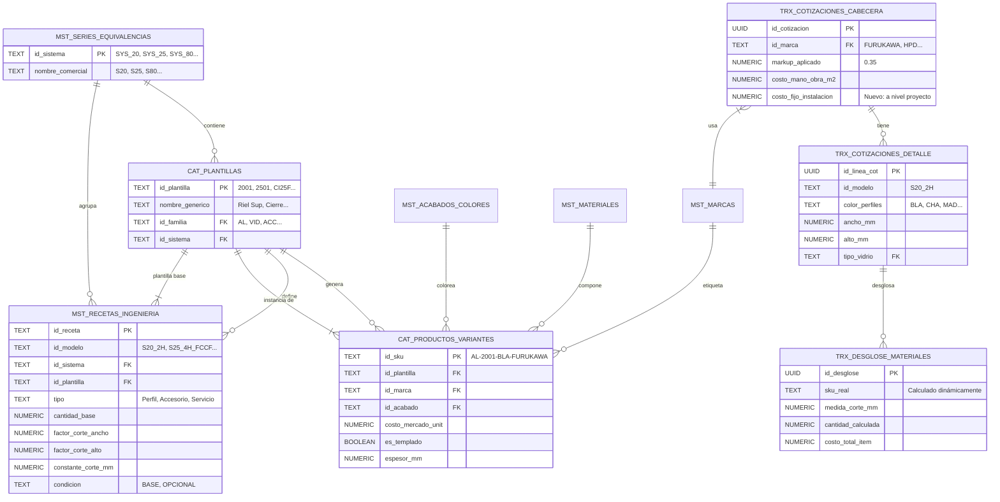

# Arquitectura del Sistema de Recetas de Cotizaciones

## Tabla de Contenidos
1. [Modelo de Datos](#modelo-de-datos)
2. [Flujo del Despiece Automático](#flujo-del-despiece-automatico)
3. [Fórmulas de SKU Dinámico](#formulas-de-sku-dinamico)
4. [Cálculos de Cantidades y Medidas](#calculos-de-cantidades-y-medidas)
5. [Cálculos de Costos](#calculos-de-costos)
6. [Servicios Especiales](#servicios-especiales)
7. [Vistas y Columnas Virtuales](#vistas-y-columnas-virtuales)

---

## 1. Modelo de Datos



---

## 2. Flujo del Despiece Automático


---

## 3. Fórmulas de SKU Dinámico

El SKU se calcula dinámicamente según el **tipo de componente**:

### 3.1 Para PERFILES (Aluminio)

```
SKU = "AL-" + id_plantilla + "-" + color_perfiles + "-" + id_marca_cotizacion
```

**Ejemplo:**
- Plantilla: `2001` (Riel Superior)
- Color seleccionado: `BLA` (Blanco)
- Marca de cotización: `FURUKAWA`

**Resultado:** `AL-2001-BLA-FURUKAWA`

> [!IMPORTANT]
> Las variables dinámicas son:
> - **Color**: Viene del usuario al crear el ítem (`color_perfiles`)
> - **Marca**: Viene de la cabecera de cotización (`id_marca`)

### 3.2 Para ACCESORIOS

```
SKU = id_material_receta + "-" + id_plantilla + "-" + id_acabado_receta + "-" + id_marca_receta
```

**Ejemplo:**
- Material: `GEN` (Genérico, no aplica material específico)
- Plantilla: `CI25F` (Cierre tipo F)
- Acabado: `GEN`
- Marca: `GEN`

**Resultado:** `GEN-CI25F-GEN-GEN`

> [!NOTE]
> Los accesorios usan valores fijos de la receta (`id_acabado_receta`, `id_marca_receta`) porque no cambian con el proyecto. Solo los perfiles varían por marca y color.

### 3.3 Implementación en PostgreSQL

```sql
CREATE OR REPLACE FUNCTION fn_calcular_sku_real(
    p_tipo TEXT,              -- 'Perfil' o 'Accesorio'
    p_id_plantilla TEXT,      -- '2001', 'CI25F', etc.
    p_color_perfiles TEXT,    -- 'BLA', 'CHA', etc. (del usuario)
    p_id_marca_cot TEXT,      -- 'FURUKAWA', 'HPD' (de la cabecera)
    p_id_material_receta TEXT,-- 'AL', 'GEN' (de la receta)
    p_id_acabado_receta TEXT, -- 'GEN' o NULL (de la receta)
    p_id_marca_receta TEXT    -- 'GEN' o NULL (de la receta)
) RETURNS TEXT AS $$
BEGIN
    IF p_tipo = 'Perfil' THEN
        -- SKU dinámico: varía por color y marca del proyecto
        RETURN 'AL-' || p_id_plantilla || '-' || p_color_perfiles || '-' || p_id_marca_cot;
    ELSE
        -- SKU fijo: usa valores de la receta
        RETURN COALESCE(p_id_material_receta, 'AC') || '-' || 
               p_id_plantilla || '-' || 
               COALESCE(p_id_acabado_receta, 'GEN') || '-' || 
               COALESCE(p_id_marca_receta, 'GEN');
    END IF;
END;
$$ LANGUAGE plpgsql IMMUTABLE;
```

---

## 4. Cálculos de Cantidades y Medidas

### 4.1 Medida de Corte (para Perfiles)

```
Medida_Corte_mm = (Ancho × factor_corte_ancho) + (Alto × factor_corte_alto) + constante_corte_mm
```

**Ejemplos de tu data:**

| Componente | Factor Ancho | Factor Alto | Constante | Fórmula |
|------------|--------------|-------------|-----------|---------|
| Riel Sup (2001) | 1 | 0 | -12 | `Ancho - 12` |
| Jamba (2009) | 0 | 1 | 0 | `Alto` |
| Zocalo Sup (2004) | 0.5 | 0 | -4 | `(Ancho / 2) - 4` |
| Traslapo (2010) | 0 | 1 | -28 | `Alto - 28` |
| Marco 45° (80501) | 1 | 0 | 0 | `Ancho` (corte a 45°) |

### 4.2 Cantidad Calculada

```
Cantidad = cantidad_base × cantidad_item_usuario
```

**Casos especiales (por área):**

```
Cantidad = (factor_cantidad_ancho × Ancho) + (factor_cantidad_alto × Alto) + (factor_cantidad_area × Área)
```

| Componente | Base | F. Ancho | F. Alto | F. Área | Interpretación |
|------------|------|----------|---------|---------|----------------|
| Felpa (FESYB) | 0 | 0.004 | 0.006 | 0 | Metros lineales por perímetro |
| Silicona (S25) | 0 | 0.002 | 0.004 | 0 | Consumo proporcional |
| Acc. por m² (ACCM2) | 0 | 0 | 0 | 0.000001 | Proporcional al área |

---

## 5. Cálculos de Costos

### 5.1 Costo por Componente

```
Costo_Total_Item = Cantidad_Calculada × Costo_Unitario_SKU
```

Donde `Costo_Unitario_SKU` viene de `cat_productos_variantes.costo_mercado_unit`.

### 5.2 Costo Total de la Línea

```sql
SELECT SUM(costo_total_item) FROM trx_desglose_materiales WHERE id_linea_cot = ?
```

### 5.3 Precio de Venta (con Markup)

```
Precio_Venta_Linea = Costo_Total_Materiales × (1 + Markup)
```

### 5.4 Total con IGV

```
Total_Final = Subtotal_Venta × (1 + IGV)
```

---

## 6. Servicios Especiales

### 6.1 Vidrio

- **Tipo**: `Vidrio`
- **Cantidad**: `(Ancho × Alto) / 1,000,000` (metros cuadrados)
- **SKU**: El usuario selecciona directamente de `cat_productos_variantes` filtrado por familia VID
- **Costo**: `Área_m2 × Costo_Unitario_Vidrio`

### 6.2 Flete de Templado (Condicional)

- **Condición**: Solo si el vidrio tiene `es_templado = TRUE`
- **SKU Dinámico**:
  - Espesor ≤ 6mm → `SER-FLETE-06MM`
  - Espesor ≤ 8mm → `SER-FLETE-08MM`
  - Espesor > 8mm → `SER-FLETE-10MM`
- **Costo**: `Área_m2 × Costo_Flete_SKU`

### 6.3 Mano de Obra (por m²)

- **Condición**: `costo_mano_obra_m2 > 0` en la cabecera
- **Costo**: `Área_m2 × costo_mano_obra_m2`

### 6.4 Servicios de Instalación (Fijo por Proyecto)

- **Ubicación**: Campo en `trx_cotizaciones_cabecera`
- **Descripción**: "Embalaje, Flete a obra, Movilidad, Viáticos"
- **Costo**: Monto fijo definido manualmente por el usuario PARA TODA LA COTIZACIÓN (no por ítem)

---

## 7. Vistas y Columnas Virtuales

### 7.1 Vista de Detalle (`vw_cotizaciones_detalladas`)

```sql
SELECT 
    d.*,
    -- Costo de materiales (suma del desglose)
    (SELECT SUM(costo_total_item) FROM trx_desglose_materiales WHERE id_linea_cot = d.id_linea_cot) as _costo_materiales,
    
    -- Precio unitario con markup
    _costo_materiales * (1 + c.markup_aplicado) as _vc_precio_unit_oferta,
    
    -- Subtotal línea
    _vc_precio_unit_oferta * d.cantidad as _vc_subtotal_linea
FROM trx_cotizaciones_detalle d
JOIN trx_cotizaciones_cabecera c ON d.id_cotizacion = c.id_cotizacion;
```

### 7.2 Vista de Totales (`vw_cotizaciones_totales`)

```sql
SELECT 
    c.*,
    -- Suma de costos directos
    SUM(_costo_materiales) as _vc_total_costo_materiales,
    
    -- Subtotal venta (suma de líneas)
    SUM(_vc_subtotal_linea) + COALESCE(c.costo_fijo_instalacion, 0) as _vc_subtotal_venta,
    
    -- IGV
    _vc_subtotal_venta * (SELECT igv FROM mst_config_general) as _vc_monto_igv,
    
    -- Total final
    _vc_subtotal_venta * (1 + igv) as _vc_precio_final_cliente
FROM trx_cotizaciones_cabecera c
JOIN vw_cotizaciones_detalladas d ON c.id_cotizacion = d.id_cotizacion
GROUP BY c.id_cotizacion;
```

---

## 8. Lo que Falta por Hacer

### 8.1 Cambios de Base de Datos

1. **Mover `costo_fijo_instalacion`** de `trx_cotizaciones_detalle` a `trx_cotizaciones_cabecera`
2. **Agregar columna `id_sistema`** a `mst_recetas_ingenieria` (ya hecho en sprint3)
3. **Insertar nuevas recetas** con los datos proporcionados
4. **Actualizar las vistas** para incluir el costo fijo en los totales

### 8.2 Datos Maestros Requeridos

1. **CAT_PLANTILLAS**: Verificar que existan todas las plantillas referenciadas (2001, 2002, 2501, CI25F, FESYB, etc.)
2. **CAT_PRODUCTOS_VARIANTES**: Crear SKUs para todas las combinaciones:
   - Para cada plantilla de perfil × cada color × cada marca
   - Para cada accesorio genérico
3. **MST_SERIES_EQUIVALENCIAS**: Verificar que existan los sistemas (SYS_20, SYS_25, SYS_3825, SYS_42, SYS_62, SYS_80, SYS_GEN)

### 8.3 Cambios de UI

1. **cotizacion-item-dialog.tsx**: El campo de costo fijo de instalación NO debe estar aquí
2. **cotizacion-detail.tsx**: Agregar campo de costo fijo de instalación en el panel de cabecera (información general)
