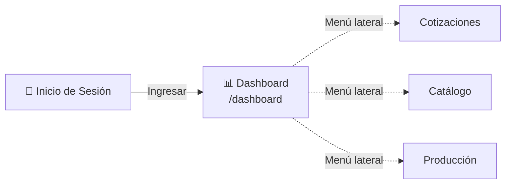
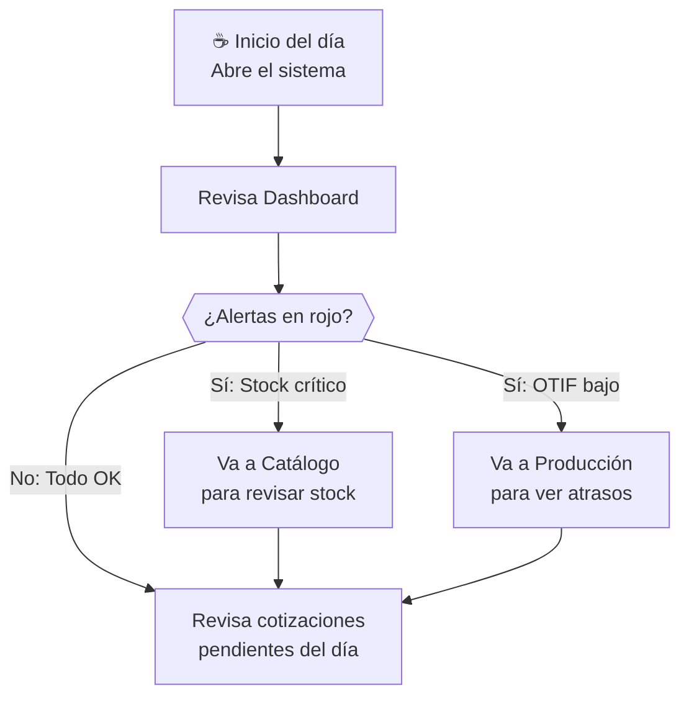

# T01 — Tutorial: Dashboard KPI

> **Módulo:** Dashboard  
> **Ruta en la app:** `/dashboard` (página de inicio al ingresar)  
> **Rol requerido:** ADMIN, SECRETARIA, OPERARIO (todos pueden verlo)  
> **Última actualización:** Febrero 2026  

---

## 📋 ¿Qué es el Dashboard?

El Dashboard es la **pantalla principal** del sistema. Es lo primero que ves al iniciar sesión. Muestra un resumen en tiempo real del estado completo del negocio: ventas, inventario y producción — todo en un solo lugar, sin necesidad de entrar a cada módulo.

> **💡 Piénsalo así:** Es como el tablero de un auto. De un vistazo ves la velocidad (ventas), el combustible (stock) y el motor (producción).

---

## 🗺️ ¿Dónde está?



Al ingresar al sistema, el Dashboard aparece automáticamente. También puedes acceder desde el **menú lateral izquierdo** → icono de gráfico de barras 📊.

---

## 🖥️ Anatomía del Dashboard

```
┌─────────────────────────────────────────────────────────┐
│  MENÚ LATERAL   │             HEADER                     │
│  📊 Dashboard   │  Sistema ERP · Vidriería               │
│  📝 Cotizaciones│                                        │
│  📦 Catálogo    ├────────────────────────────────────────│
│  📥 Entradas    │  TARJETAS KPI (fila 1)                 │
│  📤 Salidas     │  [Total Cotiz] [Aprobadas] [Rechazadas]│
│  📒 Kardex      │  [Valor Stock] [OTIF]      [Conversión]│
│                 ├────────────────────────────────────────│
│  🔧 Recetas     │  GRÁFICOS (fila 2)                     │
│  🏭 Producción  │  [Cotiz/Mes]  │  [Distribución ABC]    │
│  📊 Exportar    ├────────────────────────────────────────│
│  ⚙️ Config      │  TABLAS RÁPIDAS (fila 3)               │
│                 │  [Top Productos]  [Stock Crítico]       │
└─────────────────────────────────────────────────────────┘
```

---

## 📊 Sección 1: Tarjetas KPI

Las **tarjetas KPI** (Key Performance Indicators) son los recuadros de colores en la parte superior. Cada una muestra un número clave del negocio.

| Tarjeta | Qué mide | Cómo interpretarla |
|---------|----------|-------------------|
| **Total Cotizaciones** | Cantidad de cotizaciones del período | Mayor = más trabajo comercial |
| **Cotizaciones Aprobadas** | Las que el cliente aceptó | Mayor = más ventas cerradas |
| **Tasa de Conversión** | % de cotizaciones que se aprobaron | Meta: >40% es buena performance |
| **Valor del Inventario** | Suma del costo de todo el stock | Control de capital inmovilizado |
| **OTIF** | Entregas a tiempo y completas | Meta: >90% es excelente |
| **Stock en Alerta** | Productos bajo el mínimo | Menor = mejor gestión de compras |

### 🔍 Filtro de Período

En la esquina superior derecha del Dashboard encontrarás botones para filtrar los datos:

```
[ Último Mes ]  [ Trimestre ]  [ Año ]
```

| Botón | Período que muestra |
|-------|-------------------|
| **Último Mes** | Los últimos 30 días |
| **Trimestre** | Los últimos 90 días |
| **Año** | Los últimos 365 días |

> **⚠️ Importante:** El filtro solo afecta a las tarjetas de Cotizaciones. El valor del stock siempre es en tiempo real.

---

## 📈 Sección 2: Gráficos

### Gráfico 1 — Cotizaciones por Mes (Barras)

```
S/ 45,000 │    ████
S/ 40,000 │    ████  ████
S/ 35,000 │    ████  ████  ████
S/ 30,000 │ ████  ████  ████  ████
          └─ Oct   Nov   Dic   Ene
              Cotizaciones enviadas por mes
```

- **Barras azules:** Valor total de cotizaciones enviadas
- **Barras verdes:** Valor de cotizaciones aprobadas
- **Al pasar el mouse** sobre cada barra: muestra el número exacto y cantidad de cotizaciones

### Gráfico 2 — Distribución ABC del Stock (Circular)

```
        ████ A (20% productos = 80% valor)
      ██████ B (30% productos = 15% valor)  
     ███████ C (50% productos = 5% valor)
```

| Categoría | Qué significa | Acción recomendada |
|-----------|---------------|-------------------|
| **A (Rojo)** | Productos de alto valor, pocos SKUs | Priorizar reposición, controlar stock |
| **B (Amarillo)** | Valor y cantidad medios | Monitoreo regular |
| **C (Verde)** | Muchos productos, poco valor | Comprar en menor frecuencia |

---

## 📋 Sección 3: Tablas de Alerta Rápida

### Tabla: Top Productos por Valor

Muestra los productos que representan mayor inversión en inventario. Si alguno llega a cero, es una alerta crítica de reposición.

| Columna | Qué significa |
|---------|--------------|
| SKU | Código único del producto |
| Descripción | Nombre del perfil/vidrio/accesorio |
| Stock Actual | Unidades en almacén ahora mismo |
| Valor Total | Stock × Costo Promedio |
| Clase | A, B o C según análisis ABC |

### Tabla: Productos en Estado Crítico

Lista de productos donde el stock está por debajo del mínimo configurado. **Estos productos necesitan reposición urgente.**

| Columna | Qué significa |
|---------|--------------|
| SKU | Código del producto |
| Stock Actual | Lo que hay en almacén |
| Stock Mínimo | Lo que debería haber como mínimo |
| Diferencia | Cuánto falta para llegar al mínimo |
| Estado | 🟡 Alerta / 🔴 Crítico |

---

## 🔘 Botones y Acciones del Dashboard

| Elemento | Ubicación | Qué hace |
|----------|-----------|----------|
| **Filtro de período** | Esquina superior derecha | Cambia el rango de fechas de los KPIs |
| **Click en tarjeta KPI** | Tarjetas superiores | En algunos casos abre el módulo correspondiente |
| **Hover en gráfico** | Barras o sectores | Muestra tooltip con detalle exacto |
| **Click en fila de tabla** | Tablas inferiores | Navega al detalle del producto o cotización |
| **🔄 Actualizar** | (automático) | Los datos se actualizan al volver a esta página |

---

## 💡 Flujo Típico de Uso Diario



---

## ❓ Preguntas Frecuentes

**¿Por qué los datos parecen desactualizados?**
> El Dashboard se actualiza automáticamente al cargar la página. Si ves datos viejos, presiona F5 (recargar) en el navegador.

**¿Por qué la Tasa de Conversión está en 0%?**
> Si no hay cotizaciones aprobadas en el período seleccionado, la tasa es 0%. Prueba cambiar el filtro a "Año".

**¿El Dashboard muestra datos en tiempo real?**
> Sí. Cada vez que alguien registra una entrada, cotización o movimiento, los datos del Dashboard se actualizan al recargar.

**¿Puedo exportar el Dashboard a Excel?**
> El Dashboard en sí no se exporta. Para exportar datos ve al módulo **Exportador Excel** (`/export`). Ver [T10_TUTORIAL_EXPORTADOR.md](./T10_TUTORIAL_EXPORTADOR.md).

---

## ⚠️ Errores Comunes y Soluciones

| Error / Situación | Causa | Solución |
|-------------------|-------|----------|
| Tarjetas muestran 0 | Sin datos en el período | Cambiar filtro a "Año" |
| Gráfico no carga | Conexión a Supabase | Verificar internet y recargar |
| Stock en rojo siempre | Stock mínimo muy alto configurado | Ir a Catálogo → ajustar stock mínimo del producto |
| No veo el dashboard | Sin permiso de sesión | Cerrar sesión y volver a ingresar |

---

## 🔗 Documentos Relacionados

- [T02_TUTORIAL_COTIZACIONES.md](./T02_TUTORIAL_COTIZACIONES.md) — Cómo gestionar cotizaciones
- [T03_TUTORIAL_CATALOGO.md](./T03_TUTORIAL_CATALOGO.md) — Cómo interpretar el stock y el catálogo de SKUs
- [T09_TUTORIAL_PRODUCCION.md](./T09_TUTORIAL_PRODUCCION.md) — Cómo gestionar el Kanban
- [03_MODULOS_Y_FUNCIONALIDADES.md](../03_MODULOS_Y_FUNCIONALIDADES.md) — Referencia técnica de módulos
