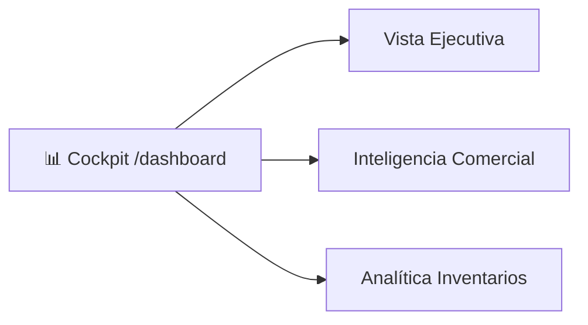

# T01 — Tutorial: Cockpit MTO (Dashboard)

> **Módulo:** Cockpit MTO (Dashboard)  
> **Ruta en la app:** `/dashboard`  
> **Rol requerido:** ADMIN, GERENTE (Acceso total)  
> **Última actualización:** Febrero 2026  

---

## 🎯 ¿Qué es el Cockpit MTO?

El **Cockpit MTO (Make-To-Order)** es el tablero principal de Inteligencia Operativa y Control de Producción del sistema. No es solo un resumen gráfico, sino una herramienta de toma de decisiones dividida en tres grandes dimensiones: **Ejecutiva, Comercial y Analítica de Inventario**.

---

## 🧭 Navegación del Cockpit

El panel está dividido por pestañas laterales (o superiores en móviles) que cambian el enfoque de los indicadores gráficos:

---

## 📈 1. Vista Ejecutiva (Valorización & KPIs)

Esta vista ofrece el **estado financiero y el nivel de servicio**.

### 📊 KPIs Principales:
| Indicador | Qué mide | Cómo se calcula |
|-----------|----------|-----------------|
| **Valor Total Inventario** | El capital inmovilizado en la empresa | Σ (Stock Actual × Costo PMP) de todos los SKUs |
| **Nivel de Servicio (OTIF)** | *On-Time In-Full*. Puntualidad de entrega | % de Pedidos entregados A TIEMPO y COMPLETOS |
| **Materiales Críticos** | Riesgo de parar producción | Cantidad de SKUs cuyo Stock Actual ≤ Stock Mínimo |
| **Total Items (SKUs)** | Tamaño de la maestría de materiales | Total de productos/SKUs registrados |

### 📉 Gráficos:
1. **Histórico de Cumplimiento (OTIF)**: Evolución mensual de tu puntualidad. Barras verdes (>90%) y amarillas (<90%).
2. **Margen de Contribución**: Ventas vs Costos Directos del mes actual.

> **💡 Tip de Moneda:** En la parte superior derecha de esta vista puedes alternar **[ PEN | USD ]** para ver tu valorización total convertida automáticamente según tu tipo de cambio configurado.

---

## 🤝 2. Inteligencia Comercial (Ventas & Márgenes)

Métricas reales de eficiencia en ventas y la salud de tus proyectos.

### 📊 KPIs Principales:
| Indicador | Qué mide |
|-----------|----------|
| **Tasa de Conversión** | % de las Cotizaciones que fueron Aprobadas vs el total emitido. |
| **Ticket Promedio** | El tamaño monetario típico de un proyecto cerrado (S/). |
| **Margen Promedio** | Utilidad Bruta Real promedio (Diferencia de Precio de Venta vs Costos Directos). |
| **Ciclo de Venta** | Días promedio desde que emites una cotización hasta que el cliente la aprueba. |

### 📉 Gráficos:
1. **Top Sistemas Vendidos**: Gráfico de barras horizontal («Vacas Lecheras») acumulando el volumen de ventas por Modelo de producto.
2. **Estado de Cotizaciones (Embudo)**: Gráfico de pastel mostrando proporción de proyectos en estatus "Ganadas", "Perdidas" o "Pendientes".

---

## 📦 3. Analítica de Inventarios (Quiebres & Pareto)

Esta vista se centra en la "salud" de tu almacén: detectar faltantes urgentes y descubrir capital estancado.

### 🚨 Monitor de Quiebres (La "Lista Roja")
Tabla en tiempo real que lista los SKUs cuyo **Stock Actual** llegó al límite o a cero.
- Muestra el nombre, el stock disponible (en rojo) y el **Punto de Reorden (ROP)** sugerido.

### 🧟‍♂️ Inventario Zombie
Muestra tu "capital estancado".
- Lista los productos que **tienen stock físico** pero que **no han tenido ninguna salida** en los últimos 90 días. Se ordena mostrando primero los de mayor impacto económico. (Obliga a realizar liquidaciones o promociones).

### 💎 Tesoro Oculto (Retazos)
Calcula el valor económico que tienes "tirado" en la zona de despuntes.
- Muestra el **Valor Económico Recuperable** en Soles de las piezas útiles.
- Contabiliza cantidad de trozos y los Metros Lineales totales que suman.

### 📊 Análisis de Pareto (Curva ABC)
Gráfico interactivo crítico para la estrategia de abastecimiento.
- Puedes clasificar los materiales por su peso en el **Consumo** (movimiento histórico) o en el **Valor Actual** (el stock detenido).
- Filtra por [90d], [180d], [1 año] o [Total].
- **Clase A (Azul oscuro):** ~80% del valor.
- **Clase B (Celeste):** ~15% del valor.
- **Clase C (Gris):** ~5% del valor.

---

## 🔗 Documentos Relacionados

- [T02_TUTORIAL_COTIZACIONES.md](./T02_TUTORIAL_COTIZACIONES.md) — Para entender cómo afecta la Tasa de Conversión.
- [T03_TUTORIAL_CATALOGO.md](./T03_TUTORIAL_CATALOGO.md) — Dónde modificar el Stock Mínimo para el Monitor de Quiebres.
- [T09_TUTORIAL_PRODUCCION.md](./T09_TUTORIAL_PRODUCCION.md) — Dónde se determina el indicador de puntualidad (OTIF).
