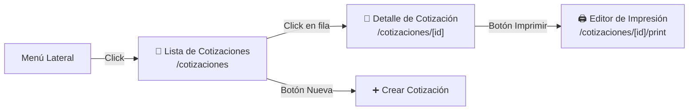
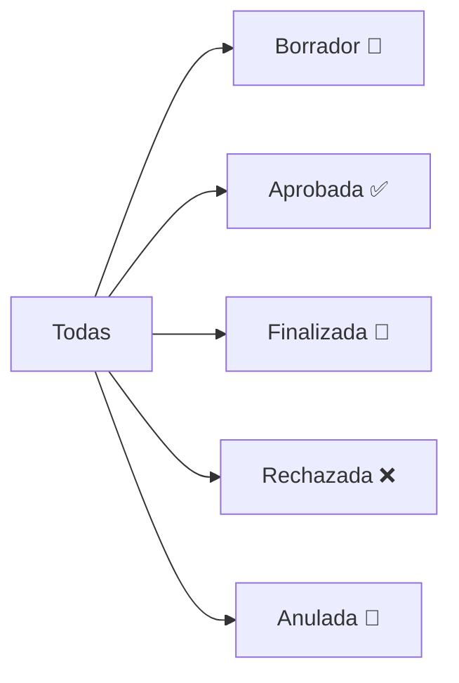
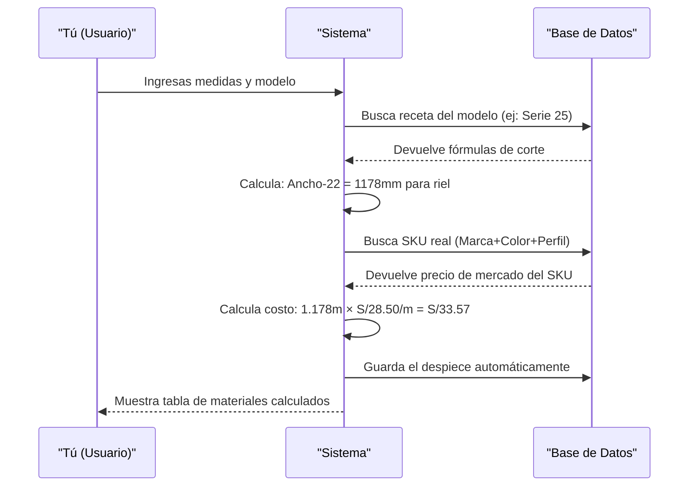
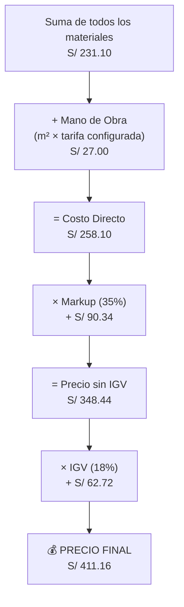
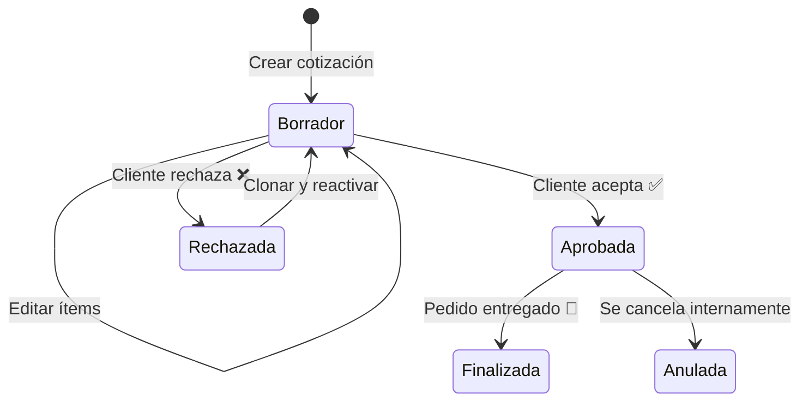
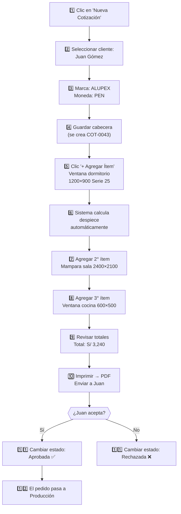

# T02 — Tutorial: Cotizaciones

> **Módulo:** Cotizaciones  
> **Ruta en la app:** `/cotizaciones` y `/cotizaciones/[id]`  
> **Rol requerido:** ADMIN, SECRETARIA (edición); OPERARIO (solo lectura)  
> **Última actualización:** Febrero 2026  

---

## 📋 ¿Qué es el módulo de Cotizaciones?

Las cotizaciones son **presupuestos que envías a tus clientes** antes de fabricar una ventana, mampara u otro producto de aluminio. Este módulo te permite:

- Crear cotizaciones con múltiples ítems (ventanas, mamparas, etc.)
- Calcular automáticamente cuántos perfiles, vidrios y accesorios necesitas (**despiece automático**)
- Llevar control del estado (Borrador → Aprobada / Rechazada)
- Imprimir en PDF para enviar al cliente

> **🏭 Contexto de negocio:** Una cotización típica puede tener 5 ventanas de diferentes medidas. El sistema calcula el costo exacto de cada una usando las recetas de ingeniería configuradas.

---

## 🗺️ Dónde está y cómo navegar



---

## 📄 PARTE 1: Lista de Cotizaciones (`/cotizaciones`)

### Vista General de la Lista

Al abrir Cotizaciones verás una tabla con todas las cotizaciones del sistema:

```
┌─────┬──────────┬───────────────┬──────────┬───────────┬──────────┬────────┐
│  #  │ Número   │ Cliente       │ Moneda   │ Total     │ Estado   │Acciones│
├─────┼──────────┼───────────────┼──────────┼───────────┼──────────┼────────┤
│  1  │ COT-0042 │ Juan Gómez    │ PEN (S/) │ S/ 2,450  │ Borrador │ 👁️ ✏️ │
│  2  │ COT-0041 │ Empresa SAC   │ USD ($)  │ $ 1,200   │ Aprobada │ 👁️    │
│  3  │ COT-0040 │ María López   │ PEN (S/) │ S/ 890    │ Rechazada│ 👁️    │
└─────┴──────────┴───────────────┴──────────┴───────────┴──────────┴────────┘
```

### Botones de la Lista

| Botón / Elemento | Icono | Qué hace |
|-----------------|-------|----------|
| **Nueva Cotización** | ➕ | Abre formulario para crear cotización nueva |
| **Filtro de Estado** | 📂 | Filtra: Todas / Borrador / Aprobada / Finalizada / Rechazada / Anulada |
| **Ver detalle** | 👁️ | Abre el detalle completo de la cotización |
| **Editar** | ✏️ | Solo aparece en estado Borrador |
| **Click en fila** | — | Abre el detalle de esa cotización |

### Filtros de Estado



| Estado | Color | Significado | Puede editarse |
|--------|-------|-------------|----------------|
| **Borrador** | Gris/Azul | En preparación, no enviada aún | ✅ Sí |
| **Aprobada** | Verde | Cliente aceptó el presupuesto | ❌ No |
| **Finalizada** | Azul | Pedido completado y entregado | ❌ No |
| **Rechazada** | Rojo | Cliente rechazó el presupuesto | ❌ No |
| **Anulada** | Naranja | Se canceló internamente | ❌ No |

---

## ➕ PARTE 2: Crear una Nueva Cotización

### Paso 1: Abrir el formulario

Haz clic en el botón **"Nueva Cotización"** (➕) en la esquina superior derecha de la lista.

### Paso 2: Cabecera de la Cotización

Se abre un formulario con los datos generales:

```
┌─────────────────────────────────────────────────────┐
│  NUEVA COTIZACIÓN                                   │
├─────────────────────────────────────────────────────│
│  Cliente: [Buscar cliente...]          [+ Nuevo]    │
│  Marca:   [ALUVID / ALUPEX / ...]      (lista)      │
│  Moneda:  ● PEN (Soles)  ○ USD (Dólares)            │
│  Validez: 15 días (configurable)                    │
│  Costo Fijo Inst.: [ S/ 150.00 ] (flete/embalaje)   │
│  Términos Pers.:   [ Condiciones de venta... ]      │
│  Título Doc:       [ Cotización Especial ]          │
│  Notas:   [Texto libre...]                          │
│                                          [Guardar]  │
└─────────────────────────────────────────────────────┘
```

| Campo | Obligatorio | Qué ingresar |
|-------|-------------|-------------|
| **Cliente** | ✅ Sí | Busca por nombre. Si no existe, créalo con "+ Nuevo" |
| **Marca** | ✅ Sí | La marca de aluminio del cliente (afecta qué SKUs se usan) |
| **Moneda** | ✅ Sí | Soles (PEN) o Dólares (USD). Afecta cómo se muestran los precios |
| **Tipo de Cambio** | Solo si USD | Rate PEN/USD para conversiones |
| **Validez** | ✅ Sí | Días que es válida la cotización (default: 15) |
| **Costo Fijo Inst.** | ❌ No | Monto para instalación general, flete de equipo o embalajes |
| **Términos Pers.** | ❌ No | Cláusulas redactadas específicamente para este cliente |
| **Título Doc.** | ❌ No | Título alternativo ("Presupuesto Proforma", etc.) para el PDF |
| **Notas** | ❌ No | Observaciones internas o para el cliente |

> **⚠️ Sobre la Marca:** La marca seleccionada aquí determina qué perfiles de aluminio se usan en el despiece. Si seleccionas "ALUVID", el sistema usará los SKUs de esa marca. Esto es crítico para que los costos sean correctos.

### Paso 3: Guardar la cabecera

Al hacer clic en **"Guardar"**, se crea la cotización en estado **Borrador** y se abre el detalle donde podrás agregar ítems.

---

## 📄 PARTE 3: Detalle de Cotización — Agregar Ítems

### Vista del Detalle

```
┌─────────────────────────────────────────────────────────────────┐
│  COT-0042 │ Juan Gómez │ PEN │ Estado: BORRADOR                │
│  [Imprimir] [Cambiar Estado ▼] [Clonar] [Exportar Excel]       │
├─────────────────────────────────────────────────────────────────│
│  ÍTEMS DE LA COTIZACIÓN                    [+ Agregar Ítem]    │
│  ┌────┬──────────────┬────────┬────────┬─────────┬──────────┐  │
│  │ #  │ Descripción  │ Medidas│ Modelo │  Total  │ Acciones │  │
│  ├────┼──────────────┼────────┼────────┼─────────┼──────────┤  │
│  │ 1  │ Ventana Corr │2000×150│ Ser 25 │ S/645   │ 👁️ ✏️ 🗑️│  │
│  └────┴──────────────┴────────┴────────┴─────────┴──────────┘  │
├─────────────────────────────────────────────────────────────────│
│  TOTALES                                                        │
│  Subtotal Materiales:    S/ 545.20                              │
│  Mano de Obra:           S/  99.80                              │
│  Costo Directo:          S/ 645.00                              │
│  Markup (35%):           S/ 225.75                              │
│  Subtotal sin IGV:       S/ 870.75                              │
│  IGV (18%):              S/ 156.74                              │
│  ════════════════════════════════                               │
│  TOTAL FINAL:            S/ 1,027.49                            │
└─────────────────────────────────────────────────────────────────┘
```

### Botones del Detalle

| Botón | Qué hace |
|-------|----------|
| **🖨️ Imprimir** | Abre el editor de impresión para generar PDF |
| **Cambiar Estado ▼** | Menú desplegable: Aprobar / Rechazar / Anular |
| **🔄 Clonar** | Crea una copia exacta de esta cotización en estado Borrador |
| **📊 Exportar Excel** | Descarga la cotización en formato XLSX |
| **➕ Agregar Ítem** | Abre el formulario para añadir una ventana/mampara |
| **👁️ Ver despiece** | Muestra el desglose de materiales del ítem |
| **✏️ Editar ítem** | Modifica las dimensiones o modelo del ítem |
| **🗑️ Eliminar ítem** | Borra el ítem y su despiece (no se puede deshacer) |

---

## ➕ PARTE 4: Agregar un Ítem (Ventana/Mampara)

Haz clic en **"+ Agregar Ítem"**. Se abre un diálogo con este formulario:

```
┌─────────────────────────────────────────────────────┐
│  NUEVO ÍTEM                                         │
├─────────────────────────────────────────────────────│
│  Descripción:  [Ventana Corrediza Baño]    (texto)  │
│  Modelo:       [Serie 25 - 2 hojas ▼]     (lista)   │
│  Ancho (mm):   [ 1200 ]                             │
│  Alto (mm):    [  900 ]                             │
│  Cantidad:     [    1 ]                             │
│  Acabado/Color:[Natural ▼]                (lista)   │
│  Tipo de Cierre: [Cierre lateral c/llave] (lista)   │
│  Tipo de Vidrio: [Laminado 6mm Incoloro]  (lista)   │
│  Grupo Opciones: [Opciones avanzadas...]            │
│  Opciones Adic.: [Factor Flete: 5%]                 │
│  [x] Es despiece manual (ignorar auto)              │
│  [Cancelar]                        [Guardar y Calcular] │
└─────────────────────────────────────────────────────┘
```

| Campo | Obligatorio | Cómo llenarlo |
|-------|-------------|--------------|
| **Descripción** | ✅ | Nombre libre del ítem (ej: "Ventana dormitorio principal") |
| **Modelo** | ✅ | Elige el tipo de ventana de las recetas configuradas |
| **Ancho (mm)** | ✅ | Ancho en milímetros. Ej: 1200 = 1.20 metros |
| **Alto (mm)** | ✅ | Alto en milímetros. Ej: 900 = 90 centímetros |
| **Cantidad** | ✅ | Cuántas ventanas iguales necesita el cliente |
| **Acabado/Color** | ✅ | Color del aluminio (Natural, Champagne, Bronze, etc.) |
| **Tipo Cierre** | ❌ | Accesorio de cierre o chapa que usa la hoja |
| **Tipo Vidrio** | ❌ | Variación del vidrio; puede cruzarse con las opciones |
| **Grupo de Op.** | ❌ | Selección de un template de opciones y variables de la ventana |
| **Opciones Adic.** | ❌ | Configurado como JSON, sirve p. ej. para el Flete (`factor_flete`) |
| **Despiece Manual** | — | Marca si quieres despiezarlo 100% manual sin usar las recetas |

> **💡 Tip Ancho/Alto:** Siempre ingresa en milímetros. Una ventana de 1.20m × 0.90m se ingresa como **Ancho: 1200** y **Alto: 900**.

### ¿Qué pasa cuando haces clic en "Guardar y Calcular"?



El sistema **calcula automáticamente** todos los materiales. Esto se llama **Despiece Automático** o **BOM (Bill of Materials)**.

---

## 🔩 PARTE 5: El Despiece de Materiales (BOM)

Después de agregar un ítem, puedes ver su despiece haciendo clic en **👁️ Ver despiece**.

### Ejemplo de Despiece de una Ventana 1200×900

```
┌──────────────────────────────────────────────────────────────────┐
│  DESPIECE — Ventana Corrediza Serie 25 — 1200mm × 900mm         │
├────┬──────────────────────┬──────┬────────┬──────────┬──────────┤
│Tipo│ Componente           │ Qty  │Longitud│ P.Unit   │ Total    │
├────┼──────────────────────┼──────┼────────┼──────────┼──────────┤
│ P  │ Riel Superior Ser.25 │  1   │1178 mm │S/25.80/m │  S/30.39 │
│ P  │ Riel Inferior Ser.25 │  1   │1178 mm │S/28.50/m │  S/33.57 │
│ P  │ Jamba Lateral Ser.25 │  2   │ 870 mm │S/22.40/m │  S/38.98 │
│ P  │ Traversa Hoja Ser.25 │  2   │ 570 mm │S/18.60/m │  S/21.22 │
│ V  │ Vidrio Simple 4mm    │  2   │  hoja  │S/48.00/m²│  S/73.44 │
│ A  │ Felpa 6mm            │  1   │  kit   │S/ 8.50   │  S/ 8.50 │
│ A  │ Seguro de ventana    │  1   │  und   │S/12.00   │  S/12.00 │
│ A  │ Jalador aluminio     │  2   │  und   │S/ 6.50   │  S/13.00 │
├────┴──────────────────────┴──────┴────────┴──────────┴──────────┤
│                                    TOTAL MATERIALES: S/ 231.10  │
│                                    + Mano de Obra:   S/  27.00  │
│                                    COSTO DIRECTO:    S/ 258.10  │
└──────────────────────────────────────────────────────────────────┘
  P = Perfil   V = Vidrio   A = Accesorio
```

### ✏️ Editar el Despiece Manualmente

Si necesitas ajustar algún componente (por ejemplo, cambiar la cantidad de un accesorio), haz clic en **"Editar Despiece"**. Puedes:
- Cambiar la cantidad de cualquier componente
- Cambiar el precio unitario
- Agregar componentes que no calculó automáticamente
- Eliminar componentes que no aplican

> **⚠️ Advertencia:** Si editas el despiece manualmente y luego recalculas automáticamente, perderás los cambios manuales.

---

## 💰 PARTE 6: Cómo se Calcula el Precio Final



| Componente | Dónde se configura |
|------------|-------------------|
| **Markup %** | Configuración → Margen de utilidad |
| **IGV %** | Configuración → Tasa IGV (actualmente 18%) |
| **Costo Mano de Obra** | Configuración → Costo MO por m² |
| **Tipo de Cambio** | En la cabecera de cada cotización |

---

## 📋 PARTE 7: Cambiar el Estado de la Cotización

### Ciclo de Estados



### Cómo cambiar el estado

1. Abre el detalle de la cotización
2. Haz clic en el botón **"Cambiar Estado ▼"**
3. Selecciona el nuevo estado del menú:

| Opción | Cuándo usarla |
|--------|--------------|
| **✅ Aprobar** | El cliente confirmó que acepta la propuesta |
| **🚀 Finalizar** | El proyecto está terminado, cancelado en su totalidad y entregado |
| **❌ Rechazar** | El cliente no acepta (puedes ingresar el motivo) |
| **🚫 Anular** | Se cancela por razones internas |

> **💡 Tip Rechazo:** Cuando rechazas, el sistema te pedirá el motivo. Esto es útil para estadísticas: "¿Por qué perdemos cotizaciones? ¿Precio? ¿Tiempo?" 

---

## 🖨️ PARTE 8: Imprimir / Generar PDF

### Acceder al Editor de Impresión

Desde el detalle de cotización, haz clic en **"🖨️ Imprimir"**.

### Los 3 Temas Disponibles

| Tema | Estilo | Cuándo usarlo |
|------|--------|--------------|
| **Moderno** | Colores vivos, diseño contemporáneo | Clientes corporativos |
| **Clásico** | Formal, con bordes tradicionales | Clientes conservadores |
| **Minimalista** | Limpio, sin distracciones | Presentaciones ejecutivas |

### Opciones de Personalización

```
┌─────────────────────────────────────────────────────┐
│  EDITOR DE IMPRESIÓN                                │
├─────────────────────────────────────────────────────│
│  Tema: ● Moderno  ○ Clásico  ○ Minimalista          │
│  ☑️ Mostrar logo de la empresa                      │
│  ☑️ Mostrar desglose de materiales                  │
│  ☑️ Mostrar condiciones de pago                     │
│  ☑️ Mostrar datos bancarios                         │
│  ☐  Mostrar precios unitarios por tramo             │
│                                          [Imprimir] │
└─────────────────────────────────────────────────────┘
           VISTA PREVIA ───────────────────────────
           [ La cotización se muestra aquí ]
```

### Cómo Imprimir/Guardar como PDF

1. Selecciona el tema y opciones que deseas
2. Haz clic en **"Imprimir"**
3. Se abre el diálogo de impresión del navegador
4. En **Destino**, selecciona **"Guardar como PDF"**
5. Elige la carpeta y guarda

---

## 🔄 PARTE 9: Clonar una Cotización

Clonar es útil cuando un cliente pide una cotización muy similar a otra que ya hiciste, o cuando quieres reactivar una cotización rechazada con pequeñas diferencias.

**Cómo clonar:**
1. Abre el detalle de la cotización que quieres copiar
2. Haz clic en **"🔄 Clonar"**
3. Se crea una copia completa en estado **Borrador** con número nuevo
4. Puedes editarla libremente sin afectar la original

---

## 📊 PARTE 10: Flujo Completo de Ejemplo

### Caso: Cotización para 3 ventanas de Juan Gómez



---

## ❓ Preguntas Frecuentes

**¿Puedo cambiar el precio de un ítem manualmente?**
> Sí. Entra al despiece del ítem y edita los campos de precio. También puedes modificar el markup directamente desde la vista de totales.

**¿Qué pasa si el modelo que necesito no está en la lista?**
> Necesitas crear la receta del modelo primero. Ve a **Recetas de Ingeniería** → Nuevo Modelo. Ver [T08_TUTORIAL_RECETAS.md](./T08_TUTORIAL_RECETAS.md).

**¿Puedo hacer una cotización en dólares y pasarla a soles?**
> Sí. El sistema muestra siempre el equivalente en ambas monedas usando el tipo de cambio configurado en la cabecera.

**¿Se descuenta el stock cuando apruebo una cotización?**
> No automáticamente. El stock solo se descuenta cuando creas una **Salida** en el módulo de Inventario. Ver [T06_TUTORIAL_SALIDAS.md](./T06_TUTORIAL_SALIDAS.md).

**¿Puedo agregar descuento a la cotización?**
> El markup es ajustable por ítem. Para descuentos, reduce el markup del ítem específico en el formulario de edición.

---

## ⚠️ Errores Comunes y Soluciones

| Situación | Causa probable | Solución |
|-----------|---------------|---------|
| "No hay modelos disponibles" | Sin recetas configuradas para esa marca | Configurar recetas en módulo Recetas |
| Despiece da costo S/0.00 | SKU sin precio de mercado | Actualizar precio en Catálogo |
| No puedo editar la cotización | Estado no es Borrador | Clonar → editar el clon |
| El tipo de cambio no cambia | Campo bloqueado | Solo editable en cabecera de cada cotización |
| Error al guardar ítem | Campo obligatorio vacío | Verificar que Modelo, Ancho y Alto estén llenos |

---

## 🔗 Documentos Relacionados

- [T08_TUTORIAL_RECETAS.md](./T08_TUTORIAL_RECETAS.md) — Cómo configurar modelos y recetas
- [T03_TUTORIAL_CATALOGO.md](./T03_TUTORIAL_CATALOGO.md) — Cómo gestionar productos y precios
- [T09_TUTORIAL_PRODUCCION.md](./T09_TUTORIAL_PRODUCCION.md) — Qué pasa después de aprobar
- [T12_TUTORIAL_CONFIGURACION.md](./T12_TUTORIAL_CONFIGURACION.md) — Configurar markup e IGV
- [10_FLUJOS_DE_NEGOCIO.md](../10_FLUJOS_DE_NEGOCIO.md) — Diagramas técnicos del flujo
