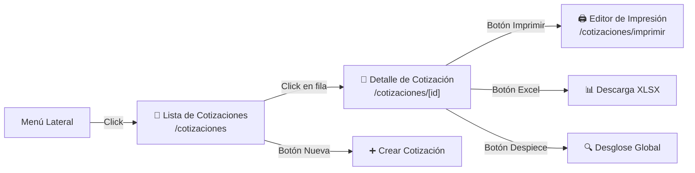
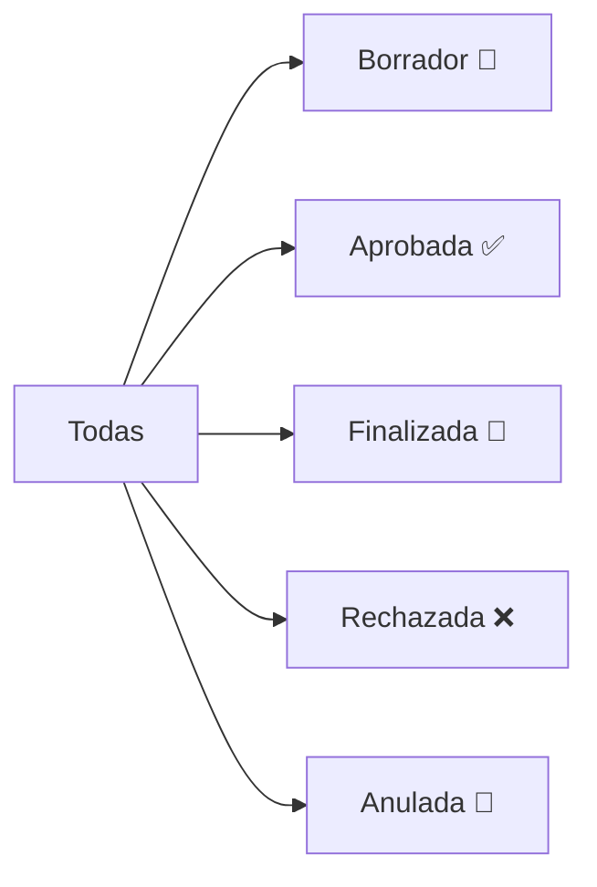
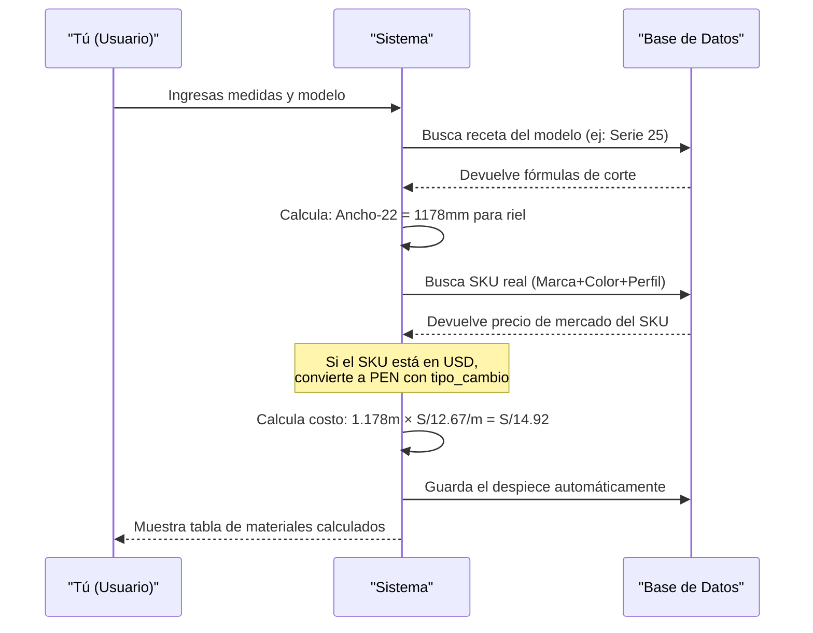
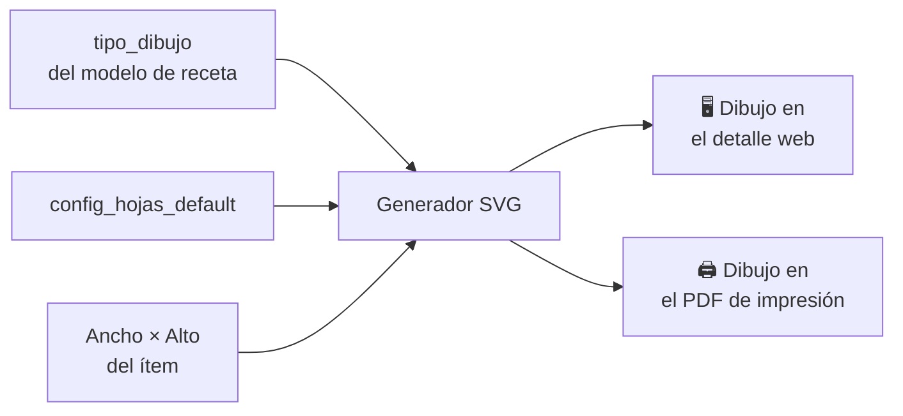
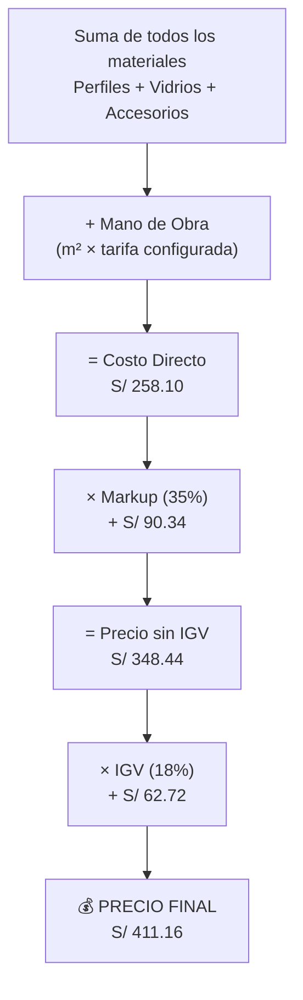
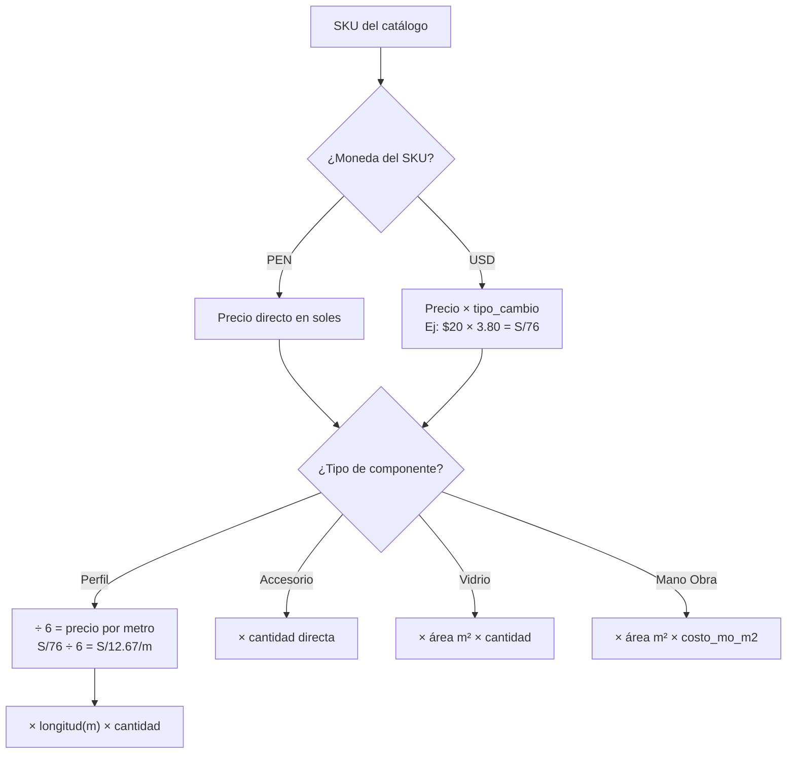
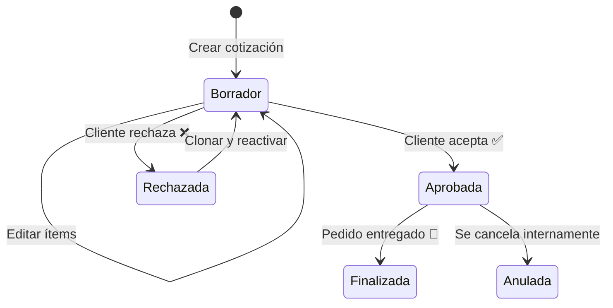
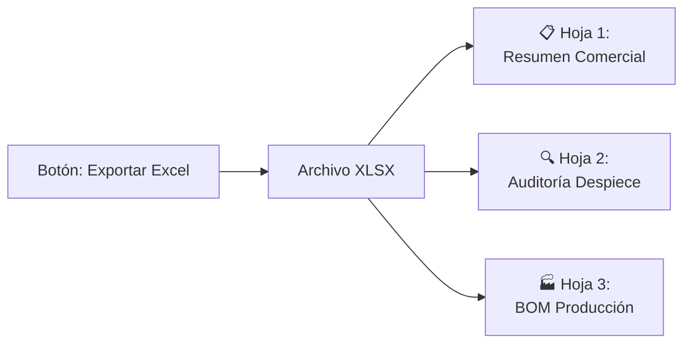
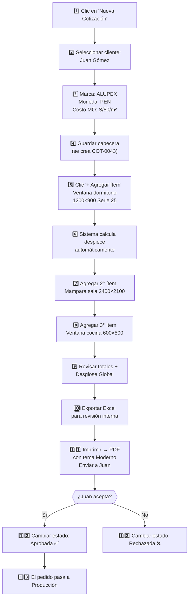

# T02 — Tutorial: Cotizaciones

> **Módulo:** Cotizaciones  
> **Ruta en la app:** `/cotizaciones` y `/cotizaciones/[id]`  
> **Rol requerido:** ADMIN, SECRETARIA (edición); OPERARIO (solo lectura)  
> **Última actualización:** Marzo 2026  

---

## 📋 ¿Qué es el módulo de Cotizaciones?

Las cotizaciones son **presupuestos que envías a tus clientes** antes de fabricar una ventana, mampara u otro producto de aluminio. Este módulo te permite:

- Crear cotizaciones con múltiples ítems (ventanas, mamparas, etc.)
- Calcular automáticamente cuántos perfiles, vidrios y accesorios necesitas (**despiece automático**)
- Llevar control del estado (Borrador → Aprobada / Rechazada)
- Imprimir en PDF con **3 temas visuales** y personalización de colores
- **Exportar a Excel** con fórmulas nativas y desglose completo
- Ver el **Desglose Global** de materiales y costos de todo el proyecto

> **🏭 Contexto de negocio:** Una cotización típica puede tener 5 ventanas de diferentes medidas. El sistema calcula el costo exacto de cada una usando las recetas de ingeniería configuradas.

---

## 🗺️ Dónde está y cómo navegar


```mermaid
graph LR
    MENU["Menú Lateral"] -->|Click| COT_LIST["📝 Lista de Cotizaciones<br/>/cotizaciones"]
    COT_LIST -->|Click en fila| COT_DETAIL["📄 Detalle de Cotización<br/>/cotizaciones/[id]"]
    COT_DETAIL -->|Botón Imprimir| PRINT["🖨️ Editor de Impresión<br/>/cotizaciones/imprimir"]
    COT_DETAIL -->|Botón Excel| EXCEL["📊 Descarga XLSX"]
    COT_DETAIL -->|Botón Despiece| DESG["🔍 Desglose Global"]
    COT_LIST -->|Botón Nueva| NEW_COT["➕ Crear Cotización"]
```

---

## 📄 PARTE 1: Lista de Cotizaciones (`/cotizaciones`)

### Vista General de la Lista

Al abrir Cotizaciones verás una tabla con todas las cotizaciones del sistema:

```
┌─────┬──────────┬───────────────┬──────────┬───────────┬──────────┬────────┐
│  #  │ Número   │ Cliente       │ Moneda   │ Total     │ Estado   │Acciones│
├─────┼──────────┼───────────────┼──────────┼───────────┼──────────┼────────┤
│  1  │ COT-0042 │ Juan Gómez    │ PEN (S/) │ S/ 2,450  │ Borrador │ 👁️ ✏️ │
│  2  │ COT-0041 │ Empresa SAC   │ USD ($)  │ $ 1,200   │ Aprobada │ 👁️    │
│  3  │ COT-0040 │ María López   │ PEN (S/) │ S/ 890    │ Rechazada│ 👁️    │
└─────┴──────────┴───────────────┴──────────┴───────────┴──────────┴────────┘
```

### Botones de la Lista

| Botón / Elemento | Icono | Qué hace |
|-----------------|-------|----------|
| **Nueva Cotización** | ➕ | Abre formulario para crear cotización nueva |
| **Filtro de Estado** | 📂 | Filtra: Todas / Borrador / Aprobada / Finalizada / Rechazada / Anulada |
| **Ver detalle** | 👁️ | Abre el detalle completo de la cotización |
| **Editar** | ✏️ | Solo aparece en estado Borrador |
| **Click en fila** | — | Abre el detalle de esa cotización |

### Filtros de Estado


```mermaid
graph LR
    ALL["Todas"] --> B["Borrador 📝"]
    ALL --> A["Aprobada ✅"]
    ALL --> F["Finalizada 🚀"]
    ALL --> R["Rechazada ❌"]
    ALL --> AN["Anulada 🚫"]
```

| Estado | Color | Significado | Puede editarse |
|--------|-------|-------------|----------------|
| **Borrador** | Gris/Azul | En preparación, no enviada aún | ✅ Sí |
| **Aprobada** | Verde | Cliente aceptó el presupuesto | ❌ No |
| **Finalizada** | Azul | Pedido completado y entregado | ❌ No |
| **Rechazada** | Rojo | Cliente rechazó el presupuesto | ❌ No |
| **Anulada** | Naranja | Se canceló internamente | ❌ No |

---

## ➕ PARTE 2: Crear una Nueva Cotización

### Paso 1: Abrir el formulario

Haz clic en el botón **"Nueva Cotización"** (➕) en la esquina superior derecha de la lista.

### Paso 2: Cabecera de la Cotización

Se abre un formulario con los datos generales:

```
┌─────────────────────────────────────────────────────┐
│  NUEVA COTIZACIÓN                                   │
├─────────────────────────────────────────────────────│
│  Cliente: [Buscar cliente...]          [+ Nuevo]    │
│  Marca:   [ALUVID / ALUPEX / ...]      (lista)      │
│  Moneda:  ● PEN (Soles)  ○ USD (Dólares)            │
│  Tipo Cambio: [ 3.80 ] (solo si USD)                │
│  Validez: 15 días (configurable)                    │
│  Costo Fijo Inst.: [ S/ 150.00 ] (flete/embalaje)   │
│  Costo MO/m²: [ S/ 50.00 ] (mano de obra)          │
│  Términos Pers.:   [ Condiciones de venta... ]      │
│  Título Doc:       [ Cotización Especial ]          │
│  Notas:   [Texto libre...]                          │
│                                          [Guardar]  │
└─────────────────────────────────────────────────────┘
```

| Campo | Obligatorio | Qué ingresar |
|-------|-------------|-------------|
| **Cliente** | ✅ Sí | Busca por nombre. Si no existe, créalo con "+ Nuevo" |
| **Marca** | ✅ Sí | La marca de aluminio del cliente (afecta qué SKUs se usan) |
| **Moneda** | ✅ Sí | Soles (PEN) o Dólares (USD). Afecta cómo se muestran los precios |
| **Tipo de Cambio** | Solo si USD | Rate PEN/USD para conversiones internas |
| **Validez** | ✅ Sí | Días que es válida la cotización (default: 15) |
| **Costo MO/m²** | ❌ No | Tarifa de mano de obra por metro cuadrado de ventana |
| **Costo Fijo Inst.** | ❌ No | Monto para instalación general, flete de equipo o embalajes |
| **Términos Pers.** | ❌ No | Cláusulas redactadas específicamente para este cliente |
| **Título Doc.** | ❌ No | Título alternativo ("Presupuesto Proforma", etc.) para el PDF |
| **Aplica Detracción** | ❌ No | Activa el cálculo de detracción cuando aplica normativamente |
| **Notas** | ❌ No | Observaciones internas o para el cliente |

> **⚠️ Sobre la Marca:** La marca seleccionada aquí determina qué perfiles de aluminio se usan en el despiece. Si seleccionas "ALUVID", el sistema usará los SKUs de esa marca. Esto es crítico para que los costos sean correctos.

> **💡 Sobre el Costo MO/m²:** Este valor se usa para calcular la mano de obra de cada ítem. El sistema calcula el área total de ventana (ancho × alto) y la multiplica por esta tarifa. Si lo dejas en 0, no se cobrará mano de obra.

### Paso 3: Guardar la cabecera

Al hacer clic en **"Guardar"**, se crea la cotización en estado **Borrador** y se abre el detalle donde podrás agregar ítems.

---

## 📄 PARTE 3: Detalle de Cotización — Agregar Ítems

### Vista del Detalle

```
┌─────────────────────────────────────────────────────────────────┐
│  COT-0042 │ Juan Gómez │ PEN │ Estado: BORRADOR                │
│  [Imprimir] [Cambiar Estado ▼] [Clonar] [Exportar Excel]       │
│  [🔍 Desglose Global]                                          │
├─────────────────────────────────────────────────────────────────│
│  ÍTEMS DE LA COTIZACIÓN                    [+ Agregar Ítem]    │
│  ┌────┬──────────────┬────────┬────────┬─────────┬──────────┐  │
│  │ #  │ Descripción  │ Medidas│ Modelo │  Total  │ Acciones │  │
│  ├────┼──────────────┼────────┼────────┼─────────┼──────────┤  │
│  │ 1  │ Ventana Corr │2000×150│ Ser 25 │ S/645   │ 👁️ ✏️ 🗑️│  │
│  └────┴──────────────┴────────┴────────┴─────────┴──────────┘  │
├─────────────────────────────────────────────────────────────────│
│  TOTALES                                                        │
│  Subtotal Materiales:    S/ 545.20                              │
│  Mano de Obra:           S/  99.80                              │
│  Costo Directo:          S/ 645.00                              │
│  Markup (35%):           S/ 225.75                              │
│  Subtotal sin IGV:       S/ 870.75                              │
│  IGV (18%):              S/ 156.74                              │
│  ════════════════════════════════                               │
│  TOTAL FINAL:            S/ 1,027.49                            │
└─────────────────────────────────────────────────────────────────┘
```

### Botones del Detalle

| Botón | Qué hace |
|-------|----------|
| **🖨️ Imprimir** | Abre el editor de impresión para generar PDF |
| **Cambiar Estado ▼** | Menú desplegable: Aprobar / Rechazar / Anular |
| **🔄 Clonar** | Crea una copia exacta de esta cotización en estado Borrador |
| **📊 Exportar Excel** | Descarga archivo XLSX con 3 hojas profesionales |
| **🔍 Desglose Global** | Abre diálogo con todos los materiales del proyecto |
| **➕ Agregar Ítem** | Abre el formulario para añadir una ventana/mampara |
| **👁️ Ver despiece** | Muestra el desglose de materiales del ítem |
| **✏️ Editar ítem** | Modifica las dimensiones o modelo del ítem |
| **🗑️ Eliminar ítem** | Borra el ítem y su despiece (no se puede deshacer) |

---

## ➕ PARTE 4: Agregar un Ítem (Ventana/Mampara)

Haz clic en **"+ Agregar Ítem"**. Se abre un diálogo con este formulario:

```
┌─────────────────────────────────────────────────────┐
│  NUEVO ÍTEM                                         │
├─────────────────────────────────────────────────────│
│  Descripción:  [Ventana Corrediza Baño]    (texto)  │
│  Modelo:       [Serie 25 - 2 hojas ▼]     (lista)   │
│  Ancho (mm):   [ 1200 ]                             │
│  Alto (mm):    [  900 ]                             │
│  Cantidad:     [    1 ]                             │
│  Acabado/Color:[Natural ▼]                (lista)   │
│  Tipo de Cierre: [Cierre lateral c/llave] (lista)   │
│  Tipo de Vidrio: [Laminado 6mm Incoloro]  (lista)   │
│  Grupo Opciones: [Opciones avanzadas...]            │
│  Opciones Adic.: [Factor Flete: 5%]                 │
│  [x] Es despiece manual (ignorar auto)              │
│  [Cancelar]                        [Guardar y Calcular] │
└─────────────────────────────────────────────────────┘
```

| Campo | Obligatorio | Cómo llenarlo |
|-------|-------------|--------------|
| **Descripción** | ✅ | Nombre libre del ítem (ej: "Ventana dormitorio principal") |
| **Modelo** | ✅ | Elige el tipo de ventana de las recetas configuradas |
| **Ancho (mm)** | ✅ | Ancho en milímetros. Ej: 1200 = 1.20 metros |
| **Alto (mm)** | ✅ | Alto en milímetros. Ej: 900 = 90 centímetros |
| **Cantidad** | ✅ | Cuántas ventanas iguales necesita el cliente |
| **Acabado/Color** | ✅ | Color del aluminio (Natural, Champagne, Bronze, etc.) |
| **Tipo Cierre** | ❌ | Accesorio de cierre o chapa que usa la hoja |
| **Tipo Vidrio** | ❌ | Variación del vidrio; puede cruzarse con las opciones |
| **Grupo de Op.** | ❌ | Selección de un template de opciones y variables de la ventana |
| **Opciones Adic.** | ❌ | Configurado como JSON, sirve p. ej. para el Flete (`factor_flete`) |
| **Despiece Manual** | — | Marca si quieres despiezarlo 100% manual sin usar las recetas |

> **💡 Tip Ancho/Alto:** Siempre ingresa en milímetros. Una ventana de 1.20m × 0.90m se ingresa como **Ancho: 1200** y **Alto: 900**.

### ¿Qué pasa cuando haces clic en "Guardar y Calcular"?


```mermaid
sequenceDiagram
    participant U as "Tú (Usuario)"
    participant SYS as "Sistema"
    participant DB as "Base de Datos"

    U->>SYS: Ingresas medidas y modelo
    SYS->>DB: Busca receta del modelo (ej: Serie 25)
    DB-->>SYS: Devuelve fórmulas de corte
    SYS->>SYS: Calcula: Ancho-22 = 1178mm para riel
    SYS->>DB: Busca SKU real (Marca+Color+Perfil)
    DB-->>SYS: Devuelve precio de mercado del SKU
    Note over SYS: Si el SKU está en USD,<br/>convierte a PEN con tipo_cambio
    SYS->>SYS: Calcula costo: 1.178m × S/12.67/m = S/14.92
    SYS->>DB: Guarda el despiece automáticamente
    SYS-->>U: Muestra tabla de materiales calculados
```

El sistema **calcula automáticamente** todos los materiales. Esto se llama **Despiece Automático** o **BOM (Bill of Materials)**.

---

## 🖼️ PARTE 4b: Dibujos SVG de Tipología

Después de guardar un ítem, el sistema muestra automáticamente un **dibujo técnico SVG** que representa visualmente la ventana. Este dibujo aparece tanto en el detalle web como en el PDF de impresión.

### ¿De dónde sale el dibujo?

El dibujo se genera automáticamente a partir de la **receta del modelo** seleccionado, usando estos campos:


```mermaid
flowchart LR
    TD["tipo_dibujo\ndel modelo de receta"] --> SVG["Generador SVG"]
    CH["config_hojas_default"] --> SVG
    DIM["Ancho × Alto\ndel ítem"] --> SVG
    SVG --> WEB["🖥️ Dibujo en\nel detalle web"]
    SVG --> PDF["🖨️ Dibujo en\nel PDF de impresión"]
```

### Tipos de Dibujo

| Tipo (`tipo_dibujo`) | Representación Visual | Descripción |
|---------------------|:---:|-------------|
| **Corrediza** | ↔️ `[← →]` | Flechas horizontales indicando hojas que se deslizan |
| **Proyectante** | ↗️ `[↗]` | Flecha diagonal indicando apertura hacia afuera |
| **Batiente** | ↩️ `[↩]` | Arco indicando apertura como puerta |
| **Fijo** | ▢ `[▢]` | Rectángulo sin indicadores de movimiento |
| **Fijo_Sin_Marco** | ▢ `[  ]` | Similar a fijo pero sin marco perimetral |

### Configuración de Hojas

La disposición de los paneles se controla con `config_hojas_default`:

| Config | Significado | Dibujo |
|--------|-------------|--------|
| **CC** | 2 hojas Corredizas | `[← →]` |
| **CCC** | 3 hojas Corredizas | `[← → ←]` |
| **FCCF** | Fijo + 2 Corredizas + Fijo | `[│ ← → │]` |
| **P** | 1 hoja Proyectante | `[↗]` |
| **A** | 1 hoja Abatible (Batiente) | `[↩]` |
| **F** | 1 paño Fijo | `[▢]` |
| **FF** | 2 paños Fijos | `[▢▢]` |

> **💡 Tip:** Si el dibujo no se muestra correctamente, verifica que el modelo de receta tenga `tipo_dibujo` y `config_hojas_default` configurados. Ver [T08_TUTORIAL_RECETAS.md](./T08_TUTORIAL_RECETAS.md) → PARTE 4.

> **💡 Tamaño del dibujo en PDF:** El tamaño del dibujo SVG en la impresión se controla desde el **Editor de Impresión** (PARTE 9 de este tutorial) con las opciones S/M/L/XL.

---

## 🔩 PARTE 5: El Despiece de Materiales (BOM)

Después de agregar un ítem, puedes ver su despiece haciendo clic en **👁️ Ver despiece**.

### Ejemplo de Despiece de una Ventana 1200×900

```
┌──────────────────────────────────────────────────────────────────┐
│  DESPIECE — Ventana Corrediza Serie 25 — 1200mm × 900mm         │
├────┬──────────────────────┬──────┬────────┬──────────┬──────────┤
│Tipo│ Componente           │ Qty  │Longitud│ P.Unit   │ Total    │
├────┼──────────────────────┼──────┼────────┼──────────┼──────────┤
│ P  │ Riel Superior Ser.25 │  1   │1178 mm │S/12.67/m │  S/14.92 │
│ P  │ Riel Inferior Ser.25 │  1   │1178 mm │S/14.25/m │  S/16.78 │
│ P  │ Jamba Lateral Ser.25 │  2   │ 870 mm │S/11.20/m │  S/19.49 │
│ P  │ Traversa Hoja Ser.25 │  2   │ 570 mm │S/ 9.30/m │  S/10.60 │
│ V  │ Vidrio Simple 4mm    │  2   │  hoja  │S/48.00/m²│  S/73.44 │
│ A  │ Felpa 6mm            │  1   │  kit   │S/ 8.50   │  S/ 8.50 │
│ A  │ Seguro de ventana    │  1   │  und   │S/12.00   │  S/12.00 │
│ A  │ Jalador aluminio     │  2   │  und   │S/ 6.50   │  S/13.00 │
│ S  │ Mano de Obra         │ 1.08 │  m²    │S/50.00/m²│  S/54.00 │
├────┴──────────────────────┴──────┴────────┴──────────┴──────────┤
│                                    TOTAL MATERIALES: S/ 168.73   │
│                                    + Mano de Obra:   S/  54.00   │
│                                    COSTO DIRECTO:    S/ 222.73   │
└──────────────────────────────────────────────────────────────────┘
  P = Perfil   V = Vidrio   A = Accesorio   S = Servicio
```

### 🔑 Cómo se calcula el costo unitario

El sistema maneja **precios por metro** para perfiles y **precios por unidad** para accesorios:


```mermaid
flowchart TD
    subgraph "PERFILES (precio por metro)"
        P1["Precio catálogo: S/ 76.00 por barra de 6m"] --> P2["÷ 6 = S/ 12.67 por metro"]
        P2 --> P3["× 1.178m (longitud de corte)"]
        P3 --> P4["× 1 (cantidad)"]
        P4 --> P5["= S/ 14.92 costo total"]
    end

    subgraph "ACCESORIOS (precio por unidad)"
        A1["Precio catálogo: S/ 12.00 por unidad"] --> A2["× 1 (cantidad)"]
        A2 --> A3["= S/ 12.00 costo total"]
    end

    subgraph "MANO DE OBRA (precio por m²)"
        M1["Costo MO: S/ 50.00 /m²"] --> M2["× 1.08 m² (área ventana)"]
        M2 --> M3["= S/ 54.00 costo total"]
    end
```

> **💱 Conversión USD → PEN:** Si un perfil tiene precio en dólares (ej: $20.00 USD por barra), el sistema automáticamente lo convierte a soles usando el **tipo de cambio** configurado en la cabecera de la cotización. Ejemplo: $20.00 × 3.80 = S/ 76.00.

### ✏️ Editar el Despiece Manualmente

Si necesitas ajustar algún componente (por ejemplo, cambiar la cantidad de un accesorio), haz clic en **"Editar Despiece"**. Puedes:
- Cambiar la cantidad de cualquier componente
- Cambiar el precio unitario
- Agregar componentes que no calculó automáticamente
- Eliminar componentes que no aplican

> **⚠️ Advertencia:** Si editas el despiece manualmente y luego recalculas automáticamente, perderás los cambios manuales.

---

## 🔍 PARTE 6: Desglose Global de Materiales

El **Desglose Global** muestra un consolidado de **TODOS los materiales** de toda la cotización (sumando todos los ítems). Es ideal para tener una visión general del proyecto.

### Cómo acceder

1. Desde el detalle de la cotización, haz clic en **"🔍 Desglose Global"** (o el botón con icono de calculadora)
2. Se abre un diálogo con dos vistas:

### Vista Detallada (Tabla)

```
┌──────────┬─────────────────────────┬──────┬────────────┬──────────┬──────────┐
│ Tipo     │ Componente              │ Ítem │  Cantidad  │ C.Unit   │ C.Total  │
├──────────┼─────────────────────────┼──────┼────────────┼──────────┼──────────┤
│ Perfil   │ Riel Sup. AL BLA COR   │  V2  │1488mm × 3  │ S/ 12.67 │ S/ 56.54 │
│ Perfil   │ Jamba Lateral BLA COR  │  V2  │2100mm × 6  │ S/ 15.72 │ S/125.45 │
│ Accesorio│ Guía 80                │  V5  │12.00 UND   │ S/  5.00 │ S/ 60.00 │
│ Accesorio│ Silicona 80            │  V5  │20.00 UND   │ S/  5.00 │ S/100.00 │
│ Servicio │ Mano de Obra           │  V5  │ 8.00 m²    │ S/ 50.00 │ S/400.00 │
├──────────┴─────────────────────────┴──────┴────────────┴──────────┴──────────┤
│  COSTO DIRECTO TOTAL: S/ 4,445.85     MARKUP (50%): × 1.50                   │
│  PRECIO VENTA TOTAL:  S/ 6,668.78                                            │
└──────────────────────────────────────────────────────────────────────────────┘
```

**Columnas explicadas:**

| Columna | Qué muestra |
|---------|-------------|
| **Tipo** | Perfil, Accesorio, Vidrio o Servicio |
| **Componente** | Nombre del material + SKU |
| **Ítem** | Etiqueta del ítem padre (V1, V2, etc.) con cantidad de ventanas |
| **Cantidad** | Para perfiles: `longitud mm × unidades`. Para accesorios: `cantidad unidades` |
| **Costo Unitario** | Costo por metro (perfiles) o por unidad (accesorios), ya convertido a soles |
| **Costo Total** | Cantidad total × Costo unitario |

### Vista Resumen (Gráfico)

La pestaña **"Resumen (Gráfico)"** muestra un gráfico circular (pie chart) con la distribución de costos por tipo de componente:

```
    ╭────────────────────╮
    │   🟦 Perfiles: 45% │
    │   🟩 Vidrio:   25% │
    │   🟨 Accesorios:15% │
    │   🟥 Servicios: 15% │
    ╰────────────────────╯
```

> **💡 Tip:** El desglose global es la misma fuente de datos que usa la exportación a Excel. Si los valores coinciden aquí, coincidirán en el Excel.

---

## 💰 PARTE 7: Cómo se Calcula el Precio Final


```mermaid
flowchart TD
    A["Suma de todos los materiales<br/>Perfiles + Vidrios + Accesorios"] --> B["+ Mano de Obra<br/>(m² × tarifa configurada)"]
    B --> C["= Costo Directo<br/>S/ 258.10"]
    C --> D["× Markup (35%)<br/>+ S/ 90.34"]
    D --> E["= Precio sin IGV<br/>S/ 348.44"]
    E --> F["× IGV (18%)<br/>+ S/ 62.72"]
    F --> G["💰 PRECIO FINAL<br/>S/ 411.16"]
```

| Componente | Dónde se configura |
|------------|-------------------|
| **Markup %** | Configuración → Margen de utilidad |
| **IGV %** | Configuración → Tasa IGV (actualmente 18%) |
| **Costo Mano de Obra/m²** | En la cabecera de cada cotización (`costo_mano_obra_m2`) |
| **Tipo de Cambio** | En la cabecera de cada cotización |
| **Costo Fijo Instalación** | En la cabecera de cada cotización |

### ¿Cómo se calcula el costo de cada material?


```mermaid
flowchart TD
    SKU["SKU del catálogo"] --> MON{"¿Moneda del SKU?"}
    MON -->|PEN| PEN["Precio directo en soles"]
    MON -->|USD| USD["Precio × tipo_cambio<br/>Ej: $20 × 3.80 = S/76"]
    PEN --> TIPO{"¿Tipo de componente?"}
    USD --> TIPO
    TIPO -->|Perfil| DIV6["÷ 6 = precio por metro<br/>S/76 ÷ 6 = S/12.67/m"]
    DIV6 --> CALC_P["× longitud(m) × cantidad"]
    TIPO -->|Accesorio| CALC_A["× cantidad directa"]
    TIPO -->|Vidrio| CALC_V["× área m² × cantidad"]
    TIPO -->|Mano Obra| CALC_M["× área m² × costo_mo_m2"]
```

> **⚠️ Importante:** El sistema siempre trabaja internamente en **soles (PEN)**. Los SKUs en USD se convierten automáticamente usando el tipo de cambio de la cotización.

---

## 📋 PARTE 8: Cambiar el Estado de la Cotización

### Ciclo de Estados


```mermaid
stateDiagram-v2
    [*] --> Borrador : Crear cotización
    Borrador --> Borrador : Editar ítems
    Borrador --> Aprobada : Cliente acepta ✅
    Borrador --> Rechazada : Cliente rechaza ❌
    Aprobada --> Finalizada : Pedido entregado 🚀
    Aprobada --> Anulada : Se cancela internamente
    Rechazada --> Borrador : Clonar y reactivar
```

### Cómo cambiar el estado

1. Abre el detalle de la cotización
2. Haz clic en el botón **"Cambiar Estado ▼"**
3. Selecciona el nuevo estado del menú:

| Opción | Cuándo usarla |
|--------|--------------|
| **✅ Aprobar** | El cliente confirmó que acepta la propuesta |
| **🚀 Finalizar** | El proyecto está terminado, cancelado en su totalidad y entregado |
| **❌ Rechazar** | El cliente no acepta (puedes ingresar el motivo) |
| **🚫 Anular** | Se cancela por razones internas |

> **💡 Tip Rechazo:** Cuando rechazas, el sistema te pedirá el motivo. Esto es útil para estadísticas: "¿Por qué perdemos cotizaciones? ¿Precio? ¿Tiempo?" 

---

## 🖨️ PARTE 9: Editor de Impresión — Generar PDF

### Acceder al Editor de Impresión

Desde el detalle de cotización, haz clic en **"🖨️ Imprimir"**. Se abre un editor visual con vista previa en tiempo real.

### Los 3 Temas Disponibles

| Tema | Estilo | Cuándo usarlo |
|------|--------|--------------|
| **Moderno** | Colores vivos, tipografía sans-serif, diseño contemporáneo | Clientes corporativos y presentaciones formales |
| **Clásico** | Formal con bordes tradicionales, tipografía serif | Clientes conservadores, licitaciones |
| **Minimalista** | Limpio, sin distracciones, máximo uso del espacio | Presentaciones ejecutivas rápidas |

### Panel de Personalización

```
┌─────────────────────────────────────────────────────┐
│  EDITOR DE IMPRESIÓN                                │
├─────────────────────────────────────────────────────│
│  Tema: ● Moderno  ○ Clásico  ○ Minimalista          │
│                                                      │
│  Color principal: [████ #2563eb ▼]                   │
│  Título del documento: [ COTIZACIÓN ]                │
│                                                      │
│  Tamaño de imagen:  [S] [M] [L] [XL]                │
│                                                      │
│  Secciones visibles:                                 │
│  ☑️ Mostrar logo de la empresa                      │
│  ☑️ Mostrar condiciones de pago                     │
│  ☑️ Mostrar datos bancarios                         │
│  ☑️ Mostrar garantía                                │
│  ☑️ Mostrar firma                                   │
│                                                      │
│  Textos editables:                                   │
│  [ Condiciones de pago: ...  ]                      │
│  [ Garantía: ...             ]                      │
│  [ Notas adicionales: ...    ]                      │
│                                          [Imprimir] │
└─────────────────────────────────────────────────────┘
           VISTA PREVIA ───────────────────────────
           [ La cotización se muestra aquí en tiempo real ]
```

### Opciones del Editor

| Opción | Descripción |
|--------|-------------|
| **Color principal** | Selector de color. Cambia el tono de encabezados, bordes y acentos del PDF |
| **Título del documento** | Texto del encabezado: "COTIZACIÓN", "PRESUPUESTO", "PROFORMA", etc. |
| **Tamaño de imagen** | Controla el tamaño del dibujo/tipología de cada ventana: S (pequeño), M (mediano), L (grande), XL (muy grande) |
| **Mostrar logo** | Incluye el logo de tu empresa en la cabecera |
| **Condiciones de pago** | Texto editable con los términos de pago |
| **Datos bancarios** | Muestra las cuentas bancarias configuradas |
| **Garantía** | Texto libre con la garantía ofrecida |
| **Firma** | Espacio para firma al pie del documento |

### Tamaño de Imagen de los Ítems

Cada ítem muestra un **dibujo técnico (tipología SVG)** de la ventana. Puedes controlar su tamaño:

| Tamaño | Dimensión | Cuándo usarlo |
|--------|-----------|--------------|
| **S** (Small) | 56 × 56 px | Cotizaciones con muchos ítems, visión compacta |
| **M** (Medium) | 80 × 80 px | **Default.** Balance entre detalle y espacio |
| **L** (Large) | 112 × 112 px | Pocos ítems, más detalle visual |
| **XL** (Extra Large) | 160 × 160 px | Presentaciones especiales, mostrar el dibujo grande |

### Cómo Imprimir / Guardar como PDF

1. Configura el tema, color y opciones que deseas
2. Verifica la vista previa en tiempo real
3. Haz clic en **"Imprimir"**
4. Se abre el diálogo de impresión del navegador
5. En **Destino**, selecciona **"Guardar como PDF"**
6. Elige la carpeta y guarda

> **💡 Tip:** La vista previa refleja exactamente lo que se imprimirá. Si algo no se ve bien, ajusta las opciones antes de imprimir.

---

## 📊 PARTE 10: Exportar a Excel

### Qué genera

El botón **"📊 Exportar Excel"** descarga un archivo `.xlsx` con **3 hojas profesionales**:


```mermaid
flowchart LR
    BTN["Botón: Exportar Excel"] --> XLSX["Archivo XLSX"]
    XLSX --> H1["📋 Hoja 1:<br/>Resumen Comercial"]
    XLSX --> H2["🔍 Hoja 2:<br/>Auditoría Despiece"]
    XLSX --> H3["🏭 Hoja 3:<br/>BOM Producción"]
```

### Hoja 1: Resumen Comercial

Contiene la cabecera de la cotización y la lista de ítems con totales:

```
┌──────────────────────────────────────────────────────┐
│  COTIZACIÓN COT-0042                                  │
│  Cliente: Juan Gómez  │ Fecha: 02/03/2026            │
│  Moneda: PEN          │ Marca: ALUVID                │
├──────┬─────────────────┬───────┬───────┬────────────┤
│ Ítem │ Descripción      │ Ancho │ Alto  │ Subtotal   │
├──────┼─────────────────┼───────┼───────┼────────────┤
│  V1  │ Ventana dormit. │ 1200  │  900  │ S/ 411.16  │
│  V2  │ Mampara sala    │ 2400  │ 2100  │ S/ 1,432   │
├──────┴─────────────────┴───────┴───────┴────────────┤
│  TOTAL FINAL CON IGV:                    S/ 3,240.00 │
└──────────────────────────────────────────────────────┘
```

### Hoja 2: Auditoría Despiece (Interna — CON precios)

Esta hoja es **solo para uso interno**. Contiene todos los materiales con costos y **fórmulas nativas de Excel**:

```
┌───────┬──────┬──────────────┬───────────────┬───────┬────────┬────┬──────┬─────────┬──────────┐
│ Ítem  │ Tipo │ SKU          │ Descripción   │Acabado│ Medida │Áng.│ Cant │ C.Unit  │ C.Total  │
├───────┼──────┼──────────────┼───────────────┼───────┼────────┼────┼──────┼─────────┼──────────┤
│  V2   │Perfil│AL-2001-BLA..│ Riel sup.     │ BLA   │ 1.488  │ 45 │  3   │ 12.67   │ =F×H×I   │
│  V5   │ Acc  │GEN-GU80-..  │ Guía 80       │ GEN   │   1    │  0 │ 12   │  5.00   │ =F×H×I   │
│  V5   │ Serv │              │ Mano de Obra  │       │   1    │  0 │  8   │ 50.00   │ =F×H×I   │
└───────┴──────┴──────────────┴───────────────┴───────┴────────┴────┴──────┴─────────┴──────────┘
```

**🔑 Fórmula universal:** `Costo Total = Medida × Cantidad × Costo Unitario`

| Tipo | Col. "Medida" | Col. "Costo Unitario" | Cómo funciona |
|------|:---:|:---:|---------|
| **Perfil** | Longitud en **metros** (mm÷1000) | Precio por metro (barra÷6, ya en PEN) | `1.488m × 3 × S/12.67 = S/56.54` |
| **Accesorio** | `1` | Precio por unidad del catálogo | `1 × 12 × S/5.00 = S/60.00` |
| **Vidrio** | `1` | Precio por m² | `1 × 2.16m² × S/48.00 = S/103.68` |
| **Mano Obra** | `1` | Costo MO/m² de la cotización | `1 × 8m² × S/50.00 = S/400.00` |

> **💱 Conversión automática:** Los SKUs con precio en USD ya están convertidos a PEN en la columna "Costo Unitario". No necesitas hacer conversión manual.

### Hoja 3: BOM Producción (Para el taller — SIN precios)

Esta hoja va al taller. Solo tiene medidas de corte y cantidades, **sin precios**:

```
┌───────┬──────┬──────────────┬────────────────┬────────────┬────────┬──────┐
│ Ítem  │ Tipo │ SKU          │ Descripción    │ Medida(mm) │ Ángulo │ Cant │
├───────┼──────┼──────────────┼────────────────┼────────────┼────────┼──────┤
│  V1   │Perfil│AL-4209-MAD.. │ Marco perimet. │    1,500   │   45   │   2  │
│  V1   │ Acc  │GEN-T42-GEN.. │ Tornillo 42    │      0     │    0   │   6  │
└───────┴──────┴──────────────┴────────────────┴────────────┴────────┴──────┘
```

---

## 🔄 PARTE 11: Clonar una Cotización

Clonar es útil cuando un cliente pide una cotización muy similar a otra que ya hiciste, o cuando quieres reactivar una cotización rechazada con pequeñas diferencias.

**Cómo clonar:**
1. Abre el detalle de la cotización que quieres copiar
2. Haz clic en **"🔄 Clonar"**
3. Se crea una copia completa en estado **Borrador** con número nuevo
4. Puedes editarla libremente sin afectar la original

---

## 📊 PARTE 12: Flujo Completo de Ejemplo

### Caso: Cotización para 3 ventanas de Juan Gómez


```mermaid
flowchart TD
    A["1️⃣ Clic en 'Nueva Cotización'"] --> B["2️⃣ Seleccionar cliente:<br/>Juan Gómez"]
    B --> C["3️⃣ Marca: ALUPEX<br/>Moneda: PEN<br/>Costo MO: S/50/m²"]
    C --> D["4️⃣ Guardar cabecera<br/>(se crea COT-0043)"]
    D --> E["5️⃣ Clic '+ Agregar Ítem'<br/>Ventana dormitorio<br/>1200×900 Serie 25"]
    E --> F["6️⃣ Sistema calcula despiece<br/>automáticamente"]
    F --> G["7️⃣ Agregar 2° ítem<br/>Mampara sala 2400×2100"]
    G --> H["8️⃣ Agregar 3° ítem<br/>Ventana cocina 600×500"]
    H --> I["9️⃣ Revisar totales +<br/>Desglose Global"]
    I --> J["🔟 Exportar Excel<br/>para revisión interna"]
    J --> K["1️⃣1️⃣ Imprimir → PDF<br/>con tema Moderno<br/>Enviar a Juan"]
    K --> L{{"¿Juan acepta?"}}
    L -- "Sí" --> M["1️⃣2️⃣ Cambiar estado: Aprobada ✅"]
    L -- "No" --> N["1️⃣2️⃣ Cambiar estado: Rechazada ❌"]
    M --> O["1️⃣3️⃣ El pedido pasa a Producción"]
```

---

## ❓ Preguntas Frecuentes

**¿Puedo cambiar el precio de un ítem manualmente?**
> Sí. Entra al despiece del ítem y edita los campos de precio. También puedes modificar el markup directamente desde la vista de totales.

**¿Qué pasa si el modelo que necesito no está en la lista?**
> Necesitas crear la receta del modelo primero. Ve a **Recetas de Ingeniería** → Nuevo Modelo. Ver [T08_TUTORIAL_RECETAS.md](./T08_TUTORIAL_RECETAS.md).

**¿Puedo hacer una cotización en dólares y pasarla a soles?**
> El sistema trabaja internamente en soles. El tipo de cambio en la cabecera determina la conversión de SKUs en USD a PEN.

**¿Se descuenta el stock cuando apruebo una cotización?**
> No automáticamente. El stock solo se descuenta cuando creas una **Salida** en el módulo de Inventario. Ver [T06_TUTORIAL_SALIDAS.md](./T06_TUTORIAL_SALIDAS.md).

**¿Puedo agregar descuento a la cotización?**
> El markup es ajustable por ítem. Para descuentos, reduce el markup del ítem específico en el formulario de edición.

**¿El Excel refleja exactamente lo que veo en la web?**
> Sí. El Excel usa la misma fuente de datos (`vw_reporte_desglose`) que el Desglose Global. Los costos unitarios ya incluyen la conversión USD→PEN. Las fórmulas se pueden verificar directamente en Excel.

**¿Por qué un perfil muestra un costo unitario diferente al del catálogo?**
> El catálogo muestra el precio por **barra de 6 metros**. En el Desglose Global y en el Excel, se muestra el precio por **metro lineal** (barra ÷ 6). Si además el perfil está en USD, se multiplica por el tipo de cambio.

---

## ⚠️ Errores Comunes y Soluciones

| Situación | Causa probable | Solución |
|-----------|---------------|---------|
| "No hay modelos disponibles" | Sin recetas configuradas para esa marca | Configurar recetas en módulo Recetas |
| Despiece da costo S/0.00 | SKU sin precio de mercado en el catálogo | Actualizar precio en Catálogo |
| Costo unitario de MdO sale S/0 | `costo_mano_obra_m2` no configurado en la cabecera | Editar cabecera y poner tarifa MO |
| Perfil en USD muestra precio bajo | Tipo de cambio no configurado o en 1.00 | Verificar tipo de cambio en la cabecera |
| No puedo editar la cotización | Estado no es Borrador | Clonar → editar el clon |
| El tipo de cambio no cambia | Campo bloqueado | Solo editable en cabecera de cada cotización |
| Error al guardar ítem | Campo obligatorio vacío | Verificar que Modelo, Ancho y Alto estén llenos |
| Excel muestra celdas con S/0 | Material sin precio en catálogo o sin cantidad | Verificar SKU en catálogo de productos |

---

## 🔗 Documentos Relacionados

- [T08_TUTORIAL_RECETAS.md](./T08_TUTORIAL_RECETAS.md) — Cómo configurar modelos y recetas
- [T03_TUTORIAL_CATALOGO.md](./T03_TUTORIAL_CATALOGO.md) — Cómo gestionar productos y precios
- [T09_TUTORIAL_PRODUCCION.md](./T09_TUTORIAL_PRODUCCION.md) — Qué pasa después de aprobar
- [T12_TUTORIAL_CONFIGURACION.md](./T12_TUTORIAL_CONFIGURACION.md) — Configurar markup, IGV y costos MO
- [10_FLUJOS_DE_NEGOCIO.md](../10_FLUJOS_DE_NEGOCIO.md) — Diagramas técnicos del flujo
- [08_ARQUITECTURA_RECETAS.md](../08_ARQUITECTURA_RECETAS.md) — Arquitectura del motor de despiece
