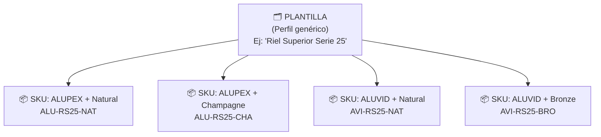
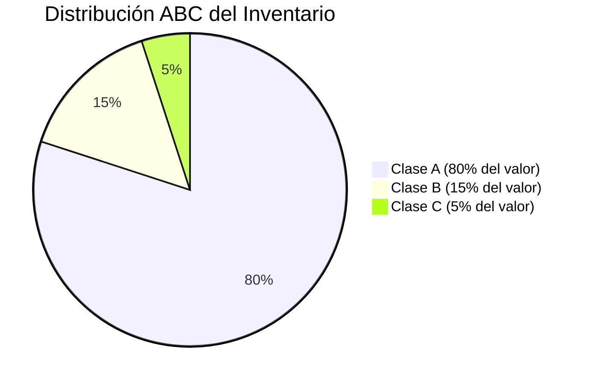

# T03 — Tutorial: Catálogo de Productos (SKUs)

> **Módulo:** Catálogo  
> **Ruta en la app:** `/catalog`  
> **Rol requerido:** ADMIN (edición completa); SECRETARIA, OPERARIO (lectura)  
> **Última actualización:** Febrero 2026  

---

## 📋 ¿Qué es el Catálogo?

El Catálogo es la **biblioteca maestra de todos los productos** del negocio: perfiles de aluminio, vidrios, accesorios y cualquier material. Cada producto tiene un código único llamado **SKU** (Stock Keeping Unit).

**Sin el Catálogo, nada funciona.** El inventario, las cotizaciones y las recetas dependen de que los productos estén bien registrados aquí.

> **🏭 Ejemplo real:** El perfil "Riel Superior Serie 25 ALUPEX Natural" tiene el SKU `ALU-RS25-NAT`. Cada vez que lo compras o usas en una ventana, el sistema lo identifica por ese código.

---

## 🗺️ Estructura del Catálogo: Plantillas vs SKUs



| Concepto | Qué es | Ejemplo |
|----------|--------|---------|
| **Plantilla** | El producto genérico, sin marca ni color | "Riel Superior Serie 25" |
| **SKU / Variante** | La versión específica con marca, material y acabado | "Riel Superior Serie 25 ALUPEX Natural" |

**Una plantilla puede tener muchos SKUs** (uno por cada combinación de marca y color).

---

## 🖥️ Vista del Catálogo (`/catalog`)

```
┌──────────────────────────────────────────────────────────────────┐
│  CATÁLOGO DE PRODUCTOS                           [+ Nueva SK U]  │
│                                                [+ Nueva Plantilla]│
├──────────────────────────────────────────────────────────────────│
│  Buscar: [                    ]  Familia: [Todas ▼]              │
│  Marca:  [Todas ▼]  Material: [Todas ▼]  Sistema: [Todos ▼]     │
├──────────────────────────────────────────────────────────────────│
│  SKU          │ Descripción           │ Stock │ Costo │ Clase    │
│  ─────────────┼───────────────────────┼───────┼───────┼───────── │
│  ALU-RS25-NAT │ Riel Sup S25 Natural  │  45 m │S/25.80│  A      │
│  ALU-RS25-CHA │ Riel Sup S25 Champg.  │  30 m │S/25.80│  B      │
│  VID-4MM-CLR  │ Vidrio Simple 4mm     │ 120 m²│S/48.00│  A      │
│  ACC-FLP-6MM  │ Felpa 6mm rollo       │  15 pz│S/ 8.50│  C      │
└──────────────────────────────────────────────────────────────────┘
  (mostrando 1-25 de 248 productos)        [ < Anterior ] [Siguiente > ]
```

---

## 🔍 Filtros del Catálogo

| Filtro | Opciones | Para qué sirve |
|--------|----------|----------------|
| **Buscar** | Texto libre | Busca en SKU, nombre y descripción |
| **Familia** | Perfiles, Vidrios, Accesorios, etc. | Ver solo una categoría |
| **Marca** | ALUPEX, ALUVID, SIN MARCA, etc. | Filtrar por proveedor/marca de aluminio |
| **Material** | Aluminio, Vidrio, PVC, etc. | Por tipo de material |
| **Sistema/Serie** | Serie 25, Serie 35, etc. | Por línea de producto |

---

## 📦 Ver el Detalle de un SKU

Al hacer clic en cualquier fila de la tabla, se abre un **panel lateral** con toda la información del producto:

```
┌──────────────────────────────────────┐
│  ALU-RS25-NAT                        │
│  Riel Superior Serie 25 — Natural    │
│  ─────────────────────────────────── │
│  INFORMACIÓN GENERAL                 │
│  Familia:    Perfiles de Aluminio    │
│  Marca:      ALUPEX                  │
│  Material:   Aluminio                │
│  Serie:      Serie 25                │
│  Acabado:    Natural (Anodizado)     │
│  Unidad:     Metro lineal (m)        │
│                                      │
│  COSTOS                              │
│  Precio de Mercado: S/ 25.80 / m    │
│  Fecha actualización: 15-Feb-2026    │
│                                      │
│  STOCK                               │
│  Stock Actual:   45.00 m             │
│  Stock Mínimo:   10.00 m             │
│  Estado:         🟢 Normal           │
│                                      │
│  [✏️ Editar] [📦 Ajustar Stock]     │
└──────────────────────────────────────┘
```

---

## ➕ PARTE 1: Crear una Nueva Plantilla

Las plantillas son el "molde" del cual nacen los SKUs. Primero crea la plantilla, luego agrégale variantes.

**Cómo crear una plantilla:**

1. Haz clic en **"+ Nueva Plantilla"**
2. Llena el formulario:

| Campo | Ejemplo | Nota |
|-------|---------|------|
| **Nombre** | "Riel Superior Serie 35" | Nombre descriptivo sin marca/color |
| **Familia** | Perfiles de Aluminio | Categoría principal |
| **Serie/Sistema** | Serie 35 | Línea de producto |
| **Unidad de Medida** | Metro lineal (m) | Metro, M², Unidad, Kg, etc. |
| **Descripción larga** | Texto libre | Detalles técnicos opcionales |

3. Haz clic en **"Guardar"**

---

## ➕ PARTE 2: Crear un Nuevo SKU (Variante)

Una vez que tienes la plantilla, crea una variante para cada combinación de marca y color.

**Cómo crear un SKU:**

1. Haz clic en **"+ Nuevo SKU"**
2. Llena el formulario:

| Campo | Ejemplo | Obligatorio |
|-------|---------|-------------|
| **Plantilla base** | "Riel Superior Serie 35" | ✅ Sí |
| **Marca** | ALUPEX | ✅ Sí |
| **Material** | Aluminio | ✅ Sí |
| **Acabado/Color** | Champagne | ✅ Sí |
| **Precio de Mercado** | 28.50 | ✅ Sí |
| **Stock Mínimo** | 10 | ✅ Sí (para alertas) |
| **Stock Inicial** | 50 | Opcional |

3. El sistema **genera automáticamente** el código SKU basado en la combinación
4. Haz clic en **"Guardar"**

---

## ✏️ PARTE 3: Actualizar Precio de Mercado

Los precios de los perfiles cambian con el mercado. Debes actualizarlos regularmente.

### Método 1: Actualizar precio individual

1. Busca el SKU en el catálogo
2. Haz clic en la fila para abrir el panel lateral
3. Haz clic en **"✏️ Editar"**
4. Modifica el campo **"Precio de Mercado"**
5. Guarda

### Método 2: Actualización masiva

Para actualizar muchos precios a la vez, usa la función de actualización masiva:

1. En la lista del catálogo, selecciona múltiples SKUs con el checkbox ☑️
2. Haz clic en **"Actualizar Precios Seleccionados"**
3. Ingresa el nuevo precio para cada uno en la tabla que aparece
4. Guarda todos

> **⚠️ Importante:** El precio de mercado afecta directamente los costos calculados en cotizaciones **nuevas**. Las cotizaciones ya guardadas mantienen los precios del momento en que se crearon.

---

## 📦 PARTE 4: Ajuste de Stock

Si necesitas corregir el stock de un producto (por diferencias de inventario físico, mermas, etc.):

1. Busca el SKU
2. Abre el panel lateral → clic en **"📦 Ajustar Stock"**
3. Ingresa:
   - **Tipo de ajuste:** Entrada (aumenta) o Salida (disminuye)
   - **Cantidad:** Cuántas unidades ajustar
   - **Motivo:** Texto explicativo (ej: "Diferencia de inventario físico Feb-2026")
4. Confirma

> **⚠️ Nota:** El ajuste crea un movimiento en el Kardex con tipo "AJUSTE". Siempre queda registrado quién lo hizo y cuándo.

---

## 🔢 Clasificación ABC de Productos

El sistema clasifica automáticamente los productos según su valor en inventario:



| Clase | Productos | % Valor | Estrategia |
|-------|-----------|---------|-----------|
| **🔴 A** | 20% de los SKUs | 80% del valor total | Control estricto, reposición frecuente |
| **🟡 B** | 30% de los SKUs | 15% del valor total | Monitoreo mensual |
| **🟢 C** | 50% de los SKUs | 5% del valor total | Reposición cuando sea necesario |

---

## ❓ Preguntas Frecuentes

**¿Por qué hay dos conceptos (Plantilla y SKU)?**
> Una plantilla es el "tipo" de perfil y un SKU es la versión específica. El Riel Superior Serie 25 en Natural es diferente al mismo riel en Champagne (tienen precios y stocks separados).

**¿Puedo eliminar un SKU?**
> Solo si no tiene movimientos en el Kardex. Si ya se usó en alguna cotización o entrada, el sistema no lo dejará eliminar para preservar el historial.

**¿El stock de aquí es el mismo que el del módulo Inventario?**
> Sí. Son la misma información vista desde dos módulos diferentes.

---

## 🔗 Documentos Relacionados

- [T04_TUTORIAL_INVENTARIO.md](./T04_TUTORIAL_INVENTARIO.md) — Ver stock en tiempo real
- [T05_TUTORIAL_ENTRADAS.md](./T05_TUTORIAL_ENTRADAS.md) — Registrar compras de materiales
- [T08_TUTORIAL_RECETAS.md](./T08_TUTORIAL_RECETAS.md) — Usar SKUs en recetas de ventanas
- [09_DICCIONARIO_DATOS.md](../09_DICCIONARIO_DATOS.md) — Referencia técnica de tablas
