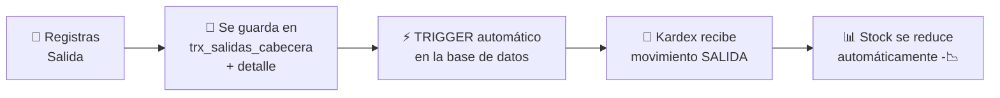
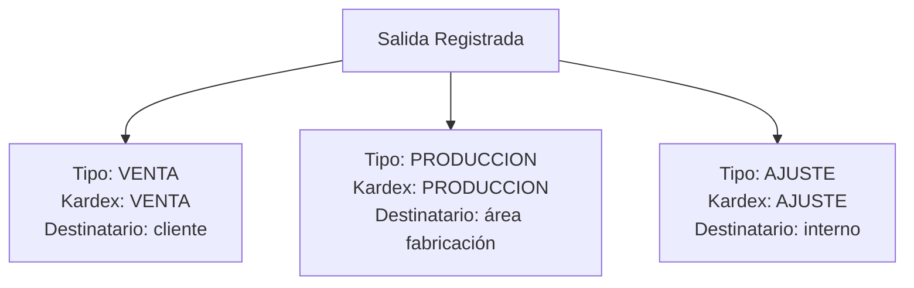
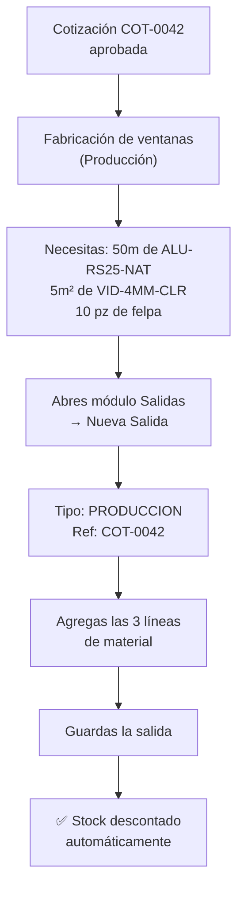

# T06 — Tutorial: Salidas de Inventario (Despachos)

> **Módulo:** Salidas  
> **Ruta en la app:** `/inventory` → pestaña "Salidas"  
> **Rol requerido:** ADMIN, SECRETARIA  
> **Última actualización:** Febrero 2026  

---

## 📋 ¿Qué son las Salidas?

Las **Salidas** registran el material que **sale** del almacén: despachos a obras, uso en producción, o ajustes negativos. Cada salida **reduce el stock** automáticamente.

> **👷 Ejemplo:** Enviaste 50m de perfil para fabricar las ventanas del cliente "Juan Gómez" (COT-0042). Registras eso como una Salida y el sistema descuenta 50m del stock.

---

## 🔄 ¿Qué pasa cuando registras una Salida?



---

## 🖥️ Vista de la Pestaña Salidas

```
┌──────────────────────────────────────────────────────────────┐
│  SALIDAS DE INVENTARIO                    [+ Nueva Salida]   │
│  Buscar: [              ]  Tipo: [Todos ▼]                   │
├────────────┬───────────┬───────────────┬──────────┬─────────┤
│ N° Salida  │ Fecha     │ Destinatario  │ Tipo     │ Total   │
├────────────┼───────────┼───────────────┼──────────┼─────────┤
│ SAL-0018   │ 21/02/26  │ Juan Gómez   │ VENTA    │S/1,290  │
│ SAL-0017   │ 20/02/26  │ Producción   │ PRODUC.  │S/3,450  │
│ SAL-0016   │ 18/02/26  │ -            │ AJUSTE   │ S/125   │
└────────────┴───────────┴───────────────┴──────────┴─────────┘
```

---

## ➕ Paso a Paso: Crear una Nueva Salida

### Paso 1: Abrir el formulario

Haz clic en **"+ Nueva Salida"**.

---

### Paso 2: Llenar la Cabecera

```
┌─────────────────────────────────────────────────────────┐
│  NUEVA SALIDA DE INVENTARIO                             │
├─────────────────────────────────────────────────────────│
│  Tipo:           ● Venta  ○ Producción  ○ Ajuste        │
│  Destinatario:   [Para venta a Juan Gómez - COT-0042]   │
│  Fecha:          [22/02/2026]                           │
│  Nº Referencia:  [COT-0042]  (opcional, para trazab.)   │
│  Observaciones:  [Despacho ventanas dormitorio]         │
└─────────────────────────────────────────────────────────┘
```

| Campo | Obligatorio | Descripción |
|-------|-------------|-------------|
| **Tipo** | ✅ Sí | Tipo de salida (ver tabla abajo) |
| **Destinatario** | ✅ Sí | A quién va el material: cliente, área, etc. |
| **Fecha** | ✅ Sí | Fecha del despacho (default: hoy) |
| **Nº Referencia** | ❌ No | Número de cotización, orden de trabajo o guía |
| **Observaciones** | ❌ No | Notas adicionales sobre esta salida |

---

### Tipos de Salida

| Tipo | Cuándo usarlo | Qué se registra en Kardex |
|------|--------------|--------------------------|
| **VENTA** | Material despachado a un cliente final | VENTA (-stock) |
| **PRODUCCION** | Material usado en fabricación interna | PRODUCCION (-stock) |
| **AJUSTE** | Mermas, pérdidas, correcciones | AJUSTE (-stock) |

---

### Paso 3: Agregar Líneas de Detalle

```
┌────────────────────────────────────────────────────────────┐
│  LÍNEAS DE DETALLE                            [+ Agregar]  │
├──────────────────────────┬──────┬──────────┬──────────────┤
│ Producto (SKU)           │ Qty  │ Costo(P) │ Subtotal     │
├──────────────────────────┼──────┼──────────┼──────────────┤
│ ALU-RS25-NAT (buscar...) │ 50 m │ S/25.60  │  S/1,280.00  │
│ VID-4MM-CLR (buscar...)  │ 5 m² │ S/47.50  │  S/  237.50  │
├──────────────────────────┴──────┴──────────┼──────────────┤
│                                    TOTAL:  │  S/1,517.50  │
└────────────────────────────────────────────┴──────────────┘
```

| Campo | Cómo llenarlo |
|-------|--------------|
| **Producto** | Escribe el SKU o nombre. El sistema busca mientras escribes |
| **Cantidad** | Cuánto material sale del almacén |
| **Costo (PMP)** | Se llena automáticamente con el PMP actual. Puedes ajustar si necesario |

> **⚠️ Atención:** No puedes registrar una salida mayor al stock disponible. El sistema validará que haya suficiente material.

---

### Paso 4: Guardar la Salida

Haz clic en **"Guardar Salida"**. El sistema:
1. Valida que haya stock suficiente para cada producto
2. Guarda la salida
3. El trigger actualiza el Kardex automáticamente
4. El stock de cada producto baja inmediatamente

---

## 📊 Diferencia entre Tipos de Salida en el Kardex



Esto es importante para el análisis posterior: puedes ver cuánto sale por ventas vs cuánto se consume internamente en producción.

---

## 💡 Flujo Típico: Despacho para una Obra



---

## ❓ Preguntas Frecuentes

**¿Qué pasa si intento sacar más stock del que hay?**
> El sistema te mostrará un error: "Stock insuficiente para [SKU]". Debes registrar primero una entrada (compra) o reducir la cantidad de la salida.

**¿La salida descuenta el stock del catálogo automáticamente?**
> Sí, inmediatamente al guardar.

**¿Puedo borrar una salida?**
> Solo Administradores. Se recomienda hacer una "Entrada de ajuste" en cambio, para mantener el historial completo.

**¿Necesito registrar una salida cuando apruebo una cotización?**
> No automáticamente. Actualmente el descuento de stock es manual (cuando físicamente despachas el material).

---

## ⚠️ Errores Comunes

| Error | Causa | Solución |
|-------|-------|---------|
| "Stock insuficiente" | Menos stock del que intentas sacar | Registrar entrada primero o reducir cantidad |
| "Producto no encontrado" | SKU incorrecto | Buscar en Catálogo el código correcto |
| Stock no baja | Error de conexión | Recargar y verificar en Kardex |

---

## 🔗 Documentos Relacionados

- [T03_TUTORIAL_CATALOGO.md](./T03_TUTORIAL_CATALOGO.md) — Verificar stock antes de sacar
- [T07_TUTORIAL_KARDEX.md](./T07_TUTORIAL_KARDEX.md) — Ver el movimiento registrado
- [T05_TUTORIAL_ENTRADAS.md](./T05_TUTORIAL_ENTRADAS.md) — Si necesitas agregar stock primero
