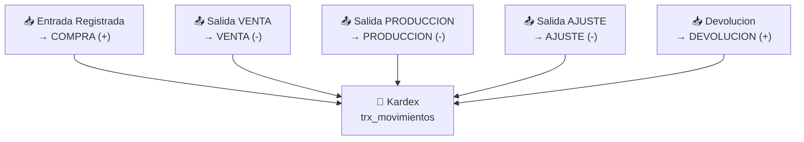

# T07 — Tutorial: Kardex

> **Módulo:** Kardex  
> **Ruta en la app:** `/inventory` → pestaña "Kardex"  
> **Rol requerido:** ADMIN, SECRETARIA (lectura); ADMIN (acciones)  
> **Última actualización:** Febrero 2026  

---

## 📋 ¿Qué es el Kardex?

El Kardex es el **registro histórico completo** de todos los movimientos de inventario: cada compra, despacho, uso en producción y ajuste queda guardado aquí con fecha, hora, cantidad y usuario responsable.

> **📁 Piénsalo como:** La "libreta de contabilidad" del almacén. Nada entra ni sale sin quedar registrado en el Kardex.

**El Kardex es de solo lectura.** No creas movimientos aquí directamente — eso lo hacen los módulos de Entradas y Salidas automáticamente.

---

## 🗺️ Tipos de Movimientos en el Kardex



| Tipo de Movimiento | De dónde viene | Efecto en stock |
|-------------------|----------------|----------------|
| **COMPRA** | Módulo Entradas (tipo Compra) | Aumenta ➕ |
| **DEVOLUCION** | Módulo Entradas (tipo Devolución) | Aumenta ➕ |
| **VENTA** | Módulo Salidas (tipo Venta) | Reduce ➖ |
| **PRODUCCION** | Módulo Salidas (tipo Producción) | Reduce ➖ |
| **AJUSTE** | Módulo Entradas o Salidas (tipo Ajuste) | Aumenta ➕ o Reduce ➖ |

---

## 🖥️ Vista del Kardex

```
┌──────────────────────────────────────────────────────────────────────────────┐
│  KARDEX DE MOVIMIENTOS                                      [Exportar 📊]    │
│  Buscar: [        ]  Tipo: [Todos ▼]  Desde: [01/02/26]  Hasta: [22/02/26]  │
├──────────┬────────────┬──────────────────┬───────┬────────┬─────┬───────────┤
│ Fecha    │ Movimiento │ Producto         │ Qty   │ P.Unit │Saldo│ Ref.Doc.  │
├──────────┼────────────┼──────────────────┼───────┼────────┼─────┼───────────┤
│22/02/26  │ VENTA      │ ALU-RS25-NAT     │ -50.0m│S/25.60 │195.0│ COT-0042  │
│20/02/26  │ COMPRA     │ ALU-RS25-NAT     │+200.0m│S/25.80 │245.0│ F001-1245 │
│18/02/26  │ PRODUCCION │ VID-4MM-CLR      │ -12.5m²│S/47.50│107.5│ OP-0019   │
│15/02/26  │ COMPRA     │ VID-4MM-CLR      │+120.0m²│S/47.50│120.0│ G001-0087 │
└──────────┴────────────┴──────────────────┴───────┴────────┴─────┴───────────┘
(mostrando 1-25 de 347 movimientos)
```

---

## 📊 Columnas del Kardex

| Columna | Qué significa |
|---------|--------------|
| **Fecha** | Cuándo se registró el movimiento |
| **Tipo Movimiento** | COMPRA, VENTA, PRODUCCION, AJUSTE, DEVOLUCION |
| **Producto** | SKU y nombre del producto afectado |
| **Cantidad** | Cantidad que entró (+) o salió (-) |
| **Precio Unitario** | Costo por unidad en ese movimiento |
| **Saldo** | Stock acumulado después de ese movimiento |
| **Doc. Referencia** | Número de factura, cotización u orden de trabajo |

> **💡 El Saldo** te muestra el stock histórico. Si quieres saber cuánto había el 15 de febrero, busca el último movimiento de ese día y mira la columna Saldo.

---

## 🔍 Filtros del Kardex

| Filtro | Cómo usarlo | Ejemplo de uso |
|--------|-------------|----------------|
| **Buscar** | SKU o descripción | Buscar "ALU-RS25" para ver solo ese perfil |
| **Tipo** | Selecciona COMPRA, VENTA, etc. | Ver solo compras del mes |
| **Desde / Hasta** | Rango de fechas | Movimientos de enero 2026 |

### Combinaciones útiles de filtros

```
Ver las compras de un perfil específico en el mes:
  Buscar: "ALU-RS25-NAT"  +  Tipo: COMPRA  +  Desde: 01/02/26

Ver todos los despachos a Juan Gómez:
  Buscar: "COT-0042"  (en campo Ref. Documento)

Todo lo que salió en producción esta semana:
  Tipo: PRODUCCION  +  Desde: 17/02/26  +  Hasta: 22/02/26
```

---

## 👁️ Ver Detalle de un Movimiento

Haz clic en cualquier fila del Kardex para ver información adicional:

```
┌────────────────────────────────────────────┐
│  MOVIMIENTO #KDX-00347                     │
│  Tipo: VENTA                               │
│  Fecha: 22/02/2026 09:45                   │
│  ─────────────────────────────────────── │
│  Producto: ALU-RS25-NAT                    │
│  Descripción: Riel Superior S25 Natural    │
│  Cantidad: -50.00 m                        │
│  P. Unitario: S/ 25.60 / m                 │
│  Total: S/ 1,280.00                        │
│  ─────────────────────────────────────── │
│  Documento Ref: COT-0042                   │
│  Destinatario: Juan Gómez                  │
│  Observaciones: Despacho ventanas dorm.    │
│  Registrado por: secretaria@empresa.com    │
└────────────────────────────────────────────┘
```

---

## 📈 Leer el Saldo en el Tiempo (Ejemplo)

Supongamos que quieres rastrear el movimiento del perfil `ALU-RS25-NAT` en febrero:

```
Fecha     │ Tipo     │  Qty   │ Saldo
──────────┼──────────┼────────┼───────
01/02/26  │ Saldo inicial         │  45.0m
05/02/26  │ COMPRA   │ +100.0m│ 145.0m
10/02/26  │ VENTA    │  -20.0m│ 125.0m
15/02/26  │ COMPRA   │ +100.0m│ 225.0m  ← Aquí el stock es 225m
20/02/26  │ COMPRA   │ +200.0m│ 425.0m
22/02/26  │ VENTA    │  -50.0m│ 375.0m  ← Stock actual
```

El saldo final (375.0m) es lo que verás en el módulo de **Stock en Tiempo Real**.

---

## 📊 Exportar el Kardex a Excel

1. Aplica los filtros que quieras (fecha, tipo, producto)
2. Haz clic en **"Exportar 📊"**
3. Se descarga un archivo `.xlsx` con todos los movimientos filtrados

**Usos del Excel del Kardex:**
- Preparar informes contables
- Auditorías de inventario
- Análisis de consumo por período
- Enviar a Power BI para visualizaciones avanzadas

---

## ❓ Preguntas Frecuentes

**¿Por qué el saldo en el Kardex no coincide con lo que muestro en Inventario?**
> Deben coincidir siempre. Si hay diferencia, puede ser un problema de actualización de la vista. Recarga la página (F5).

**¿Puedo borrar un movimiento del Kardex?**
> No directamente. El Kardex es inmutable por diseño. Para corregir un error, registra un movimiento compensatorio inverso.

**¿Qué significa "Ref. Doc" vacío?**
> El movimiento se creó sin número de documento de referencia. Generalmente ocurre en ajustes rápidos.

**¿El Kardex muestra movimientos de todos los usuarios?**
> Sí. Puedes ver quién registró cada movimiento en la columna "Registrado por".

---

## ⚠️ Errores Comunes

| Situación | Causa | Solución |
|-----------|-------|---------|
| "Sin resultados" con filtros | Filtro muy restrictivo | Ampliar el rango de fechas |
| Saldo negativo visible | Salida registrada antes de entrada | Revisar orden cronológico de registros |
| Movimiento duplicado | Se guardó dos veces por error | Contactar ADMIN para revisión |

---

## 🔗 Documentos Relacionados

- [T05_TUTORIAL_ENTRADAS.md](./T05_TUTORIAL_ENTRADAS.md) — Cómo se crean movimientos de COMPRA
- [T06_TUTORIAL_SALIDAS.md](./T06_TUTORIAL_SALIDAS.md) — Cómo se crean movimientos de VENTA/PRODUCCION
- [T10_TUTORIAL_EXPORTADOR.md](./T10_TUTORIAL_EXPORTADOR.md) — Exportar el Kardex completo con filtros avanzados
