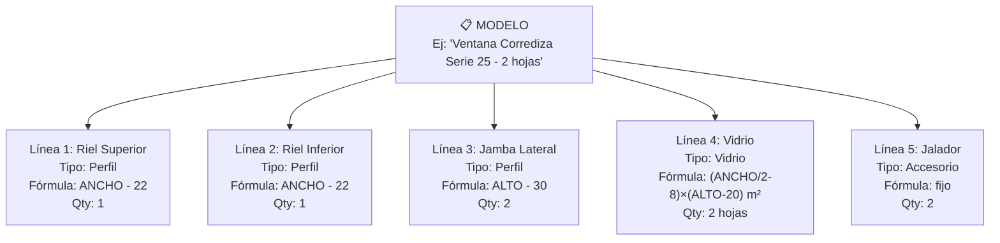
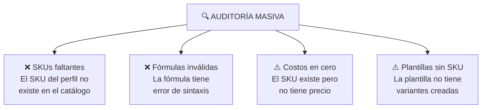
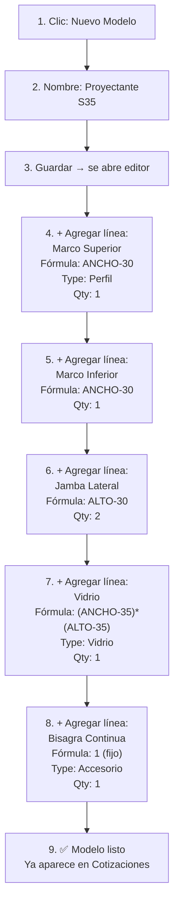

# T08 — Tutorial: Recetas de Ingeniería

> **Módulo:** Recetas  
> **Ruta en la app:** `/recetas` y `/configuracion/recetas`  
> **Rol requerido:** ADMIN (edición); SECRETARIA (lectura)  
> **Última actualización:** Febrero 2026  

---

## 📋 ¿Qué son las Recetas de Ingeniería?

Las **Recetas** son el "cerebro" del sistema de cotizaciones. Definen exactamente **qué materiales se necesitan y en qué cantidades** para fabricar un tipo de ventana o mampara.

Cuando creas una cotización y agregas un ítem de "Ventana Corrediza Serie 25 de 1200×900mm", el sistema usa la **Receta de ese modelo** para calcular automáticamente cuántos metros de cada perfil necesitas, cuánto vidrio y qué accesorios.

> **🏭 Analogía:** Las recetas son como la ficha técnica de fabricación. El sistema las usa para "armar" el presupuesto automáticamente.

---

## 🗂️ Estructura de las Recetas



Cada modelo tiene **líneas de receta** — una por cada componente que lleva el producto terminado.

---

## 🖥️ Vista Principal de Recetas (`/recetas`)

```
┌──────────────────────────────────────────────────────────────┐
│  RECETAS DE INGENIERÍA                       [+ Nuevo Modelo]│
│  Buscar: [              ]                    [🔍 Auditoría]  │
├──────┬──────────────────────────────┬───────┬───────────────┤
│  #   │ Nombre del Modelo            │ Líneas│ Acciones      │
├──────┼──────────────────────────────┼───────┼───────────────┤
│  1   │ Corrediza 2H Serie 25        │   8   │ ✏️ 🔄 🗑️     │
│  2   │ Corrediza 3H Serie 25        │  11   │ ✏️ 🔄 🗑️     │
│  3   │ Proyectante Serie 35         │   6   │ ✏️ 🔄 🗑️     │
│  4   │ Mampara Fija Serie 100       │   5   │ ✏️ 🔄 🗑️     │
│  5   │ Batiente Simple Serie 25     │   7   │ ✏️ 🔄 🗑️     │
└──────┴──────────────────────────────┴───────┴───────────────┘
```

### Botones de la lista de modelos

| Botón | Icono | Qué hace |
|-------|-------|----------|
| **Nuevo Modelo** | ➕ | Crea un modelo de ventana/mampara nuevo |
| **🔍 Auditoría** | 🔍 | Auditoría masiva de todas las recetas |
| **Editar** | ✏️ | Abre el editor de receta para ese modelo |
| **Clonar** | 🔄 | Crea una copia del modelo con todos sus componentes |
| **Eliminar** | 🗑️ | Elimina el modelo (solo si no está en uso) |

---

## ➕ PARTE 1: Crear un Nuevo Modelo

### Paso 1: Clic en "Nuevo Modelo"

Se abre un formulario básico:

```
┌─────────────────────────────────────────────────────┐
│  NUEVO MODELO DE RECETA                             │
├─────────────────────────────────────────────────────│
│  Nombre:    [Proyectante Serie 35 - 1 Hoja]         │
│  Serie:     [Serie 35]                              │
│  Descripción: [Ventana proyectante de 1 hoja,       │
│               apertura hacia afuera]                │
│                                          [Guardar]  │
└─────────────────────────────────────────────────────┘
```

| Campo | Qué ingresar |
|-------|-------------|
| **Nombre** | Nombre descriptivo que verán en cotizaciones (ej: "Proyectante Serie 35 - 1 Hoja") |
| **Serie** | La serie de aluminio que usa (Serie 25, 35, 100, etc.) |
| **Descripción** | Texto libre explicando el tipo de ventana |

---

### Paso 2: Agregar Líneas de Receta

Al guardar el modelo, se abre el **Editor de Receta** donde agregas cada componente:

```
┌──────────────────────────────────────────────────────────────────────┐
│  EDITOR: Proyectante Serie 35 - 1 Hoja              [+ Agregar Línea]│
├──────┬───────────────────┬──────────┬─────────────┬──────┬──────────┤
│ Tipo │ Plantilla/SKU     │ Fórmula  │ Resultado   │ Qty  │ Acciones │
├──────┼───────────────────┼──────────┼─────────────┼──────┼──────────┤
│  P   │ Marco Superior S35│ANCHO-30  │(calculado)  │  1   │ ✏️ 🗑️   │
│  P   │ Marco Inferior S35│ANCHO-30  │(calculado)  │  1   │ ✏️ 🗑️   │
│  P   │ Jamba Lateral S35 │ALTO-30   │(calculado)  │  2   │ ✏️ 🗑️   │
│  V   │ Vidrio Proyect.   │(ANCHO-35)│×(ALTO-35) m²│  1   │ ✏️ 🗑️   │
│  A   │ Bisagra Continua  │ fijo     │  1 pz       │  1   │ ✏️ 🗑️   │
│  A   │ Manija Espag.     │ fijo     │  1 pz       │  1   │ ✏️ 🗑️   │
└──────┴───────────────────┴──────────┴─────────────┴──────┴──────────┘
  P = Perfil   V = Vidrio   A = Accesorio
```

---

## ✏️ PARTE 2: Agregar / Editar una Línea de Receta

Al hacer clic en **"+ Agregar Línea"** o **✏️ Editar**, se abre este formulario:

```
┌─────────────────────────────────────────────────────┐
│  LÍNEA DE RECETA                                    │
├─────────────────────────────────────────────────────│
│  Tipo:        ● Perfil  ○ Vidrio  ○ Accesorio        │
│  Plantilla:   [Marco Superior Serie 35 ▼]           │
│  Fórmula:     [ANCHO - 30]                          │
│  Cantidad:    [1]                                   │
│  Unidad:      Metro lineal (automático del SKU)     │
│                                          [Guardar]  │
└─────────────────────────────────────────────────────┘
```

| Campo | Opciones | Descripción |
|-------|----------|-------------|
| **Tipo** | Perfil / Vidrio / Accesorio | Qué tipo de material es este componente |
| **Plantilla** | Lista de plantillas del catálogo | El perfil genérico (sin marca/color) |
| **Fórmula** | Expresión matemática | Cómo se calcula la longitud/área |
| **Cantidad** | Número | Cuántas piezas de este componente por ventana |

---

## 🔢 PARTE 3: Las Fórmulas — Explicación Detallada

Las fórmulas son el corazón de las recetas. Usan las variables `ANCHO` y `ALTO` (en mm) que el usuario ingresa en la cotización.

### Variables disponibles

| Variable | Qué representa | Ejemplo (ventana 1200×900) |
|----------|---------------|--------------------------|
| `ANCHO` | Ancho de la ventana en mm | 1200 |
| `ALTO` | Alto de la ventana en mm | 900 |

### Operadores disponibles

| Operador | Función | Ejemplo | Resultado |
|----------|---------|---------|-----------|
| `+` | Suma | `ANCHO + 10` | 1210 mm |
| `-` | Resta | `ANCHO - 22` | 1178 mm |
| `*` | Multiplicación | `ALTO * 2` | 1800 mm |
| `/` | División | `ANCHO / 2` | 600 mm |
| `()` | Agrupación | `(ANCHO - 20) / 2` | 590 mm |

### Ejemplos de fórmulas reales

```
Riel Superior (resta sellos laterales):
  ANCHO - 22  →  Si ANCHO=1200: 1200-22 = 1178mm = 1.178m

Jamba lateral (descuenta rieles sup e inf):
  ALTO - 30   →  Si ALTO=900:  900-30 = 870mm = 0.870m

Hoja de ventana (mitad del ancho menos holguras):
  ANCHO / 2 - 15  →  1200/2-15 = 585mm = 0.585m

Área de vidrio (2 hojas, descontando marcos):
  (ANCHO/2 - 8) * (ALTO - 20) * 2  →  Calcula m² automáticamente
```

> **⚠️ Importante:** Las fórmulas para vidrio deben dar resultado en **m²** porque el vidrio se mide en metros cuadrados. Para perfiles, el resultado es en **mm** y el sistema convierte a metros automáticamente.

### Componentes de cantidad fija (Accesorios)

Cuando la cantidad depende del modelo, no del tamaño (ej: un jalador siempre es 1, sin importar cómo mida la ventana), usa:
- **Fórmula:** `1` (número fijo)
- **Cantidad:** El número de piezas

---

## 🔬 PARTE 4: Auditoría Masiva de Recetas

La Auditoría es una herramienta que escanea **todas las recetas** para detectar posibles problemas antes de que afecten las cotizaciones.

### Cómo acceder

1. En la lista de modelos, haz clic en **"🔍 Auditoría"**
2. El sistema analiza todas las recetas automáticamente
3. Muestra un informe con los problemas encontrados

### Qué detecta la Auditoría



### Resultados de la Auditoría

```
┌────────────────────────────────────────────────────────────────┐
│  AUDITORÍA MASIVA — RESULTADOS                                │
│  Modelos analizados: 12  │  ✅ OK: 8  │  ⚠️ Alertas: 4       │
├────────────┬───────────────┬────────────┬──────────────────────┤
│ Modelo     │ Línea         │ Problema   │ Detalle              │
├────────────┼───────────────┼────────────┼──────────────────────┤
│ Corrediza  │ Marco Sup S35 │ SKU falta  │ No existe ALUVID/Nat │
│ Proyectante│ Felpa 9mm     │ Costo = 0  │ Precio no configurado│
└────────────┴───────────────┴────────────┴──────────────────────┘
```

### Cómo corregir los problemas detectados

| Problema | Solución |
|----------|---------|
| SKU faltante | Ir a Catálogo → crear el SKU que falta |
| Fórmula inválida | Editar la línea de receta → corregir la fórmula |
| Costo en cero | Ir a Catálogo → actualizar precio de mercado del SKU |
| Plantilla sin SKU | Ir a Catálogo → crear variantes para esa plantilla |

En el resultado de la auditoría, puedes hacer clic en el nombre del modelo para ir directamente a editarlo.

---

## 🔄 Clonar un Modelo

Si ya tienes una receta similar y solo necesitas ajustar algunas medidas o componentes:

1. En la lista de modelos, haz clic en **🔄 Clonar** del modelo base
2. Se crea una copia exacta con nombre "Copia de [Original]"
3. Haz clic en ✏️ para editar la copia y ajustar lo que necesites

**Casos de uso del clon:**
- Crear "Corrediza Serie 35" partiendo de "Corrediza Serie 25"
- Crear versión de 3 hojas partiendo de la de 2 hojas

---

## 💡 Ejemplo Completo: Crear Receta de Ventana Proyectante



---

## ❓ Preguntas Frecuentes

**¿Por qué no aparece mi modelo nuevo en Cotizaciones?**
> El modelo debe tener al menos una línea de receta guardada. Si está vacío, no aparece.

**¿Puedo tener la misma plantilla en múltiples recetas?**
> Sí. Una plantilla de "Riel Superior Serie 25" puede estar en la receta de Corrediza 2H, Corrediza 3H, y Batiente.

**¿Qué pasa si cambio una fórmula en una receta? ¿Afecta cotizaciones ya hechas?**
> No. Las cotizaciones ya creadas guardan el despiece calculado en ese momento. Los cambios en recetas solo afectan cotizaciones **nuevas**.

**¿Cómo sé qué fórmula usar si no soy ingeniero?**
> Consulta con el técnico de fabricación. Ellos saben exactamente cuánto material se descuenta por los marcos y holguras. La fórmula típica para perfiles es `DIMENSIÓN - DESCUENTO_DE_BORDES`.

---

## ⚠️ Errores Comunes en Fórmulas

| Fórmula con error | Error | Fórmula correcta |
|-------------------|-------|-----------------|
| `ANCHO- 22` (espacio antes de número) | Puede parsear mal | `ANCHO - 22` |
| `ancho - 22` (minúsculas) | Variable no reconocida | `ANCHO - 22` |
| `ANCHO x 2` (x en vez de *) | Operador inválido | `ANCHO * 2` |
| `/2` sin variable | Sintaxis incompleta | `ANCHO / 2` |

---

## 🔗 Documentos Relacionados

- [T02_TUTORIAL_COTIZACIONES.md](./T02_TUTORIAL_COTIZACIONES.md) — Cómo se usan las recetas en cotizaciones
- [T03_TUTORIAL_CATALOGO.md](./T03_TUTORIAL_CATALOGO.md) — Configurar plantillas y SKUs que usa la receta
- [08_ARQUITECTURA_RECETAS.md](../08_ARQUITECTURA_RECETAS.md) — Documentación técnica del motor de recetas
