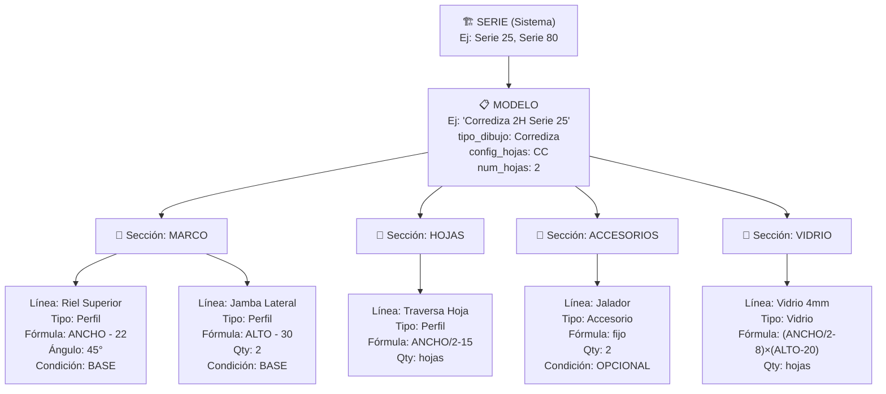
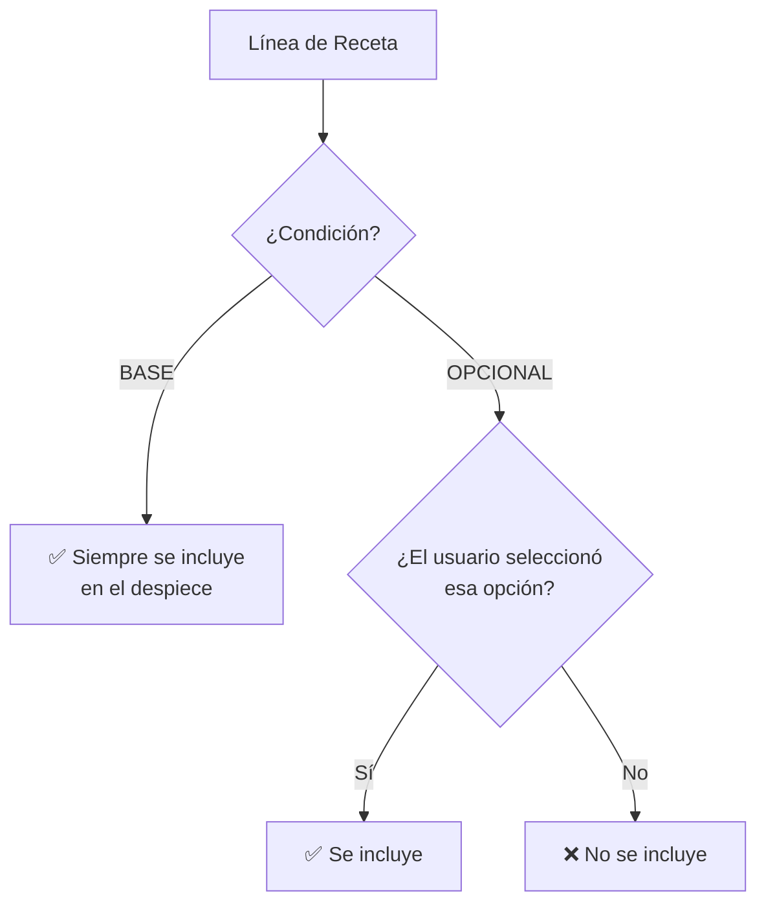
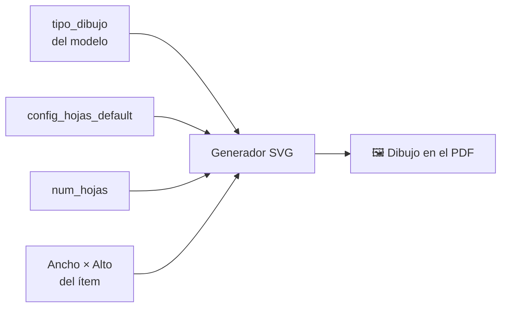
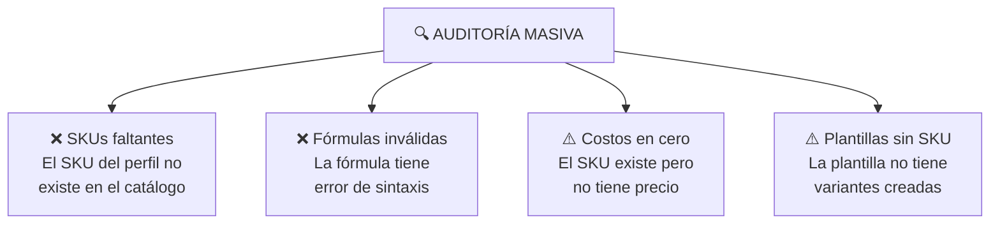
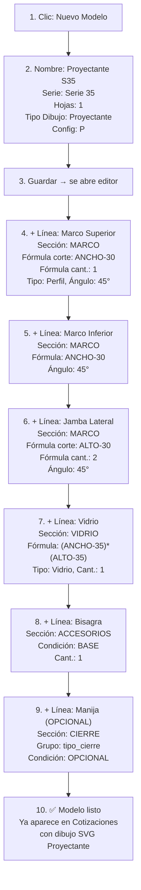
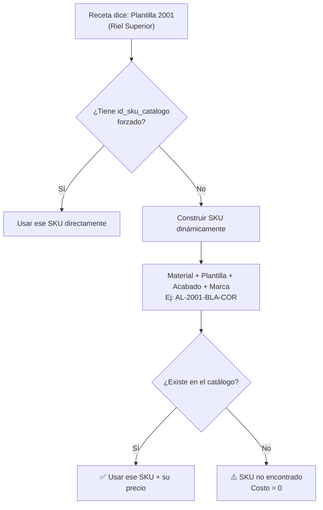

# T08 — Tutorial: Recetas de Ingeniería

> **Módulo:** Recetas  
> **Ruta en la app:** `/recetas` y `/configuracion/recetas`  
> **Rol requerido:** ADMIN (edición); SECRETARIA (lectura)  
> **Última actualización:** Marzo 2026  

---

## 📋 ¿Qué son las Recetas de Ingeniería?

Las **Recetas** son el "cerebro" del sistema de cotizaciones. Definen exactamente **qué materiales se necesitan y en qué cantidades** para fabricar un tipo de ventana o mampara.

Cuando creas una cotización y agregas un ítem de "Ventana Corrediza Serie 25 de 1200×900mm", el sistema usa la **Receta de ese modelo** para calcular automáticamente cuántos metros de cada perfil necesitas, cuánto vidrio y qué accesorios.

> **🏭 Analogía:** Las recetas son como la ficha técnica de fabricación. El sistema las usa para "armar" el presupuesto automáticamente.

---

## 🗂️ Estructura de las Recetas


```mermaid
graph TD
    SYS["🏗️ SERIE (Sistema)<br/>Ej: Serie 25, Serie 80"] --> MOD
    MOD["📋 MODELO<br/>Ej: 'Corrediza 2H Serie 25'<br/>tipo_dibujo: Corrediza<br/>config_hojas: CC<br/>num_hojas: 2"] --> SEC1["📂 Sección: MARCO"]
    MOD --> SEC2["📂 Sección: HOJAS"]
    MOD --> SEC3["📂 Sección: ACCESORIOS"]
    MOD --> SEC4["📂 Sección: VIDRIO"]
    
    SEC1 --> L1["Línea: Riel Superior<br/>Tipo: Perfil<br/>Fórmula: ANCHO - 22<br/>Ángulo: 45°<br/>Condición: BASE"]
    SEC1 --> L2["Línea: Jamba Lateral<br/>Tipo: Perfil<br/>Fórmula: ALTO - 30<br/>Qty: 2<br/>Condición: BASE"]
    SEC2 --> L3["Línea: Traversa Hoja<br/>Tipo: Perfil<br/>Fórmula: ANCHO/2-15<br/>Qty: hojas"]
    SEC3 --> L4["Línea: Jalador<br/>Tipo: Accesorio<br/>Fórmula: fijo<br/>Qty: 2<br/>Condición: OPCIONAL"]
    SEC4 --> L5["Línea: Vidrio 4mm<br/>Tipo: Vidrio<br/>Fórmula: (ANCHO/2-8)×(ALTO-20)<br/>Qty: hojas"]
```

Cada modelo tiene **líneas de receta** organizadas por **secciones**, una por cada componente que lleva el producto terminado.

### Conceptos Clave

| Concepto | Qué es | Ejemplo |
|----------|--------|---------|
| **Serie (Sistema)** | La línea de aluminio | Serie 25, Serie 80, Serie 3831 |
| **Modelo** | Un tipo específico de ventana | Corrediza 2 Hojas Serie 25 |
| **Línea de Receta** | Un componente del modelo | Riel Superior, Jamba, Vidrio |
| **Sección** | Agrupación lógica de líneas | MARCO, HOJAS, ACCESORIOS, VIDRIO |
| **Tipo de Dibujo** | Cómo se dibuja el SVG en el PDF | Corrediza, Proyectante, Batiente, Fijo |
| **Config Hojas** | Disposición de las hojas | CC, FCCF, P, A, F |
| **Condición** | Si el material es obligatorio o no | BASE (siempre) u OPCIONAL |

---

## 🖥️ Vista Principal de Recetas (`/recetas`)

```
┌──────────────────────────────────────────────────────────────┐
│  RECETAS DE INGENIERÍA                       [+ Nuevo Modelo]│
│  Buscar: [              ]                    [🔍 Auditoría]  │
├──────┬──────────────────────────────┬────────┬───────┬───────┤
│  #   │ Nombre del Modelo            │ Dibujo │ Hojas │Accion│
├──────┼──────────────────────────────┼────────┼───────┼───────┤
│  1   │ Corrediza 2H Serie 25        │Corred. │  CC   │ ✏️🔄🗑│
│  2   │ Corrediza 4H Serie 25        │Corred. │  FCCF │ ✏️🔄🗑│
│  3   │ Proyectante Serie 3831       │Proyect.│  P    │ ✏️🔄🗑│
│  4   │ Mampara Fija Serie 100       │Fijo    │  F    │ ✏️🔄🗑│
│  5   │ Batiente Simple Serie 25     │Batient.│  A    │ ✏️🔄🗑│
└──────┴──────────────────────────────┴────────┴───────┴───────┘
```

### Botones de la lista de modelos

| Botón | Icono | Qué hace |
|-------|-------|----------|
| **Nuevo Modelo** | ➕ | Crea un modelo de ventana/mampara nuevo |
| **🔍 Auditoría** | 🔍 | Auditoría masiva de todas las recetas |
| **Editar** | ✏️ | Abre el editor de receta para ese modelo |
| **Clonar** | 🔄 | Crea una copia del modelo con todos sus componentes |
| **Eliminar** | 🗑️ | Elimina el modelo (solo si no está en uso) |

---

## ➕ PARTE 1: Crear un Nuevo Modelo

### Paso 1: Clic en "Nuevo Modelo"

Se abre un formulario:

```
┌─────────────────────────────────────────────────────┐
│  NUEVO MODELO DE RECETA                             │
├─────────────────────────────────────────────────────│
│  Nombre:       [Proyectante Serie 35 - 1 Hoja]      │
│  Serie:        [Serie 35 ▼]                         │
│  Nro. Hojas:   [1]                                  │
│  Tipo Dibujo:  [Proyectante ▼]                      │
│  Config Hojas: [P]                                  │
│  Descripción:  [Ventana proyectante de 1 hoja...]    │
│                                          [Guardar]  │
└─────────────────────────────────────────────────────┘
```

| Campo | Qué ingresar |
|-------|-------------|
| **Nombre** | Nombre descriptivo que verán en cotizaciones (ej: "Proyectante Serie 35 - 1 Hoja") |
| **Serie** | La serie de aluminio que usa (Serie 25, 35, 80, 100, etc.) |
| **Nro. Hojas** | Cuántas hojas tiene el modelo (1, 2, 3, 4, 6). Usado en la variable `hojas` de fórmulas |
| **Tipo Dibujo** | Cómo se renderiza el SVG de tipología en la impresión (ver tabla abajo) |
| **Config Hojas** | Disposición de hojas. Define la iconografía del dibujo (ver tabla abajo) |
| **Descripción** | Texto libre explicando el tipo de ventana |

### Tipos de Dibujo (tipo_dibujo)

El `tipo_dibujo` le dice al sistema **cómo dibujar** el SVG en el PDF de la cotización:

| Tipo | Icono Visual | Cuándo usarlo |
|------|:---:|---------|
| **Corrediza** | ↔️ | Ventanas con hojas que se deslizan horizontalmente |
| **Proyectante** | ↗️ | Ventanas con hoja que se abre hacia afuera (bisagra arriba) |
| **Batiente** | ↩️ | Puertas/ventanas con hoja que se abre como puerta (bisagra lateral) |
| **Fijo** | ▢ | Vidrio fijo sin apertura, marcos y sobreluz |

### Config Hojas (config_hojas_default)

La `config_hojas_default` define la disposición de los paneles en el dibujo:

| Config | Significado | Dibujo |
|--------|-------------|--------|
| **CC** | 2 hojas Corredizas | `[← →]` |
| **CCC** | 3 hojas Corredizas | `[← → ←]` |
| **FCCF** | Fijo + 2 Corredizas + Fijo | `[│ ← → │]` |
| **P** | 1 hoja Proyectante | `[↗]` |
| **A** | 1 hoja Abatible (Batiente) | `[↩]` |
| **F** | 1 paño Fijo | `[▢]` |
| **FF** | 2 paños Fijos | `[▢▢]` |

---

### Paso 2: Agregar Líneas de Receta

Al guardar el modelo, se abre el **Editor de Receta** donde agregas cada componente:

```
┌──────────────────────────────────────────────────────────────────────────────┐
│  EDITOR: Proyectante Serie 35 - 1 Hoja                    [+ Agregar Línea]│
├──────┬───────────────────┬──────────┬──────────┬────────┬──────┬──────┬─────┤
│ Tipo │ Componente        │ Sección  │ Fórmula  │Condición│ Qty │Áng.  │Accs.│
├──────┼───────────────────┼──────────┼──────────┼────────┼──────┼──────┼─────┤
│  P   │ Marco Superior S35│ MARCO    │ANCHO-30  │ BASE   │  1   │  45° │ ✏️🗑│
│  P   │ Marco Inferior S35│ MARCO    │ANCHO-30  │ BASE   │  1   │  45° │ ✏️🗑│
│  P   │ Jamba Lateral S35 │ MARCO    │ALTO-30   │ BASE   │  2   │  45° │ ✏️🗑│
│  V   │ Vidrio Proyect.   │ VIDRIO   │(ANCHO-35)│ BASE   │  1   │  —   │ ✏️🗑│
│  A   │ Bisagra Continua  │ACCESORIOS│ fijo     │ BASE   │  1   │  —   │ ✏️🗑│
│  A   │ Manija Espag.     │ACCESORIOS│ fijo     │OPCIONAL│  1   │  —   │ ✏️🗑│
└──────┴───────────────────┴──────────┴──────────┴────────┴──────┴──────┴─────┘
  P = Perfil   V = Vidrio   A = Accesorio
```

---

## ✏️ PARTE 2: Agregar / Editar una Línea de Receta

Al hacer clic en **"+ Agregar Línea"** o **✏️ Editar**, se abre este formulario:

```
┌─────────────────────────────────────────────────────┐
│  LÍNEA DE RECETA                                    │
├─────────────────────────────────────────────────────│
│  Tipo:          ● Perfil  ○ Vidrio  ○ Accesorio      │
│  Plantilla:     [Marco Superior Serie 35 ▼]         │
│  SKU Catálogo:  [AL-2001-BLA-COR]  (opcional)       │
│  Sección:       [MARCO ▼]                           │
│  Condición:     ● BASE  ○ OPCIONAL                   │
│  Nombre:        [Marco superior perimetral]          │
│                                                      │
│  Fórmula Corte: [ANCHO - 30]  (longitud en mm)      │
│  Fórmula Cant.: [1]           (cuántas piezas)       │
│  Ángulo:        [45°]                                │
│  Grupo Opción:  [—]  (solo para líneas opcionales)   │
│  Orden Visual:  [10]  (posición en la tabla)         │
│                                          [Guardar]  │
└─────────────────────────────────────────────────────┘
```

### Campos de la Línea

| Campo | Descripción |
|-------|-------------|
| **Tipo** | `Perfil` (barras de aluminio), `Vidrio` (paños de vidrio), `Accesorio` (piezas sueltas: cierres, burletes, tornillos) |
| **Plantilla** | El perfil genérico del catálogo (sin marca/color). Ej: "2001 - Riel Superior" |
| **SKU Catálogo** | (Opcional) Si quieres forzar un SKU específico en vez de dejar que el sistema lo resuelva |
| **Sección** | Agrupación visual: `MARCO`, `HOJAS`, `ACCESORIOS`, `VIDRIO`, `CRUCES`, `SELLADO`, `CIERRE` |
| **Condición** | `BASE` = siempre se incluye. `OPCIONAL` = se incluye solo si el usuario activa esa opción |
| **Nombre** | Nombre descriptivo del componente para tablas y reportes |
| **Fórmula Corte** | Expresión matemática para calcular la longitud/área del componente |
| **Fórmula Cantidad** | Expresión para calcular cuántas piezas (puede usar variable `hojas`) |
| **Ángulo** | Ángulo de corte del perfil: `45°` (inglete) o `90°` (recto) |
| **Grupo Opción** | Para líneas opcionales: a qué grupo de opciones pertenece (ej: `tipo_cierre`, `tipo_vidrio`) |
| **Orden Visual** | Número que define la posición en la tabla del editor (10, 20, 30...) |

### Condición: BASE vs OPCIONAL


```mermaid
flowchart TD
    LINEA["Línea de Receta"] --> COND{"¿Condición?"}
    COND -->|BASE| SIEMPRE["✅ Siempre se incluye<br/>en el despiece"]
    COND -->|OPCIONAL| CHECK{"¿El usuario seleccionó<br/>esa opción?"}
    CHECK -->|Sí| INCLUIR["✅ Se incluye"]
    CHECK -->|No| EXCLUIR["❌ No se incluye"]
```

**Ejemplo práctico:**
- `Riel Superior` → Condición: **BASE** (siempre necesario)
- `Manija Espagnolette` → Condición: **OPCIONAL**, Grupo: `tipo_cierre` (solo si el usuario elige ese cierre)

### Secciones de Receta

Las secciones organizan visualmente las líneas:

| Sección | Qué contiene | Ejemplos |
|---------|-------------|---------|
| **MARCO** | Perfiles del marco perimetral | Riel superior, riel inferior, jambas |
| **HOJAS** | Perfiles de las hojas móviles | Travesaños, cabezales, zócalos de hoja |
| **CRUCES** | Perfiles internos de división | Parantes, travesaños intermedios |
| **ACCESORIOS** | Piezas sueltas y ferretería | Cierres, manijas, burletes, felpa |
| **VIDRIO** | Paños de vidrio | Vidrio simple, laminado, templado |
| **SELLADO** | Materiales de sellado | Silicona, estoquillo, burlete |
| **CIERRE** | Accesorios de cierre específico | Chapas, cerraduras, pasadores |

---

## 🔢 PARTE 3: Las Fórmulas — Explicación Detallada

Las fórmulas son el corazón de las recetas. Usan las variables del ítem de cotización para calcular dimensiones y cantidades.

### Variables disponibles

| Variable | Qué representa | Ejemplo (ventana 1200×900, 2 hojas) |
|----------|---------------|-------------------------------------|
| `ANCHO` (o `ancho`) | Ancho de la ventana en mm | 1200 |
| `ALTO` (o `alto`) | Alto de la ventana en mm | 900 |
| `hojas` | Número de hojas del modelo | 2 |

### Operadores disponibles

| Operador | Función | Ejemplo | Resultado |
|----------|---------|---------|-----------| 
| `+` | Suma | `ANCHO + 10` | 1210 mm |
| `-` | Resta | `ANCHO - 22` | 1178 mm |
| `*` | Multiplicación | `ALTO * 2` | 1800 mm |
| `/` | División | `ANCHO / 2` | 600 mm |
| `()` | Agrupación | `(ANCHO - 20) / 2` | 590 mm |

### Dos tipos de fórmula

| Fórmula | Campo | Para qué | Ejemplo |
|---------|-------|----------|---------|
| **Fórmula de Corte** | `formula_perfil` | Calcular la **longitud** en mm | `ANCHO - 22` → 1178 mm |
| **Fórmula de Cantidad** | `formula_cantidad` | Calcular **cuántas piezas** | `hojas * 2` → 4 piezas |

### Ejemplos de fórmulas reales

```
Riel Superior (resta sellos laterales):
  Fórmula corte: ANCHO - 22  →  Si ANCHO=1200: 1200-22 = 1178mm = 1.178m
  Fórmula cant.: 1           →  1 riel por ventana

Jamba lateral (descuenta rieles sup e inf):
  Fórmula corte: ALTO - 30   →  Si ALTO=900:  900-30 = 870mm = 0.870m
  Fórmula cant.: 2           →  2 jambas (izquierda y derecha)

Traversa de hoja (usa variable hojas):
  Fórmula corte: ANCHO / hojas - 15  →  1200/2-15 = 585mm
  Fórmula cant.: hojas * 2           →  2*2 = 4 traversas

Área de vidrio (para el tipo Vidrio):
  Fórmula corte: (ANCHO/2 - 8) * (ALTO - 20)  →  Calcula m² automáticamente
  Fórmula cant.: hojas                         →  2 paños de vidrio

Felpa (accesorio, longitud fija):
  Fórmula corte: 1 (fijo)         
  Fórmula cant.: (ANCHO + ALTO) * 2 / 1000  →  Metros lineales de felpa
```

> **⚠️ Importante:** Las fórmulas para vidrio deben dar resultado en **m²** porque el vidrio se mide en metros cuadrados. Para perfiles, el resultado es en **mm** y el sistema convierte a metros automáticamente (÷1000).

### Componentes de cantidad fija (Accesorios)

Cuando la cantidad no depende del tamaño (ej: un jalador siempre es 1 por hoja):
- **Fórmula Corte:** vacía o `1`
- **Fórmula Cant.:** `hojas` o un número fijo

---

## 🎨 PARTE 4: Dibujos SVG (Tipologías)

Al imprimir una cotización, cada ítem muestra un **dibujo técnico SVG** que representa visualmente la ventana. Este dibujo se genera automáticamente basado en:


```mermaid
flowchart LR
    TD["tipo_dibujo<br/>del modelo"] --> SVG["Generador SVG"]
    CH["config_hojas_default"] --> SVG
    NH["num_hojas"] --> SVG
    DIM["Ancho × Alto<br/>del ítem"] --> SVG
    SVG --> DRAW["🖼️ Dibujo en el PDF"]
```

| Tipo Dibujo | Qué dibuja |
|-------------|-----------|
| **Corrediza** | Flechas horizontales indicando deslizamiento (← →) |
| **Proyectante** | Flecha diagonal indicando apertura hacia afuera (↗) |
| **Batiente** | Arco indicando apertura como puerta (↩) |
| **Fijo** | Rectángulo sin indicadores de movimiento (▢) |

El **tamaño** del dibujo se puede controlar desde el editor de impresión (S/M/L/XL). Ver [T02_TUTORIAL_COTIZACIONES.md](./T02_TUTORIAL_COTIZACIONES.md) → PARTE 9.

---

## 🔬 PARTE 5: Auditoría Masiva de Recetas

La Auditoría escanea **todas las recetas** para detectar problemas antes de que afecten las cotizaciones.

### Cómo acceder

1. En la lista de modelos, haz clic en **"🔍 Auditoría"**
2. El sistema analiza todas las recetas automáticamente
3. Muestra un informe con los problemas encontrados

### Qué detecta la Auditoría


```mermaid
flowchart TD
    AUD["🔍 AUDITORÍA MASIVA"] --> A["❌ SKUs faltantes<br/>El SKU del perfil no<br/>existe en el catálogo"]
    AUD --> B["❌ Fórmulas inválidas<br/>La fórmula tiene<br/>error de sintaxis"]
    AUD --> C["⚠️ Costos en cero<br/>El SKU existe pero<br/>no tiene precio"]
    AUD --> D["⚠️ Plantillas sin SKU<br/>La plantilla no tiene<br/>variantes creadas"]
```

### Resultados de la Auditoría

```
┌────────────────────────────────────────────────────────────────┐
│  AUDITORÍA MASIVA — RESULTADOS                                │
│  Modelos analizados: 12  │  ✅ OK: 8  │  ⚠️ Alertas: 4       │
├────────────┬───────────────┬────────────┬──────────────────────┤
│ Modelo     │ Línea         │ Problema   │ Detalle              │
├────────────┼───────────────┼────────────┼──────────────────────┤
│ Corrediza  │ Marco Sup S35 │ SKU falta  │ No existe ALUVID/Nat │
│ Proyectante│ Felpa 9mm     │ Costo = 0  │ Precio no configurado│
└────────────┴───────────────┴────────────┴──────────────────────┘
```

### Cómo corregir

| Problema | Solución |
|----------|---------| 
| SKU faltante | Ir a Catálogo → crear el SKU que falta |
| Fórmula inválida | Editar la línea de receta → corregir la fórmula |
| Costo en cero | Ir a Catálogo → actualizar precio de mercado del SKU |
| Plantilla sin SKU | Ir a Catálogo → crear variantes para esa plantilla |

---

## 🔄 PARTE 6: Clonar un Modelo

Si ya tienes una receta similar y solo necesitas ajustar:

1. En la lista de modelos, haz clic en **🔄 Clonar** del modelo base
2. Se crea una copia exacta con nombre "Copia de [Original]"
3. Haz clic en ✏️ para editar la copia y ajustar lo que necesites

**Casos de uso del clon:**
- Crear "Corrediza Serie 35" partiendo de "Corrediza Serie 25"
- Crear versión de 3 hojas partiendo de la de 2 hojas
- Crear modelo con cierre diferente

---

## 💡 PARTE 7: Ejemplo Completo — Ventana Proyectante


```mermaid
flowchart TD
    A["1. Clic: Nuevo Modelo"] --> B["2. Nombre: Proyectante S35<br/>Serie: Serie 35<br/>Hojas: 1<br/>Tipo Dibujo: Proyectante<br/>Config: P"]
    B --> C["3. Guardar → se abre editor"]
    C --> D["4. + Línea: Marco Superior<br/>Sección: MARCO<br/>Fórmula corte: ANCHO-30<br/>Fórmula cant.: 1<br/>Tipo: Perfil, Ángulo: 45°"]
    D --> E["5. + Línea: Marco Inferior<br/>Sección: MARCO<br/>Fórmula: ANCHO-30<br/>Ángulo: 45°"]
    E --> F["6. + Línea: Jamba Lateral<br/>Sección: MARCO<br/>Fórmula corte: ALTO-30<br/>Fórmula cant.: 2<br/>Ángulo: 45°"]
    F --> G["7. + Línea: Vidrio<br/>Sección: VIDRIO<br/>Fórmula: (ANCHO-35)*(ALTO-35)<br/>Tipo: Vidrio, Cant.: 1"]
    G --> H["8. + Línea: Bisagra<br/>Sección: ACCESORIOS<br/>Condición: BASE<br/>Cant.: 1"]
    H --> I["9. + Línea: Manija (OPCIONAL)<br/>Sección: CIERRE<br/>Grupo: tipo_cierre<br/>Condición: OPCIONAL"]
    I --> J["10. ✅ Modelo listo<br/>Ya aparece en Cotizaciones<br/>con dibujo SVG Proyectante"]
```

---

## 🔧 Cómo el Sistema Resuelve el SKU Real

Cuando calculas el despiece, el sistema necesita buscar el SKU exacto del catálogo. La resolución sigue esta prioridad:


```mermaid
flowchart TD
    A["Receta dice: Plantilla 2001<br/>(Riel Superior)"] --> B{"¿Tiene id_sku_catalogo<br/>forzado?"}
    B -->|Sí| C["Usar ese SKU directamente"]
    B -->|No| D["Construir SKU dinámicamente"]
    D --> E["Material + Plantilla + Acabado + Marca<br/>Ej: AL-2001-BLA-COR"]
    E --> F{"¿Existe en el catálogo?"}
    F -->|Sí| G["✅ Usar ese SKU + su precio"]
    F -->|No| H["⚠️ SKU no encontrado<br/>Costo = 0"]
```

**Variables de construcción del SKU:**

| Variable | Origen | Ejemplo |
|----------|--------|---------|
| Material | Del catálogo (familia del perfil) | `AL` (aluminio) |
| Plantilla | De la línea de receta | `2001` (Riel Superior) |
| Acabado | Del color elegido por el usuario en la cotización | `BLA` (blanco) |
| Marca | De la marca de la cotización | `COR` (Corrales) |

**SKU resultante:** `AL-2001-BLA-COR`

---

## ❓ Preguntas Frecuentes

**¿Por qué no aparece mi modelo nuevo en Cotizaciones?**
> El modelo debe estar marcado como `activo` y tener al menos una línea de receta. Si está vacío, no aparece.

**¿Puedo tener la misma plantilla en múltiples recetas?**
> Sí. Una plantilla de "Riel Superior Serie 25" puede estar en Corrediza 2H, Corrediza 3H, y Batiente.

**¿Qué pasa si cambio una fórmula? ¿Afecta cotizaciones ya hechas?**
> No. Las cotizaciones ya creadas guardan el despiece calculado en ese momento. Los cambios solo afectan cotizaciones **nuevas**.

**¿Cómo sé qué fórmula usar si no soy ingeniero?**
> Consulta con el técnico de fabricación. La fórmula típica es `DIMENSIÓN - DESCUENTO_DE_BORDES`.

**¿Para qué sirve la variable `hojas`?**
> Para que la cantidad de un componente se multiplique automáticamente según el modelo. Ej: un modelo de 4 hojas necesita 4 traversas, no 2. Usa `hojas * 2` en la fórmula de cantidad.

**¿Qué es el `grupo_opcion`?**
> Agrupa líneas opcionales con las opciones del formulario de cotización. Si una línea tiene `grupo_opcion = "tipo_cierre"` y el usuario selecciona ese cierre en la cotización, esa línea se incluye en el despiece.

---

## ⚠️ Errores Comunes en Fórmulas

| Fórmula con error | Error | Fórmula correcta |
|-------------------|-------|-----------------| 
| `ANCHO- 22` (espacio irregular) | Puede parsear mal | `ANCHO - 22` |
| `ancho - 22` (minúsculas) | Depende del parser, usar mayúsculas si hay duda | `ANCHO - 22` |
| `ANCHO x 2` (x en vez de *) | Operador inválido | `ANCHO * 2` |
| `/2` sin variable | Sintaxis incompleta | `ANCHO / 2` |
| `hojas` en fórmula de corte | La cantidad de piezas va en fórmula de **cantidad** | Mover a `formula_cantidad` |

---

## 🔗 Documentos Relacionados

- [T02_TUTORIAL_COTIZACIONES.md](./T02_TUTORIAL_COTIZACIONES.md) — Cómo se usan las recetas en cotizaciones
- [T03_TUTORIAL_CATALOGO.md](./T03_TUTORIAL_CATALOGO.md) — Configurar plantillas y SKUs que usa la receta
- [08_ARQUITECTURA_RECETAS.md](../08_ARQUITECTURA_RECETAS.md) — Documentación técnica del motor de recetas
- [T12_TUTORIAL_CONFIGURACION.md](./T12_TUTORIAL_CONFIGURACION.md) — Configurar costo MO/m², markup e IGV
