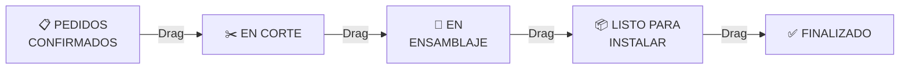
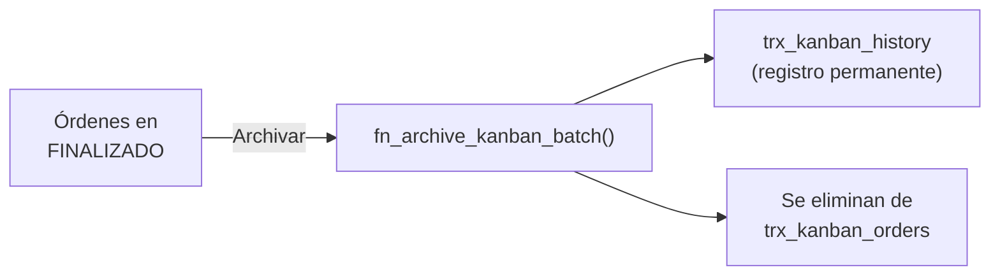

# T09 — Tutorial: Producción (Tablero Kanban)

> **Módulo:** Producción  
> **Ruta en la app:** `/production`  
> **Rol requerido:** ADMIN (todos los permisos); OPERARIO (mover tarjetas, crear, editar); SECRETARIA (solo ver)  
> **Última actualización:** Marzo 2026  

---

## 📋 ¿Qué es el Módulo de Producción?

El módulo de Producción es un **tablero Kanban visual** para seguir el avance de fabricación de cada pedido. Cada orden de trabajo es una "tarjeta" que avanza por columnas arrastrándola con el mouse (o tocándola en celular).

> **⚠️ Aislamiento Transaccional:** El Kanban opera de forma **100% independiente** del resto del ERP. Los campos como Cliente, Producto, Marca, etc. son **texto libre** — no están vinculados a las tablas de clientes ni cotizaciones. Esto significa que puedes crear órdenes sin tener el cliente registrado en el sistema.

> **🏭 Ejemplo de uso diario:** El operario llega a la fábrica, abre el Kanban, ve qué ventanas están "En Corte", termina de cortar una y la arrastra a "En Ensamblaje". El jefe lo ve desde su computadora al recargar.

---

## 🗂️ Las 5 Columnas del Tablero



| Columna | Color de Encabezado | Significado |
|---------|:---:|------------|
| **Pedidos Confirmados** | Gris oscuro | Pedido recibido, aún no se empieza a fabricar |
| **En Corte** | Cian | Se está cortando el aluminio y vidrio |
| **En Ensamblaje** | Ámbar | Se están ensamblando las piezas cortadas |
| **Listo para Instalar** | Naranja | Producto terminado, pendiente de entrega/instalación |
| **Finalizado** | Verde | Pedido entregado al cliente ✅ |

---

## 🖥️ Vista General del Tablero

```
┌────────────────────────────────────────────────────────────────────────────────┐
│  🏭 Tablero de Producción  [🔍 Buscar...]                                      │
│  [⚙️ Configuración] [📊 Estadísticas] [📥 Exportar] [📦 Archivar Finalizados] │
│  [📋 Pegar] [+ Nueva Orden] [❓]                                               │
├────────────┬──────────┬───────────┬──────────────┬───────────────────────────────┤
│ PEDIDOS    │ EN CORTE │ EN        │ LISTO PARA   │ FINALIZADO                   │
│CONFIRMADOS│   4/4    │ENSAMBLAJE │ INSTALAR     │                              │
│    (3)     │          │   2/3     │     (1)      │    (12)                      │
├────────────┼──────────┼───────────┼──────────────┼──────────────────────────────│
│ [+ Nueva]  │┌────────┐│┌─────────┐│┌────────────┐│┌───────────────────────────┐│
│ [📋 Pegar] ││OT-25001││ │OT-24312││ │OT-25010   │││OT-24998                   ││
│┌──────────┐││Cliente: │││Cliente: │││Cliente:    │││Archivado automáticamente  ││
││OT-25042  │││María L. │││Emp. SAC │││R.Díaz     │││                           ││
││Cliente:  │││1200×900 │││2400×2100│││1800×1200  ││└───────────────────────────┘│
││Juan G.   │││Marca:COR│││Color:BLA│││Entrega:   ││                             │
││Producto: │││Entrega: │││Retrabajo│││28/03/2026 ││                             │
││VCA Ser.25│││25/03/26 │││⚠️ 1    ││└────────────┘│                             │
│└──────────┘│└────────┘│└─────────┘│              │                              │
└────────────┴──────────┴───────────┴──────────────┴──────────────────────────────┘
```

---

## 🖱️ PARTE 1: Mover Tarjetas (Drag & Drop)

### ¿Cómo avanzar una orden?

1. **Haz clic y mantén presionado** sobre la tarjeta
2. **Arrastra** la tarjeta hacia la columna destino
3. **Suelta** — el estado se actualiza automáticamente en la base de datos

```
 [EN CORTE]              [EN ENSAMBLAJE]
  ┌────────┐    →→→    ┌────────┐
  │OT-25001│  ─────▶   │OT-25001│
  │María L.│  (drag)   │María L.│
  └────────┘           └────────┘
```

> **📱 En celular:** Mantén presionada la tarjeta por 1 segundo hasta que "flote", luego arrástrala.

### Movimiento hacia atrás (Retrabajo)

Si mueves una tarjeta **hacia la izquierda** (por ejemplo, de "En Ensamblaje" de vuelta a "En Corte"), el sistema detecta un **retrabajo**:

- Se incrementa automáticamente el **contador de rework** (⚠️)
- Se registra en el `rework_history` con fecha y columnas origen/destino
- La tarjeta mostrará una alerta naranja con el número de retrabajos

> **⚠️ Significado de rework:** Si una tarjeta muestra "⚠️ 2", significa que esa orden ha regresado 2 veces a etapas anteriores. Esto es un indicador de calidad.

### Historial de movimientos

Cada vez que mueves una tarjeta, el sistema registra automáticamente en `movement_history`:
- La **columna** a la que se movió
- La **fecha y hora** de entrada
- La **fecha y hora** de salida (cuando se mueve a la siguiente)

Este historial se usa para calcular tiempos de permanencia en cada etapa (visible en Estadísticas).

---

## ➕ PARTE 2: Crear una Nueva Orden de Trabajo

Haz clic en el botón **"+ Nueva Orden"** (o el botón **"+ Nueva"** dentro de la columna Pedidos Confirmados).

### Formulario de nueva orden

```
┌─────────────────────────────────────────────────────┐
│  NUEVA ORDEN DE TRABAJO                             │
├─────────────────────────────────────────────────────│
│  Cliente:       [Constructora Lima SAC]  (texto)    │
│  Producto:      [Ventana Corrediza S25]  (texto)    │
│  Descripción:   [3 ventanas + 1 mampara] (texto)   │
│  Marca:         [Corrales]               (texto)    │
│  Color:         [Blanco]                 (texto)    │
│  Tipo Cristal:  [Templado 6mm Incoloro]  (texto)    │
│  Ancho (mm):    [1200]                              │
│  Alto (mm):     [900]                               │
│  Fecha Entrega: [28/03/2026]             (fecha)    │
│  [Cancelar]                    [Guardar]            │
└─────────────────────────────────────────────────────┘
```

| Campo | Obligatorio | Qué ingresar |
|-------|:-:|-------------|
| **Cliente** | ✅ | Nombre del cliente (texto libre, sin vinculación al ERP) |
| **Producto** | ✅ | Tipo de producto a fabricar (ej: "VCA Serie 25") |
| **Descripción** | ❌ | Detalle adicional (ej: "3 ventanas para obra Miraflores") |
| **Marca** | ❌ | Marca de aluminio que se usará |
| **Color** | ❌ | Color/acabado del aluminio |
| **Tipo Cristal** | ❌ | Tipo de vidrio (ej: "Templado 6mm Incoloro") |
| **Ancho (mm)** | ✅ | Ancho de la ventana en milímetros |
| **Alto (mm)** | ✅ | Alto de la ventana en milímetros |
| **Fecha Entrega** | ✅ | Fecha comprometida de entrega al cliente |

> **💡 ID automático:** El sistema genera automáticamente un ID como `OT-25XXXX` (OT = Orden de Trabajo, 25 = año, XXXX = número aleatorio).

Al guardar, la tarjeta aparece en la columna **"Pedidos Confirmados"**.

---

## 📋 PARTE 3: Información en la Tarjeta

Cada tarjeta muestra esta información:

```
┌──────────────────────────────────┐
│ [Color del encabezado = columna] │
│  OT-25001          [📋][✏️][🗑️] │
├──────────────────────────────────┤
│  Cliente: María López            │
│  Producto: VCA Ser.25 - 2H       │
│  Medidas: 120cm x 90cm           │
│  ─────────────────────────       │
│  Marca: Corrales   Color: BLA    │
│  Cristal: Temp 6mm Creación: ... │
│  ─────────────────────────       │
│  ⚠️ 1         Entrega: 25/03/26 │
└──────────────────────────────────┘
```

| Elemento | Qué muestra |
|----------|------------|
| **Encabezado** (color) | Color de la columna actual. Contiene ID, botones copiar/editar/eliminar |
| **Cliente** | Nombre del cliente (texto libre) |
| **Producto** + Descripción | Nombre del producto + descripción adicional si tiene |
| **Medidas** | Ancho × Alto convertidos de mm a cm |
| **Marca / Color / Cristal** | Detalles de material en grid compacto |
| **Creación** | Fecha en que se creó la orden |
| **⚠️ N** | Contador de retrabajos (solo visible si > 0, en naranja) |
| **Entrega** | Fecha de entrega prometida. **Se pone roja** si ya venció |

### Botones de la tarjeta

| Botón | Qué hace |
|-------|----------|
| **📋 Copiar** | Copia los datos de esta orden para pegarla como nueva |
| **✏️ Editar** | Abre el formulario para modificar cualquier campo de la orden |
| **🗑️ Eliminar** | Archiva la orden al historial y la elimina del tablero (pide confirmación) |

---

## 📋 PARTE 4: Copiar y Pegar Órdenes

Para crear una orden similar a otra existente:

1. Haz clic en **📋 Copiar** en la tarjeta de la orden base
2. Aparece el toast "Copiado" y se activa el botón **"Pegar"** en la barra superior
3. Haz clic en **"📋 Pegar"** — se abre el formulario prellenado con los datos copiados
4. Modifica lo que necesites y guarda

> **💡 Tip:** Copiar/Pegar es útil cuando un cliente pide varios productos similares (ej: 5 ventanas del mismo modelo pero diferentes medidas).

---

## ⚙️ PARTE 5: Configuración del Tablero (WIP Limits)

El botón **"⚙️ Configuración"** abre un diálogo para configurar **límites WIP** (Work In Progress):

```
┌─────────────────────────────────────────────────────┐
│  CONFIGURACIÓN DEL TABLERO                          │
├─────────────────────────────────────────────────────│
│  Límite WIP — En Corte:        [4]                  │
│  Límite WIP — En Ensamblaje:   [3]                  │
│                                                      │
│  [Cancelar]                          [Guardar]      │
└─────────────────────────────────────────────────────┘
```

| Configuración | Qué es | Ejemplo |
|---------------|--------|---------|
| **Límite WIP En Corte** | Máximo de órdenes simultáneas en corte | 4 (si hay 5, la columna se pone roja) |
| **Límite WIP En Ensamblaje** | Máximo de órdenes simultáneas en ensamblaje | 3 |

> **🔴 Columna en rojo:** Cuando una columna supera su límite WIP, el borde de la columna cambia a **rojo** como alerta visual. Esto indica que el equipo está sobrecargado en esa etapa.

---

## 📊 PARTE 6: Estadísticas de Producción

El botón **"📊 Estadísticas"** abre un panel con métricas calculadas desde el historial de órdenes archivadas:

| Métrica | Qué mide |
|---------|----------|
| **Órdenes por estado** | Distribución actual: cuántas hay en cada columna |
| **Tiempo promedio por etapa** | Días promedio que una orden permanece en cada columna |
| **Lead Time total** | Tiempo total desde Pedido Confirmado hasta Finalizado |
| **Retrabajos** | Porcentaje de órdenes que han tenido al menos un retrabajo |
| **Tendencia mensual** | Evolución de la producción mes a mes |

> **💡 Tip:** Las estadísticas se alimentan del historial (`trx_kanban_history`). Cuantas más órdenes archives, más precisas serán las métricas.

---

## 📥 PARTE 7: Exportar el Tablero a Excel

El botón **"📥 Exportar"** descarga un archivo Excel con los datos del tablero y el historial para análisis externo.

---

## 📦 PARTE 8: Archivar Órdenes Finalizadas

El botón **"📦 Archivar Finalizados"** mueve **todas** las órdenes de la columna "Finalizado" al historial (`trx_kanban_history`) en una sola operación:



- Pide confirmación antes de ejecutar
- Las órdenes archivadas siguen visibles en Estadísticas
- Es irreversible: una vez archivadas, no vuelven al tablero activo

---

## 🔍 PARTE 9: Buscar Órdenes

La **barra de búsqueda** filtra tarjetas en tiempo real por:
- ID de la orden (ej: "OT-25001")
- Nombre del cliente
- Nombre del producto
- Marca
- Descripción adicional

---

## ❓ Preguntas Frecuentes

**¿El Kanban descuenta stock del inventario cuando muevo una tarjeta?**
> No. El Kanban es transaccionalmente **independiente** del inventario. El descuento de stock se hace manualmente en el módulo de Salidas cuando físicamente despachas el material.

**¿El Kanban está vinculado a las cotizaciones?**
> No. Los campos del Kanban son texto libre. Si tienes una cotización COT-0042, puedes poner ese número en el campo Producto o Descripción como referencia, pero no hay ningún vínculo automático.

**¿Quién puede mover tarjetas?**
> ADMIN y OPERARIO pueden mover, crear y editar tarjetas. SECRETARIA solo puede ver el tablero.

**¿Puedo tener el Kanban abierto en varios dispositivos?**
> Sí. Los cambios se guardan en Supabase. Al recargar la página en otro dispositivo, se ven los cambios actualizados.

**¿Qué es el "retrabajo" (rework)?**
> Cuando mueves una tarjeta **hacia atrás** (ej: de Ensamblaje a Corte), el sistema lo detecta como un retrabajo y aumenta el contador ⚠️. Esto es un KPI de calidad: muchos retrabajos indican problemas en el proceso.

**¿Qué pasa con las órdenes finalizadas si no las archivo?**
> Se quedan en la columna Finalizado indefinidamente. No afectan el rendimiento, pero es buena práctica archivarlas periódicamente para mantener el tablero limpio y alimentar las estadísticas.

---

## ⚠️ Errores Comunes

| Situación | Causa | Solución |
|-----------|-------|---------| 
| No puedo arrastrar tarjetas | Sin permiso (rol SECRETARIA) | Pedir al ADMIN cambiar tu rol a OPERARIO |
| Tarjeta no se mueve al soltar | Conexión lenta o error de red | Esperar y recargar la página. El movimiento se revierte automáticamente si falla |
| Columna se pone en rojo | Se excedió el límite WIP configurado | Terminar órdenes de esa columna antes de agregar más, o ajustar el límite en Configuración |
| Fecha de entrega en rojo | La fecha ya pasó y la orden no está finalizada | Entregar el pedido y mover a Finalizado, o editar la fecha |

---

## 🔗 Documentos Relacionados

- [T02_TUTORIAL_COTIZACIONES.md](./T02_TUTORIAL_COTIZACIONES.md) — Crear cotizaciones (referencia opcional para el Kanban)
- [T06_TUTORIAL_SALIDAS.md](./T06_TUTORIAL_SALIDAS.md) — Descontar el material usado en producción
- [10_FLUJOS_DE_NEGOCIO.md](../10_FLUJOS_DE_NEGOCIO.md) — Diagrama técnico del flujo de producción
- [02_ESQUEMA_BASE_DATOS.md](../02_ESQUEMA_BASE_DATOS.md) — Diagrama de tablas Kanban (sección 1b)
