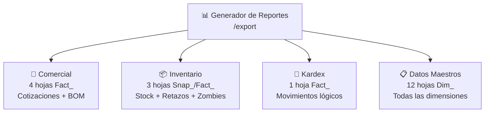
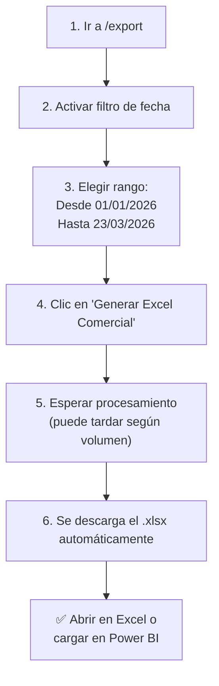
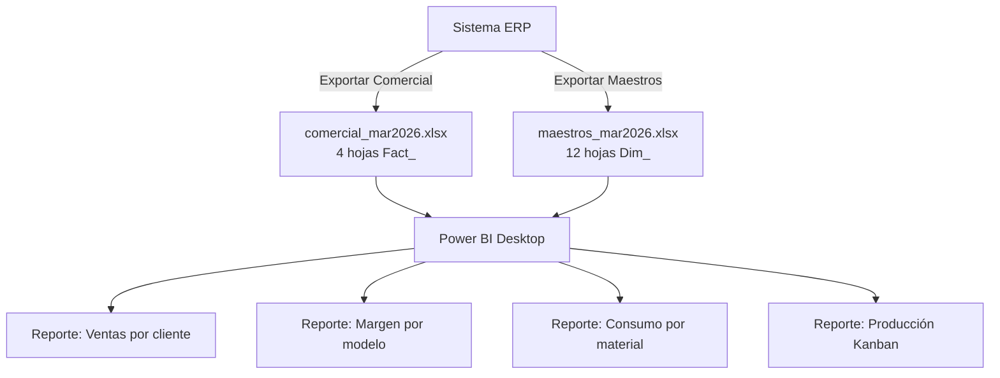

# T10 — Tutorial: Exportador Excel (Generador de Reportes)

> **Módulo:** Exportador Excel / Generador de Reportes  
> **Ruta en la app:** `/export`  
> **Rol requerido:** ADMIN, SECRETARIA  
> **Última actualización:** Marzo 2026  

---

## 📋 ¿Qué es el Exportador Excel?

El Exportador genera archivos **Excel (.xlsx) con múltiples hojas**, listos para análisis en Microsoft Excel o Power BI. No requiere conexión a servidores externos — el archivo se genera directamente en tu navegador y se descarga automáticamente.

> **💡 Enfoque Power BI:** Los nombres de las hojas usan prefijos `Fact_` (datos transaccionales), `Snap_` (fotos del estado actual) y `Dim_` (tablas maestras/dimensionales). Esto facilita la carga directa a modelos de datos en Power BI.

---

## 🗂️ Los 4 Tipos de Exportación



| Tipo | Para quién | Hojas incluidas | Usa filtro de fecha |
|------|-----------|----------------|:---:|
| **Comercial** | Gerente ventas, contador | 4 hojas: Cabecera + Detalle + Desglose + Producción | ✅ Sí |
| **Inventario** | Almacenero, auditor | 3 hojas: Stock Valorizado + Retazos + Stock Zombie | ❌ No (foto actual) |
| **Kardex** | Contador, auditor | 1 hoja: Movimientos Kardex del período | ✅ Sí |
| **Datos Maestros** | Sistemas, Power BI | 12 hojas: Todas las tablas dimensionales | ❌ No (estado actual) |

---

## 🖥️ Vista del Exportador

```
┌──────────────────────────────────────────────────────────────────┐
│  📊 GENERADOR DE REPORTES                                        │
│  Exportación de datos estructurados multi-hoja, optimizados      │
│  para Power BI y Excel Avanzado.                                  │
├──────────────────────────────────────────────────────────────────│
│  PARÁMETROS GLOBALES DE EXPORTACIÓN                              │
│  ☑️ Filtrar por Fecha de Emisión/Movimiento                     │
│  Desde: [23/02/2026]      ─      Hasta: [23/03/2026]            │
│  ⚠️ Desactivar el filtro descarga TODO el historial (lento)     │
├──────────────────────────────────────────────────────────────────│
│  ┌────────────────────────┐  ┌────────────────────────┐          │
│  │ 🛒 Módulo Comercial    │  │ 📦 Estado de Inventario │          │
│  │ Cotizaciones + BOM     │  │ Stock + Retazos + Zombie│          │
│  │ 4 hojas planas         │  │ 3 hojas (foto actual)   │          │
│  │ [Generar Excel Comerc.]│  │ [Generar Excel Invent.] │          │
│  └────────────────────────┘  └────────────────────────┘          │
│  ┌────────────────────────┐  ┌────────────────────────┐          │
│  │ 📒 Kardex Movimientos  │  │ 📁 Datos Maestros      │          │
│  │ Auditoría de Entr/Sal  │  │ Dimensiones para BI    │          │
│  │ 1 hoja transaccional   │  │ 12 hojas dimensionales  │          │
│  │ [Generar Excel Kardex] │  │ [Descargar Tablas Maes.]│          │
│  └────────────────────────┘  └────────────────────────┘          │
└──────────────────────────────────────────────────────────────────┘
```

---

## 📝 Tipo 1: Exportación Comercial (4 hojas)

### Cuándo usar:
- Análisis de ventas y márgenes
- Informe mensual para gerencia
- Alimentar dashboard de Power BI con datos de ventas

### Hojas del archivo generado:

| Hoja | Nombre Excel | Contenido |
|------|-------------|-----------|
| 1 | `Fact_Cotizaciones_Cabecera` | Una fila por cotización: número, fecha, cliente, moneda, marca, estado, markup, totales calculados |
| 2 | `Fact_Cotizaciones_Detalle` | Una fila por ventana/mampara: cotización padre, modelo, medidas, costo directo, precio de venta |
| 3 | `Fact_Desglose_Ingenieria` | Una fila por componente del BOM: SKU, tipo, longitud, cantidad, ángulo, costos unitarios y totales |
| 4 | `Fact_Produccion_Kanban` | Órdenes del tablero Kanban: ID, cliente, producto, marca, estado, medidas, fecha de creación y entrega |

### Cómo exportar paso a paso:



---

## 📦 Tipo 2: Exportación de Inventario (3 hojas)

### Cuándo usar:
- Valorización mensual del inventario para contabilidad
- Identificar stock inmovilizado (zombies)
- Control de mermas/retazos

### Hojas del archivo generado:

| Hoja | Nombre Excel | Contenido | Para qué sirve |
|------|-------------|-----------|----------------|
| 1 | `Snap_Inventario_Valorizado` | Todos los SKUs con stock actual, valor unitario PMP y valor total | Valorización contable |
| 2 | `Fact_Retazos_Disponibles` | Retazos reutilizables con SKU padre, longitud y estado | Control de mermas |
| 3 | `Stock_Zombie` | SKUs sin movimiento en 90+ días con valor estancado | Identificar capital inmovilizado |

> **📸 Es una foto:** No usa filtro de fecha. Exporta el estado del inventario **a este momento exacto**.

> **💡 Stock Zombie:** Son productos con stock pero sin movimiento en los últimos 90 días. Son capital inmovilizado que deberías revisar: quizás ya no se usan o hay que liquidar.

---

## 📒 Tipo 3: Exportación Kardex (1 hoja)

### Cuándo usar:
- Auditoría de movimientos por período
- Informe para SUNAT de entradas/salidas
- Verificación de stocks históricos o rastreo de mermas

### Hoja generada:

| Hoja | Nombre Excel |
|------|-------------|
| 1 | `Fact_Kardex_Movimientos` |

### Columnas principales:

| Columna | Descripción |
|---------|-------------|
| Fecha | Fecha y hora del movimiento |
| Tipo | COMPRA, VENTA, PRODUCCION, AJUSTE, RETORNO |
| SKU | Código del producto |
| Descripción | Nombre completo del SKU |
| Cantidad | Positiva (entrada) o negativa (salida) |
| Moneda Origen | PEN o USD del documento original |
| Costo Unitario Doc. | Costo en la moneda del documento |
| Tipo Cambio | Tasa USD→PEN aplicada |
| Costo Total PEN | Valor total en soles |
| Referencia Doc | UUID del documento de entrada/salida |

---

## 📋 Tipo 4: Exportación Datos Maestros (12 hojas)

### Cuándo usar:
- Cargar el catálogo completo a Power BI como tablas dimensionales
- Backup de datos de referencia
- Migración o integración con otro sistema

### Hojas del archivo generado:

| # | Hoja | Nombre Excel | Contenido |
|---|------|-------------|-----------|
| 1 | Catálogo SKU | `Dim_SKU_Catalogo` | Todos los SKUs con plantilla, marca, familia, precios, stock mínimo |
| 2 | Clientes | `Dim_Clientes` | RUC, razón social, teléfono, tipo cliente |
| 3 | Proveedores | `Dim_Proveedores` | RUC, razón social, contacto, días crédito, moneda |
| 4 | Familias | `Dim_Familias` | Categorías de productos |
| 5 | Sistemas | `Dim_Sistemas` | Series/Sistemas con códigos multi-distribuidor |
| 6 | Plantillas | `Dim_Plantillas` | Plantillas genéricas con largo estándar |
| 7 | Modelos Receta | `Dim_Recetas_Modelos` | Modelos de ventana con tipo_dibujo y config hojas |
| 8 | Recetas Ingeniería | `Dim_Recetas_Ing` | Líneas de receta con fórmulas, secciones y condiciones |
| 9 | Almacenes | `Dim_Almacenes` | Lista de almacenes físicos |
| 10 | Marcas | `Dim_Marcas` | Marcas comerciales con país de origen |
| 11 | Acabados | `Dim_Acabados` | Acabados/colores con sufijo SKU |
| 12 | Materiales | `Dim_Materiales` | Tipos de material con código Odoo |

> **📸 Es una foto:** No usa filtro de fecha. Exporta todo el estado actual de las tablas maestras.

> **💡 Para Power BI:** Exporta Datos Maestros + Comercial del período que necesitas. En Power BI, carga ambos archivos y relaciona por SKU, ID Cliente, ID Modelo, etc. para crear reportes con cruce de información.

---

## 📊 ¿Cómo usar en Power BI?



**Pasos básicos en Power BI:**
1. Abrir Power BI Desktop → **Obtener datos** → **Excel**
2. Seleccionar el archivo exportado
3. Marcar todas las hojas que quieres cargar (las `Fact_` y `Dim_`)
4. Clic en **Cargar**
5. En el modelo, crear relaciones:
   - `Fact_Cotizaciones_Detalle[id_cotizacion]` → `Fact_Cotizaciones_Cabecera[id_cotizacion]`
   - `Fact_Cotizaciones_Cabecera[id_cliente]` → `Dim_Clientes[id_cliente]`
   - `Fact_Desglose_Ingenieria[sku_real]` → `Dim_SKU_Catalogo[id_sku]`

---

## ⚙️ Parámetros Globales de Exportación

El panel superior tiene controles que aplican a **todos los tipos**:

| Parámetro | Descripción |
|-----------|-------------|
| **☑️ Filtrar por Fecha** | Activa/desactiva el filtro de periodo. Si se desactiva, exporta TODO el historial (puede ser muy lento) |
| **Desde** | Fecha de inicio del período (default: hace 30 días) |
| **Hasta** | Fecha de fin del período (default: hoy) |

> **⚠️ Atención:** Si desactivas el filtro de fecha, la exportación descarga TODO el historial sin límite temporal. En bases de datos grandes, esto puede tardar varios minutos y consumir mucha memoria del navegador.

---

## ❓ Preguntas Frecuentes

**¿El archivo Excel se actualiza automáticamente?**
> No. Cada vez que necesitas datos actualizados, debes hacer una nueva exportación. El archivo descargado es una "foto" de ese momento.

**¿Puedo descargar un rango de fechas muy largo (1 año)?**
> Sí, pero puede tardar más. Archivos grandes (100,000+ filas) pueden demorar 30-60 segundos en generarse.

**¿El filtro de fecha aplica a Inventario y Datos Maestros?**
> No. El filtro de fecha solo afecta a **Comercial** y **Kardex** (datos transaccionales). Inventario y Datos Maestros siempre exportan el estado actual completo.

**¿Se puede exportar solo las cotizaciones de un cliente específico?**
> No directamente desde el exportador. Exporta todas, luego filtra en Excel usando la columna "Cliente".

**¿Por qué los nombres de hojas tienen prefijos como Fact_ y Dim_?**
> Es la convención de modelado dimensional para análisis de datos. `Fact_` = tablas de hechos (transacciones). `Dim_` = tablas de dimensiones (catálogos). `Snap_` = fotos de estado actual. Esto facilita la integración con Power BI.

---

## ⚠️ Situaciones Comunes

| Situación | Causa | Solución |
|-----------|-------|---------| 
| Descarga no inicia | Bloqueador de popups activo | Permitir popups en este sitio |
| Archivo descargado tiene 0 registros | Sin datos en el período seleccionado | Ampliar el rango de fechas o desactivar el filtro |
| Error al abrir en Excel | Versión Excel muy antigua | Usar Excel 2016 o más reciente |
| Tarda más de 2 minutos | Demasiados datos o filtro desactivado | Activar filtro de fecha y reducir el rango |
| Error "Extrayendo Datos..." se queda cargando | Timeout del navegador por volumen | Reducir el rango de fechas hasta que funcione |

---

## 🔗 Documentos Relacionados

- [T04_TUTORIAL_INVENTARIO.md](./T04_TUTORIAL_INVENTARIO.md) — Qué incluye el stock valorizado
- [T07_TUTORIAL_KARDEX.md](./T07_TUTORIAL_KARDEX.md) — Qué datos están en el Kardex
- [T02_TUTORIAL_COTIZACIONES.md](./T02_TUTORIAL_COTIZACIONES.md) — Qué datos están en el Comercial
- [02_ESQUEMA_BASE_DATOS.md](../02_ESQUEMA_BASE_DATOS.md) — Estructura de vistas usadas en las exportaciones
