# T12 — Tutorial: Configuración del Sistema

> **Módulo:** Configuración  
> **Ruta en la app:** `/configuracion` y `/settings`  
> **Rol requerido:** Solo ADMIN  
> **Última actualización:** Febrero 2026  

---

## 📋 ¿Qué es la Configuración?

La Configuración es el panel donde defines los **parámetros globales** del sistema: datos de tu empresa, tasas económicas (IGV, markup), tipo de cambio, cuentas bancarias y personalización visual. Estos parámetros afectan automáticamente a cotizaciones, reportes e impresiones.

> **⚠️ Solo el ADMIN puede acceder a la configuración.** Si no tienes este rol, el menú no aparecerá.

---

## 🗂️ Secciones de Configuración

```mermaid
graph TD
    CONF["⚙️ Configuración<br/>/configuracion"] --> EMP["🏢 Datos de Empresa"]
    CONF --> ECON["💰 Parámetros Económicos"]
    CONF --> BANCO["🏦 Cuentas Bancarias"]
    CONF --> TEXT["📄 Textos de Cotización"]
    CONF --> VISUAL["🎨 Personalización Visual"]
```



---

## 🏢 SECCIÓN 1: Datos de la Empresa

Estos datos aparecen en el encabezado de todas las cotizaciones impresas:

```
┌─────────────────────────────────────────────────────┐
│  DATOS DE LA EMPRESA                                │
├─────────────────────────────────────────────────────│
│  Nombre de Empresa:  [Vidriería del Norte SAC]      │
│  RUC:                [20501234567]                  │
│  Dirección:          [Av. Industrial 1450, Lima]    │
│  Teléfono:           [01-234-5678]                  │
│  Correo:             [ventas@vidrieria.com]         │
│  Web:                [www.vidrieria.com]            │
│  Logo:               [Subir imagen.png] 📎          │
│  Firma digital:      [Subir. firma.png] 📎          │
└─────────────────────────────────────────────────────┘
```

| Campo | Dónde aparece |
|-------|--------------|
| **Nombre empresa** | Encabezado de cotizaciones, reportes |
| **RUC** | Encabezado de cotizaciones |
| **Dirección** | Pie de cotizaciones |
| **Logo** | Esquina superior de cotizaciones imprimibles |
| **Firma digital** | Pie de cotizaciones (versión con firma) |

> **Formatos de logo aceptados:** PNG o JPG hasta 2MB. Recomendado: 400×200px sobre fondo transparente o blanco.

---

## 💰 SECCIÓN 2: Parámetros Económicos

Estos valores afectan directamente todos los cálculos de cotizaciones:

| Parámetro | Valor actual | Qué afecta |
|-----------|-------------|-----------|
| **Tasa IGV** | 18% | Se suma al precio final de cada cotización |
| **Markup default** | 35% | Margen de ganancia (`markup_cotizaciones_default`) en nuevas cotizaciones |
| **Costo MO (m²)** | S/25.00/m² | Costo mano de obra (`costo_mo_m2_default`) en base al cristal |
| **Tipo de cambio** | S/3.75 | Conversión PEN/USD global |
| **Descuento Máx %** | 0.15 (15%) | Límite porcentual negociable que acepta el sistema  |
| **Validez de cotiz.** | 15 días | Días que la cotización es válida (aparece en documento) |
| **Moneda default** | PEN (Soles) | Pre-selección en nuevas cotizaciones |

### Cómo funcionan los parámetros en la cotización:

```mermaid
flowchart LR
    M["Costo Materiales<br/>S/231.10"] --> CD
    MO["Mano de Obra<br/>3m² × S/25 = S/75"] --> CD
    CD["Costo Directo<br/>S/306.10"] --> P
    P[" × Markup 35%<br/>= S/413.24"] --> IGV
    IGV["+ IGV 18%<br/>= S/487.62"] --> FIN
    FIN["💰 Precio Final<br/>S/487.62"]
```



### Cambiar el Markup

El markup del 35% es el default para **nuevas cotizaciones**. Puedes ajustarlo por cotización individual sin cambiar el default aquí.

Si cambias el markup default en Configuración:
- ✅ Afecta todas las **nuevas** cotizaciones creadas después del cambio
- ❌ No afecta las cotizaciones ya existentes

---

## 🏦 SECCIÓN 3: Cuentas Bancarias

Las cuentas aparecen automáticamente en el pie de las cotizaciones impresas (si la opción está activada en el editor de impresión).

```
┌─────────────────────────────────────────────────────┐
│  CUENTAS BANCARIAS                                  │
├─────────────────────────────────────────────────────│
│  BCP SOLES:     [000-12345678-0-01]                 │
│  BCP DÓLARES:   [000-98765432-1-76]                 │
│  BBVA SOLES:    [0011-0215-01234567-19]             │
│  BBVA DÓLARES:  [011-321-000123456789-55]           │
│  Interbancario: [00200011021501234567]               │
└─────────────────────────────────────────────────────┘
```

Completa solo las cuentas que uses. Las vacías no aparecen en la cotización.

---

## 📄 SECCIÓN 4: Textos y Firmantes

Textos y variables para la generación de la cotización impresa. Puedes personalizar:

| Texto | Ejemplo | Aparece en |
|-------|---------|-----------|
| **Cond. Bases** | "1. Las instalaciones corren bajo..." | Cláusulas de las cotizaciones impresas |
| **Formas de Pago**| "50% al inicio, 50% a la entrega" | Pie de cotización |
| **Garantía** | "12 meses contra defectos de fabricación" | Cotización impresa |
| **Notas Pie** | "Precios válidos 15 días" | Parte más baja de la cotización impresa |
| **Representante** | "Carlos Vidal" | Nombre del ejecutivo a cargo de la firma |
| **Cargo Repres.** | "Gerente General" | Cargo mostrado debajo del representante |
| **Color Primario** | "#2563eb" (Azul HEX) | Marca visual usada en el PDF |

## 🔐 SECCIÓN 6: Gestión de Usuarios y Roles

En `/settings` (sección avanzada), el ADMIN puede:

```
┌──────────────────────────────────────────────────────┐
│  GESTIÓN DE USUARIOS                                 │
├────────────┬───────────────────┬──────────┬──────────┤
│ Email      │ Nombre            │ Rol      │ Acciones │
├────────────┼───────────────────┼──────────┼──────────┤
│ a@emp.com  │ Carlos Admin      │ ADMIN    │ ✏️ 🔒   │
│ s@emp.com  │ María Secretaria  │ SECRETARIA│ ✏️ 🔒  │
│ o@emp.com  │ Pedro Operario    │ OPERARIO │ ✏️ 🔒   │
└────────────┴───────────────────┴──────────┴──────────┘
```

Para gestión detallada de usuarios, ver: [11_AUTENTICACION_Y_ROLES.md](../11_AUTENTICACION_Y_ROLES.md)

---

## 💡 Flujo: Primera Configuración del Sistema

Si el sistema acaba de instalarse, sigue este orden de configuración:

```mermaid
flowchart TD
    A["1️⃣ Datos de empresa<br/>(nombre, RUC, logo)"] --> B["2️⃣ Parámetros económicos<br/>(IGV, markup, MO)"]
    B --> C["3️⃣ Cuentas bancarias"]
    C --> D["4️⃣ Textos de cotización<br/>(garantía, condiciones)"]
    D --> E["5️⃣ Crear usuarios<br/>(secretaria, operario)"]
    E --> F["6️⃣ Crear familias<br/>y marcas en Catálogo"]
    F --> G["7️⃣ Cargar proveedores<br/>y clientes"]
    G --> H["8️⃣ Cargar productos al Catálogo<br/>(plantillas + SKUs)"]
    H --> I["9️⃣ Crear recetas<br/>(modelos de ventana)"]
    I --> J["✅ Sistema listo para<br/>primera cotización"]
```



---

## ❓ Preguntas Frecuentes

**¿Puedo tener diferentes markups por familia de producto?**
> Actualmente el markup es global. Se puede ajustar por ítem individual en la cotización.

**¿El tipo de cambio se actualiza automáticamente?**
> No. Se actualiza manualmente aquí. Recuerda actualizar el tipo de cambio regularmente para que las conversiones sean precisas.

**¿Qué pasa si cambio el IGV?**
> Las cotizaciones nuevas tendrán el nuevo IGV. Las existentes mantienen el que tenían al crearse.

**¿Puedo subir el logo en cualquier formato?**
> Recomendado PNG con fondo transparente. JPG también funciona pero sin transparencia.

---

## ⚠️ Advertencias Importantes

> **No cambies el markup durante un período de cotizaciones activas** sin notificar al equipo. Podría causar inconsistencia entre cotizaciones presentadas en el mismo período.

> **Guarda el logo antes de imprimir cotizaciones.** Si no hay logo configurado, el espacio del logo aparecerá en blanco en el PDF.

---

## 🔗 Documentos Relacionados

- [11_AUTENTICACION_Y_ROLES.md](../11_AUTENTICACION_Y_ROLES.md) — Gestión detallada de usuarios y roles
- [T02_TUTORIAL_COTIZACIONES.md](./T02_TUTORIAL_COTIZACIONES.md) — Cómo se aplican estos parámetros
- [12_GUIA_SUPABASE.md](../12_GUIA_SUPABASE.md) — Configuración avanzada en la base de datos
