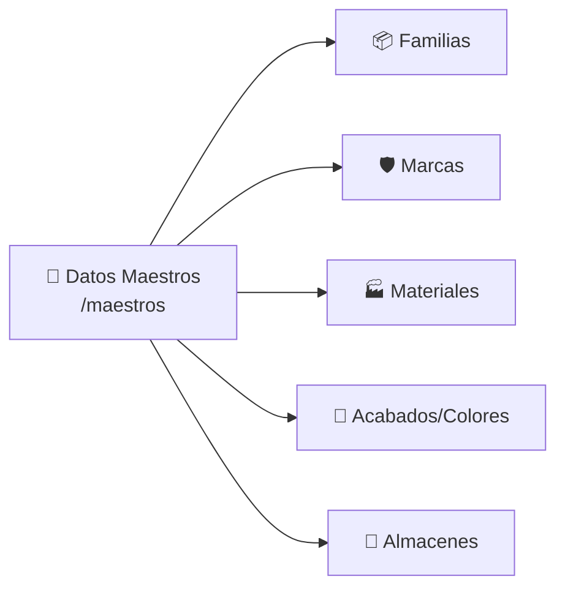

# T13 — Tutorial: Datos Maestros

> **Módulo:** Datos Maestros  
> **Ruta en la app:** `/maestros` (principal), `/maestros/series` (Series)  
> **Rol requerido:** ADMIN (CRUD completo); SECRETARIA y OPERARIO (solo lectura)  
> **Última actualización:** Marzo 2026  

---

## 📋 ¿Qué son los Datos Maestros?

Los Datos Maestros son las **tablas de referencia** que alimentan a todo el sistema. Son los "diccionarios" que se usan en catálogos, cotizaciones, inventario y recetas. Si necesitas agregar una familia nueva de productos, una marca, un acabado o un almacén, es aquí donde lo haces.

> **🏭 Ejemplo:** Antes de crear un SKU de perfil "Aluminio Blanco marca Corrales", necesitas que existan: la familia "Perfiles", el material "Aluminio", el acabado "Blanco" y la marca "Corrales". Todo eso se gestiona desde aquí.

---

## 🗂️ Las 5 Pestañas del Módulo



| Pestaña | Tabla | Campos | Para qué sirve |
|---------|-------|--------|----------------|
| **Familias** | `mst_familias` | ID, Nombre, Categoría Odoo | Agrupar productos: Perfiles, Vidrios, Accesorios, etc. |
| **Marcas** | `mst_marcas` | ID, Nombre, País de Origen | Marcas comerciales de aluminio: Corrales, HPD, Eduholding |
| **Materiales** | `mst_materiales` | ID, Nombre, Código Odoo | Tipos de material: Aluminio, Vidrio, PVC, Acero |
| **Acabados/Colores** | `mst_acabados_colores` | ID, Nombre, Sufijo SKU | Acabados: Blanco (BLA), Natural (NAT), Champagne (CHA) |
| **Almacenes** | `mst_almacenes` | ID, Nombre | Almacenes físicos del negocio |

---

## 🖥️ Vista General

```
┌──────────────────────────────────────────────────────────────┐
│  📁 Datos Maestros                                            │
│  Gestión centralizada de entidades paramétricas               │
├──────────────────────────────────────────────────────────────│
│  [📦 Familias] [🛡️ Marcas] [🏭 Materiales] [🎨 Acabados] [🏢 Almac.] │
├──────────────────────────────────────────────────────────────│
│  Buscar: [           ]                     [+ Nuevo] (Admin) │
│  ┌────────┬───────────────────┬──────────────┬───────┐       │
│  │ ID     │ Nombre            │ Campo Extra  │Acciones│      │
│  ├────────┼───────────────────┼──────────────┼───────┤       │
│  │ PER    │ Perfiles          │ Perfiles     │ ✏️ 🗑️│       │
│  │ VID    │ Vidrios           │ Vidrios      │ ✏️ 🗑️│       │
│  │ ACC    │ Accesorios        │ Accesorios   │ ✏️ 🗑️│       │
│  └────────┴───────────────────┴──────────────┴───────┘       │
│  Mostrando 1-50 de 8    [50▼] [< Anterior] [Siguiente >]     │
└──────────────────────────────────────────────────────────────┘
```

---

## ➕ Crear un Nuevo Registro

> **Solo ADMIN** puede crear, editar y eliminar. Otros roles ven la tabla en modo lectura.

1. Selecciona la pestaña correspondiente (ej: "Familias")
2. Haz clic en **"+ Nuevo"**
3. Llena los campos del formulario:

```
┌─────────────────────────────────────────────────────┐
│  NUEVA FAMILIA                                      │
├─────────────────────────────────────────────────────│
│  ID Familia:     [ACC]         (código corto único) │
│  Nombre Familia: [Accesorios]  (nombre descriptivo) │
│  Categoría Odoo: [Accesorios]  (opcional)           │
│  [Cancelar]                              [Guardar]  │
└─────────────────────────────────────────────────────┘
```

### Campos por pestaña

| Pestaña | Campo ID | Campo Nombre | Campo Extra |
|---------|---------|-------------|-------------|
| **Familias** | `id_familia` (ej: PER) | Nombre Familia | Categoría Odoo |
| **Marcas** | `id_marca` (ej: COR) | Nombre Marca | País de Origen |
| **Materiales** | `id_material` (ej: AL) | Nombre Material | Código Odoo |
| **Acabados** | `id_acabado` (ej: BLA) | Nombre Acabado | **Sufijo SKU** (crítico para el catálogo) |
| **Almacenes** | `id_almacen` (ej: ALM1) | Nombre Almacén | — |

> **⚠️ El Sufijo SKU de Acabados es crítico:** Este sufijo se usa para construir automáticamente los códigos SKU del catálogo. Por ejemplo, si el acabado "Blanco" tiene sufijo `BLA`, el sistema genera SKUs como `AL-2001-BLA-COR`. Si lo cambias, los SKUs existentes ya no coincidirán.

---

## ✏️ Editar un Registro

1. Haz clic en **✏️ Editar** en la fila del registro
2. Modifica los campos necesarios
3. Haz clic en **"Guardar"**

> **💡 Nota:** No puedes cambiar el ID (clave primaria) de un registro existente. Solo puedes editar el nombre y el campo extra.

---

## 🗑️ Eliminar un Registro

1. Haz clic en **🗑️ Eliminar** en la fila del registro
2. Confirma la eliminación

> **⚠️ Restricción de FK:** Si el registro está en uso por otra tabla (por ejemplo, una familia usada en plantillas), el sistema mostrará un error de "clave foránea violada" (código PostgreSQL `23503`) y **no permitirá eliminarlo**. Primero debes eliminar o reasignar los registros que dependen de él.

---

## 🗂️ Series/Sistemas (Ruta separada)

Las **Series de Perfilería** se gestionan en una ruta separada: `/maestros/series`.

Esta tabla (`mst_series_equivalencias`) tiene campos adicionales para mapear los códigos equivalentes entre distribuidores:

| Campo | Para qué |
|-------|----------|
| `id_sistema` | Código interno (ej: S25) |
| `nombre_comercial` | Nombre visible (ej: "Serie 25") |
| `cod_corrales` | Código del proveedor Corrales |
| `cod_eduholding` | Código del proveedor Eduholding |
| `cod_hpd` | Código del proveedor HPD |
| `cod_limatambo` | Código del proveedor Limatambo |
| `uso_principal` | Para qué se usa (ej: "Ventanas corredizas") |

---

## ❓ Preguntas Frecuentes

**¿Dónde configuro IGV, markup y datos de empresa?**
> Eso está en [T12_TUTORIAL_CONFIGURACION.md](./T12_TUTORIAL_CONFIGURACION.md) → módulo de Configuración (`/configuracion`).

**¿Por qué no puedo crear ni editar registros?**
> Solo el rol ADMIN tiene permisos de escritura en las tablas maestras. Si tu rol es SECRETARIA u OPERARIO, solo puedes ver los datos.

**¿Si agrego una familia nueva, aparece automáticamente en el catálogo?**
> No automáticamente. La familia aparece como opción al crear plantillas en el Catálogo, pero debes crear plantillas y SKUs manualmente. Ver [T03_TUTORIAL_CATALOGO.md](./T03_TUTORIAL_CATALOGO.md).

**¿Puedo importar datos maestros desde Excel?**
> No desde la UI. Consulta la guía [CSV_A_SQL_UPSERT.md](../CSV_A_SQL_UPSERT.md) para carga masiva vía SQL.

---

## 🔗 Documentos Relacionados

- [T03_TUTORIAL_CATALOGO.md](./T03_TUTORIAL_CATALOGO.md) — Cómo crear plantillas y SKUs usando estos maestros
- [T08_TUTORIAL_RECETAS.md](./T08_TUTORIAL_RECETAS.md) — Cómo las recetas referencian plantillas, materiales y marcas
- [T12_TUTORIAL_CONFIGURACION.md](./T12_TUTORIAL_CONFIGURACION.md) — Configuración global del ERP (IGV, markup, empresa)
- [02_ESQUEMA_BASE_DATOS.md](../02_ESQUEMA_BASE_DATOS.md) — Diagrama ERD de todas las tablas maestras
