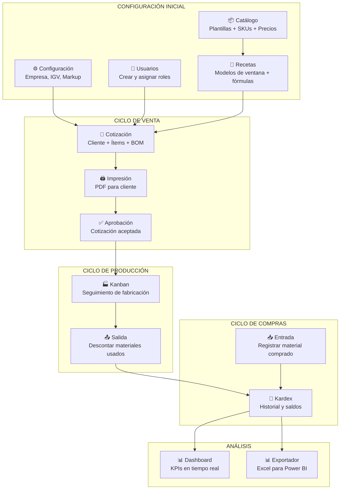
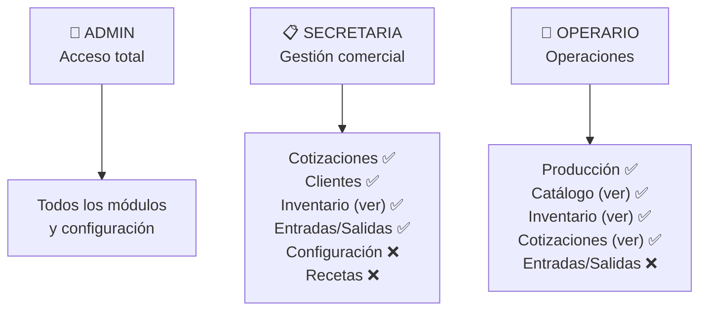

# 00 — Índice Maestro de la Documentación

> **Sistema:** ERP de Inventario y Cotizaciones — Carpintería Metálica / Vidriería de Aluminio  
> **Versión Stack:** Next.js 16 + Supabase PostgreSQL 17 + TanStack Query  
> **Última actualización:** Febrero 2026  

---

## 🚀 ¿Por dónde empezar?

```mermaid
graph TD
    SOY{{"¿Quién eres?"}}
    SOY -->|Usuario del sistema\n(secretaria, operario)| USR["📚 TUTORIALES DE USUARIO\nVer sección Tutoriales abajo"]
    SOY -->|Administrador del sistema| ADM["⚙️ GUÍAS DE ADMINISTRACIÓN\nVer sección Admin abajo"]
    SOY -->|Desarrollador / IT| DEV["🔧 DOCS TÉCNICOS\nVer sección Técnicos abajo"]
    SOY -->|Emergencia / Crisis| EMG["🚨 CONTINGENCIA\n13_CONTINGENCIA_RECUPERACION.md"]
```

---

## 📚 Sección 1: Tutoriales para Usuarios Finales

> Guías paso a paso para usar cada módulo del sistema. Sin conocimientos técnicos necesarios.

| # | Tutorial | Módulo | Ruta App | Para quién |
|---|---------|--------|----------|-----------|
| T01 | [Dashboard KPI](./tutoriales/T01_TUTORIAL_DASHBOARD.md) | Dashboard | `/dashboard` | Todos |
| T02 | [Cotizaciones](./tutoriales/T02_TUTORIAL_COTIZACIONES.md) | Cotizaciones | `/cotizaciones` | Admin, Secretaria |
| T03 | [Catálogo de Productos](./tutoriales/T03_TUTORIAL_CATALOGO.md) | Catálogo | `/catalog` | Admin |
| T04 | [Inventario / Stock](./tutoriales/T04_TUTORIAL_INVENTARIO.md) | Inventario | `/inventory` | Todos |
| T05 | [Entradas (Compras)](./tutoriales/T05_TUTORIAL_ENTRADAS.md) | Entradas | `/inventory` → Entradas | Admin, Secretaria |
| T06 | [Salidas (Despachos)](./tutoriales/T06_TUTORIAL_SALIDAS.md) | Salidas | `/inventory` → Salidas | Admin, Secretaria |
| T07 | [Kardex](./tutoriales/T07_TUTORIAL_KARDEX.md) | Kardex | `/inventory` → Kardex | Todos |
| T08 | [Recetas de Ingeniería](./tutoriales/T08_TUTORIAL_RECETAS.md) | Recetas | `/recetas` | Admin |
| T09 | [Producción (Kanban)](./tutoriales/T09_TUTORIAL_PRODUCCION.md) | Producción | `/production` | Admin, Operario |
| T10 | [Exportador Excel](./tutoriales/T10_TUTORIAL_EXPORTADOR.md) | Exportador | `/export` | Admin, Secretaria |
| T11 | [Clientes y Proveedores](./tutoriales/T11_TUTORIAL_CLIENTES_PROVEEDORES.md) | CRM | `/clients`, `/suppliers` | Admin, Secretaria |
| T12 | [Configuración del Sistema](./tutoriales/T12_TUTORIAL_CONFIGURACION.md) | Configuración | `/configuracion` | Solo Admin |

---

## ⚙️ Sección 2: Guías de Administración del Sistema

| Documento | Qué cubre | Cuándo usarlo |
|-----------|-----------|-------------|
| [11_AUTENTICACION_Y_ROLES.md](./11_AUTENTICACION_Y_ROLES.md) | Crear usuarios, asignar roles, desactivar acceso | Alta/baja de empleados |
| [12_GUIA_SUPABASE.md](./12_GUIA_SUPABASE.md) | Panel Supabase, API, seguridad, monitoreo | Mantenimiento mensual |
| [13_CONTINGENCIA_RECUPERACION.md](./13_CONTINGENCIA_RECUPERACION.md) | Backups, keep-alive, recuperación de desastres | Emergencias y preventivo |
| [T12_TUTORIAL_CONFIGURACION.md](./tutoriales/T12_TUTORIAL_CONFIGURACION.md) | IGV, markup, empresa, cuentas bancarias | Configuración inicial o ajustes |

---

## 🔧 Sección 3: Documentación Técnica

> Para desarrolladores, IT y personal técnico que necesita entender la arquitectura.

| # | Documento | Contenido |
|---|-----------|-----------|
| 01 | [Arquitectura General](./01_ARQUITECTURA_GENERAL.md) | Stack tecnológico, capas, despliegue, seguridad |
| 02 | [Esquema Base de Datos](./02_ESQUEMA_BASE_DATOS.md) | Todas las tablas, columnas, tipos y relaciones |
| 03 | [Módulos y Funcionalidades](./03_MODULOS_Y_FUNCIONALIDADES.md) | Mapa de módulos, rutas y APIs de cada uno |
| 04 | [Referencia de API](./04_API_REFERENCIA.md) | Funciones de la API, parámetros y ejemplos |
| 05 | [Guía del Desarrollador](./05_GUIA_DESARROLLADOR.md) | Setup local, convenciones, cómo extender el sistema |
| 06 | [Blindaje Arquitectónico](./06_BLINDAJE_ARQUITECTONICO.md) | Protecciones, versiones congeladas, antipatrones |
| 07 | [Guía de Despliegue](./07_GUIA_DESPLIEGUE_ESTATICO.md) | Build, deploy en CDN/IIS/S3, variables de entorno |
| 08 | [Arquitectura de Recetas](./08_ARQUITECTURA_RECETAS.md) | Motor BOM, fórmulas, resolución de SKUs |
| 09 | [Diccionario de Datos](./09_DICCIONARIO_DATOS.md) | Referencia de cada campo de cada tabla |
| 10 | [Flujos de Negocio](./10_FLUJOS_DE_NEGOCIO.md) | Diagramas de secuencia de los procesos clave |
| 11 | [Autenticación y Roles](./11_AUTENTICACION_Y_ROLES.md) | JWT, RLS, políticas de acceso |
| 12 | [Guía Supabase](./12_GUIA_SUPABASE.md) | Configuración, API, monitoreo, backups |
| 13 | [Contingencia y Recuperación](./13_CONTINGENCIA_RECUPERACION.md) | Self-hosting, backups, keep-alive, disaster recovery |

---

## 🗂️ Sección 4: Documentos de Migración y Operaciones

| Documento | Contenido |
|-----------|-----------|
| [CSV_A_SQL_UPSERT.md](./CSV_A_SQL_UPSERT.md) | Cómo cargar datos desde CSV a la BD |
| [PLAN_MIGRACION_MASIVA.md](./PLAN_MIGRACION_MASIVA.md) | Procedimiento de migración masiva de datos |
| [migration_guide.md](./migration_guide.md) | Guía de migraciones de schema |
| [prompt_para_migracion_datos.md](./prompt_para_migracion_datos.md) | Prompts de IA para migración de datos |

---

## 📂 Sección 5: Documentos Raíz del Proyecto

| Documento | Dónde está | Contenido |
|-----------|-----------|-----------|
| [README.md](../README.md) | Raíz del proyecto | Introducción y quick start |
| [HANDOFF_MAESTRO.md](../HANDOFF_MAESTRO.md) | Raíz del proyecto | Protocolo de entrega y estado del sistema |
| [CONTINGENCIA_SUPABASE.md](../CONTINGENCIA_SUPABASE.md) | Raíz del proyecto | Resumen de emergencia (plan B) |
| [CHANGELOG_CORRECCIONES_2026-02-10.md](../CHANGELOG_CORRECCIONES_2026-02-10.md) | Raíz del proyecto | Historial de cambios |
| [GIT_GUIDE.md](../GIT_GUIDE.md) | Raíz del proyecto | Cómo hacer commits y pushes |

---

## 🗺️ Mapa de Flujo del Sistema (Vista Proceso de Negocio)



---

## 🔑 Roles y Acceso por Sección



---

## 📞 Referencia Rápida de Soporte

| Situación | Documento |
|-----------|-----------|
| El sistema no carga / página en blanco | [13_CONTINGENCIA_RECUPERACION.md](./13_CONTINGENCIA_RECUPERACION.md) |
| No puedo hacer login | [11_AUTENTICACION_Y_ROLES.md](./11_AUTENTICACION_Y_ROLES.md) |
| El stock muestra datos incorrectos | [T07_TUTORIAL_KARDEX.md](./tutoriales/T07_TUTORIAL_KARDEX.md) |
| La cotización no calcula el despiece | [T08_TUTORIAL_RECETAS.md](./tutoriales/T08_TUTORIAL_RECETAS.md) |
| No sé cómo registrar una compra | [T05_TUTORIAL_ENTRADAS.md](./tutoriales/T05_TUTORIAL_ENTRADAS.md) |
| Supabase está caído / pausado | [13_CONTINGENCIA_RECUPERACION.md](./13_CONTINGENCIA_RECUPERACION.md) |
