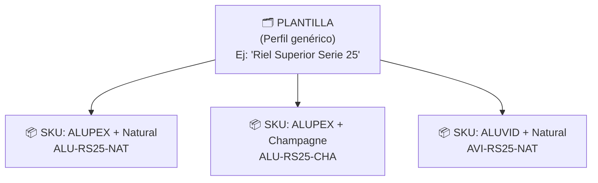
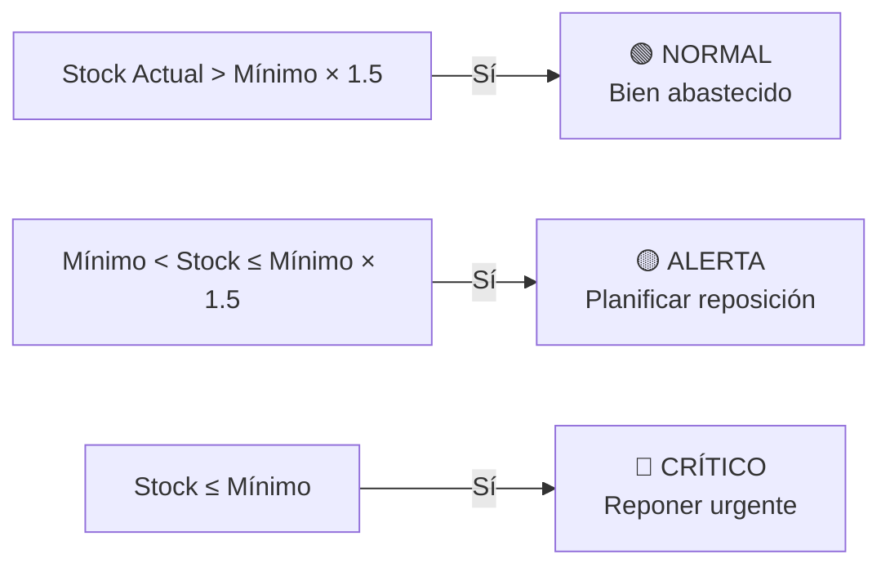

# T03 — Tutorial: Catálogo y Stock en Tiempo Real

> **Módulo:** Catálogo  
> **Ruta en la app:** `/catalog`  
> **Rol requerido:** ADMIN (edición completa); SECRETARIA, OPERARIO (lectura)  
> **Última actualización:** Febrero 2026  

---

## 📋 ¿Qué es el Catálogo?

El Catálogo es la **biblioteca maestra de todos los productos** del negocio y **el lugar central donde visualizas el Inventario Físico (Stock en Tiempo Real)**. Cada producto tiene un código único llamado **SKU** (Stock Keeping Unit).

> **💡 Importante:** No existe una pestaña separada de "Stock" en el módulo Inventario. Para saber cuánto material tienes, cuál es su costo y si necesitas reponer, **siempre debes venir al Catálogo**.

---

## 🗺️ Estructura del Catálogo: Plantillas vs SKUs



| Concepto | Qué es | Ejemplo |
|----------|--------|---------|
| **Plantilla** | El producto genérico, sin marca ni color | "Riel Superior Serie 25" |
| **SKU / Variante** | La versión específica con marca, material y acabado | "Riel Superior Serie 25 ALUPEX Natural" |

---

## 🖥️ Vista del Catálogo y Stock en Tiempo Real (`/catalog`)

```
┌──────────────────────────────────────────────────────────────────────┐
│  CATÁLOGO Y STOCK EN TIEMPO REAL                 [+ Nueva SK U]      │
│                                                [+ Nueva Plantilla]   │
├──────────────────────────────────────────────────────────────────────│
│  Buscar: [              ]  Estado: [Todos ▼]  Familia: [Todas ▼]     │
│  Marca:  [Todas ▼]  Material: [Todas ▼]  Sistema: [Todos ▼]          │
├────────────┬────────────────────────┬───────┬───────┬───────┬────────┤
│ SKU        │ Descripción            │ Stock │ Mínimo│ PMP   │ Estado │
├────────────┼────────────────────────┼───────┼───────┼───────┼────────┤
│ ALU-RS25-N │ Riel Sup S25 Natural   │ 45.0m │ 10.0m │S/25.60│ 🟢Normal│
│ VID-4MM-CLR│ Vidrio Simple 4mm      │120.0m²│ 20.0m²│S/47.50│ 🟢Normal│
│ ACC-FLP-6MM│ Felpa 6mm              │ 15.0pz│ 20.0pz│S/ 8.50│ 🟡Alerta│
│ ALU-JM25-CH│ Jamba S25 Champagne    │  2.0m │ 10.0m │S/22.40│ 🔴Crític│
└────────────┴────────────────────────┴───────┴───────┴───────┴────────┘
```

| Columna | Qué significa | Cómo se calcula |
|---------|--------------|----------------|
| **SKU** | Código único del producto | Generado al crear la variante |
| **Descripción** | Nombre completo del producto | De la plantilla + variante |
| **Stock Actual** | Unidades/metros/m² disponibles ahora | Suma de entradas - salidas (Kardex) |
| **Stock Mínimo** | El mínimo que debe haber siempre | Configurado manualmente en el SKU |
| **PMP / Costo** | Precio Medio Ponderado | Promedio de todas las compras (ver abajo) |
| **Estado** | 🟢 Normal / 🟡 Alerta / 🔴 Crítico | Comparación stock vs mínimo |

---

## 🚦 Estados de Reposición (Stock)



---

## 💡 ¿Qué es el PMP (Precio Medio Ponderado)?

El PMP es el costo que se usa para valorizar tu inventario y calcular el costo en las cotizaciones. Se promedia con cada compra nueva:

```
Ejemplo:
├─ Compra 1: 100m a S/24.00/m = S/2,400.00
└─ Compra 2:  50m a S/27.00/m = S/1,350.00

PMP = (2,400 + 1,350) / 150m = S/25.00/m
```

---

## 📦 Ver el Detalle de un SKU

Al hacer clic en cualquier fila de la tabla, se abre un **panel lateral** con toda la información técnica y de costos:

```
┌──────────────────────────────────────┐
│  ALU-RS25-NAT                        │
│  Riel Superior Serie 25 — Natural    │
│  ─────────────────────────────────── │
│  INFORMACIÓN GENERAL                 │
│  Familia:    Perfiles de Aluminio    │
│  Marca:      ALUPEX                  │
│  Clase ABC:  A (Alto Valor)          │
│                                      │
│  COSTOS Y VALORIZACIÓN               │
│  Costo (PMP):  S/ 25.60 / m          │
│  Valor Total:  S/ 1,152.00           │
│                                      │
│  STOCK ACTUAL                        │
│  Stock Actual:   45.00 m             │
│  Stock Mínimo:   10.00 m             │
│  Estado:         🟢 Normal           │
│                                      │
│  [✏️ Editar] [📦 Ajustar Stock]     │
└──────────────────────────────────────┘
```

---

## ➕ Crear Plantillas y SKUs

1. **Crear Plantilla**: Clic en "+ Nueva Plantilla". Se define la "Serie 25 Riel Superior" sin marca ni color.
2. **Crear SKU (Variante)**: Clic en "+ Nueva SKU". Se selecciona la plantilla, se le asigna Marca (ALUPEX) y Color (Natural). Se define su **Stock Mínimo**.

---

## 📦 Ajuste Rápido de Stock

Si encuentras diferencias durante un inventario físico:
1. Busca el SKU en el Catálogo y haz clic en él.
2. Clic en **"📦 Ajustar Stock"** en el panel lateral.
3. Ingresa si aumenta o disminuye y el motivo.
4. Esto genera automáticamente un movimiento tipo "AJUSTE" en el Kardex.

---

## 🔢 Clasificación ABC en el Catálogo

El sistema clasifica los SKUs automáticamente según el capital que inmovilizan (Stock × PMP):

| Clase | Porcentaje del Valor | Estrategia |
|-------|----------------------|-----------|
| **🔴 A** | Representan el 80% del valor total | Control estricto, reposición frecuente |
| **🟡 B** | Representan el 15% del valor total | Monitoreo mensual |
| **🟢 C** | Representan el 5% del valor total | Reposición cuando sea necesario |

---

## ❓ Preguntas Frecuentes

**¿Por qué no hay una pestaña de 'Stock' en el menú de Inventario?**
> Por diseño técnico y usabilidad, el catálogo es tu maestro de materiales. Al unificar el Catálogo con el Inventario en Tiempo Real, puedes ver los costos (PMP) y tu stock físico alineados en una sola vista eficiente.

**¿El stock se actualiza solo?**
> Sí, la columna "Stock" en el Catálogo se recalcula instantáneamente cada vez que quieres ver o recargar la tabla basándose en los registros de `/inventory` (Entradas o Salidas).

---

## 🔗 Documentos Relacionados

- [T04_TUTORIAL_INVENTARIO.md](./T04_TUTORIAL_INVENTARIO.md) — Dónde registrar los movimientos físicos que afectan a este stock.
- [T05_TUTORIAL_ENTRADAS.md](./T05_TUTORIAL_ENTRADAS.md) — Cómo ingresar compras.
- [T06_TUTORIAL_SALIDAS.md](./T06_TUTORIAL_SALIDAS.md) — Cómo registrar las salidas a producción.
