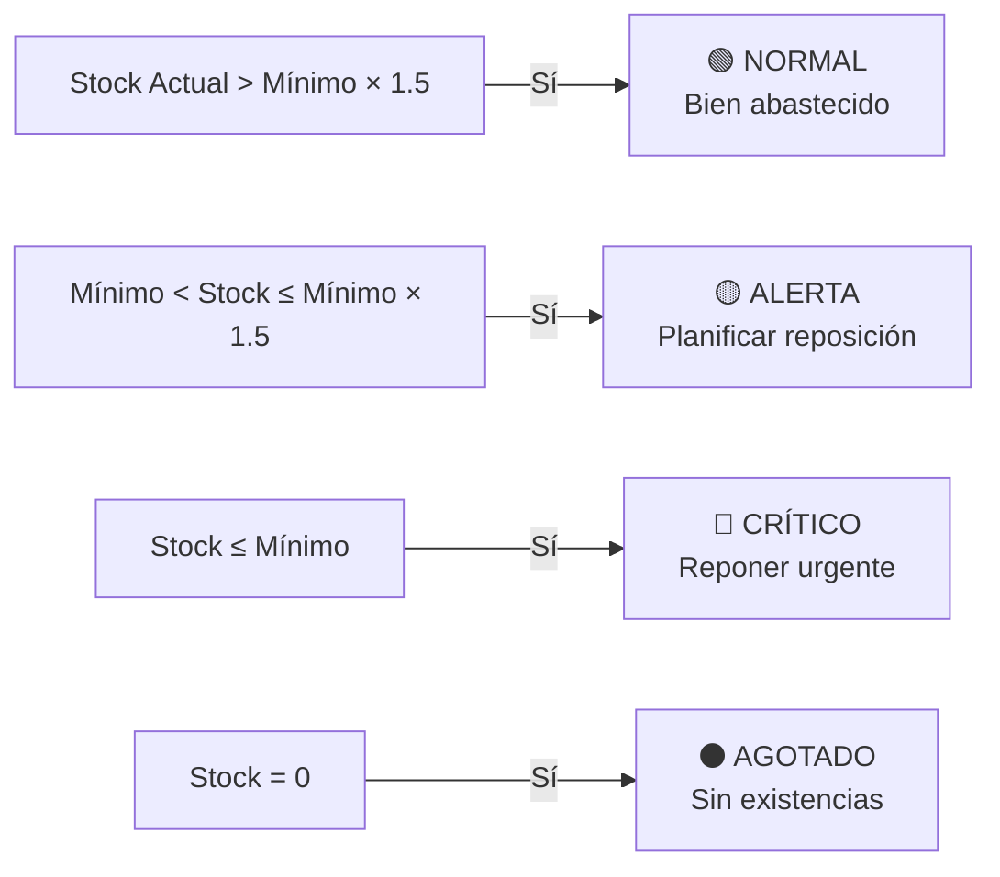
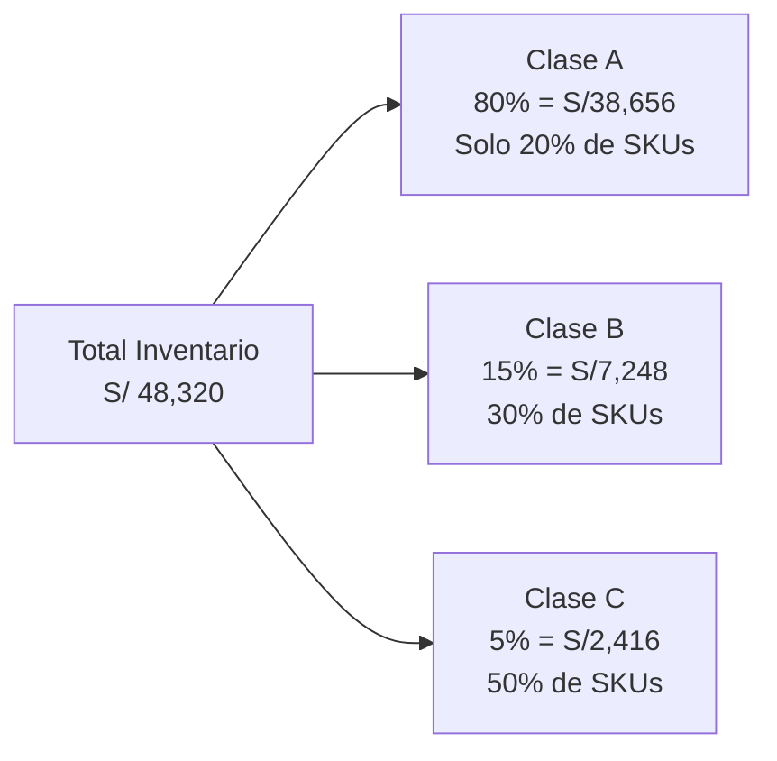
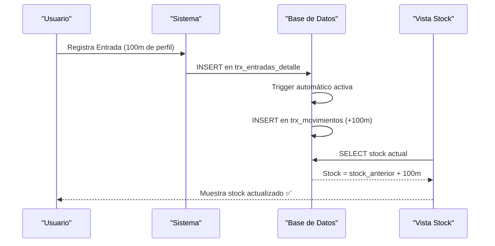

# T04 — Tutorial: Inventario (Stock en Tiempo Real)

> **Módulo:** Inventario / Stock  
> **Ruta en la app:** `/inventory` → pestaña "Stock"  
> **Rol requerido:** Todos pueden ver; ADMIN edita  
> **Última actualización:** Febrero 2026  

---

## 📋 ¿Qué es el módulo de Inventario?

El módulo de Inventario muestra **cuánto tienes de cada material en este momento**, su valor económico y si necesitas reponer. Los datos son en **tiempo real**: cada vez que registras una compra o despacho, el stock se actualiza automáticamente.

> **🏭 Ejemplo:** Si ayer compraste 100m de perfil y hoy usaste 35m en producción, el inventario muestra 65m disponibles.

---

## 🗺️ Navegación dentro del Módulo `/inventory`

El módulo de Inventario tiene **4 pestañas**:

```
┌─────────────────────────────────────────────────────────┐
│  [ Stock ] [ Entradas ] [ Salidas ] [ Kardex ]          │
│  ─────────────────────────────────────────────────────── │
│  (Estás aquí: Stock en Tiempo Real)                     │
└─────────────────────────────────────────────────────────┘
```

| Pestaña | Qué muestra |
|---------|-------------|
| **Stock** | El inventario actual de todos los productos |
| **Entradas** | Registro de compras/recepciones (aumenta stock) |
| **Salidas** | Registro de despachos/usos (reduce stock) |
| **Kardex** | Historial completo de todos los movimientos |

Este tutorial cubre la pestaña **Stock**. Las demás tienen sus propios tutoriales.

---

## 🖥️ Vista del Stock en Tiempo Real

```
┌──────────────────────────────────────────────────────────────────────┐
│  INVENTARIO — STOCK EN TIEMPO REAL                    [Exportar 📊] │
│  Buscar: [              ]  Estado: [Todos ▼]  Clase: [Todos ▼]      │
├────────────┬────────────────────────┬───────┬───────┬───────┬───────┤
│ SKU        │ Descripción            │ Stock │ Mínimo│ PMP   │ Valor │
├────────────┼────────────────────────┼───────┼───────┼───────┼───────┤
│ ALU-RS25-N │ Riel Sup S25 Natural   │ 45.0m │ 10.0m │S/25.60│S/1152 │
│ VID-4MM-CLR│ Vidrio Simple 4mm      │120.0m²│ 20.0m²│S/47.50│S/5700 │
│ ACC-FLP-6MM│ Felpa 6mm              │ 15.0pz│ 5.0pz │S/ 8.50│ S/127 │
│ ALU-JM25-CH│ Jamba S25 Champagne    │  2.0m │ 10.0m │S/22.40│  S/44 │
├────────────┴────────────────────────┴───────┴───────┴───────┴───────┤
│ Valor total del inventario: S/ 48,320.50                             │
└──────────────────────────────────────────────────────────────────────┘
```

---

## 📊 Columnas del Stock

| Columna | Qué significa | Cómo se calcula |
|---------|--------------|----------------|
| **SKU** | Código único del producto | Asignado en el Catálogo |
| **Descripción** | Nombre completo del producto | Del Catálogo |
| **Stock Actual** | Unidades/metros/m² disponibles ahora | Suma de entradas - salidas (Kardex) |
| **Stock Mínimo** | El mínimo que debe haber siempre | Configurado en el Catálogo |
| **PMP** | Precio Medio Ponderado | Promedio ponderado de todas las compras |
| **Valor Total** | Stock × PMP | Inversión en ese producto |
| **Estado** | 🟢 Normal / 🟡 Alerta / 🔴 Crítico | Comparación stock vs mínimo |

---

## 💡 ¿Qué es el PMP (Precio Medio Ponderado)?

El PMP es el costo promedio de cada unidad **considerando el precio de todas las compras anteriores**:

```
Ejemplo:
├─ Compra 1: 100m a S/24.00/m = S/2,400.00
└─ Compra 2:  50m a S/27.00/m = S/1,350.00

PMP = (2,400 + 1,350) / (100 + 50) = S/3,750 / 150m = S/25.00/m

Stock: 150m
Valor en inventario: 150 × 25.00 = S/3,750.00
```

> **¿Por qué importa el PMP?** Porque es el costo que se usa para valorizar el inventario y para calcular el costo de los materiales usados en producción.

---

## 🚦 Estados de Stock



| Estado | Color | Acción recomendada |
|--------|-------|--------------------|
| **Normal** | 🟢 Verde | Ninguna acción inmediata |
| **Alerta** | 🟡 Amarillo | Planificar orden de compra |
| **Crítico** | 🔴 Rojo | Generar orden de compra urgente |
| **Agotado** | ⚫ Negro | Compra de emergencia |

---

## 🔍 Filtros del Stock

| Filtro | Opciones | Para qué sirve |
|--------|----------|----------------|
| **Buscar** | Texto libre | Busca por SKU o nombre |
| **Estado** | Normal / Alerta / Crítico | Ver solo los que necesitan atención |
| **Clase ABC** | A / B / C | Priorizar los más valiosos |

**💡 Uso recomendado para inicio del día:**
1. Filtra por Estado = **"Crítico"** → ¿qué hay que comprar hoy?
2. Filtra por Estado = **"Alerta"** → ¿qué hay que planificar esta semana?

---

## 📈 Clasificación ABC en el Stock

El sistema clasifica automáticamente usando el análisis de Pareto (80/20):



**Regla práctica:** Concéntrate en los productos **Clase A** — son pocos pero representan casi todo tu capital.

---

## 📊 Flujo: Cómo se actualiza el Stock



**No tienes que hacer nada manual.** El stock se recalcula automáticamente cuando registras entradas o salidas.

---

## 📋 Indicadores de Reposición

| Indicador | Qué es | Fórmula |
|-----------|--------|---------|
| **Punto de Pedido** | ¿Cuándo pedir? | Stock Mínimo + (Días de espera × Consumo diario) |
| **Cantidad a Pedir** | ¿Cuánto pedir? | Stock Máximo - Stock Actual |
| **Días de Inventario** | ¿Para cuánto alcanza? | Stock Actual / Consumo Promedio Diario |

---

## ❓ Preguntas Frecuentes

**¿El stock que veo es el del físico o el del sistema?**
> Es el del sistema, calculado desde todos los registros de entradas y salidas. Si difiere del físico, puede haber movimientos no registrados o pérdidas no documentadas. Usa la función de **Ajuste de Stock** en el Catálogo para corregir diferencias.

**¿Por qué un producto muestra stock negativo?**
> Ocurre cuando se registraron más salidas que entradas. Puede ser error de registro. Ve al Kardex de ese producto para ver qué movimiento causó el negativo.

**¿Puedo imprimir el listado de stock?**
> Usa el botón **"Exportar 📊"** para descargarlo en Excel, luego imprimes desde ahí.

**¿El stock se actualiza solo?**
> Sí, pero necesitas que alguien registre las entradas y salidas. El sistema no "sabe" que compraste algo hasta que alguien lo registra.

---

## ⚠️ Situaciones de Alerta Comunes

| Situación | Causa | Solución |
|-----------|-------|---------|
| Todo en rojo al inicio | Stock mínimos muy altos | Revisar stock mínimos en Catálogo |
| Stock dice 0 pero hay material | Compra no registrada | Registrar Entrada en módulo Entradas |
| PMP muy bajo/alto | Error en precio de compra | Corregir en la entrada correspondiente |
| Stock no cambia al registrar | Error de conexión | Recargar la página (F5) |

---

## 🔗 Documentos Relacionados

- [T05_TUTORIAL_ENTRADAS.md](./T05_TUTORIAL_ENTRADAS.md) — Cómo registrar compras que aumentan el stock
- [T06_TUTORIAL_SALIDAS.md](./T06_TUTORIAL_SALIDAS.md) — Cómo registrar despachos que reducen el stock
- [T07_TUTORIAL_KARDEX.md](./T07_TUTORIAL_KARDEX.md) — Historial completo de movimientos
- [T03_TUTORIAL_CATALOGO.md](./T03_TUTORIAL_CATALOGO.md) — Configurar stock mínimos y precios
