# T05 — Tutorial: Entradas de Inventario (Compras)

> **Módulo:** Entradas  
> **Ruta en la app:** `/inventory` → pestaña "Entradas"  
> **Rol requerido:** ADMIN, SECRETARIA  
> **Última actualización:** Febrero 2026  

---

## 📋 ¿Qué son las Entradas?

Las **Entradas** son el registro de todo material que **ingresa** al almacén: compras a proveedores, devoluciones de producción o ajustes de inventario positivos. Cada entrada **aumenta el stock** automáticamente.

> **👷 Ejemplo:** Compraste 200m de perfil Riel Superior Serie 25 a ALUPEX por S/5,160. Registras esa compra como una "Entrada" y el sistema suma 200m al stock de ese perfil.

---

## 🔄 ¿Qué pasa cuando registras una Entrada?

```mermaid
flowchart LR
    A["📝 Registras<br/>Entrada"] --> B["💾 Se guarda en<br/>trx_entradas_cabecera<br/>+ detalle"]
    B --> C["⚡ TRIGGER automático<br/>en la base de datos"]
    C --> D["📒 Kardex recibe<br/>movimiento COMPRA"]
    D --> E["📊 Stock se actualiza<br/>en tiempo real +✅"]
```



**No necesitas hacer nada extra.** El stock sube automáticamente al guardar la entrada.

---

## 🖥️ Vista de la Pestaña Entradas

```
┌──────────────────────────────────────────────────────────────┐
│  ENTRADAS DE INVENTARIO                  [+ Nueva Entrada]   │
│  Buscar: [              ]  Proveedor: [Todos ▼]              │
├────────────┬───────────┬───────────────┬──────────┬─────────┤
│ N° Entrada │ Fecha     │ Proveedor     │ Doc Ref  │ Total   │
├────────────┼───────────┼───────────────┼──────────┼─────────┤
│ ENT-0023   │ 20/02/26  │ ALUPEX SAC   │ F001-1245│S/5,160  │
│ ENT-0022   │ 18/02/26  │ Vidrios Perú │ G001-0087│S/2,880  │
│ ENT-0021   │ 15/02/26  │ ALUPEX SAC   │ F001-1238│S/3,420  │
└────────────┴───────────┴───────────────┴──────────┴─────────┘
```

---

## ➕ Paso a Paso: Crear una Nueva Entrada

### Paso 1: Abrir el formulario

Haz clic en **"+ Nueva Entrada"**. Se abre un formulario en dos partes: **cabecera** y **líneas de detalle**.

---

### Paso 2: Llenar la Cabecera

```
┌─────────────────────────────────────────────────────────┐
│  NUEVA ENTRADA DE INVENTARIO                            │
├─────────────────────────────────────────────────────────│
│  Proveedor:    [Buscar proveedor...]          [+ Nuevo] │
│  Fecha:        [22/02/2026]                             │
│  Tipo:         ● Compra  ○ Devolución  ○ Ajuste         │
│  Nº Documento: [F001-1250]  (factura o guía)            │
│  Observaciones:[Pedido urgente para cotización COT-0042]│
└─────────────────────────────────────────────────────────┘
```

| Campo | Obligatorio | Qué ingresar |
|-------|-------------|-------------|
| **Proveedor** | ✅ Sí | Selecciona el proveedor de la lista. Si no existe, créalo con "+ Nuevo" |
| **Fecha** | ✅ Sí | Fecha de recepción del material (default: hoy) |
| **Tipo** | ✅ Sí | Compra (lo normal), Devolución (material que regresó de obra) o Ajuste |
| **Nº Documento** | ✅ Sí | Número de la factura o guía de remisión del proveedor |
| **Observaciones** | ❌ No | Nota interna sobre esta compra |

> **💡 Tip:** El número de documento te servirá después para buscar en el Kardex a qué compra corresponde un movimiento.

---

### Paso 3: Agregar Líneas de Detalle (Productos Comprados)

Después de la cabecera, agregar cada producto comprado:

```
┌─────────────────────────────────────────────────────────────┐
│  LÍNEAS DE DETALLE                           [+ Agregar]    │
├──────────────────────────┬───────┬──────────┬──────────────┤
│ Producto (SKU)           │ Qty   │ P. Unit  │ Subtotal     │
├──────────────────────────┼───────┼──────────┼──────────────┤
│ ALU-RS25-NAT (buscar...) │ 200 m │ S/25.80  │  S/5,160.00  │
│ [+ Agregar línea]        │       │          │              │
├──────────────────────────┴───────┴──────────┼──────────────┤
│                                     TOTAL:  │  S/5,160.00  │
└─────────────────────────────────────────────┴──────────────┘
```

Para cada línea:

| Campo | Cómo llenarlo |
|-------|--------------|
| **Producto** | Escribe el SKU o nombre del perfil/vidrio/accesorio. El sistema busca mientras escribes |
| **Cantidad** | Cuántos metros/m²/unidades compraste |
| **Precio Unitario** | Precio por unidad según la factura del proveedor |

**Agrega todas las líneas que necesites.** Una sola entrada puede tener 20 productos diferentes de la misma factura.

---

### Paso 4: Guardar la Entrada

Haz clic en **"Guardar Entrada"**. El sistema:
1. Registra la cabecera y todas las líneas
2. Activa el **trigger automático** que actualiza el Kardex
3. El stock de cada producto sube inmediatamente
4. Muestra confirmación con el número de entrada asignado (ej: ENT-0023)

---

## 👁️ Ver el Detalle de una Entrada

Haz clic en cualquier fila de la lista para ver el detalle completo:

```
┌────────────────────────────────────────────────────┐
│  ENTRADA ENT-0023                                  │
│  Fecha: 20/02/2026  │  Proveedor: ALUPEX SAC       │
│  Documento: F001-1245  │  Tipo: Compra             │
│  ──────────────────────────────────────────────── │
│  PRODUCTOS COMPRADOS:                              │
│  ● ALU-RS25-NAT: 200m × S/25.80 = S/5,160.00      │
│  ──────────────────────────────────────────────── │
│  TOTAL: S/5,160.00                                 │
│  Registrado por: admin@empresa.com                 │
│  Registrado el: 20/02/2026 14:35                   │
└────────────────────────────────────────────────────┘
```

---

## 📊 Tipos de Entrada

| Tipo | Cuándo usarlo | Efecto en Stock |
|------|---------------|----------------|
| **Compra** | Cuando recibes material de un proveedor con factura/guía | Aumenta stock ➕ |
| **Devolución** | Material que regresó de una obra sin usar | Aumenta stock ➕ |
| **Ajuste** | Diferencias de inventario físico vs sistema | Aumenta stock ➕ |

---

## ❓ Preguntas Frecuentes

**¿Puedo modificar una entrada ya guardada?**
> No directamente. Si cometiste un error, debes registrar una **Salida** de ajuste por la cantidad incorrecta, y luego una nueva **Entrada** correcta. Esto mantiene el historial íntegro.

**¿Qué pasa si ingreso un precio diferente al histórico?**
> El sistema recalcula el PMP (Precio Medio Ponderado) automáticamente. Es correcto que el PMP cambie cuando hay nuevas compras a diferente precio.

**¿Puedo registrar una entrada sin proveedor?**
> No. El proveedor es obligatorio para mantener trazabilidad. Si no tienes el proveedor cargado, créalo primero en el módulo Proveedores.

**¿Puedo eliminar una entrada?**
> Solo el ADMIN puede eliminar entradas y solo si no hay movimientos posteriores asociados. Se recomienda usar ajustes en lugar de eliminar.

---

## ⚠️ Errores Comunes

| Error | Causa | Solución |
|-------|-------|---------|
| "Producto no encontrado" | SKU no existe en el catálogo | Crear primero el producto en Catálogo |
| "Proveedor requerido" | Campo vacío | Seleccionar o crear el proveedor |
| Stock no sube | Error de conexión | Recargar (F5) y verificar en Kardex |
| PMP incorrecto | Precio unitario mal ingresado | Crear entrada de ajuste corrección |

---

## 🔗 Documentos Relacionados

- [T03_TUTORIAL_CATALOGO.md](./T03_TUTORIAL_CATALOGO.md) — Ver el efecto en el stock
- [T07_TUTORIAL_KARDEX.md](./T07_TUTORIAL_KARDEX.md) — Verificar el movimiento en el Kardex
- [T11_TUTORIAL_CLIENTES_PROVEEDORES.md](./T11_TUTORIAL_CLIENTES_PROVEEDORES.md) — Crear proveedores
