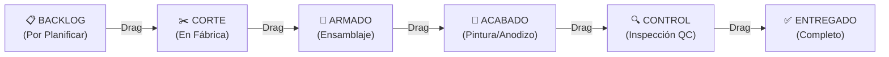

# T09 — Tutorial: Producción (Tablero Kanban)

> **Módulo:** Producción  
> **Ruta en la app:** `/production`  
> **Rol requerido:** ADMIN (todos los permisos); OPERARIO (mover tarjetas, ver); SECRETARIA (solo ver)  
> **Última actualización:** Febrero 2026  

---

## 📋 ¿Qué es el Módulo de Producción?

El módulo de Producción es un **tablero Kanban** que permite seguir el avance físico de fabricación de cada pedido. Cada ventana o ítem de una cotización aprobada se convierte en una "tarjeta" que avanza por columnas según su etapa de fabricación.

> **🏭 Ejemplo de uso diario:** El operario llega a la fábrica, abre el Kanban, ve qué ventanas están en CORTE, termina de cortar una y arrastra la tarjeta a ARMADO. El jefe lo ve en tiempo real desde su celular.

---

## 🗂️ Las 6 Columnas del Kanban



| Columna | Color | Significado |
|---------|-------|------------|
| **BACKLOG** | Gris | Pedido recibido, aún no se empieza a fabricar |
| **CORTE** | Azul | Se está cortando el aluminio y vidrio |
| **ARMADO** | Naranja | Se están ensamblando las piezas |
| **ACABADO** | Morado | Pintura, anodizado u otros acabados finales |
| **CONTROL** | Amarillo | Inspección de calidad (QC) antes de entrega |
| **ENTREGADO** | Verde | Pedido entregado al cliente ✅ |

---

## 🖥️ Vista del Tablero Kanban

```
┌────────────────────────────────────────────────────────────────────────────┐
│  🏭 TABLERO DE PRODUCCIÓN         [+ Nueva Orden] [📊 Estadísticas] [🔧]  │
├───────────┬───────────┬───────────┬───────────┬───────────┬────────────────┤
│ BACKLOG   │  CORTE    │  ARMADO   │  ACABADO  │  CONTROL  │  ENTREGADO    │
│    (3)    │    (5)    │    (2)    │    (1)    │    (1)    │    (12)       │
├───────────┼───────────┼───────────┼───────────┼───────────┼────────────────┤
│ ┌───────┐ │ ┌───────┐ │ ┌───────┐ │ ┌───────┐ │ ┌───────┐ │ ┌───────────┐ │
│ │COT-045│ │ │COT-042│ │ │COT-041│ │ │COT-039│ │ │COT-040│ │ │COT-035    │ │
│ │J.Gómez│ │ │M.López│ │ │E.SAC  │ │ │R.Díaz │ │ │A.Cruz │ │ │Entregado  │ │
│ │3 vent.│ │ │2 vent.│ │ │5 vent.│ │ │1 mampa│ │ │2 vent.│ │ │15/02/26   │ │
│ │Pend.  │ │ │Urgente│ │ │Nor.   │ │ │       │ │ │       │ │ └───────────┘ │
│ └───────┘ │ └───────┘ │ └───────┘ │ └───────┘ │ └───────┘ │               │
│           │ ┌───────┐ │           │           │           │               │
│           │ │COT-043│ │           │           │           │               │
│           │ │...    │ │           │           │           │               │
│           │ └───────┘ │           │           │           │               │
└───────────┴───────────┴───────────┴───────────┴───────────┴────────────────┘
```

---

## 🖱️ PARTE 1: Mover Tarjetas (Drag & Drop)

### ¿Cómo avanzar una orden al siguiente estado?

1. **Haz clic y mantén presionado** sobre la tarjeta de la orden
2. **Arrastra** la tarjeta hacia la columna siguiente
3. **Suelta** — el estado se actualiza automáticamente en la base de datos

```
 [CORTE]              [ARMADO]
  ┌───────┐    →→→    ┌───────┐
  │COT-042│  ─────▶   │COT-042│
  │M.López│  (drag)   │M.López│
  └───────┘           └───────┘
```

> **📱 En celular:** El drag & drop también funciona táctilmente. Mantén presionada la tarjeta por 1 segundo hasta que "flote", luego arrástrala.

### Reglas del movimiento

- **Solo puedes mover hacia adelante o atrás** (no puedes saltar de BACKLOG directo a ENTREGADO)
- Cualquier movimiento queda registrado en el **historial** con fecha, hora y usuario que lo hizo

---

## ➕ PARTE 2: Crear una Nueva Orden de Trabajo

Hay **dos formas** de crear órdenes en el Kanban:

### Método A: Importar desde una Cotización Aprobada (Recomendado)

1. Asegúrate de que la cotización esté en estado **"Aprobada"**
2. En el tablero, haz clic en **"+ Nueva Orden"**
3. Selecciona **"Importar desde Cotización"**
4. Selecciona la cotización de la lista
5. El sistema crea automáticamente una tarjeta en BACKLOG con todos los detalles del pedido

### Método B: Crear Manualmente

1. Haz clic en **"+ Nueva Orden"** → **"Crear manualmente"**
2. Llena el formulario:

```
┌─────────────────────────────────────────────────────┐
│  NUEVA ORDEN DE TRABAJO                             │
├─────────────────────────────────────────────────────│
│  Título:      [Ventanas para obra Miraflores]       │
│  Cliente:     [Constructora Lima SAC]               │
│  Descripción: [3 ventanas corredizas + 1 mampara]   │
│  Prioridad:   ● Normal  ○ Urgente  ○ Pausado        │
│  Fecha       │
│  solicitada: [28/02/2026]                           │
│  Cotización: [COT-0045] (opcional)                  │
└─────────────────────────────────────────────────────┘
```

---

## 📋 PARTE 3: Ver el Detalle de una Orden

Haz clic en cualquier tarjeta para ver su detalle completo:

```
┌──────────────────────────────────────────────────────┐
│  ORDEN: COT-0042 — María López                      │
│  Estado actual: CORTE  🔴 URGENTE                   │
│  ─────────────────────────────────────────────────  │
│  ÍTEMS DE LA ORDEN:                                  │
│  • Ventana Corrediza S25 1200×900 (×2)               │
│  • Mampara Fija S100 2400×2100 (×1)                  │
│  ─────────────────────────────────────────────────  │
│  HISTORIAL DE ESTADOS:                               │
│  BACKLOG → CORTE:  21/02/26 08:15 (juan@empresa.com)│
│  Creada:           20/02/26 16:30 (admin@empresa)    │
│  ─────────────────────────────────────────────────  │
│  FECHA SOLICITADA: 25/02/2026                        │
│  OBSERVACIONES: Cliente pide entrega urgente          │
│  ─────────────────────────────────────────────────  │
│  [✏️ Editar]  [📋 Historial]  [🗑️ Eliminar]         │
└──────────────────────────────────────────────────────┘
```

### Botones del detalle de orden

| Botón | Qué hace |
|-------|----------|
| **✏️ Editar** | Modifica título, descripción, prioridad, fecha |
| **📋 Historial** | Muestra todos los cambios de estado con fecha/hora/usuario |
| **🗑️ Eliminar** | Elimina la orden (solo ADMIN, irreversible) |

---

## 📊 PARTE 4: Estadísticas de Producción

Haz clic en el botón **"📊 Estadísticas"** para ver métricas del tablero:

| Métrica | Qué mide |
|---------|----------|
| **Órdenes por estado** | Cuántas hay en cada columna ahora mismo |
| **Tiempo promedio en cada etapa** | Cuántos días pasa una orden en CORTE, ARMADO, etc. |
| **OTIF Acumulado** | Porcentaje de entregas a tiempo |
| **Órdenes del mes** | Entrada y salida del tablero este mes |

---

## 🔧 PARTE 5: Configuración del Tablero

El botón **"🔧 Configurar"** permite ajustar:

| Configuración | Qué hace |
|--------------|----------|
| **Alertas de tiempo** | Cuántos días en un estado antes de marcar como retrasado |
| **Columnas visibles** | Mostrar/ocultar columnas no usadas |
| **Vista compacta** | Ver más tarjetas en pantalla reduciendo tamaño |
| **Ordenamiento** | Por fecha, prioridad o cliente |

---

## 🎯 Prioridades de las Órdenes

```
🔴 URGENTE   → Borde rojo en la tarjeta. Entrega inminente.
🔵 NORMAL    → Sin borde especial.
⏸️ PAUSADO   → Borde gris. Trabajo detenido temporalmente.
```

Para cambiar la prioridad, edita la orden y selecciona el nivel de prioridad.

---

## 📤 PARTE 6: Exportar el Tablero a Excel

1. Haz clic en el ícono de Excel **📥** en la esquina del tablero
2. Se descarga un archivo con todas las órdenes, estados e historial

---

## ❓ Preguntas Frecuentes

**¿El Kanban descuenta stock del inventario cuando muevo una tarjeta?**
> No automáticamente. El descuento de stock se hace manualmente en el módulo de Salidas cuando físicamente despachas el material.

**¿Quién puede mover tarjetas?**
> ADMIN y OPERARIO pueden mover tarjetas. SECRETARIA solo puede ver el tablero.

**¿Puedo tener el Kanban abierto en varios dispositivos?**
> Sí. Los cambios se sincronizan en tiempo real con Supabase. Si el operario mueve una tarjeta en el taller, el gerente lo ve en su computadora al recargar.

**¿Qué pasa si cierro la venta antes de que llegue a ENTREGADO?**
> Nada automático. El Kanban y las cotizaciones son independientes. Puedes marcarla como ENTREGADO cuando corresponda independientemente del estado de la cotización.

---

## ⚠️ Errores Comunes

| Situación | Causa | Solución |
|-----------|-------|---------|
| No puedo arrastrar tarjetas | Sin permiso (rol SECRETARIA) | Pedir al ADMIN cambiar tu rol a OPERARIO |
| Tarjeta no se mueve al soltar | Conexión lenta | Esperar y verificar en el historial |
| No aparece la cotización en "Importar" | Cotización no está Aprobada | Cambiar estado de la cotización a Aprobada primero |

---

## 🔗 Documentos Relacionados

- [T02_TUTORIAL_COTIZACIONES.md](./T02_TUTORIAL_COTIZACIONES.md) — Aprobar cotizaciones para importar al Kanban
- [T06_TUTORIAL_SALIDAS.md](./T06_TUTORIAL_SALIDAS.md) — Descontar el material usado en producción
- [10_FLUJOS_DE_NEGOCIO.md](../10_FLUJOS_DE_NEGOCIO.md) — Diagrama técnico del flujo de producción
