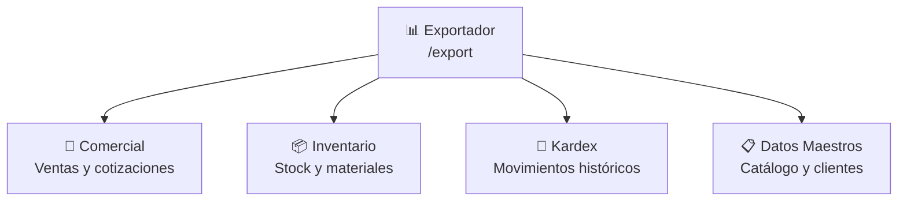
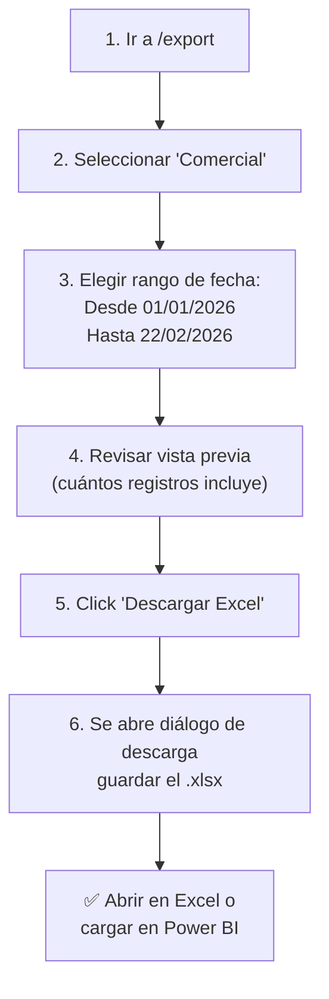
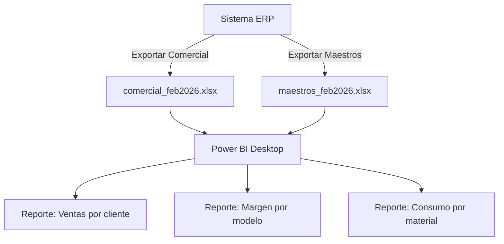

# T10 — Tutorial: Exportador Excel

> **Módulo:** Exportador Excel  
> **Ruta en la app:** `/export`  
> **Rol requerido:** ADMIN, SECRETARIA  
> **Última actualización:** Febrero 2026  

---

## 📋 ¿Qué es el Exportador Excel?

El Exportador genera archivos **Excel (.xlsx) con múltiples hojas**, listos para análisis en Microsoft Excel o Power BI. No requiere conexión a servidores externos — el archivo se genera directamente en tu navegador y se descarga automáticamente.

> **💡 Caso de uso:** El contador necesita el inventario valorizado del mes. El gerente quiere ver las cotizaciones del trimestre en Power BI. El almacenero necesita el kardex de enero para auditoría. Todo se genera desde aquí.

---

## 🗂️ Los 4 Tipos de Exportación



| Tipo | Para quién | Hojas incluidas |
|------|-----------|----------------|
| **Comercial** | Gerente ventas, contador | Cotizaciones, Detalles, Desglose materiales, Producción |
| **Inventario** | Almacenero, auditor | Stock valorizado, Retazos, Stock Zombie |
| **Kardex** | Contador, auditor | Movimientos filtrados por fecha |
| **Datos Maestros** | Sistemas, Power BI | Catálogo SKUs, Clientes, Proveedores, Familias |

---

## 🖥️ Vista del Exportador

```
┌──────────────────────────────────────────────────────────────┐
│  EXPORTADOR EXCEL                                            │
├──────────────────────────────────────────────────────────────│
│  TIPO DE EXPORTACIÓN:                                        │
│  ┌─────────────┐ ┌─────────────┐ ┌──────────┐ ┌──────────┐ │
│  │ 📝 Comercial│ │ 📦 Inventario│ │ 📒 Kardex│ │ 📋 Maestros│
│  │  (ventas)  │ │   (stock)   │ │(historial)│ │(catálogo)│ │
│  └─────────────┘ └─────────────┘ └──────────┘ └──────────┘ │
│                                                              │
│  FILTROS DE FECHA (solo para Comercial y Kardex):           │
│  Desde: [01/01/2026]    Hasta: [22/02/2026]                 │
│                                                              │
│  VISTA PREVIA:                                               │
│  ✅ Incluye: Cabeceras de cotización (45 registros)          │
│  ✅ Incluye: Detalles de cotización (189 líneas)             │
│  ✅ Incluye: Desglose de materiales (1,240 filas)            │
│  ✅ Incluye: Órdenes de producción (38 órdenes)             │
│                                                              │
│                            [📥 Descargar Excel]             │
└──────────────────────────────────────────────────────────────┘
```

---

## 📝 Tipo 1: Exportación Comercial

### Cuándo usar:
- Análisis de ventas y márgenes
- Informe mensual para gerencia
- Alimentar dashboard de Power BI

### Hojas del archivo generado:

| Hoja | Contenido | Columnas principales |
|------|-----------|---------------------|
| **Cotizaciones** | Una fila por cotización | N°, Fecha, Cliente, Moneda, Total, Estado, Markup, IGV |
| **Detalle_Items** | Una fila por ventana/mampara | N° Cot., Descripción, Modelo, Ancho, Alto, Costo, Precio |
| **Desglose_BOM** | Una fila por componente | N° Cot., Ítem, SKU, Tipo, Longitud, Costo unitario, Total |
| **Produccion** | Órdenes del Kanban | N° Orden, Cliente, Estado, Fecha inicio, Fecha fin |

### Cómo exportar Comercial paso a paso:



---

## 📦 Tipo 2: Exportación de Inventario

### Cuándo usar:
- Valorización mensual del inventario
- Informe para contador (activos en almacén)
- Auditoría de materiales

### Hojas del archivo generado:

| Hoja | Contenido | Para qué sirve |
|------|-----------|----------------|
| **Stock_Valorizado** | Todos los SKUs con stock y valor | Valorización contable del inventario |
| **Retazos** | Materiales en estado de retazo | Control de mermas |
| **Stock_Zombie** | SKUs sin movimiento en 90+ días | Identificar inventario muerto |

> **💡 Stock Zombie:** Son productos con stock pero sin movimiento en los últimos 90 días. Son capital inmovilizado que deberías revisar: quizás ya no se usan o hay que liquidar.

---

## 📒 Tipo 3: Exportación Kardex

### Cuándo usar:
- Auditoría de movimientos por período
- Informe para SUNAT de entradas/salidas
- Verificación de stocks históricos

### La exportación Kardex tiene filtro de FECHA:

```
FILTRO KARDEX:
┌────────────────────────────────────────┐
│ Desde: [01/01/2026]                   │
│ Hasta: [31/01/2026]  ← Solo enero     │
│                                        │
│ Hoja incluida:                         │
│ ● Movimientos: todos los del período   │
│   con saldo acumulado por fecha        │
│                            [Descargar] │
└────────────────────────────────────────┘
```

### Columnas de la hoja Movimientos:

| Columna | Descripción |
|---------|-------------|
| Fecha | Fecha y hora del movimiento |
| Tipo | COMPRA, VENTA, PRODUCCION, AJUSTE |
| SKU | Código del producto |
| Descripción | Nombre del producto |
| Entrada (+) | Cantidad que ingresó |
| Salida (-) | Cantidad que salió |
| Saldo | Acumulado después del movimiento |
| P. Unitario | Precio en ese movimiento |
| Valor | Qty × Precio |
| Doc. Ref. | Número de factura/cotización |
| Usuario | Quién lo registró |

---

## 📋 Tipo 4: Exportación Datos Maestros

### Cuándo usar:
- Cargar el catálogo completo a Power BI
- Backup de datos de referencia
- Migración o integración con otro sistema

### Hojas del archivo generado:

| Hoja | Contenido |
|------|-----------|
| **Catalogo** | Todos los SKUs con plantilla, marca, familia, precios |
| **Clientes** | RUC, razón social, contacto, dirección |
| **Proveedores** | Datos de todos los proveedores |
| **Familias** | Categorías de productos |
| **Marcas** | Marcas de aluminio registradas |

> **💡 Para Power BI:** Exporta Datos Maestros + Comercial del período que necesitas. En Power BI, carga ambos archivos y relaciona por N° cotización y SKU para crear reportes con cruce de información.

---

## 📊 ¿Cómo usar en Power BI?



**Pasos básicos en Power BI:**
1. Abrir Power BI Desktop → **Obtener datos** → **Excel**
2. Seleccionar el archivo exportado
3. Marcar todas las hojas que quieres cargar
4. Clic en **Cargar**
5. En el modelo, crear relaciones entre hojas (N° cotización)

---

## ❓ Preguntas Frecuentes

**¿El archivo Excel se actualiza automáticamente?**
> No. Cada vez que necesitas datos actualizados, debes hacer una nueva exportación. El archivo descargado es una "foto" de ese momento.

**¿Puedo descargar un rango de fechas muy largo (1 año)?**
> Sí, pero puede tardar más. Archivos grandes (100,000+ filas) pueden demorar 30-60 segundos en generarse.

**¿El archivo incluye los datos de todos los clientes aunque tenga filtro de fecha?**
> El filtro de fecha solo aplica a Comercial y Kardex. Los Datos Maestros y el Inventario no tienen filtro de fecha — siempre exportan el estado actual.

**¿Se puede exportar solo las cotizaciones de un cliente específico?**
> No directamente desde el exportador. Exporta todas, luego filtra en Excel usando la columna "Cliente".

---

## ⚠️ Situaciones Comunes

| Situación | Causa | Solución |
|-----------|-------|---------|
| Descarga no inicia | Bloqueador de popups activo | Permitir popups en este sitio |
| Archivo descargado está vacío | Sin datos en el período | Verificar el rango de fechas |
| Error al abrir en Excel | Versión Excel muy antigua | Usar Excel 2016 o más reciente |
| Tarda más de 2 minutos | Demasiados datos | Reducir el rango de fechas |

---

## 🔗 Documentos Relacionados

- [T04_TUTORIAL_INVENTARIO.md](./T04_TUTORIAL_INVENTARIO.md) — Qué incluye el stock valorizado
- [T07_TUTORIAL_KARDEX.md](./T07_TUTORIAL_KARDEX.md) — Qué datos están en el Kardex
- [T02_TUTORIAL_COTIZACIONES.md](./T02_TUTORIAL_COTIZACIONES.md) — Qué datos están en el Comercial
