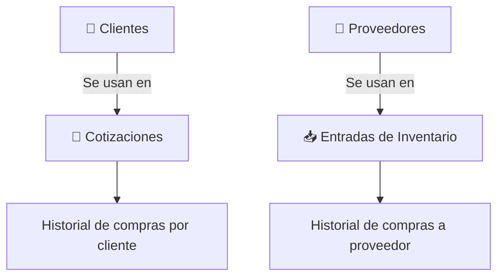

# T11 — Tutorial: Clientes y Proveedores

> **Módulo:** Clientes (`/clients`) y Proveedores (`/suppliers`)  
> **Rol requerido:** ADMIN, SECRETARIA (edición); OPERARIO (solo lectura)  
> **Última actualización:** Febrero 2026  

---

## 📋 ¿Qué son los módulos de Clientes y Proveedores?

- **Clientes:** Base de datos de todos tus contactos de venta. Se usan en las cotizaciones.
- **Proveedores:** Empresas de quienes compras materiales (ALUPEX, vidrierías, etc.). Se usan en las Entradas de Inventario.

Ambos módulos tienen una interfaz similar: lista, búsqueda, y formulario de alta/edición.

---

## 👥 MÓDULO CLIENTES (`/clients`)

### Vista de la lista de Clientes

```
┌──────────────────────────────────────────────────────────┐
│  CLIENTES                                 [+ Nuevo Cliente]│
│  Buscar: [                    ]                           │
├──────────────┬────────────────────┬─────────┬────────────┤
│ RUC / DNI    │ Razón Social / Nombre│ Teléfono │ Acciones │
├──────────────┼────────────────────┼─────────┼────────────┤
│ 20501234567  │ Constructora Lima  │ 987-1234 │ ✏️ 🗑️    │
│ 10123456789  │ Juan García Ríos   │ 956-5678 │ ✏️ 🗑️    │
│ 20609876543  │ Inmobiliaria Sur   │ 01-234567│ ✏️ 🗑️    │
└──────────────┴────────────────────┴─────────┴────────────┘
```

### Datos de un Cliente

| Campo | Obligatorio | Descripción |
|-------|-------------|-------------|
| **RUC o DNI** | ✅ Sí | 11 dígitos para empresa, 8 para natural |
| **Razón Social / Nombre** | ✅ Sí | Nombre completo para facturas |
| **Tipo Cliente** | ✅ Sí | Selecciona entre **EMPRESA** o **PERSONA** |
| **Dirección** | ❌ No | Dirección de obra o fiscal, se imprime en la cotización |
| **Teléfono** | ❌ No | Para contacto |
| **Correo Electrónico** | ❌ No | Para envío de cotizaciones |
| **Contacto** | ❌ No | Nombre de la persona de contacto en empresas |
| **Notas** | ❌ No | Observaciones internas |

### Cómo crear un Cliente nuevo

1. Clic en **"+ Nuevo Cliente"**
2. Llena los campos (mínimo: RUC y nombre)
3. Clic en **"Guardar"**

> **💡 Tip:** Puedes crear un cliente directamente desde el formulario de nueva cotización, sin tener que ir a este módulo. Haz clic en "+ Nuevo" junto al campo "Cliente" en la cotización.

### Cómo editar o ver el historial de un cliente

1. Busca el cliente por nombre o RUC
2. Haz clic en el ícono ✏️ para editar sus datos
3. En el detalle del cliente encontrarás el **historial de cotizaciones** vinculadas a él

---

## 🏢 MÓDULO PROVEEDORES (`/suppliers`)

### Vista de la lista de Proveedores

```
┌──────────────────────────────────────────────────────────────┐
│  PROVEEDORES                               [+ Nuevo Proveedor]│
│  Buscar: [                    ]                              │
├──────────────┬──────────────────────┬───────────┬───────────┤
│ RUC          │ Razón Social         │ Tipo      │ Acciones  │
├──────────────┼──────────────────────┼───────────┼───────────┤
│ 20123456789  │ ALUPEX SAC           │ Aluminio  │ ✏️ 🗑️   │
│ 20987654321  │ Vidrios del Perú SAC │ Vidriería │ ✏️ 🗑️   │
│ 10456789012  │ Accesorios Martinez  │ Accesorios│ ✏️ 🗑️   │
└──────────────┴──────────────────────┴───────────┴───────────┘
```

### Datos de un Proveedor

| Campo | Obligatorio | Descripción |
|-------|-------------|-------------|
| **RUC** | ✅ Sí | Número de RUC del proveedor |
| **Razón Social** | ✅ Sí | Nombre legal del proveedor |
| **Tipo de Material** | ❌ No | Aluminio, Vidrio, Accesorios, Otros |
| **Días de Crédito** | ❌ No | Días de crédito otorgados para pagarle |
| **Moneda Predet.** | ❌ No | Moneda por defecto para comprarle (PEN o USD) |
| **Teléfono** | ❌ No | Línea de contacto |
| **Correo** | ❌ No | Email para pedidos |
| **Contacto** | ❌ No | Nombre del asesor comercial |
| **Dirección** | ❌ No | Dirección de la empresa |
| **Cuenta Bancaria** | ❌ No | Para transferencias de pago |
| **Notas** | ❌ No | Notas de negociación, términos, etc. |

### Cómo crear un Proveedor nuevo

1. Clic en **"+ Nuevo Proveedor"**
2. Llena los datos básicos
3. Guarda

> **💡 Tip:** Al registrar una Entrada (compra), el sistema solo permite seleccionar proveedores ya existentes en esta lista. Si un proveedor nuevo te entregó materiales, créalo primero aquí.

---

## 🔄 Relaciones con otros módulos



**Desde el detalle de un cliente:**
- Ver todas las cotizaciones emitidas para ese cliente
- Filtrar por estado (Aprobadas, Pendientes, Rechazadas)
- Ver el valor total de negocio con ese cliente

**Desde el detalle de un proveedor:**
- Ver todas las entradas/compras realizadas a ese proveedor
- Total de compras en el período

---

## 🔍 Buscar Clientes y Proveedores

Ambos módulos tienen búsqueda en tiempo real:
- Escribes en el campo "Buscar" y la lista se filtra automáticamente
- Puedes buscar por **RUC/DNI**, **nombre** o **correo**

---

## ❓ Preguntas Frecuentes

**¿Puedo tener dos clientes con el mismo RUC?**
> No. El sistema valida que el RUC sea único. Si recibes un error "RUC duplicado", busca si ya existe ese cliente.

**¿Puedo eliminar un cliente?**
> Solo si no tiene cotizaciones asociadas. Si ya tiene cotizaciones, el cliente se puede "desactivar" pero no eliminar.

**¿Los datos del cliente aparecen en la cotización impresa?**
> Sí. El nombre, RUC y dirección del cliente seleccionado aparecen automáticamente en el PDF de la cotización.

---

## 🔗 Documentos Relacionados

- [T02_TUTORIAL_COTIZACIONES.md](./T02_TUTORIAL_COTIZACIONES.md) — Usar clientes en cotizaciones
- [T05_TUTORIAL_ENTRADAS.md](./T05_TUTORIAL_ENTRADAS.md) — Usar proveedores en entradas de inventario
