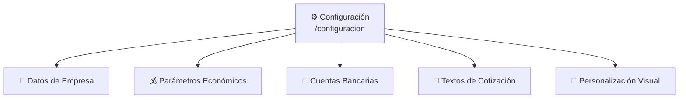
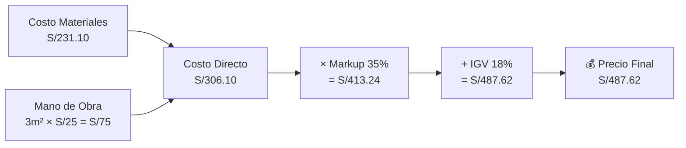
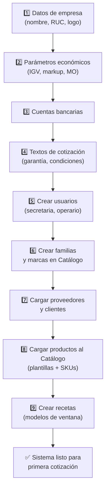

# T12 — Tutorial: Configuración del Sistema

> **Módulo:** Configuración  
> **Ruta en la app:** `/configuracion` y `/settings`  
> **Rol requerido:** Solo ADMIN  
> **Última actualización:** Febrero 2026  

---

## 📋 ¿Qué es la Configuración?

La Configuración es el panel donde defines los **parámetros globales** del sistema: datos de tu empresa, tasas económicas (IGV, markup), tipo de cambio, cuentas bancarias y personalización visual. Estos parámetros afectan automáticamente a cotizaciones, reportes e impresiones.

> **⚠️ Solo el ADMIN puede acceder a la configuración.** Si no tienes este rol, el menú no aparecerá.

---

## 🗂️ Secciones de Configuración



---

## 🏢 SECCIÓN 1: Datos de la Empresa

Estos datos aparecen en el encabezado de todas las cotizaciones impresas:

```
┌─────────────────────────────────────────────────────┐
│  DATOS DE LA EMPRESA                                │
├─────────────────────────────────────────────────────│
│  Nombre de Empresa:  [Vidriería del Norte SAC]      │
│  RUC:                [20501234567]                  │
│  Dirección:          [Av. Industrial 1450, Lima]    │
│  Teléfono:           [01-234-5678]                  │
│  Correo:             [ventas@vidrieria.com]         │
│  Web:                [www.vidrieria.com]            │
│  Logo:               [Subir imagen.png] 📎          │
│  Firma digital:      [Subir. firma.png] 📎          │
└─────────────────────────────────────────────────────┘
```

| Campo | Dónde aparece |
|-------|--------------|
| **Nombre empresa** | Encabezado de cotizaciones, reportes |
| **RUC** | Encabezado de cotizaciones |
| **Dirección** | Pie de cotizaciones |
| **Logo** | Esquina superior de cotizaciones imprimibles |
| **Firma digital** | Pie de cotizaciones (versión con firma) |

> **Formatos de logo aceptados:** PNG o JPG hasta 2MB. Recomendado: 400×200px sobre fondo transparente o blanco.

---

## 💰 SECCIÓN 2: Parámetros Económicos

Estos valores afectan directamente todos los cálculos de cotizaciones:

| Parámetro | Valor actual | Qué afecta |
|-----------|-------------|-----------|
| **Tasa IGV** | 18% | Se suma al precio final de cada cotización |
| **Markup default** | 35% | Margen de ganancia por defecto en nuevas cotizaciones |
| **Costo MO (m²)** | S/25.00/m² | Costo mano de obra por metro cuadrado de vidrio |
| **Tipo de cambio** | S/3.75 | Conversión PEN/USD en cotizaciones en dólares |
| **Validez de cotización** | 15 días | Días que la cotización es válida (aparece en documento) |
| **Moneda default** | PEN (Soles) | Pre-selección en nuevas cotizaciones |

### Cómo funcionan los parámetros en la cotización:



### Cambiar el Markup

El markup del 35% es el default para **nuevas cotizaciones**. Puedes ajustarlo por cotización individual sin cambiar el default aquí.

Si cambias el markup default en Configuración:
- ✅ Afecta todas las **nuevas** cotizaciones creadas después del cambio
- ❌ No afecta las cotizaciones ya existentes

---

## 🏦 SECCIÓN 3: Cuentas Bancarias

Las cuentas aparecen automáticamente en el pie de las cotizaciones impresas (si la opción está activada en el editor de impresión).

```
┌─────────────────────────────────────────────────────┐
│  CUENTAS BANCARIAS                                  │
├─────────────────────────────────────────────────────│
│  BCP SOLES:     [000-12345678-0-01]                 │
│  BCP DÓLARES:   [000-98765432-1-76]                 │
│  BBVA SOLES:    [0011-0215-01234567-19]             │
│  BBVA DÓLARES:  [011-321-000123456789-55]           │
│  Interbancario: [00200011021501234567]               │
└─────────────────────────────────────────────────────┘
```

Completa solo las cuentas que uses. Las vacías no aparecen en la cotización.

---

## 📄 SECCIÓN 4: Textos de Cotización

Textos que se imprimen en las cotizaciones al pie de página. Puedes personalizar:

| Texto | Ejemplo | Aparece en |
|-------|---------|-----------|
| **Condiciones de pago** | "50% al inicio, 50% a la entrega" | Cotización impresa |
| **Garantía** | "12 meses contra defectos de fabricación" | Cotización impresa |
| **Observaciones** | "Precios válidos 15 días" | Cotización impresa |
| **Nota de pago** | "Favor realizar depósito previo al inicio" | Cotización impresa |

> **Tip:** Puedes usar HTML simple para dar formato: `<b>texto negrita</b>` o `<br/>` para saltos de línea.

---

## 🎨 SECCIÓN 5: Personalización Visual

| Ajuste | Opciones | Para qué sirve |
|--------|----------|----------------|
| **Color primario** | Selector de color | Color del menú lateral y encabezados |
| **Tema** | Claro / Oscuro | Preferencia visual del sistema |
| **Moneda default** | PEN / USD | Pre-selección en formularios |

---

## 🔐 SECCIÓN 6: Gestión de Usuarios y Roles

En `/settings` (sección avanzada), el ADMIN puede:

```
┌──────────────────────────────────────────────────────┐
│  GESTIÓN DE USUARIOS                                 │
├────────────┬───────────────────┬──────────┬──────────┤
│ Email      │ Nombre            │ Rol      │ Acciones │
├────────────┼───────────────────┼──────────┼──────────┤
│ a@emp.com  │ Carlos Admin      │ ADMIN    │ ✏️ 🔒   │
│ s@emp.com  │ María Secretaria  │ SECRETARIA│ ✏️ 🔒  │
│ o@emp.com  │ Pedro Operario    │ OPERARIO │ ✏️ 🔒   │
└────────────┴───────────────────┴──────────┴──────────┘
```

Para gestión detallada de usuarios, ver: [11_AUTENTICACION_Y_ROLES.md](../11_AUTENTICACION_Y_ROLES.md)

---

## 💡 Flujo: Primera Configuración del Sistema

Si el sistema acaba de instalarse, sigue este orden de configuración:



---

## ❓ Preguntas Frecuentes

**¿Puedo tener diferentes markups por familia de producto?**
> Actualmente el markup es global. Se puede ajustar por ítem individual en la cotización.

**¿El tipo de cambio se actualiza automáticamente?**
> No. Se actualiza manualmente aquí. Recuerda actualizar el tipo de cambio regularmente para que las conversiones sean precisas.

**¿Qué pasa si cambio el IGV?**
> Las cotizaciones nuevas tendrán el nuevo IGV. Las existentes mantienen el que tenían al crearse.

**¿Puedo subir el logo en cualquier formato?**
> Recomendado PNG con fondo transparente. JPG también funciona pero sin transparencia.

---

## ⚠️ Advertencias Importantes

> **No cambies el markup durante un período de cotizaciones activas** sin notificar al equipo. Podría causar inconsistencia entre cotizaciones presentadas en el mismo período.

> **Guarda el logo antes de imprimir cotizaciones.** Si no hay logo configurado, el espacio del logo aparecerá en blanco en el PDF.

---

## 🔗 Documentos Relacionados

- [11_AUTENTICACION_Y_ROLES.md](../11_AUTENTICACION_Y_ROLES.md) — Gestión detallada de usuarios y roles
- [T02_TUTORIAL_COTIZACIONES.md](./T02_TUTORIAL_COTIZACIONES.md) — Cómo se aplican estos parámetros
- [12_GUIA_SUPABASE.md](../12_GUIA_SUPABASE.md) — Configuración avanzada en la base de datos
